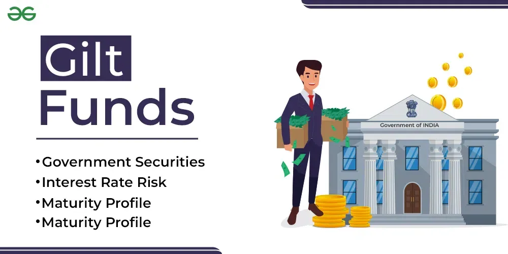

## Table of Contents

## What is a Gilt Fund?

A Gilt Fund is a type of mutual fund that invests in government securities. These securities are bonds issued by the government to raise money. Since they are backed by the government, they are considered very safe. Gilt Funds are popular among investors who want to keep their money safe and earn a steady income.

Gilt Funds can be a good choice for people who don't want to take big risks with their money. The returns from these funds are usually lower than from other types of funds, but they are more predictable. This makes them a good option for people who want to protect their savings and get regular income without worrying too much about market ups and downs.

## How do Gilt Funds operate?

Gilt Funds work by pooling money from many investors and using it to buy government securities. These securities are like loans to the government, and they pay interest over time. The fund manager chooses which securities to buy based on how long the fund wants to keep the money invested and how much risk they want to take. The goal is to make sure the fund earns a good return while keeping the money safe.

When the government securities in the fund mature, or when the fund manager thinks it's a good time, they might sell some of the securities. The money from these sales can be used to buy new securities or be given back to the investors. The interest earned from the securities is usually paid out to the investors regularly, like every month or every three months. This gives investors a steady income, which is one of the main reasons people choose Gilt Funds.

## What are the main types of securities held in a Gilt Fund?

Gilt Funds mainly hold government securities. These are bonds issued by the government to borrow money. The most common type of security in a Gilt Fund is government bonds. These bonds pay interest regularly, usually every six months, and return the full amount of the bond when it matures. The [interest rate](/wiki/interest-rate-trading-strategies) on these bonds can be fixed or sometimes floating, meaning it can change over time.

Another type of security you might find in a Gilt Fund is Treasury Bills. These are short-term securities that the government issues to raise money for a shorter period, usually less than a year. They don't pay regular interest like bonds do. Instead, they are sold at a discount and then paid back at their full value when they mature. The difference between the purchase price and the maturity value is the investor's earnings.

Some Gilt Funds might also hold State Development Loans (SDLs). These are similar to government bonds but are issued by state governments instead of the central government. They also pay regular interest and return the principal amount at maturity. SDLs can be a bit riskier than central government securities, but they are still considered very safe because they are backed by the state government.

## What are the benefits of investing in Gilt Funds?

Investing in Gilt Funds has several benefits. One big advantage is that they are very safe. Since Gilt Funds only invest in government securities, there is almost no risk of losing your money. The government always pays back its loans, so your investment is secure. This makes Gilt Funds a good choice for people who want to keep their money safe and not take big risks.

Another benefit of Gilt Funds is that they provide a steady income. The government securities in these funds pay interest regularly, which means you get money coming in at set times. This can be helpful if you need a regular income from your investments. Also, because Gilt Funds are less risky, they can help balance out riskier investments in your overall portfolio, making your whole investment plan more stable.

## What are the risks associated with Gilt Funds?

Even though Gilt Funds are very safe because they invest in government securities, they still have some risks. One risk is interest rate risk. When interest rates go up, the value of the bonds in the fund can go down. This means if you want to sell your investment before the bonds mature, you might get less money than you expected. Interest rates can change because of things like government policy or economic conditions, and this can affect the value of your Gilt Fund.

Another risk is inflation risk. If inflation goes up, the buying power of the money you get from your Gilt Fund can go down. This means the income you get might not be worth as much in the future as it is now. Gilt Funds usually have lower returns compared to other types of investments, so if inflation is high, your returns might not keep up with the rising costs of things.

Also, Gilt Funds might not be as liquid as other investments. This means it can be harder to sell your investment quickly if you need the money. Government securities can have long maturities, so if you need to get your money out before the securities mature, you might have to sell them at a lower price. This can be a problem if you need your money fast.

## How do interest rate changes affect Gilt Funds?

When interest rates change, it can affect Gilt Funds in a big way. If interest rates go up, the value of the bonds in the Gilt Fund goes down. This happens because new bonds being issued will have higher interest rates, making the older bonds with lower rates less attractive to investors. So, if you want to sell your Gilt Fund before the bonds mature, you might have to sell them for less money than you paid for them.

On the other hand, if interest rates go down, the value of the bonds in your Gilt Fund can go up. This is because the older bonds with higher interest rates become more valuable compared to the new bonds with lower rates. But this also means that if you are holding onto the Gilt Fund to get regular income, the income might not grow as much as you hoped because new bonds are paying less interest. So, changes in interest rates can make the value of your Gilt Fund go up or down, depending on which way the rates are moving.

## What is the role of duration in managing a Gilt Fund?

Duration is a big deal when it comes to managing a Gilt Fund. It tells us how sensitive the fund is to changes in interest rates. If a Gilt Fund has a long duration, it means the bonds in the fund will take a long time to mature. When interest rates go up, the value of these long-duration bonds can drop a lot. So, if you're managing a Gilt Fund with a long duration, you need to be careful because the fund's value can change a lot with interest rate changes.

On the other hand, if a Gilt Fund has a short duration, it means the bonds will mature sooner. When interest rates change, the value of these short-duration bonds doesn't change as much. This makes the fund less risky when it comes to interest rate changes. As a fund manager, you can choose the duration of the bonds in the fund based on what you think will happen with interest rates. If you think rates will go up, you might choose shorter durations to protect the fund's value. If you think rates will go down, you might choose longer durations to get more value from the bonds.

## How do Gilt Funds compare to other fixed income funds?

Gilt Funds are a type of fixed income fund that only invests in government securities, which makes them very safe. Compared to other fixed income funds like corporate bond funds or municipal bond funds, Gilt Funds have the lowest risk because they are backed by the government. Other fixed income funds might invest in bonds from companies or local governments, which can be riskier because these entities might not always be able to pay back their loans. Gilt Funds usually have lower returns than these other funds because of their lower risk, but they are a good choice if you want to keep your money safe and get a steady income.

Another difference is how Gilt Funds react to changes in interest rates. Because they invest in long-term government bonds, Gilt Funds can be more sensitive to interest rate changes than funds that invest in shorter-term or different types of bonds. When interest rates go up, the value of the bonds in a Gilt Fund can drop more than in other fixed income funds with shorter durations. On the other hand, if interest rates go down, Gilt Funds can see their value go up more. This makes Gilt Funds a bit trickier to manage than other fixed income funds, but they can still be a good choice if you understand how interest rates might change.

## What are the tax implications of investing in Gilt Funds?

When you invest in Gilt Funds, you need to know about the taxes you might have to pay. The interest you earn from the government securities in the fund is added to your income and taxed at your normal income tax rate. This means if you earn a lot of interest, you might have to pay more taxes. Also, if you sell your Gilt Fund units and make a profit, you have to pay capital gains tax. If you hold the fund for less than three years, the profit is taxed as short-term capital gains, which is the same as your income tax rate. If you hold it for more than three years, it's taxed as long-term capital gains, which is usually 20% with indexation benefits. Indexation helps reduce your tax by adjusting the purchase price for inflation.

There's one more thing to keep in mind about taxes and Gilt Funds. If you get dividends from your Gilt Fund, they are added to your income and taxed at your normal income tax rate. But remember, since 2020, dividends are taxed in the hands of the investor, not the fund. So, you'll need to report the dividends on your tax return and pay the tax on them. Knowing these tax rules can help you plan better and maybe even save some money on taxes when you invest in Gilt Funds.

## How should one evaluate the performance of a Gilt Fund?

To evaluate the performance of a Gilt Fund, you should look at its returns over time. Check how much money the fund has made for its investors in the past few years. You can compare these returns to other Gilt Funds or to a benchmark like a government bond index. This helps you see if the fund is doing well compared to others. Also, look at the fund's expense ratio, which is how much it costs to run the fund. A lower expense ratio means more of your money stays invested, which can lead to better returns over time.

Another important thing to consider is how the fund handles interest rate changes. Since Gilt Funds invest in government securities, they can be affected a lot by changes in interest rates. Look at how the fund's value has changed when interest rates go up or down. A good Gilt Fund will manage these changes well, keeping the fund's value stable even when rates change. Also, think about the fund's duration, which tells you how sensitive it is to interest rate changes. A fund with a shorter duration might be less risky if you think interest rates will go up.

## What strategies can fund managers use to optimize Gilt Fund returns?

Fund managers can use different strategies to make Gilt Funds perform better. One way is by choosing the right mix of government securities. They can pick bonds with different times until they mature, which helps balance the risk and return. If they think interest rates will go up, they might choose bonds that mature sooner to avoid losing value. If they think rates will go down, they might pick longer-term bonds to get more value from them. Another strategy is to keep an eye on the economy and interest rates. By understanding what might happen with rates, managers can make smart choices about when to buy or sell bonds to make the most money for investors.

Another way to optimize returns is by managing the fund's duration. Duration tells how sensitive the fund is to interest rate changes. A fund manager can adjust the duration based on what they think will happen with interest rates. If they expect rates to rise, they might shorten the duration to protect the fund's value. If they expect rates to fall, they might lengthen the duration to take advantage of the higher bond values. Also, keeping the fund's costs low is important. By managing expenses well, more money stays in the fund, which can lead to better returns for investors over time.

## How have regulatory changes impacted the operation and attractiveness of Gilt Funds?

Regulatory changes have had a big impact on how Gilt Funds work and how attractive they are to investors. One big change was about how dividends are taxed. Before 2020, Gilt Funds could pay dividends to investors without the fund having to pay any tax. But now, dividends are taxed in the hands of the investor, not the fund. This means investors have to pay tax on the dividends they get, which can make Gilt Funds a bit less attractive because the after-tax return might be lower.

Another change is about how much money Gilt Funds can put into different kinds of government securities. Regulators sometimes set rules about the types of bonds a fund can buy and how much they can invest in each type. These rules can affect how much risk the fund can take and how much return it can get. If the rules are strict, it might be harder for the fund to make a good return, but it also means the fund might be safer. These changes can make investors think twice about Gilt Funds, but they also help make sure the funds are managed carefully and safely.

## References & Further Reading

[1]: ["Advances in Financial Machine Learning"](https://www.amazon.com/Advances-Financial-Machine-Learning-Marcos-ebook/dp/B079KLDW21) by Marcos Lopez de Prado

[2]: ["Machine Learning for Algorithmic Trading"](https://github.com/stefan-jansen/machine-learning-for-trading) by Stefan Jansen

[3]: ["Quantitative Trading: How to Build Your Own Algorithmic Trading Business"](https://www.amazon.com/Quantitative-Trading-Build-Algorithmic-Business/dp/1119800064) by Ernest P. Chan

[4]: ["Evidence-Based Technical Analysis: Applying the Scientific Method and Statistical Inference to Trading Signals"](https://www.amazon.com/Evidence-Based-Technical-Analysis-Scientific-Statistical/dp/0470008741) by David Aronson

[5]: "Algorithmic and High-Frequency Trading" by Álvaro Cartea, Sebastian Jaimungal, and José Penalva.