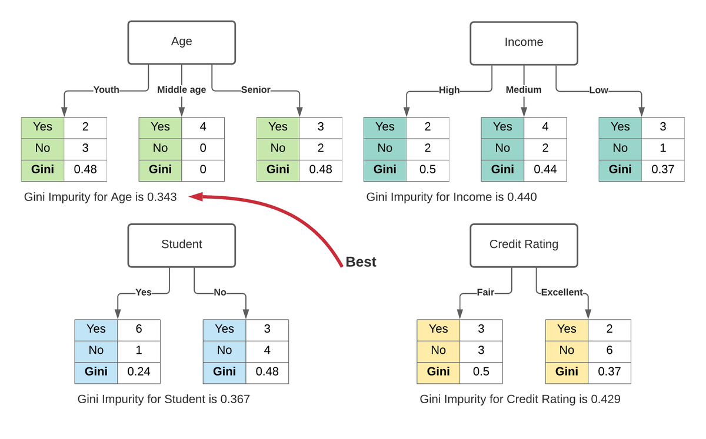

## Table of Contents

## What is Gini Impurity in the context of machine learning?

Gini Impurity is a measure used in machine learning, particularly in decision trees, to determine how well a split separates the classes of data. It calculates the probability of incorrectly labeling a randomly chosen element from the set if it were randomly labeled according to the distribution of labels in the subset. A lower Gini Impurity value means the set is more homogeneous, making it easier to classify. The formula for Gini Impurity in a set S is $$Gini(S) = 1 - \sum_{i=1}^{J} p_i^2$$ where $p_i$ is the probability of an item with label i in the set S, and J is the number of classes.

In practical terms, when building a decision tree, the algorithm tries to minimize the Gini Impurity at each split. This means the algorithm will choose the split that results in the lowest Gini Impurity, as it indicates a better separation of classes. For example, if you're classifying fruits into apples and oranges, a split that results in one branch with mostly apples and another with mostly oranges will have a lower Gini Impurity than a split where the fruits are mixed equally in both branches. By repeatedly minimizing Gini Impurity, the decision tree can effectively classify new data points.

## How is Gini Impurity calculated?

Gini Impurity is a way to measure how mixed up the labels are in a group of data. Imagine you have a bunch of fruits, some apples and some oranges. If you pick one fruit at random and guess its type based on the mix in the group, Gini Impurity tells you how often you'd be wrong. The formula for Gini Impurity in a set S is $$Gini(S) = 1 - \sum_{i=1}^{J} p_i^2$$ where $p_i$ is the chance of picking an item with label i, and J is the total number of different labels. If all the fruits are apples, the Gini Impurity is zero because you'd never guess wrong. But if you have an equal number of apples and oranges, the Gini Impurity is higher because you'd be wrong half the time.

When you're building a decision tree, you want to split the data in a way that makes the Gini Impurity as low as possible in each new group. This means the groups become more pure, with similar items grouped together. For example, if you split the fruits and one group ends up with mostly apples and the other with mostly oranges, the Gini Impurity in both groups would be lower than before the split. By doing this over and over, the decision tree can sort the data better and make more accurate predictions.

## Why is Gini Impurity used in decision tree algorithms?

Gini Impurity is used in decision tree algorithms because it helps the tree figure out the best way to split the data. When you're trying to separate different types of things, like apples and oranges, you want each group after the split to be as pure as possible. That means one group should have mostly apples and the other mostly oranges. Gini Impurity measures how mixed up the groups are. If the groups are very mixed, the Gini Impurity is high, and if they are mostly one type, it's low. The decision tree algorithm looks at all possible ways to split the data and picks the one that makes the Gini Impurity as low as possible in the new groups.

By using Gini Impurity, the decision tree can make better and better splits as it grows. Each time it splits, it's trying to make the groups more pure, which means it's getting better at telling apples from oranges. This helps the tree to classify new data more accurately because it's learned to group similar things together. The formula for Gini Impurity is $$Gini(S) = 1 - \sum_{i=1}^{J} p_i^2$$ where $p_i$ is the chance of [picking](/wiki/asset-class-picking) an item with label i, and J is the total number of different labels. So, by minimizing Gini Impurity at each step, the decision tree can sort the data in a way that makes sense and helps with prediction.

## Can you explain the difference between Gini Impurity and Entropy?

Gini Impurity and Entropy are both used in decision trees to figure out the best way to split the data. They both measure how mixed up the groups are after a split, but they do it in different ways. Gini Impurity looks at how often you'd be wrong if you picked an item at random from a group and guessed its label based on the group's mix. The formula for Gini Impurity is $$Gini(S) = 1 - \sum_{i=1}^{J} p_i^2$$ where $p_i$ is the chance of picking an item with label i, and J is the total number of different labels. If the group has mostly one type of item, the Gini Impurity is low, meaning you'd rarely guess wrong.

Entropy, on the other hand, comes from information theory and measures the randomness or unpredictability of the data. It's like measuring how surprised you'd be if you picked an item and found out its label. The formula for Entropy is $$Entropy(S) = -\sum_{i=1}^{J} p_i \log_2(p_i)$$ where $p_i$ is the same as in Gini Impurity. If all items in a group are the same, the Entropy is zero because there's no surprise. Both measures aim to make the groups as pure as possible after a split, but they do it differently. Gini Impurity is often simpler and faster to compute, while Entropy can sometimes lead to slightly different tree structures because it's more sensitive to changes in the data distribution.

## What does a high Gini Impurity value indicate about a dataset?

A high Gini Impurity value means that the data in a group is very mixed up. Imagine you have a bunch of fruits, some apples and some oranges. If you pick one fruit at random and try to guess what it is based on the mix in the group, a high Gini Impurity tells you that you'd often be wrong. The formula for Gini Impurity is $$Gini(S) = 1 - \sum_{i=1}^{J} p_i^2$$ where $p_i$ is the chance of picking an item with label i, and J is the total number of different labels. So, if the Gini Impurity is high, it means the group has a lot of different types of items mixed together.

In the context of decision trees, a high Gini Impurity in a node means that the tree hasn't done a good job of separating the data yet. The goal of the decision tree is to make splits that lower the Gini Impurity, making the groups more pure. If a node has a high Gini Impurity, it tells the tree that it needs to find a better way to split the data so that each new group becomes more similar to each other. This helps the tree make better predictions because it can group similar items together more effectively.

## How does Gini Impurity affect the splitting decisions in a decision tree?

Gini Impurity helps a decision tree figure out the best way to split the data. Imagine you have a bunch of fruits, some apples and some oranges. When the decision tree makes a split, it wants to put mostly apples in one group and mostly oranges in another. Gini Impurity measures how mixed up the groups are after the split. If the groups are very mixed, the Gini Impurity is high, and if they are mostly one type, it's low. The decision tree looks at all possible ways to split the data and picks the one that makes the Gini Impurity as low as possible in the new groups.

By using Gini Impurity, the decision tree can make better and better splits as it grows. Each time it splits, it's trying to make the groups more pure, which means it's getting better at telling apples from oranges. The formula for Gini Impurity is $$Gini(S) = 1 - \sum_{i=1}^{J} p_i^2$$ where $p_i$ is the chance of picking an item with label i, and J is the total number of different labels. So, by minimizing Gini Impurity at each step, the decision tree can sort the data in a way that makes sense and helps with prediction.

## What are the advantages of using Gini Impurity over other impurity measures?

Gini Impurity is popular in decision trees because it's simple and fast to calculate. The formula for Gini Impurity is $$Gini(S) = 1 - \sum_{i=1}^{J} p_i^2$$ where $p_i$ is the chance of picking an item with label i, and J is the total number of different labels. This simplicity means that decision trees can quickly figure out the best way to split the data, making the process faster. When you're dealing with big sets of data, this speed can be a big help.

Another advantage of Gini Impurity is that it works well for many types of data. It doesn't need the data to be in any special form, so it's easy to use no matter what kind of problem you're working on. While other measures like Entropy might give slightly different results, Gini Impurity often leads to decision trees that are just as good but take less time to build. This makes it a practical choice for many [machine learning](/wiki/machine-learning) tasks.

## Are there any limitations or drawbacks to using Gini Impurity in decision trees?

One limitation of using Gini Impurity in decision trees is that it can sometimes create less balanced trees. This means that the tree might grow more on one side than the other, leading to some branches that are very long and others that are very short. This can happen because Gini Impurity focuses on reducing impurity in each split without considering the overall structure of the tree. As a result, the tree might not be as efficient at classifying new data because it might need more steps to reach a decision on one side than the other.

Another drawback is that Gini Impurity might not always find the best split for data with many classes. The formula for Gini Impurity is $$Gini(S) = 1 - \sum_{i=1}^{J} p_i^2$$ where $p_i$ is the chance of picking an item with label i, and J is the total number of different labels. When there are many classes, Gini Impurity might not be as sensitive to small changes in the distribution of the data, which can lead to splits that don't separate the classes as well as other measures like Entropy might. This can affect the accuracy of the decision tree, especially in complex classification problems.

## How does Gini Impurity relate to the concept of information gain?

Gini Impurity and information gain are both used in decision trees to help decide the best way to split the data. Gini Impurity measures how mixed up the groups are after a split. The formula for Gini Impurity is $$Gini(S) = 1 - \sum_{i=1}^{J} p_i^2$$ where $p_i$ is the chance of picking an item with label i, and J is the total number of different labels. If the groups are very mixed, the Gini Impurity is high, and if they are mostly one type, it's low. Information gain, on the other hand, looks at how much the split reduces the uncertainty in the data. It's calculated by finding the difference between the entropy before the split and the weighted average of the entropy after the split. The goal is to choose the split that gives the highest information gain, which means the data becomes more organized and easier to classify.

When building a decision tree, you can use either Gini Impurity or information gain to decide the best split. If you use Gini Impurity, you're looking for the split that makes the Gini Impurity as low as possible in the new groups. If you use information gain, you're looking for the split that makes the biggest drop in entropy. Both methods aim to make the groups more pure after each split, but they do it in slightly different ways. Gini Impurity is often simpler and faster to compute, while information gain might give a bit more detailed understanding of how the split affects the data's uncertainty.

## In what scenarios might Gini Impurity be less effective compared to other methods?

Gini Impurity might be less effective compared to other methods when dealing with datasets that have many different classes. The formula for Gini Impurity is $$Gini(S) = 1 - \sum_{i=1}^{J} p_i^2$$ where $p_i$ is the chance of picking an item with label i, and J is the total number of different labels. When there are lots of classes, Gini Impurity might not be as good at noticing small changes in how the data is spread out. This can mean that the splits it chooses don't separate the classes as well as they could. Other measures like Entropy might be better in these cases because they can pick up on these small differences more easily.

Another scenario where Gini Impurity might not work as well is when the decision tree needs to be balanced. Gini Impurity focuses on making each split as pure as possible, but it doesn't think about how the whole tree looks. This can lead to trees that grow more on one side than the other, making some branches very long and others very short. This kind of tree might need more steps to reach a decision on one side, which can make it less efficient at classifying new data. Methods that consider the overall structure of the tree, like information gain, might create more balanced trees that work better in these situations.

## How can Gini Impurity be used to optimize the performance of a random forest?

Gini Impurity helps a random forest to make better decisions by choosing the best way to split the data in each tree. When building a random forest, lots of decision trees are made, and each tree tries to split the data in a way that makes the groups as pure as possible. Gini Impurity measures how mixed up the groups are after a split. The formula for Gini Impurity is $$Gini(S) = 1 - \sum_{i=1}^{J} p_i^2$$ where $p_i$ is the chance of picking an item with label i, and J is the total number of different labels. By using Gini Impurity, each tree in the forest can find the best splits, which means the whole forest can make more accurate predictions.

In a random forest, Gini Impurity helps to make sure that each tree is doing its best to sort the data correctly. Because the trees are built using different parts of the data, using Gini Impurity in each tree helps the forest to cover different ways of looking at the data. This can lead to a more robust model that is good at handling different kinds of data and making good predictions. By minimizing Gini Impurity at each split in each tree, the random forest can work together to give the best overall result.

## What advanced techniques can be applied to improve decision tree models that use Gini Impurity?

One advanced technique to improve decision tree models that use Gini Impurity is pruning. Pruning helps to cut back the tree to make it simpler and prevent overfitting. Overfitting happens when the tree learns the training data too well, including any mistakes or odd patterns, and then doesn't work as well on new data. By using Gini Impurity to guide the pruning process, you can remove branches that don't help much with separating the data. This means the tree becomes smaller and more general, which can make it better at predicting new data.

Another technique is using ensemble methods like boosting or bagging. In boosting, you build many decision trees one after the other, each one trying to fix the mistakes of the last one. Gini Impurity helps each tree find the best splits to improve the overall model. In bagging, you build many trees on different parts of the data and then combine their predictions. This can make the model more stable and accurate because it uses Gini Impurity to make each tree as good as possible, and then combines them to get a better overall result. By using these methods, you can create a more powerful model that uses Gini Impurity effectively.

## References & Further Reading

[1]: Breiman, L. (2001). ["Random Forests."](https://link.springer.com/article/10.1023/A:1010933404324) Machine Learning, 45(1), 5-32.

[2]: Quinlan, J.R. (1993). ["C4.5: Programs for Machine Learning."](https://link.springer.com/article/10.1007/BF00993309) Morgan Kaufmann Publishers.

[3]: Hastie, T., Tibshirani, R., & Friedman, J. (2009). ["The Elements of Statistical Learning: Data Mining, Inference, and Prediction."](https://link.springer.com/book/10.1007/978-0-387-84858-7) 2nd Edition. Springer.

[4]: Louppe, G. (2014). ["Understanding Random Forests: From Theory to Practice."](https://arxiv.org/abs/1407.7502) Springer.

[5]: Rokach, L., & Maimon, O. (2008). ["Data Mining with Decision Trees: Theory and Applications."](https://doc.lagout.org/Others/Data%20Mining/Data%20Mining%20with%20Decision%20Trees_%20Theory%20and%20Applications%20%5bRokach%20%26%20Maimon%202008-04-01%5d.pdf) World Scientific Publishing Company.

[6]: Mitchell, T.M. (1997). ["Machine Learning."](https://www.cs.cmu.edu/~tom/mlbook.html) McGraw-Hill Education.

[7]: Quinlan, J.R. (1986). ["Induction of Decision Trees."](https://link.springer.com/article/10.1007/BF00116251) Machine Learning, 1(1), 81-106.