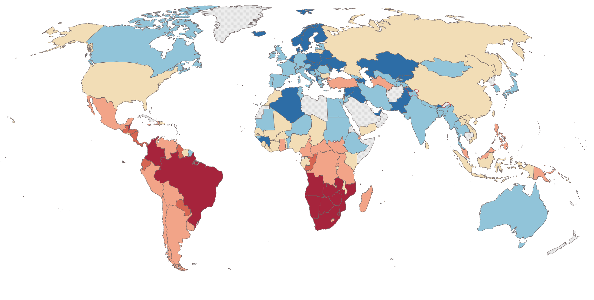

## Table of Contents

## What is the Gini Index?

The Gini Index, or Gini coefficient, is a measure used to show how equal or unequal the distribution of income or wealth is in a country. It is a number between 0 and 1, where 0 means everyone has the same amount of income or wealth, and 1 means one person has everything and everyone else has nothing. This index helps economists and policymakers understand how fair the economic system is in a country.

In simpler terms, if you line up all the people in a country from the poorest to the richest and draw a graph of their incomes, the Gini Index measures how far that graph is from being a perfect straight line, which would represent perfect equality. The higher the Gini Index, the more unequal the distribution of income or wealth. It is often used to compare different countries or to track changes in inequality over time within the same country.

## How is the Gini Index calculated?

To calculate the Gini Index, you start by organizing everyone's income or wealth from the lowest to the highest. Then, you draw a Lorenz curve, which is a graph that shows the cumulative percentage of total income or wealth against the cumulative percentage of the population. The Lorenz curve starts at the bottom left corner (0% of people, 0% of income) and ends at the top right corner (100% of people, 100% of income). If everyone had the same income or wealth, the Lorenz curve would be a straight line from the bottom left to the top right, called the line of perfect equality.

The Gini Index is calculated by measuring the area between the Lorenz curve and the line of perfect equality. This area is called the 'area of inequality'. The Gini Index is then the 'area of inequality' divided by the total area under the line of perfect equality. The total area under the line of perfect equality is always 0.5 (or 50% if you think of it as a percentage). So, the Gini Index is usually calculated as: Gini Index = (Area between the Lorenz curve and the line of perfect equality) / 0.5. The result is a number between 0 and 1, where 0 means perfect equality and 1 means perfect inequality.

## What does a Gini Index of 0 represent?

A Gini Index of 0 means that there is perfect equality in the distribution of income or wealth. Imagine if everyone in a country had exactly the same amount of money. In that case, the Gini Index would be 0 because no one would have more or less than anyone else.

This situation is very rare and almost never happens in real life. But it's useful to think about because it shows us what perfect equality looks like. When we see a Gini Index close to 0, it tells us that the country is doing a good job at making sure everyone has a fair share of the money.

## What does a Gini Index of 1 represent?

A Gini Index of 1 means that one person has all the money and everyone else has nothing. It shows the biggest possible difference in how money is shared among people. This is the opposite of perfect equality and shows extreme inequality.

In real life, a Gini Index of exactly 1 is very unlikely because it would mean that one person owns everything and everyone else has nothing at all. But, if a country's Gini Index is close to 1, it means that the difference between the richest and the poorest is very big. It helps us understand how unequal the sharing of money is in that country.

## How is the Gini Index used to measure income inequality?

The Gini Index is a way to see how fair or unfair the sharing of money is in a country. It looks at everyone's income or wealth and puts them in order from the poorest to the richest. Then, it makes a graph called a Lorenz curve. This graph shows how the total money is spread out among people. If the money is shared equally, the graph would be a straight line from the bottom left to the top right. But, if some people have a lot more money than others, the graph will bend away from that straight line.

The Gini Index measures the space between the straight line of perfect equality and the actual Lorenz curve. This space shows how unequal the money sharing is. The bigger the space, the more unequal the money sharing. The Gini Index gives a number between 0 and 1. A number close to 0 means the money is shared pretty fairly, while a number close to 1 means some people have a lot more money than others. By looking at this number, people can understand and talk about how fair the money sharing is in their country.

## What are the limitations of using the Gini Index?

The Gini Index is a helpful tool, but it has some problems. One big problem is that it doesn't tell us everything about how money is shared. For example, it can't show if the rich are getting richer or if the poor are getting poorer. It just gives one number that shows the overall difference, but it doesn't say anything about who is getting more or less money.

Another problem is that the Gini Index can be the same for different situations. Two countries can have the same Gini Index, but one might have a lot of people who are very poor, while the other might have a lot of people who are very rich. This means the Gini Index doesn't always show the full picture of how money is shared in a country. It's good for a quick look, but we need other tools to understand the details.

## How do global Gini coefficients differ from national Gini coefficients?

The global Gini coefficient looks at how income or wealth is shared among all people in the whole world. It shows how big the difference is between the richest and poorest people everywhere. When we use the global Gini coefficient, we see that some countries have a lot more money than others, and this makes the global number higher than it might be if we only looked at one country at a time. It helps us understand how money is shared across the entire planet.

The national Gini coefficient, on the other hand, focuses on how income or wealth is shared within just one country. It tells us about the difference between the richest and poorest people inside that country. Each country has its own Gini coefficient, and these numbers can be very different from the global Gini coefficient. For example, a country might have a low Gini coefficient, showing that money is shared fairly within its borders, but the global Gini coefficient might be much higher because of big differences between countries.

## What trends can be observed in global Gini coefficients over the past few decades?

Over the past few decades, the global Gini coefficient has shown some interesting changes. In the early 2000s, the global Gini coefficient was around 0.7, which means there was a big difference in how money was shared across the world. This number stayed pretty high for a while, showing that some countries were much richer than others. But over time, there have been small changes that suggest the world might be getting a bit more equal. This is because some poorer countries have been growing their economies faster than richer countries, which helps to close the gap a little.

However, even though there's been some progress, the global Gini coefficient is still very high. This means that big differences between rich and poor countries are still a big problem. Also, within countries, the Gini coefficients have been going up in many places, showing that the rich are getting richer and the poor are staying the same or getting poorer. So while the global picture might be getting slightly better, the situation inside many countries is getting worse. This shows that fighting inequality is a complicated challenge that needs work at both the global and national levels.

## How do different countries rank according to their Gini coefficients?

Different countries have different Gini coefficients, which show how fair or unfair the sharing of money is inside each country. Some countries have low Gini coefficients, which means the money is shared more equally among people. For example, countries like Norway, Finland, and Sweden usually have Gini coefficients around 0.25 to 0.30, showing they have pretty equal sharing of money. On the other hand, some countries have high Gini coefficients, meaning there is a big difference between the rich and the poor. Countries like South Africa, Brazil, and Namibia often have Gini coefficients above 0.50, showing a lot of inequality.

In the middle, you find countries like the United States and China, which have Gini coefficients around 0.40 to 0.45. This means they have a medium level of inequality. The United States has seen its Gini coefficient go up over the years, showing that the difference between rich and poor is getting bigger. In China, fast economic growth has made some people very rich, but many others are still poor, which also shows up in their Gini coefficient. Overall, the Gini coefficient helps us see how different countries handle the challenge of sharing money fairly among their people.

## What are the socio-economic factors that influence a country's Gini Index?

A country's Gini Index is influenced by many things, like how much people earn, how good the schools are, and how easy it is to get a job. If a country has good schools and lots of jobs, more people can earn money and the Gini Index might be lower. But if only a few people can go to good schools or get good jobs, then the rich might get richer and the poor might stay poor, making the Gini Index higher. Also, things like taxes and help from the government can make a difference. If the government takes money from rich people and gives it to poor people, it can make the sharing of money more equal and lower the Gini Index.

Another big thing that affects the Gini Index is how the economy is doing. If the economy is growing and everyone is getting a bit richer, the Gini Index might go down. But if the economy is not doing well, or if only rich people are getting richer, the Gini Index might go up. Also, things like where people live and what kind of work they do can make a difference. In some places, it's hard to find good jobs, and this can make the Gini Index higher. So, many different things in a country can change how fair or unfair the sharing of money is, and all these things together decide what the Gini Index will be.

## How can policies affect a country's Gini Index?

Policies can make a big difference in a country's Gini Index. If a government makes rules that help everyone get a good education and find good jobs, the Gini Index might go down. For example, if the government spends money on schools and job training, more people can earn money and the difference between rich and poor might get smaller. Also, if the government makes sure that everyone has a chance to work and earn money, it can help make the sharing of money more equal. This means that policies that help everyone have a fair shot at getting ahead can lower the Gini Index.

On the other hand, some policies can make the Gini Index go up. If the government gives big tax breaks to rich people and doesn't help poor people much, the rich might get richer and the poor might stay the same or get poorer. This makes the difference between rich and poor bigger, and the Gini Index goes up. Also, if the government doesn't do much to help people find jobs or get a good education, it can make the sharing of money less equal. So, the kinds of policies a government chooses can really change how fair or unfair the sharing of money is in a country.

## What advanced statistical methods can be used to refine Gini Index calculations?

To make the Gini Index more accurate, people can use something called "bootstrapping." This is a way to check how sure we can be about the Gini Index number. Bootstrapping takes the data we have and makes many new sets of data by [picking](/wiki/asset-class-picking) numbers from the original data over and over again. By doing this, we can see how much the Gini Index might change if we had different sets of data. This helps us understand if the Gini Index we calculated is a good guess or if it might be off by a lot.

Another way to make the Gini Index better is by using "decomposition methods." These methods break down the Gini Index into smaller parts to see what is causing the inequality. For example, we can look at how much of the inequality comes from different regions in a country or from different groups of people. By doing this, we can get a clearer picture of where the problems are and how to fix them. Using these advanced methods can help us understand the Gini Index better and make it a more useful tool for figuring out how to make the sharing of money more equal.

## What is the understanding of the Gini Index and Gini Coefficient?

The Gini Index, also known as the Gini Coefficient, serves as a crucial metric in analyzing income and wealth distribution across a specific population. Originating from the work of Italian statistician Corrado Gini in 1912, this measure provides a numerical representation of inequality. The index or coefficient can range from 0 to 1, where 0 indicates perfect equality—each individual has the same income or wealth—and 1 indicates perfect inequality—where a single individual possesses all of the income or wealth.

Mathematically, the Gini Coefficient can be expressed through the formula:

$$

G = 1 - \frac{2 \sum_{i=1}^{n} \left( L_i \cdot p_i \right)}{n} 
$$

where $n$ is the number of individuals or units, $L$ represents the cumulative proportion of total income or wealth, and $p$ denotes the cumulative proportion of the population. 

This coefficient is instrumental for policymakers and organizations as it provides a clear, quantitative measure to evaluate economic inequality. By inspecting shifts in the Gini Index over time, governments and institutions can assess the impact of implemented policies aimed at reducing economic disparities. For instance, if a country introduces progressive taxation or social welfare programs, observing a decrease in the Gini value might imply that those measures are effective in fostering economic equality.

Traditionally, the Gini Coefficient is primarily associated with income distribution analysis. However, its application extends to wealth distribution studies. Wealth is typically more concentrated than income, and measuring it presents substantial challenges. Factors such as asset value fluctuations, non-transparent asset ownership, and the complexity of measuring non-liquid assets contribute to the difficulty in accurately assessing wealth disparity through the Gini Index.

Despite such complexities, the Gini Coefficient remains one of the most widely used and recognized indicators of economic inequality. Its simplicity allows for straightforward interpretation, making it a standard tool in economic analysis and facilitating comparisons across different regions and time periods. However, due to the inherent challenges in data accuracy and comprehensiveness, particularly concerning wealth, it is often recommended to use the Gini Index in conjunction with additional indicators to provide a more holistic view of economic inequality.

## What is the interpretation of the Gini Index?

The Gini Index, a cornerstone in measuring economic inequality, serves as a quantitative indicator of how income or wealth is distributed among individuals within a nation. At its essence, the Gini Index value encapsulates the degree of inequality: a score of 0 represents perfect income equality, where everyone has exactly the same income, while a score of 1 represents maximum inequality, where a single individual possesses all the income of a given population. These values provide a snapshot of the income distribution landscape within a country, highlighting the proportional disparity in earnings.

Comparative analysis of Gini Index values across different countries reveals intriguing insights into the economic fabric of nations. Countries with similar economic scales or Gross Domestic Product (GDP) figures can exhibit widely differing Gini Index results, thereby underlining discrepancies in income distribution beyond mere economic size. For instance, two nations with comparable GDPs may display diverse Gini Index scores due to differing social policies, demographic compositions, or historical contexts influencing how income is allocated among their citizens.

Graphically, the Gini Index is often understood through the Lorenz Curve, which provides a visual representation of income distribution. The curve plots the cumulative proportion of income received by individuals or households, beginning with the poorest and ending with the richest. In a perfectly equal society, the Lorenz Curve would be a straight diagonal line, often referred to as the line of equality. On this line, each segment of the population holds an equal share of income. However, in a real-world scenario, the Lorenz Curve typically bows below the line of equality, indicating inequality. The more pronounced this bow, the greater the inequality.

The area between the line of equality and the Lorenz Curve represents the Gini Coefficient, mathematically defined as twice the area between the line of equality and the Lorenz Curve. If $A$ is the area between the Lorenz Curve and the line of equality, then the Gini Coefficient (G) can be calculated as:

$$
G = \frac{2A}{B}
$$

where $B$ is the total area under the line of equality, essentially normalizing the measure to fall between 0 and 1. This formula emphasizes the Gini Coefficient's function as a measure of concentration, quantifying how far the actual income distribution deviates from a scenario of perfect equality. Through this understanding, policymakers and economists can diagnose the root causes of income disparities and strategize potential interventions.

## References & Further Reading

[1]: Yitzhaki, S., & Schechtman, E. (2013). ["The Gini Methodology: A Primer on a Statistical Methodology."](https://link.springer.com/book/10.1007/978-1-4614-4720-7) Springer.

[2]: Dorling, D. (2015). ["Injustice: Why Social Inequality Still Persists."](https://www.dannydorling.org/books/injustice/dorling-why-social-inequali.pdf) Policy Press.

[3]: Piketty, T. (2014). ["Capital in the Twenty-First Century."](https://www.jstor.org/stable/j.ctt6wpqbc) Harvard University Press.

[4]: Aldridge, I. (2009). ["High-Frequency Trading: A Practical Guide to Algorithmic Strategies and Trading Systems."](https://www.ahmetbeyefendi.com/wp-content/uploads/2020/07/High-Frequency-Trading-Irene-Aldridge.pdf) Wiley.

[5]: Johnson, M. (2010). ["A Fistful of Dollars: High Frequency Trading and the Evolution of the Stock Market."](https://research.gold.ac.uk/id/eprint/27283/1/McGroarty2019_Article_HighFrequencyTradingStrategies.pdf) Wiley.