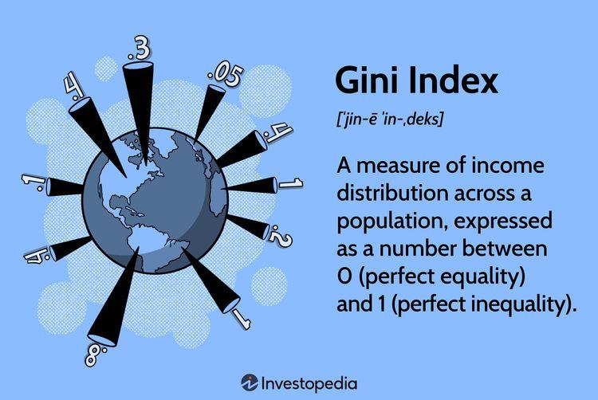

Algorithmic trading has revolutionized financial markets by automating the process of buying and selling assets based on pre-set criteria. This has led to the widespread adoption of machine learning techniques to craft more advanced and precise trading strategies. Among these techniques, decision trees have become a favored tool due to their notable simplicity and interpretability. Unlike other complex methods, decision trees bifurcate the data into distinct subsets that are easier to analyze, making them effective for trading strategies where clarity and transparency are paramount.

One key metric employed in decision tree models is the Gini Index. This index is pivotal for refining predictions, especially in trading algorithms, as it helps to assess the "impurity" or potential misclassification of data at each node of the tree. With a scoring system that ranges from 0, indicating perfect classification, to 1, representing maximal impurity, the Gini Index assists in the decision-making process throughout the tree. By aiming to minimize the Gini Index at each step, decision trees can be systematically optimized to enhance prediction accuracy, ultimately leading to more informed and effective trading decisions. This process is vital, as it underscores the potential of machine learning to make complex financial predictions more accessible and actionable.



## Table of Contents

## Understanding the Gini Index

The Gini Index is widely recognized in machine learning for its effectiveness in assessing the impurity or level of misclassification among a set of data points. This metric is crucial in decision tree algorithms, often employed in various domains including algorithmic trading. A Gini Index value of 0 indicates perfect classification, meaning all the instances within a node belong to a single class. Conversely, a Gini Index of 1 reflects the highest possible level of impurity, where the class distribution is as even as possible.

In decision trees, the goal is to partition data in a way that minimizes impurity and enhances predictive accuracy. The Gini Index is used to estimate the quality of each potential split at the nodes. This is vital in algorithmic trading, where decisions based on historical data, such as price movements or trading volumes, need to be accurate to be profitable.

Mathematically, the Gini Index for a dataset is calculated using the formula:
$$
\text{Gini} = 1 - \sum (p_i)^2
$$
where $p_i$ represents the proportion of instances belonging to class i in a node. Lower values are preferred as they reflect fewer misclassifications and thus a purer node. For algorithmic trading, minimizing the Gini Index ensures that the resulting decision tree can predict price movements or buy/sell signals more reliably. This makes the Gini Index an integral component of refining trading strategies, as it aids in achieving higher levels of precision and profitability.

## Decision Trees in Algorithmic Trading

Decision trees are vital components in [algorithmic trading](/wiki/algorithmic-trading), facilitating the evaluation of numerous trading parameters. These models are inherently hierarchical, consisting of root nodes, internal nodes, and leaf nodes, each playing a specific role in the decision-making process. By breaking down the problem into a tree structure, decision trees systematically evaluate historic trends, trading volumes, and returns, thereby providing a framework for forecasting future market movements.

In algorithmic trading, decision trees can assess historical trends by examining data points such as moving averages, [momentum](/wiki/momentum) indicators, or economic indicators. Each node in a decision tree represents a decision point, where attributes are evaluated to determine their impact on market movement predictions. For example, a trading algorithm might analyze trading volumes at the root node, then break down subsequent decisions based on past price trends at an internal node, and finally conclude with specific actions—such as buy, hold, or sell—at the leaf nodes.

The effectiveness of decision trees in this context is significantly enhanced by employing the Gini Index, a measure of node splitting effectiveness. The Gini Index quantifies the impurity or the homogeneity of data classifications at a node, guiding the algorithm in selecting the optimal attribute for branching. When an attribute is chosen for node splitting, the resulting nodes should ideally represent a more homogeneous subset of the data.

Mathematically, the Gini Index is calculated as:
$$
Gini = 1 - \sum (p_i)^2
$$
where $p_i$ is the probability of each class at a node. By minimizing the Gini Index, the decision tree reduces uncertainty, ensuring that splits lead to nodes where the outcome is more predictable.

In practice, during algorithmic trading, attributes such as past market trends serve as decisive criteria for splitting nodes. For instance, if past positive market trends are observed to predict positive returns reliably, these trends can form the basis of node differentiation in the tree.

Python libraries like Scikit-learn facilitate the implementation of decision trees by automating the computation of the Gini Index and optimizing node splits. A simple implementation can be outlined using the following Python code:

```python
from sklearn.tree import DecisionTreeClassifier
from sklearn.model_selection import train_test_split

# Sample data representing trading features and outcomes
features = ...  # trading features such as volume or trend indicators
outcomes = ...  # binary outcomes like up or down

# Splitting data into training and testing sets
X_train, X_test, y_train, y_test = train_test_split(features, outcomes, test_size=0.3)

# Initializing the decision tree classifier
clf = DecisionTreeClassifier(criterion='gini')

# Training the model
clf.fit(X_train, y_train)

# Evaluating model predictions
predictions = clf.predict(X_test)
```

In this manner, decision trees, empowered by the Gini Index, form an effective analytical tool in enhancing the precision of algorithmic trading strategies. By refining decisions through structured node evaluations and optimal splits, traders can utilize decision trees to discern meaningful patterns in trading data, optimizing buying or selling actions accordingly.

## How Gini Index Enhances Decision Making

By computing the probability of data points being erroneously classified, the Gini Index plays a critical role in selecting the best attribute for node splits in decision trees. This selection process is crucial for enhancing decision-making in algorithmic trading, where predictions need to be as accurate as possible.

The Gini Index calculates the degree of impurity in a dataset by measuring how often a randomly chosen element would be incorrectly labeled if it were randomly labeled according to the distribution of labels in the dataset. Mathematically, the Gini Index for a node is defined as:

$$
\text{Gini} = 1 - \sum (p_i)^2
$$

where $p_i$ is the proportion of each class, $i$, present in the node. A lower Gini Index indicates a purer node with less chance of incorrect classification.

When applied to trading data, the Gini Index is instrumental in ensuring that the divisions of data—essentially binary decisions made during node splits—become progressively homogeneous. This homogeneity is vital for the accuracy of predictions, as it reduces the potential for misclassification. By carefully selecting attributes that reduce the Gini Index, decision trees become more efficient at categorizing trading patterns, thereby improving the predictability of market movements.

For instance, consider a decision tree evaluating past trading trends: attributes might include variables like stock price movements or trade volumes. Employing the Gini Index enables the algorithm to methodically prioritize attributes that contribute to the most significant reductions in impurity. As a result, this method supports more precise trading decisions, such as buy/sell signals, based on refined data subsets that better reflect market realities.

In practical terms, algorithmic trading systems leverage these improved decision trees to enhance trading strategies. By basing decisions on more homogeneous datasets, traders can achieve greater consistency in their predictions, thus optimizing their trading algorithms for better risk management and profit maximization.

## Calculating the Gini Index

The Gini Index is a critical measure when constructing decision trees, particularly in the context of algorithmic trading. It quantifies the impurity or [dispersion](/wiki/dispersion-trading) across different classes in a dataset. The formula for calculating the Gini Index for a node is given by:

$$
\text{Gini} = 1 - \sum (p_i)^2
$$

where $p_i$ represents the proportion of class $i$ within the node. This formula indicates that a lower Gini Index corresponds to a higher degree of purity in the data subset, which is crucial for making precise algorithmic trading decisions. 

Consider a trading context where attributes like past trends or open interest influence decision making. For instance, if a node splits data into two categories based on past trends, such as positive or negative sentiments, the Gini Index evaluates how well these categories are separated. A lower Gini Index suggests that the sentiments are distinctly contributing to the classification, which can inform whether a trading position should be entered or exited.

In practical terms, traders use the Gini Index to decide on the most informative attributes for node splits in decision trees. This involves calculating the Gini Index for possible splits and selecting the attribute that results in the lowest impurity. Utilizing libraries like Scikit-learn, this process can be automated through functions that evaluate the Gini Index during tree construction:

```python
from sklearn.tree import DecisionTreeClassifier

# Sample dataset
X = [[1, 1], [1, 2], [2, 2], [2, 3]]
y = [0, 0, 1, 1]

# Initialize decision tree classifier with Gini
clf = DecisionTreeClassifier(criterion='gini')
clf = clf.fit(X, y)

# Gini impurity is automatically calculated during fitting
print(clf.tree_.impurity)
```

This code illustrates how decision trees utilize the Gini Index to partition data optimally. The `DecisionTreeClassifier` in Scikit-learn automatically computes the Gini Index to identify the best splits. By refining nodes based on this metric, traders can enhance the predictive power and accuracy of their algorithmic strategies, ultimately leading to more informed trading decisions.

## Example of Gini Index in Action

Consider past trend data such as positive and negative sentiments and their impact on stock returns. When using the Gini Index within a decision tree framework, traders can effectively gauge which sentiments have greater predictive value, thereby honing their algorithmic strategies. The Gini Index measures the degree of impurity or uncertainty by evaluating the probability distribution of these sentiment classes at each decision node.

For instance, assume a dataset where the sentiment towards a particular stock is either positive or negative. The goal is to assess how these sentiments influence the likelihood of stock price increases or decreases. Initially, the decision tree would consider all data points, determining the Gini Index at each node based on the proportion of positive and negative sentiments. The Gini Index $G$ for a node with two classes (positive and negative sentiments) can be computed using the formula:

$$
G = 1 - (p_{positive}^2 + p_{negative}^2)
$$

where $p_{positive}$ and $p_{negative}$ are the proportions of positive and negative sentiments, respectively.

If a particular node has an equal distribution of sentiments, the Gini Index will be higher, indicating more impurity. Conversely, if the sentiments predominantly lean towards one class, the index will be lower, suggesting an opportunity to make clear predictions based on sentiment analysis.

Here's an example implementation in Python to calculate the Gini Index for a simple set of sentiment data:

```python
def gini_index(sentiments):
    total = len(sentiments)
    positive_count = sentiments.count('positive')
    negative_count = sentiments.count('negative')

    p_positive = positive_count / total
    p_negative = negative_count / total

    return 1 - (p_positive**2 + p_negative**2)

# Example sentiment data
sentiment_data = ['positive', 'negative', 'positive', 'positive', 'negative', 'negative']
gini_score = gini_index(sentiment_data)
print(f'Gini Index: {gini_score}')
```

In this context, traders will input various sentimental data points, computing the Gini Index at each node split to ascertain which sentiment metrics offer the most substantial predictive utility. By continuously refining the decision tree to minimize the Gini Index, the algorithm's prediction accuracy regarding stock returns is enhanced, equipping traders with finely-tuned strategies for buying or selling stocks.

## Conclusion

The Gini Index, when employed alongside decision trees, serves as a crucial tool in enhancing the effectiveness of algorithmic trading strategies. This dynamic pairing optimizes decision-making processes by systematically reducing impurity from root to leaf nodes. The decision tree's hierarchical structure allows for the evaluation of a multitude of trading attributes, such as past market trends and trading volumes. In this context, the Gini Index is pivotal during node splitting, where it aids in selecting the most informative attributes. 

By calculating the likelihood of data misclassification, the Gini Index helps ensure that each partition of trading data becomes increasingly homogeneous. This reduction of impurity leads directly to heightened prediction accuracy, a vital component for making informed trading decisions. Essentially, the methodical application of the Gini Index in decision trees allows traders to meticulously refine their strategies, leading to improved forecasts and enhanced trading effectiveness.

Furthermore, the quantitative nature of the Gini Index formula \[ Gini = 1 - \sum (p_i)^2 \] is particularly beneficial in financial contexts where precision is essential. As trading algorithms continuously adapt and evolve, the ability of decision trees to leverage the Gini Index ensures that these systems remain agile and accurate. Such robustness is critical in maintaining a competitive edge in the fast-paced world of algorithmic trading. The integration of the Gini Index in refining decision trees thus represents a powerful stride toward achieving superior trading strategy precision and effectiveness.

## References & Further Reading

[1]: Bergstra, J., Bardenet, R., Bengio, Y., & Kégl, B. (2011). ["Algorithms for Hyper-Parameter Optimization."](https://dl.acm.org/doi/10.5555/2986459.2986743) Advances in Neural Information Processing Systems 24.

[2]: ["Advances in Financial Machine Learning"](https://www.amazon.com/Advances-Financial-Machine-Learning-Marcos/dp/1119482089) by Marcos Lopez de Prado

[3]: ["Evidence-Based Technical Analysis: Applying the Scientific Method and Statistical Inference to Trading Signals"](https://www.amazon.com/Evidence-Based-Technical-Analysis-Scientific-Statistical/dp/0470008741) by David Aronson

[4]: ["Machine Learning for Algorithmic Trading"](https://github.com/stefan-jansen/machine-learning-for-trading) by Stefan Jansen

[5]: ["Quantitative Trading: How to Build Your Own Algorithmic Trading Business"](https://books.google.com/books/about/Quantitative_Trading.html?id=j70yEAAAQBAJ) by Ernest P. Chan