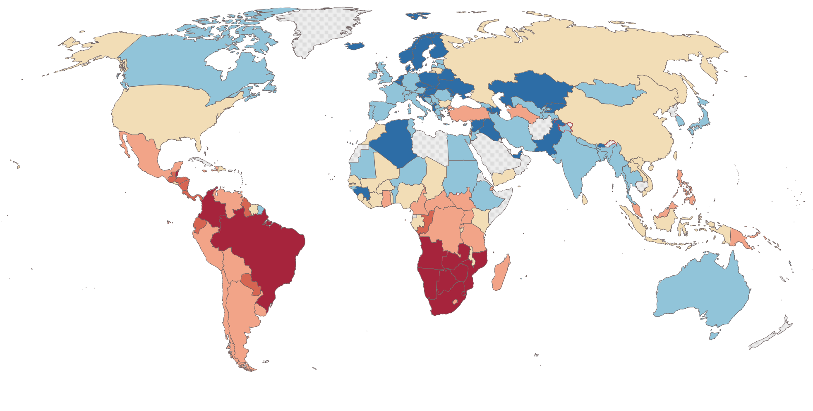

## Table of Contents

## What is the Gini Index?

The Gini Index is a way to measure how fair or unfair the distribution of something is, like money or resources, in a group of people. It's often used to see how equal or unequal income or wealth is in a country. The Gini Index gives a number between 0 and 1, where 0 means everyone has the same amount, so it's perfectly equal, and 1 means one person has everything and everyone else has nothing, which is perfectly unequal.

In real life, countries usually have a Gini Index somewhere in between 0 and 1. For example, a country with a Gini Index of 0.3 is considered to have a more equal distribution of income than a country with a Gini Index of 0.5. The Gini Index helps governments and researchers understand how to make policies that can help make things more fair for everyone.

## How is the Gini Index calculated?

The Gini Index is calculated by looking at the difference between everyone's income or wealth in a group. Imagine you line up everyone from the poorest to the richest and draw a line that shows how much of the total income or wealth each person has. Then, you draw another line that shows what it would look like if everyone had the same amount. The Gini Index is the difference between these two lines, called the Lorenz curve and the line of perfect equality. You measure this difference and divide it by the total area under the line of perfect equality. The result is a number between 0 and 1.

To make it easier, you can use a formula. First, you find the total income or wealth of everyone in the group. Then, you compare each person's income or wealth to everyone else's, one by one. You add up all these comparisons and divide by the total number of comparisons you made, times two. This gives you the Gini Index. It might sound complicated, but it's just a way to see how spread out the money or resources are among people.

## What does the Gini Index measure?

The Gini Index measures how evenly or unevenly income or wealth is shared among people in a group, like a country. It gives a number between 0 and 1. If the number is close to 0, it means the income or wealth is shared pretty evenly among everyone. If it's close to 1, it means some people have a lot more than others, and it's very unequal.

This index is useful because it helps us see how fair things are in a society. Governments and researchers use it to understand if people are getting a fair share of the money or resources. If the Gini Index shows a lot of inequality, it might mean that policies need to change to help make things more equal for everyone.

## What is the range of the Gini Index?

The Gini Index is a number that shows how equal or unequal income or wealth is in a group of people. It can be any number between 0 and 1. If the Gini Index is 0, it means that everyone has exactly the same amount of money or resources. This is called perfect equality.

If the Gini Index is 1, it means that one person has everything and everyone else has nothing. This is called perfect inequality. In real life, the Gini Index for a country is usually somewhere in between 0 and 1, showing that there is some level of inequality, but not extreme.

## How is the Gini Index used in economics?

In economics, the Gini Index is used to understand how evenly money or resources are shared among people in a country. Economists use it to see if a country has a lot of rich people and a lot of poor people, or if most people have about the same amount of money. This helps them figure out if the economy is working well for everyone or just for a few people. Governments can use the Gini Index to decide if they need to make new laws or programs to help make things more fair.

The Gini Index is also used to compare different countries or regions. For example, economists might look at the Gini Index of different countries to see which ones have more equal or unequal societies. This can help them understand why some countries are doing better than others in terms of fairness. By studying the Gini Index over time, economists can see if a country is becoming more or less equal, which can guide them in making better economic policies.

## What is the difference between the Gini Index and the Gini Coefficient?

The Gini Index and the Gini Coefficient are basically the same thing, just with a different name. They both measure how fair or unfair the distribution of money or resources is in a group of people. The number they give is between 0 and 1, where 0 means everyone has the same amount and 1 means one person has everything. 

The only real difference is how they're sometimes used in different places. In some countries, people call it the Gini Index, while in others, they might say Gini Coefficient. But no matter what you call it, it's still telling you the same thing about how equal or unequal things are. So, whether you're talking about the Gini Index or the Gini Coefficient, you're looking at the same measure of fairness in the distribution of income or wealth.

## How does the Gini Index relate to income inequality?

The Gini Index is a way to measure how fair or unfair the sharing of money is in a country. It tells us about income inequality by giving a number between 0 and 1. If the number is close to 0, it means everyone has about the same amount of money, so things are pretty equal. But if the number is close to 1, it means some people have a lot more money than others, and that's a sign of a lot of inequality.

Economists use the Gini Index to understand how well the economy is working for everyone. If the Gini Index shows a lot of inequality, it might mean that the government needs to make new rules or programs to help make things more fair. By looking at the Gini Index, we can see if a country is becoming more equal over time or if the gap between rich and poor is getting bigger.

## Can the Gini Index be used to compare income inequality between countries?

Yes, the Gini Index can be used to compare income inequality between countries. It gives a number between 0 and 1 that shows how fair or unfair the money is shared among people. If one country has a Gini Index of 0.3 and another has a Gini Index of 0.5, the first country is more equal because its number is closer to 0. This helps us see which countries are doing a better job at making sure everyone has a fair share of money.

Economists and researchers use the Gini Index to look at how different countries are doing in terms of fairness. They can compare the Gini Index numbers from different countries to understand why some places have more equal societies and others don't. By studying these numbers, they can suggest ways for governments to make things more fair for everyone.

## What are the limitations of the Gini Index?

The Gini Index is a good way to see how fair or unfair money is shared among people, but it has some problems. One big problem is that it doesn't tell us anything about why some people have more money than others. It just gives us a number, but it doesn't explain if the inequality comes from things like education, jobs, or government policies. Also, the Gini Index can be hard to understand because it's just one number that tries to show a lot of different things about a whole country.

Another limitation is that the Gini Index can be affected by how the data is collected. If the information about people's money is not correct or complete, the Gini Index might not be accurate. This can make it hard to compare different countries or to see if a country is getting more or less equal over time. So, while the Gini Index is useful, it's important to use other ways to measure fairness too, to get a better picture of how things are going.

## How has the Gini Index been applied in real-world scenarios?

The Gini Index has been used in many real-world situations to understand how fair or unfair income is shared in different countries. For example, the World Bank uses the Gini Index to compare how equal or unequal countries are. They look at the Gini Index numbers from different countries to see which ones are doing a better job at making sure everyone has a fair share of money. This helps them decide where to focus their efforts to help reduce inequality. In the United States, the Gini Index has shown that income inequality has been growing over the years, which has led to discussions about policies to help make things more equal.

In another example, the Gini Index was used to study how income inequality changed in Brazil over time. Brazil used to have one of the highest Gini Index numbers in the world, meaning it had a lot of inequality. But over the years, the government made new programs and policies to help share money more fairly. As a result, Brazil's Gini Index went down, showing that the country was becoming more equal. This shows how the Gini Index can be used to see if efforts to reduce inequality are working.

## What are some criticisms of the Gini Index as a measure of inequality?

Some people say the Gini Index isn't perfect for measuring how fair or unfair money is shared. One big criticism is that it only gives one number, so it can't tell us all the details about why some people have more money than others. It doesn't explain if the inequality comes from things like education, jobs, or government policies. This makes it hard to understand the full story behind the numbers.

Another problem is that the Gini Index can be affected by how the data is collected. If the information about people's money is not correct or complete, the Gini Index might not be accurate. This can make it difficult to compare different countries or to see if a country is getting more or less equal over time. So, while the Gini Index is useful, it's important to use other ways to measure fairness too, to get a better picture of how things are going.

## How does the Gini Index influence policy-making and economic strategies?

The Gini Index helps people who make laws and economic plans understand how fair or unfair money is shared in a country. If the Gini Index shows a lot of inequality, it means some people have much more money than others. This can lead governments to make new rules or start programs to help make things more equal. For example, they might raise taxes on rich people and use that money to help poor people, or they might create jobs or education programs to give everyone a better chance.

Economists and policymakers also use the Gini Index to compare different countries and see which ones are doing a better job at sharing money fairly. This can help them learn from other countries and find new ways to make their own country more equal. By looking at how the Gini Index changes over time, they can see if their plans are working or if they need to try something different. So, the Gini Index is a useful tool for making decisions that can help everyone in a country have a fairer share of money.

## How does the Gini Index enhance decision making?

By computing the probability of data points being erroneously classified, the Gini Index plays a critical role in selecting the best attribute for node splits in decision trees. This selection process is crucial for enhancing decision-making in algorithmic trading, where predictions need to be as accurate as possible.

The Gini Index calculates the degree of impurity in a dataset by measuring how often a randomly chosen element would be incorrectly labeled if it were randomly labeled according to the distribution of labels in the dataset. Mathematically, the Gini Index for a node is defined as:

$$
\text{Gini} = 1 - \sum (p_i)^2
$$

where $p_i$ is the proportion of each class, $i$, present in the node. A lower Gini Index indicates a purer node with less chance of incorrect classification.

When applied to trading data, the Gini Index is instrumental in ensuring that the divisions of data—essentially binary decisions made during node splits—become progressively homogeneous. This homogeneity is vital for the accuracy of predictions, as it reduces the potential for misclassification. By carefully selecting attributes that reduce the Gini Index, decision trees become more efficient at categorizing trading patterns, thereby improving the predictability of market movements.

For instance, consider a decision tree evaluating past trading trends: attributes might include variables like stock price movements or trade volumes. Employing the Gini Index enables the algorithm to methodically prioritize attributes that contribute to the most significant reductions in impurity. As a result, this method supports more precise trading decisions, such as buy/sell signals, based on refined data subsets that better reflect market realities.

In practical terms, algorithmic trading systems leverage these improved decision trees to enhance trading strategies. By basing decisions on more homogeneous datasets, traders can achieve greater consistency in their predictions, thus optimizing their trading algorithms for better risk management and profit maximization.

## How do you calculate the Gini Index?

The Gini Index is a critical measure when constructing decision trees, particularly in the context of algorithmic trading. It quantifies the impurity or [dispersion](/wiki/dispersion-trading) across different classes in a dataset. The formula for calculating the Gini Index for a node is given by:

$$
\text{Gini} = 1 - \sum (p_i)^2
$$

where $p_i$ represents the proportion of class $i$ within the node. This formula indicates that a lower Gini Index corresponds to a higher degree of purity in the data subset, which is crucial for making precise algorithmic trading decisions. 

Consider a trading context where attributes like past trends or open interest influence decision making. For instance, if a node splits data into two categories based on past trends, such as positive or negative sentiments, the Gini Index evaluates how well these categories are separated. A lower Gini Index suggests that the sentiments are distinctly contributing to the classification, which can inform whether a trading position should be entered or exited.

In practical terms, traders use the Gini Index to decide on the most informative attributes for node splits in decision trees. This involves calculating the Gini Index for possible splits and selecting the attribute that results in the lowest impurity. Utilizing libraries like Scikit-learn, this process can be automated through functions that evaluate the Gini Index during tree construction:

```python
from sklearn.tree import DecisionTreeClassifier

# Sample dataset
X = [[1, 1], [1, 2], [2, 2], [2, 3]]
y = [0, 0, 1, 1]

# Initialize decision tree classifier with Gini
clf = DecisionTreeClassifier(criterion='gini')
clf = clf.fit(X, y)

# Gini impurity is automatically calculated during fitting
print(clf.tree_.impurity)
```

This code illustrates how decision trees utilize the Gini Index to partition data optimally. The `DecisionTreeClassifier` in Scikit-learn automatically computes the Gini Index to identify the best splits. By refining nodes based on this metric, traders can enhance the predictive power and accuracy of their algorithmic strategies, ultimately leading to more informed trading decisions.

## What is an Example of Gini Index in Action?

Consider past trend data such as positive and negative sentiments and their impact on stock returns. When using the Gini Index within a decision tree framework, traders can effectively gauge which sentiments have greater predictive value, thereby honing their algorithmic strategies. The Gini Index measures the degree of impurity or uncertainty by evaluating the probability distribution of these sentiment classes at each decision node.

For instance, assume a dataset where the sentiment towards a particular stock is either positive or negative. The goal is to assess how these sentiments influence the likelihood of stock price increases or decreases. Initially, the decision tree would consider all data points, determining the Gini Index at each node based on the proportion of positive and negative sentiments. The Gini Index $G$ for a node with two classes (positive and negative sentiments) can be computed using the formula:

$$
G = 1 - (p_{positive}^2 + p_{negative}^2)
$$

where $p_{positive}$ and $p_{negative}$ are the proportions of positive and negative sentiments, respectively.

If a particular node has an equal distribution of sentiments, the Gini Index will be higher, indicating more impurity. Conversely, if the sentiments predominantly lean towards one class, the index will be lower, suggesting an opportunity to make clear predictions based on sentiment analysis.

Here's an example implementation in Python to calculate the Gini Index for a simple set of sentiment data:

```python
def gini_index(sentiments):
    total = len(sentiments)
    positive_count = sentiments.count('positive')
    negative_count = sentiments.count('negative')

    p_positive = positive_count / total
    p_negative = negative_count / total

    return 1 - (p_positive**2 + p_negative**2)

# Example sentiment data
sentiment_data = ['positive', 'negative', 'positive', 'positive', 'negative', 'negative']
gini_score = gini_index(sentiment_data)
print(f'Gini Index: {gini_score}')
```

In this context, traders will input various sentimental data points, computing the Gini Index at each node split to ascertain which sentiment metrics offer the most substantial predictive utility. By continuously refining the decision tree to minimize the Gini Index, the algorithm's prediction accuracy regarding stock returns is enhanced, equipping traders with finely-tuned strategies for buying or selling stocks.

## References & Further Reading

[1]: Bergstra, J., Bardenet, R., Bengio, Y., & Kégl, B. (2011). ["Algorithms for Hyper-Parameter Optimization."](https://dl.acm.org/doi/10.5555/2986459.2986743) Advances in Neural Information Processing Systems 24.

[2]: ["Advances in Financial Machine Learning"](https://www.amazon.com/Advances-Financial-Machine-Learning-Marcos/dp/1119482089) by Marcos Lopez de Prado

[3]: ["Evidence-Based Technical Analysis: Applying the Scientific Method and Statistical Inference to Trading Signals"](https://www.amazon.com/Evidence-Based-Technical-Analysis-Scientific-Statistical/dp/0470008741) by David Aronson

[4]: ["Machine Learning for Algorithmic Trading"](https://github.com/stefan-jansen/machine-learning-for-trading) by Stefan Jansen

[5]: ["Quantitative Trading: How to Build Your Own Algorithmic Trading Business"](https://books.google.com/books/about/Quantitative_Trading.html?id=j70yEAAAQBAJ) by Ernest P. Chan