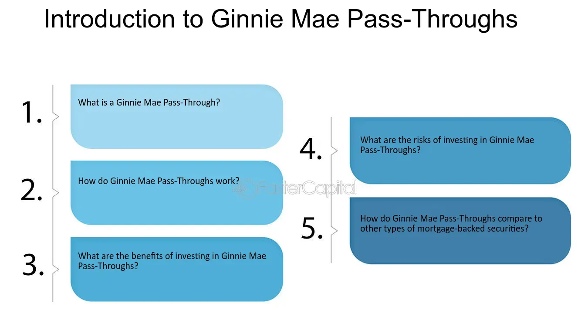

## Table of Contents

## What is a Ginnie Mae Pass-Through?

A Ginnie Mae Pass-Through is a type of mortgage-backed security that is backed by the Government National Mortgage Association, also known as Ginnie Mae. This security is created when a pool of mortgages, usually from the Federal Housing Administration (FHA) or the Department of Veterans Affairs (VA), are bundled together and sold to investors. The investors then receive payments that pass through from the homeowners' mortgage payments, which include both principal and interest.

These securities are considered very safe because they are guaranteed by the U.S. government. This means that even if homeowners default on their mortgages, the investors will still get their payments. Ginnie Mae Pass-Throughs are popular among investors who want a steady income stream and the security of government backing. They are commonly used by banks, pension funds, and other large investors looking for low-risk investments.

## How does a Ginnie Mae Pass-Through work?

A Ginnie Mae Pass-Through works by taking a bunch of home loans, mostly from the FHA or VA, and putting them together into one big group. This group of loans is then sold to investors as a single investment. The money that homeowners pay on their mortgages, including both the money they're paying back (principal) and the interest, gets collected and passed on to these investors. This is why it's called a "pass-through" - the payments pass through from the homeowners to the investors.

The great thing about Ginnie Mae Pass-Throughs is that they come with a guarantee from the U.S. government. This means that if any homeowners can't pay their mortgages, the investors still get their money. This makes Ginnie Mae Pass-Throughs a very safe investment. Banks, pension funds, and other big investors like them because they provide a steady income and are backed by the government, making them a low-risk choice for investing money.

## Who issues Ginnie Mae Pass-Through securities?

Ginnie Mae Pass-Through securities are issued by the Government National Mortgage Association, which is often called Ginnie Mae. Ginnie Mae is part of the U.S. Department of Housing and Urban Development (HUD). It doesn't actually give out loans to people, but it helps make sure that home loans can be turned into investments.

When banks and other lenders give out home loans that are backed by the FHA or VA, they can sell these loans to Ginnie Mae. Ginnie Mae then puts these loans together into a big group and turns them into securities that investors can buy. These securities are safe because Ginnie Mae guarantees that investors will get their money, even if some homeowners can't pay their mortgages.

## What types of loans are included in Ginnie Mae Pass-Through securities?

Ginnie Mae Pass-Through securities mostly include home loans that are backed by the Federal Housing Administration (FHA) or the Department of Veterans Affairs (VA). These loans are given to people who might not be able to get a regular home loan because they don't have a big down payment or their credit isn't perfect. The FHA and VA help make it easier for these people to buy homes.

When banks and other lenders give out these FHA and VA loans, they can sell them to Ginnie Mae. Ginnie Mae then puts these loans together into a big group and turns them into securities that investors can buy. These securities are safe because Ginnie Mae promises that investors will get their money, even if some homeowners can't pay their mortgages.

## What are the benefits of investing in Ginnie Mae Pass-Through securities?

Investing in Ginnie Mae Pass-Through securities has some big benefits. One of the biggest is that they are very safe. They are backed by the U.S. government, which means that even if some homeowners can't pay their mortgages, the investors still get their money. This makes them a low-risk investment, which is great for people who want to keep their money safe but still earn some income.

Another benefit is that Ginnie Mae Pass-Throughs provide a steady stream of income. The payments that homeowners make on their mortgages, including both the money they're paying back and the interest, get passed on to the investors every month. This can be really helpful for investors who need a regular income, like retirees or pension funds. Plus, because these securities are backed by a lot of different home loans, the risk is spread out, making it even safer.

## How do Ginnie Mae Pass-Through securities differ from other mortgage-backed securities?

Ginnie Mae Pass-Through securities are different from other mortgage-backed securities because they are backed by the U.S. government. This means they are super safe. If someone who has a home loan can't pay it back, the government steps in to make sure the investors still get their money. Other mortgage-backed securities, like those from Fannie Mae or Freddie Mac, don't have this full government guarantee. They have some support but not as strong as Ginnie Mae's.

Another way Ginnie Mae Pass-Throughs are different is that they mostly include loans from the FHA and VA. These are special loans that help people buy homes who might not be able to get a regular loan. Other mortgage-backed securities might include a mix of different types of home loans. Because Ginnie Mae Pass-Throughs focus on these specific types of loans, they help more people become homeowners and still provide a safe investment for people looking to earn money from home loans.

## What are the risks associated with Ginnie Mae Pass-Through securities?

Even though Ginnie Mae Pass-Through securities are backed by the U.S. government, they still have some risks. One risk is that interest rates might change. If interest rates go up, the value of the securities can go down. This is because new securities will be issued with higher interest rates, making the older ones less attractive to investors. Another risk is that homeowners might pay off their loans early, especially if interest rates drop. This means investors might get their money back sooner than expected, and they won't get as much interest as they hoped.

Another risk is that while the government guarantees the payments, it doesn't guarantee that the securities will always be easy to sell. If a lot of investors want to sell their securities at the same time, it can be hard to find buyers, and the price might drop. This is called liquidity risk. So, even though Ginnie Mae Pass-Throughs are safe in terms of getting paid, they can still have ups and downs in their value and how easy they are to sell.

## How is the interest rate risk managed in Ginnie Mae Pass-Through securities?

Interest rate risk in Ginnie Mae Pass-Through securities is managed by understanding how changes in interest rates can affect the value of these securities. If interest rates go up, new securities will have higher interest rates, making the older ones less attractive to investors. This can cause the value of the older securities to drop. To manage this risk, investors might try to predict when interest rates will change and adjust their investments accordingly. They might also spread their money across different types of investments to reduce the impact of any one security losing value.

Another way to manage [interest rate](/wiki/interest-rate-trading-strategies) risk is by being ready for homeowners to pay off their loans early if interest rates drop. When rates go down, people might refinance their homes to get a lower interest rate, paying off their old loans faster. This means investors might get their money back sooner than expected and won't earn as much interest as they hoped. To deal with this, investors can look at how quickly loans are being paid off and choose securities that are less likely to be prepaid. By keeping an eye on these factors, investors can better handle the ups and downs that come with interest rate changes.

## What role does the U.S. government play in Ginnie Mae Pass-Through securities?

The U.S. government plays a big role in Ginnie Mae Pass-Through securities. Ginnie Mae is part of the U.S. Department of Housing and Urban Development (HUD). When banks give out home loans that are backed by the FHA or VA, they can sell these loans to Ginnie Mae. Ginnie Mae then puts these loans together into a big group and turns them into securities that investors can buy. This helps banks free up money to give more loans to people who want to buy homes.

The government's most important role is that it guarantees these securities. This means that if any homeowners can't pay their mortgages, the investors still get their money. This makes Ginnie Mae Pass-Through securities very safe. Because the government promises to cover any losses, more investors are willing to buy these securities. This helps make sure there's always money available for people to buy homes, even if they need special loans from the FHA or VA.

## How are payments distributed to investors in Ginnie Mae Pass-Through securities?

Payments to investors in Ginnie Mae Pass-Through securities come from the money that homeowners pay on their mortgages. Every month, homeowners pay back part of the money they borrowed (the principal) and the interest on that money. Ginnie Mae collects all these payments and then passes them on to the investors. This is why they're called "pass-through" securities - the payments pass through from the homeowners to the investors.

The payments are divided up among the investors based on how much of the security they own. If an investor owns a big piece of the security, they get a bigger part of the payments. If they own a small piece, they get a smaller part. This way, everyone gets their fair share of the money coming in from the homeowners' mortgage payments.

## What are the prepayment risks and how do they affect Ginnie Mae Pass-Through securities?

Prepayment risk is when homeowners pay off their mortgages earlier than expected. This can happen if interest rates go down and people decide to refinance their homes to get a lower interest rate. When homeowners pay off their loans early, it means the investors in Ginnie Mae Pass-Through securities get their money back sooner than they planned. This can be a problem because the investors were counting on getting a steady stream of interest payments over time, and now they won't get as much interest as they hoped.

This early repayment can affect the value of Ginnie Mae Pass-Through securities. If a lot of homeowners pay off their loans early, the securities might not be as attractive to other investors because they won't provide as much income in the future. This can make the price of the securities go down. To manage this risk, investors might look at how quickly loans are being paid off and choose securities that are less likely to be prepaid. By keeping an eye on these factors, investors can better handle the ups and downs that come with prepayments.

## How can an investor analyze the performance of Ginnie Mae Pass-Through securities?

An investor can analyze the performance of Ginnie Mae Pass-Through securities by looking at how much money they're getting from the securities and how the value of the securities is changing over time. They should check the monthly payments they receive, which come from the homeowners' mortgage payments. These payments include both the principal, which is the money homeowners are paying back, and the interest, which is the extra money they pay for borrowing. By keeping track of these payments, investors can see if they're getting the steady income they expected.

Investors also need to watch out for changes in interest rates and how quickly homeowners are paying off their loans. If interest rates go up, the value of the securities might go down because new securities will be issued with higher interest rates. If interest rates go down, homeowners might pay off their loans early by refinancing, which means investors get their money back sooner and won't earn as much interest as they hoped. By understanding these factors and how they affect the securities, investors can better predict how well their investment will perform over time.

## What are the factors influencing Ginnie Mae pass-through securities?

Ginnie Mae pass-through securities are influenced by several critical factors that can affect their pricing, yield, and overall performance. One of the primary factors is interest rates, which greatly impact the expected return on investment for these securities. When interest rates are low, the value of existing securities with higher rates tends to increase, because they offer more attractive yields relative to newly issued securities. Conversely, when interest rates rise, the value of existing securities with lower rates tends to decrease. This inverse relationship can be expressed mathematically by the following formula:

$$
\text{Price Change} \approx - \text{Duration} \times \Delta i
$$

where $\Delta i$ is the change in interest rate and Duration is a measure of the sensitivity of the security's price to changes in interest rates.

Market [liquidity](/wiki/liquidity-risk-premium) is another important [factor](/wiki/factor-investing). Liquidity refers to the ease with which an asset can be bought or sold in the market without affecting its price. Highly liquid markets allow for quicker execution of trades and can reduce transaction costs, thereby enhancing returns for investors. Poor liquidity can lead to larger bid-ask spreads, making it costlier and more difficult to buy or sell these securities at desired prices.

The quality of mortgage servicing also plays a significant role in influencing the returns from Ginnie Mae pass-throughs. Effective and efficient servicing ensures timely collection and redistribution of payments from mortgage holders to investors, thereby minimizing default risk and maintaining the reliability of the income stream. Poor servicing can lead to increased delinquencies and defaults, negatively impacting investor returns.

Despite the backing of the U.S. government, investors must also assess credit risk associated with the borrowers of the underlying mortgages. Factors such as borrower credit scores, employment stability, and overall economic conditions can impact the likelihood of mortgage defaults, influencing the performance of these securities. While government backing reduces the risk to investors, understanding the mortgage pool's credit quality provides essential insights into potential risks.

In sum, interest rates, market liquidity, mortgage servicing quality, and borrower credit risk collectively influence the performance of Ginnie Mae pass-through securities, necessitating careful analysis and management to optimize investment outcomes.

## References & Further Reading

[1]: ["Introduction to Mortgage-Backed Securities"](https://www.sciencedirect.com/book/9780124017436/introduction-to-mortgages-and-mortgage-backed-securities) by the Securities Industry and Financial Markets Association (SIFMA).

[2]: Vickery, J., & Wright, J. (2013). ["TBA Trading and Liquidity in the Agency MBS Market."](https://www.newyorkfed.org/medialibrary/media/research/epr/2013/1212vick.pdf) Federal Reserve Bank of New York Economic Policy Review.

[3]: Fabozzi, F. J. (2016). ["The Handbook of Mortgage-Backed Securities"](https://academic.oup.com/book/7943) (7th Edition). Oxford University Press.

[4]: Goodhart, C., & Ashworth, J. P. (2011). ["Quantitative Easing: A Skeptical Survey."](https://academic.oup.com/oxrep/article-abstract/28/4/750/343730) Journal of Macroeconomics, 34(1), 46-64.

[5]: ["Algorithmic Trading and DMA: An introduction to direct access trading strategies"](https://www.amazon.com/Algorithmic-Trading-DMA-introduction-strategies/dp/0956399207) by Barry Johnson.