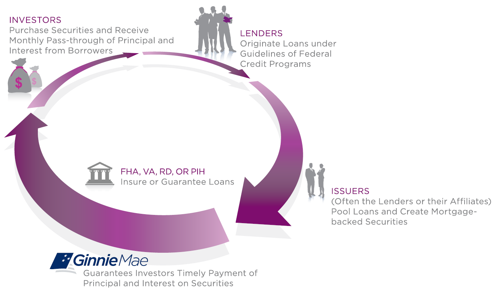

## Table of Contents

## What are Ginnie Mae securities?

Ginnie Mae securities, also known as Ginnie Mae mortgage-backed securities (MBS), are financial products issued by the Government National Mortgage Association (GNMA), which is a government-owned corporation. These securities are backed by pools of mortgages that are insured or guaranteed by the federal government, typically through agencies like the Federal Housing Administration (FHA) or the Department of Veterans Affairs (VA). When investors buy Ginnie Mae securities, they are essentially buying a share in the cash flows from these mortgage payments, which provides them with a steady stream of income.

The main attraction of Ginnie Mae securities is their safety and reliability. Because they are backed by the full faith and credit of the U.S. government, they are considered to be very low risk. This makes them an attractive option for investors looking for a secure investment with a predictable return. Additionally, Ginnie Mae securities help to increase the availability of mortgage funding, which in turn helps more people to buy homes. This is because when banks and other lenders sell their mortgages to Ginnie Mae, they get cash that they can use to issue new loans.

## Who issues Ginnie Mae securities?

Ginnie Mae securities are issued by the Government National Mortgage Association, which is often called Ginnie Mae for short. Ginnie Mae is a part of the U.S. government. It helps people buy homes by making sure there is money available for mortgages.

The way it works is that banks and other lenders give out mortgages to people. Then, they can sell those mortgages to Ginnie Mae. Ginnie Mae puts these mortgages together into groups and turns them into securities. These securities are then sold to investors. Because Ginnie Mae is backed by the U.S. government, the securities are seen as very safe investments.

## What is the primary function of Ginnie Mae securities?

The main job of Ginnie Mae securities is to help more people get home loans. When banks give out mortgages, they can sell those mortgages to Ginnie Mae. Ginnie Mae then groups these mortgages together and turns them into securities that investors can buy. This process gives banks the money they need to make more loans, which helps more people buy homes.

Ginnie Mae securities are also important because they are very safe. They are backed by the U.S. government, which means investors feel confident that their money is secure. This makes Ginnie Mae securities a popular choice for people looking for a steady and reliable way to invest their money.

## How do Ginnie Mae securities differ from other mortgage-backed securities?

Ginnie Mae securities are different from other mortgage-backed securities because they are backed by the U.S. government. This means that if something goes wrong and people can't pay their mortgages, the government will step in to make sure investors still get their money. Other mortgage-backed securities, like those from Fannie Mae or Freddie Mac, are not directly backed by the government in the same way. They are supported by these companies, which are government-sponsored but not part of the government itself.

Another difference is that Ginnie Mae securities are made up of mortgages that are insured or guaranteed by federal agencies like the FHA or VA. This adds an extra layer of safety for investors. Other mortgage-backed securities might include a wider variety of loans, some of which might not have this kind of government insurance. So, Ginnie Mae securities are seen as safer and more reliable, which is why many investors prefer them when they want a secure investment.

## What role does Ginnie Mae play in the housing market?

Ginnie Mae helps more people buy homes by making sure banks have money to lend. When banks give out mortgages, they can sell those mortgages to Ginnie Mae. Ginnie Mae then turns these mortgages into securities that investors can buy. This gives banks more money to make new loans, which means more people can get home loans.

Ginnie Mae also makes the housing market safer for everyone. The securities they issue are backed by the U.S. government, which means they are very safe for investors. This makes investors feel confident about putting their money into these securities. Because of this, more money flows into the housing market, helping to keep it strong and stable.

## How are Ginnie Mae securities structured?

Ginnie Mae securities are made up of groups of mortgages that are insured or guaranteed by the U.S. government. These mortgages come from programs like the Federal Housing Administration (FHA) or the Department of Veterans Affairs (VA). When banks give out these mortgages, they can sell them to Ginnie Mae. Ginnie Mae then puts these mortgages together into a big group, or pool. This pool is turned into a security that investors can buy.

When investors buy a Ginnie Mae security, they are buying a share in the payments that come from the mortgages in the pool. These payments include both the interest and the principal that homeowners pay on their loans. Because Ginnie Mae securities are backed by the U.S. government, they are seen as very safe. This means investors can count on getting their money back, even if some homeowners can't pay their mortgages.

## What are the risks associated with investing in Ginnie Mae securities?

Investing in Ginnie Mae securities is generally seen as safe because they are backed by the U.S. government. This means if homeowners can't pay their mortgages, the government steps in to make sure investors still get their money. But there are still some risks to think about. One risk is [interest rate](/wiki/interest-rate-trading-strategies) changes. If interest rates go up, the value of the securities might go down. This is because new securities might be issued with higher interest rates, making the older ones less attractive.

Another risk is prepayment. Homeowners might pay off their mortgages early, either by selling their homes or refinancing at a lower rate. When this happens, investors get their money back sooner than expected, which can be a problem if they were counting on a steady stream of income from the securities. While these risks are not as big as with other investments, it's still important for investors to think about them before putting their money into Ginnie Mae securities.

## How do Ginnie Mae securities contribute to the U.S. economy?

Ginnie Mae securities help the U.S. economy by making it easier for people to buy homes. When banks give out mortgages, they can sell those mortgages to Ginnie Mae. Ginnie Mae then turns these mortgages into securities that investors can buy. This gives banks more money to make new loans, which means more people can get home loans. When more people can buy homes, it helps the housing market stay strong, which is good for the overall economy.

These securities also bring more money into the economy because they are seen as safe investments. Since Ginnie Mae securities are backed by the U.S. government, investors feel confident about putting their money into them. This confidence means more money flows into the housing market, which helps keep it stable and growing. A stable housing market can lead to more jobs in construction and real estate, which helps the economy grow even more.

## What are the benefits of investing in Ginnie Mae securities?

Investing in Ginnie Mae securities has many benefits. One big benefit is that they are very safe. They are backed by the U.S. government, which means if people can't pay their mortgages, the government will make sure investors still get their money. This makes Ginnie Mae securities a good choice for people who want a secure investment.

Another benefit is that Ginnie Mae securities provide a steady stream of income. When you buy these securities, you are buying a share in the payments that come from the mortgages. This means you get regular payments from the interest and principal that homeowners pay on their loans. This can be a good way to earn money over time without taking on too much risk.

## How does the guarantee of Ginnie Mae affect the securities' appeal to investors?

The guarantee from Ginnie Mae makes their securities very appealing to investors because it means the investment is safe. Ginnie Mae is backed by the U.S. government, so if people can't pay their mortgages, the government will step in to make sure investors get their money. This makes Ginnie Mae securities a good choice for people who want a secure investment without much risk.

Because of this guarantee, more investors are willing to put their money into Ginnie Mae securities. They feel confident that their investment is protected, which means they can expect a steady stream of income from the mortgage payments. This reliability and safety make Ginnie Mae securities a popular choice for those looking for a stable and predictable way to invest their money.

## What are the historical performance trends of Ginnie Mae securities?

Ginnie Mae securities have generally performed well over time. They are known for being safe and reliable because they are backed by the U.S. government. This means that even during tough economic times, like the 2008 financial crisis, Ginnie Mae securities held up better than many other investments. Investors have seen steady returns from these securities because they get regular payments from the mortgages that make up the securities.

Over the years, the performance of Ginnie Mae securities has been influenced by interest rates and how quickly people pay off their mortgages. When interest rates are low, more people might refinance their homes, which can lead to investors getting their money back sooner than expected. This is called prepayment risk. On the other hand, when interest rates go up, the value of existing Ginnie Mae securities might go down because new securities with higher interest rates become more attractive. Despite these factors, Ginnie Mae securities have continued to be a solid choice for investors looking for safety and a steady income.

## How do regulatory changes impact the market for Ginnie Mae securities?

Regulatory changes can have a big impact on the market for Ginnie Mae securities. When the government makes new rules or changes old ones, it can affect how banks give out loans and how investors feel about putting their money into Ginnie Mae securities. For example, if the government makes it easier for people to get home loans, more mortgages might be sold to Ginnie Mae, which means more securities can be created. This could make the market for Ginnie Mae securities grow.

On the other hand, if the government makes rules that make it harder for people to get loans, fewer mortgages might be available for Ginnie Mae to turn into securities. This could make the market smaller and might make investors worry about the future of their investments. Also, changes in rules about how much risk banks can take can affect the types of mortgages that end up in Ginnie Mae securities, which can change how safe investors think these securities are.

## References & Further Reading

[1]: Vickery, J., & Wright, J. (2013). ["TBA Trading and Liquidity in the Agency MBS Market."](https://www.newyorkfed.org/medialibrary/media/research/epr/2013/1212vick.pdf) Federal Reserve Bank of New York Staff Reports.

[2]: Fabozzi, F. J. (2016). ["The Handbook of Mortgage-Backed Securities."](https://academic.oup.com/book/7943) McGraw-Hill Education.

[3]: Gorton, G. B., & Souleles, N. S. (2005). ["Special Purpose Vehicles and Securitization."](https://www.nber.org/papers/w11190) National Bureau of Economic Research Working Paper Series.

[4]: Aldrich, E. M., Grundfest, J. A., Laughlin, G., & Weisbach, M. (2009). ["Algorithmic Trading and the Market for Liquidity."](https://papers.ssrn.com/sol3/papers.cfm?abstract_id=2721922) Stanford Law and Economics Workshop Series.

[5]: Engel, E., & McCoy, P. A. (2002). ["A Tale of Three Markets: The Law and Economics of Predatory Lending."](https://papers.ssrn.com/sol3/papers.cfm?abstract_id=286649) Texas Law Review, 80.