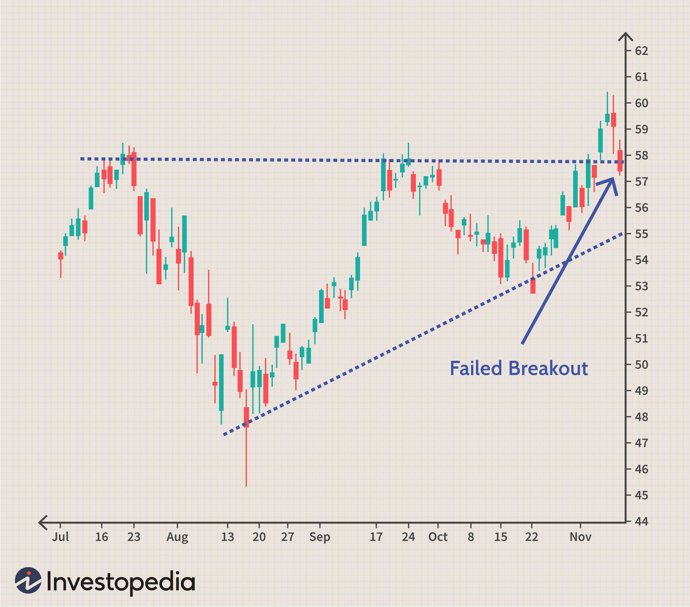

In the world of financial trading, various intricate operations ensure trades are executed smoothly, efficiently, and at optimal costs. Among these, the 'give-up trade' stands out as a mechanism involving multiple brokers to facilitate trading activities, particularly in the securities or commodities markets. This article examines the intricacies of give-up trades, assessing their relevance in the broader trading ecosystem and their interaction with modern algorithmic trading strategies.

Give-up trades are pivotal for participants who need to streamline operations and manage risk effectively. By involving multiple brokers, give-up trades allow for shared responsibilities and access to specialized broker services that might otherwise be unavailable. Such trades were historically more prevalent during the floor trading era but remain valuable for understanding market complexities and broker interactions. Understanding these trades is crucial for financial parties as it provides insights into operational flexibility, potential cost savings, and strategic market positioning.



This discussion will cover the primary entities involved in a give-up trade, illustrate a practical example of such a trade, and consider the benefits and drawbacks associated with this trading mechanism. By exploring these aspects, traders and financial professionals can make informed decisions, optimize investment outcomes, and enhance their strategic approach in ever-evolving financial markets.

## Table of Contents

## What is a Give-Up Trade?

A give-up trade is a specialized transaction where the responsibilities of trade execution and trade record-keeping become distinct between different brokerage entities. In this arrangement, an executing broker facilitates the trade by placing it on behalf of another broker, typically due to constraints or strategic reasons that prevent the latter from executing the trade directly. Following the execution of the transaction, the executing broker 'gives up' the credit or acknowledgment for the trade on record books. This means that the trade is officially recorded in the name of the third-party broker who takes ownership of the transaction.

Such transactions feature prearranged agreements between the parties involved, which specify the terms governing the execution process and outline any compensation structures. These agreements ensure a clear understanding and operational efficiency, allowing each broker to focus on their specific roles in the financial markets. The give-up arrangement can provide strategic benefits, such as accessing markets where the initiating broker has restrictions or leveraging the executing broker’s expertise and facilities.

In give-up trades, precise legal and financial documentation is crucial to delineate roles and responsibilities, ensure compliance with regulatory standards, and determine commission structures or other fees that may apply. Thus, while the core concept of a give-up trade revolves around partitioning trade execution and credit, it is underpinned by a structured agreement to safeguard the interests and expectations of all involved stakeholders.

## History and Evolution of Give-Up Trades

Give-up trades have a storied history in the evolution of financial markets, especially before the widespread adoption of electronic trading. These trades were primarily developed to facilitate smooth transaction processes in environments where communication and execution were less efficient than today. Historically, give-up trades allowed one broker, the executing broker, to [carry](/wiki/carry-trading) out transactions on behalf of another broker, typically due to strategic or regulatory constraints.

During the era of floor trading, when the physical presence on trading floors was essential, brokers were often faced with logistical challenges. For instance, a broker who had the mandate from a client to execute a trade might not have been physically present on the trading floor. In such cases, an alternative broker, already on the floor, would execute the trade. To ensure that the principal broker received credit and responsibility for the trade, the notion of 'giving up' the trade was formulated. The executing broker would effectively hand over the trade to the original broker, ensuring that the client relationship and commission were correctly attributed to the broker who initiated the transaction.

The emergence of electronic trading in the late 20th century significantly changed this dynamic. Automated systems and algorithm-driven trading platforms reduced the necessity for human intervention in executing complex trades. Real-time data and high-speed electronic communication replaced the slower, manual processes that characterized traditional floor trading. Consequently, many manual operations, including the give-up trade, saw a decline in prevalence.

Despite their reduced frequency in the contemporary trading environment, give-up trades hold enduring value. They provide critical insights into the historical workings of financial markets and are sometimes still employed in specific scenarios where their flexibility and structure offer substantial benefits. For example, in complex trades involving diverse financial instruments or in environments where specialized broker services are required, give-up trades help maintain transactional fluidity.

Understanding the historical significance and operational mechanics of give-up trades offers financial professionals insight into legacy systems that shaped current market operations and strategic execution frameworks. As such, they remain a pertinent topic of study for those seeking to gain a comprehensive understanding of market evolution and the interplay of various trading mechanisms.

## Parties Involved in a Give-Up Trade

A give-up trade typically involves three primary parties, each playing a distinct role in the transaction's execution and settlement. The main parties involved are the executing broker, the broker's client, and a third broker, commonly known as the prime broker or the give-up broker.

1. **Executing Broker**: This broker is responsible for executing the trade on the trading floor or electronic trading platform. Their role is crucial because they handle the technical aspects of executing the orders, ensuring that they comply with the client's specifications. Once the trade is executed, the executing broker 'gives up' the trade to the third broker, transferring responsibility for the transaction's settlement to that broker.

2. **Broker's Client**: The client is the original party interested in executing the trade. This client could be an institutional investor, a mutual fund manager, or any entity requiring access to trading markets. The client employs the services of their broker, who may not have direct access to all trading venues or might seek specialized services offered by another broker in specific markets.

3. **Third Broker (Prime Broker/Give-Up Broker)**: The third broker, often referred to as the give-up broker, assumes the responsibility for the trade once it is 'given up' by the executing broker. This broker handles the clearance and settlement of the trade and is also typically responsible for funding, risk management, and record-keeping associated with the transaction. The give-up broker acts as a central point of contact for the client, consolidating trades from multiple executing brokers, thereby simplifying the management and reporting of complex trading strategies.

In certain scenarios, a fourth party might become part of the process:

- **Clearing Broker**: In more complex arrangements, a separate clearing broker may be involved. The clearing broker handles the post-trade activities, ensuring that the executed trades are settled smoothly, and the financial instruments are properly transferred between parties. This role is crucial in reducing counterparty risk and ensuring the integrity of the transaction from start to finish.

The interplay between these parties ensures that give-up trades can be executed efficiently, leveraging the specific expertise and access that each broker provides. As a result, traders can benefit from broader market access, enhanced [liquidity](/wiki/liquidity-risk-premium), and specialized services that one broker alone might not offer.

## Example of a Give-Up Trade

Consider a typical give-up trade scenario in financial markets where multiple parties are involved to facilitate the execution of trades that might otherwise be impossible due to logistical constraints. For instance, Broker B wants to purchase 100 shares of a company, XYZ. However, due to specific floor restrictions, Broker B cannot directly execute this trade. This situation might occur due to regulatory barriers, lack of access to a particular trading floor, or simply because Broker B does not have the requisite infrastructure to execute the order at the desired time.

To navigate this obstacle, Broker B enlists the assistance of Floor Broker A, who possesses the necessary credentials and access rights to execute trades on the restricted floor. Floor Broker A acts on behalf of Broker B, leveraging their position and access to carry out the transaction. Upon completion, Floor Broker A executes the trade but does not record it under their own name. Instead, the transaction is attributed to Broker B, thus maintaining the integrity and intent of the original order.

In this scenario, Floor Broker A effectively "gives up" the credit associated with executing the trade to Broker B. Such arrangements are typically pre-negotiated to ensure clarity over execution terms and any compensation that Floor Broker A might receive for their role in executing the trade. Although this mechanism was more prevalent in the era of manual and floor trading, it still persists in specific circumstances, providing valuable flexibility and access within the securities or commodities markets. This example demonstrates a practical application of give-up trades, highlighting their role and functioning in modern financial operations.

## Give-Up Trade in Algorithmic Trading

Algorithmic trading has drastically altered the landscape of financial markets, optimizing the speed and accuracy of trade execution. With the advent of sophisticated algorithms, many traditional brokerage operations, such as give-up trades, have seen a decline in necessity due to the automation and precision algorithms provide. However, there are scenarios where [algorithmic trading](/wiki/algorithmic-trading) can work in conjunction with give-up trades to enhance efficiency and maintain the benefits of broker specialization.

In a typical give-up trade, an executing broker places an order on behalf of another broker, making it essential when special expertise or market access is required. Algorithmic systems can be integrated into this setup to automate the execution portion while still allowing for the specialization that give-up trades facilitate. An algorithm might, for example, scan a vast dataset to identify the most efficient execution strategy for transferring an asset between the parties involved, ensuring that the process remains nimble and capable of reacting swiftly to market fluctuations.

One significant advantage of integrating algorithms into give-up trades is the potential for enhanced operational efficiency. Algorithms can instantly process vast amounts of data and execute trades at lightning speeds, minimizing human error and reducing the latency inherent in manual processing. This ultimately leads to minimized slippage – the difference between the expected price of a trade and the actual price – and ensures optimal execution closer to the desired parameters set by the broker or client.

Furthermore, algorithms can be programmed to adhere strictly to regulatory requirements, thereby mitigating the compliance risk often associated with complex trades involving multiple parties. For instance, adherence to rules such as trade reporting and transparency obligations can be systematically enforced through algorithmic checks built into the trading software.

To exemplify, consider the Python function below that represents a simplified algorithm used for facilitating give-up trades:

```python
def execute_give_up_trade(order, executing_broker, client_broker):
    # Simulated algorithm for executing a give-up trade
    try:
        best_price = find_best_price(order)
        execute_order(order, best_price, executing_broker)
        log_trade(client_broker, order, best_price)
    except Exception as e:
        print(f"Execution failed: {e}")

def find_best_price(order):
    # Example function to find the best price for the order
    # In reality, this would involve complex algorithms and market data analysis
    return simulated_market_price(order)

def execute_order(order, price, broker):
    # Example function to execute an order
    # This would interact with market APIs in a real-world scenario
    print(f"Order executed by {broker} at price {price}")

def log_trade(broker, order, price):
    # Logs the trade as completed by the client's broker
    print(f"Trade recorded for {broker}: {order} at {price}")
```

In closing, while give-up trades have seen reduced prominence with the evolution of algorithmic trading, there remains a niche where combining both aspects can yield optimal results. Algorithms ensure effective trade execution, while give-up trades leverage specific broker strengths or market access, thereby offering a hybrid solution for complex trading needs.

## Advantages and Disadvantages of Give-Up Trades

Give-up trades, while not as prevalent as in earlier trading eras, still offer significant benefits alongside inherent challenges. Understanding these can assist traders in making more informed decisions about their trading strategies.

One primary advantage of give-up trades is flexibility. They allow traders to access specialized brokers who may have superior market insights or execution capabilities, particularly in niche markets or during volatile periods. This can result in better execution prices or reduced market impact, thus potentially enhancing trade outcomes. Moreover, give-up trades facilitate ease of access to multiple markets through a single point of contact, which can streamline operations for trading firms managing diverse asset portfolios.

Another benefit is the potential for anonymity. In certain markets, traders may wish to keep their identities confidential to prevent market movement against their positions. By engaging in a give-up trade, traders can execute large orders without revealing their presence, which might otherwise lead to adverse price shifts.

However, these trades also come with notable disadvantages. The increased complexity of having multiple parties involved can lead to operational inefficiencies and communication challenges. There is a need for clearly defined agreements detailing the roles, responsibilities, and compensation for each party to prevent disputes and ensure smooth settlement processes.

Additionally, the execution of give-up trades often incurs higher fees. These include the compensation to the executing broker and any additional administrative costs associated with managing the more complex trade structure. These additional expenses can erode the profitability of the trades, especially if there are also costs associated with hedging or managing the associated risk.

Finally, the reliance on give-up trades might expose firms to counterparty risk. Since the executing broker is acting on behalf of another party, any failure in fulfilling contractual obligations could lead to financial loss or reputational damage.

By weighing these advantages and disadvantages, traders can assess whether the strategic use of give-up trades aligns with their trading objectives and risk management strategies, optimizing their overall market performance.

## Conclusion

Although give-up trades are less common in today's trading landscape, they remain crucial in facilitating complex transactions that require the expertise and resources of multiple brokers. This mechanism allows for seamless operation in scenarios where a single broker might face limitations due to geographical location, specific market access, or regulatory constraints. By involving an executing broker to act on behalf of another, give-up trades offer a strategic advantage, providing access to specialized skills and market conditions otherwise unavailable.

For financial parties and traders, mastering the intricacies of give-up trades is essential for crafting robust market strategies and enhancing operational flexibility. By understanding how to effectively employ give-up trades, traders can leverage the expertise of various brokers, thus enhancing their capability to navigate diverse market environments. This adaptability can be a significant asset, especially in volatile or segmented markets where direct access or execution might be hampered.

Informed decisions regarding the utilization of give-up trades can substantially optimize investment outcomes. By strategically engaging in these trades, financial parties can improve execution quality, lower transaction costs, and ensure compliance with complex regulatory frameworks. Furthermore, the ability to involve multiple brokers in a coordinated effort allows traders to penetrate niche markets, better manage risk, and achieve a more favorable market positioning.

Overall, despite their reduced prevalence in the era of electronic trading, give-up trades continue to provide invaluable strategic benefits. As such, they remain a vital tool in the arsenal of sophisticated traders and financial institutions committed to maximizing their market engagement and investment returns.

## References & Further Reading

[1]: ["Brokerage Defined: 2023 Ultimate Guide"](https://www.forbes.com/advisor/investing/best-online-brokers/) - Investopedia

[2]: How FinTech is Transforming Trading. (2018). ["The Evolution and Future of Algorithmic Trading"](https://link.springer.com/article/10.1007/s12525-018-0310-9) - Finance Magnates

[3]: Domowitz, I., & Yegerman, H. (2007). ["Measuring and Managing Execution Quality in Securities Markets."](https://www.researchgate.net/publication/237547529_The_Cost_of_Algorithmic_Trading_A_First_Look_at_Comparative_Performance)

[4]: ["Mastering Python for Finance: Implement advanced state-of-the-art financial statistical applications using Python"](https://www.amazon.com/Mastering-Python-Finance-state-art/dp/1789346460) by James Ma Weiming

[5]: Gregoriou, G. N. (Ed.). (2006). ["Advances in Risk Management"](https://link.springer.com/content/pdf/10.1057/9780230625846.pdf) - Palgrave Macmillan 

[6]: "Misra, S., & Van Roy, P. (2020). ["Understanding and Mitigating Execution Risk in Financial Markets."](https://www.linkedin.com/pulse/financial-strategies-understanding-mitigating-execution-v6nxf) - ResearchGate