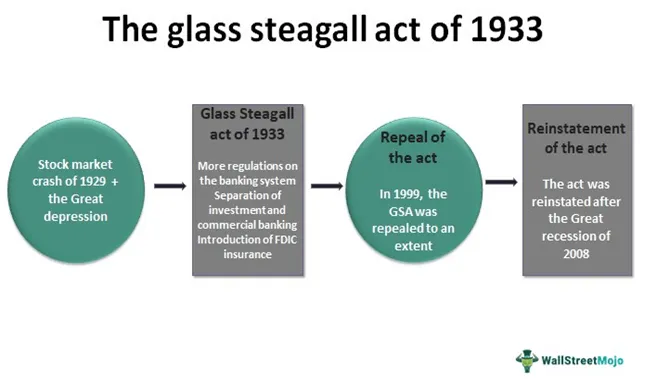

The intersection of financial reform and modern banking practices is a dynamic and complex field that has undergone significant transformation over the decades. Historically, one of the pivotal moments in financial regulation was the enactment of the Glass-Steagall Act in 1933, a response to the catastrophic failures of the banking system during the Great Depression. This legislation aimed to restore confidence in the banking system by imposing a clear separation between commercial banking and investment banking. The primary objective was to mitigate the risks associated with conflicts of interest and excessive speculation, which had been prevalent prior to the 1929 stock market crash.[^1^]

The significance of the Glass-Steagall Act extends beyond its immediate goals. It established a framework that fundamentally shaped the banking landscape in the United States for several decades, promoting financial stability and protecting consumer interests. However, as financial markets evolved and globalized, the boundaries defined by Glass-Steagall began to be seen as constraints to financial innovation and competitiveness. This led to a progressive erosion of its provisions, culminating in its repeal in 1999 through the Gramm-Leach-Bliley Act. The repeal marked a shift towards deregulation and a more integrated financial system, but it also reignited debates about the balance between free markets and prudent regulation, especially following the 2007-2008 financial crisis.

In parallel with these regulatory shifts, the financial markets have experienced a technological revolution, most notably with the rise of algorithmic trading. This practice, which involves the use of computer programs to execute trading strategies at speeds and frequencies beyond human capacity, has profoundly changed the nature of trading activities. Algorithmic trading offers advantages such as increased efficiency, accuracy, and cost-effectiveness. However, it also introduces new risks, including market volatility and the potential for systemic failures due to technological glitches or poorly designed algorithms.[^2^] 

The evolution of banking regulation and the impact of technological advancements like algorithmic trading highlight the ongoing challenge of crafting a regulatory environment that fosters innovation while safeguarding economic stability. Understanding these dynamics is crucial for policymakers, financial institutions, and other stakeholders as they navigate the complexities of modern finance.

[^1^]: "The Banking Act of 1933," Federal Reserve History, https://www.federalreservehistory.org/essays/glass-steagall-act.
[^2^]: Hendershott, Terrence, Charles M. Jones, and Albert J. Menkveld, "Does Algorithmic Trading Improve Liquidity?" Journal of Finance, Vol. 66, No. 1, 2011.

## Table of Contents

## The Glass-Steagall Act: Foundation of Financial Reform

The Glass-Steagall Act, officially known as the Banking Act of 1933, was a pivotal piece of legislation in the United States that laid the foundation for financial reform during the Great Depression. Its primary objectives were to restore confidence in the American banking system and to safeguard consumers against the risky financial practices that had contributed to the 1929 stock market crash and the subsequent bank failures.

### Background and Objectives

The origins of the Glass-Steagall Act can be traced to the widespread financial chaos of the early 1930s, marked by numerous bank failures and a lack of consumer confidence in the financial system. Sponsored by Senator Carter Glass and Representative Henry B. Steagall, the act aimed to infuse stability into the financial sector by imposing clear boundaries and regulations.

### Separation of Commercial and Investment Banking

One of the cornerstone provisions of the Glass-Steagall Act was the separation of commercial and investment banking activities. This separation was primarily motivated by the need to prevent conflicts of interest and to protect depositors' funds. Before the act, banks often engaged in both commercial banking—taking deposits and making loans—and investment banking—underwriting and dealing in securities. This dual role resulted in banks taking undue risks with depositors' money, which was a contributing [factor](/wiki/factor-investing) to the financial collapse.

The benefits of this separation were multi-faceted. By prohibiting commercial banks from engaging in investment banking, the act aimed to reduce the risk of bank failures. It ensured that banks focused on their core function of safeguarding deposits and providing credit rather than speculative investments. As a result, this partition played a significant role in promoting financial stability.

### Impact on Financial Stability and Consumer Protection

The enactment of the Glass-Steagall Act led to a considerable enhancement in financial stability and consumer protection during its enforcement. By limiting banks' exposure to risky financial activities, it reduced the chances of banking crises. Furthermore, it established the Federal Deposit Insurance Corporation (FDIC), which provided insurance for depositors, thereby boosting public confidence in financial institutions. This measure helped stabilize the banking sector and encouraged consumer participation in the economic recovery process.

### Repeal and Subsequent Regulatory Changes

Despite its initial success, the Glass-Steagall Act faced criticism over the decades, particularly from those who argued that it limited financial innovation and competitiveness. In 1999, key provisions of the act were repealed by the Gramm-Leach-Bliley Act, effectively removing the barriers between commercial and investment banking once again. This deregulation allowed financial institutions to diversify their services, leading to the emergence of financial conglomerates.

The repeal is often cited as a factor that contributed to the 2007-2008 financial crisis, as the lack of separation allowed banks to engage in high-risk activities with little oversight. In response to the crisis, subsequent legislation such as the Dodd-Frank Wall Street Reform and Consumer Protection Act of 2010 was introduced to address these regulatory gaps and re-impose some level of oversight on the financial industry.

In conclusion, the Glass-Steagall Act represented a significant milestone in financial regulation, with its impacts resonating through the decades. Although its provisions have been largely repealed, the act remains a touchstone in discussions about financial stability and the role of regulation in protecting consumers from risky banking practices.

## Banking Regulation in a Post-Glass-Steagall Era

The repeal of the Glass-Steagall Act in 1999, through the Gramm-Leach-Bliley Act, marked a significant turning point in the landscape of banking regulation. This repeal dismantled the barrier between commercial banking and investment banking, a measure originally established to prevent conflicts of interest and promote financial stability. In the absence of these restrictions, financial institutions could now offer a broader range of services, leading to increased competition but also heightening systemic risks.

### Key Regulatory Frameworks Post-Glass-Steagall

Following the repeal, financial markets underwent considerable expansion, prompting the need for regulatory frameworks to manage emerging complexities. The financial crisis of 2007-2008 highlighted the inadequacies in existing regulations, leading to the introduction of the Dodd-Frank Wall Street Reform and Consumer Protection Act in 2010.

#### Dodd-Frank Act and Glass-Steagall

The Dodd-Frank Act aimed to restore stability to the financial system by implementing stringent regulatory measures. Although it did not reinstate the Glass-Steagall separations, it addressed similar concerns through measures such as the Volcker Rule. The Volcker Rule prohibits banks from engaging in proprietary trading and restricts investments in hedge funds and private equity, partially echoing the spirit of Glass-Steagall by curbing risky financial activities by depository institutions. 

### Evolution of Financial Reforms

Modern financial reforms have adapted to address challenges that were unforeseen during the era of Glass-Steagall. The rise of complex financial products, globalized markets, and technological advancements necessitated a dynamic regulatory approach. The Dodd-Frank Act's establishment of the Financial Stability Oversight Council (FSOC) and the Consumer Financial Protection Bureau (CFPB) exemplifies the effort to monitor systemic risk and protect consumers in a rapidly evolving financial landscape.

### Efforts to Reinstate Glass-Steagall Elements

Despite significant reforms, the debate over reinstating aspects of the Glass-Steagall Act continues. Proponents argue that such measures could simplify regulatory requirements and mitigate risks associated with conglomerate financial institutions. Various legislative proposals, such as the Glass-Steagall Restoration Act, have emerged in recent years, advocating for a clear separation between commercial and investment banking activities. These proposals reflect ongoing concerns about financial stability and the enduring legacy of Glass-Steagall's regulatory philosophy.

As the financial sector remains a cornerstone of global economies, the interplay between regulation and market dynamics continues to shape the regulatory landscape. Balancing innovation with the need for stability remains a primary challenge for policymakers aiming to safeguard against future financial crises.

## The Advent of Algorithmic Trading

Algorithmic trading, often referred to as algo trading, utilizes computer programs to execute trades at high speeds and volumes based on predefined criteria. This method involves using complex algorithms and mathematical models to make trading decisions and place orders on electronic exchanges. The primary objective is to identify trading opportunities that optimize profit margins or minimize costs, without the direct involvement of human traders.

At its core, [algorithmic trading](/wiki/algorithmic-trading) involves several key components. First is the development of the trading algorithm, which includes the identification of trading strategies and rules based on historical data analysis. This can range from simple execution strategies, such as following a moving average, to complex predictive models that incorporate statistical [arbitrage](/wiki/arbitrage) or [machine learning](/wiki/machine-learning) techniques. Once the rules are set, the algorithm continuously scans the market for matching conditions, executing trades as suitable opportunities arise.

The introduction of algorithmic trading has significantly increased the speed and nature of trading activities. Traditionally, human traders executed trades manually, a process that often involved considerable time and lag. Algorithmic trading systems, by contrast, operate at microsecond speeds, executing thousands of trades in the time a human takes to process a single order. This enhancement in speed not only increases market [liquidity](/wiki/liquidity-risk-premium) but also reduces the overall transaction costs due to narrower bid-ask spreads.

Algorithmic trading offers numerous advantages, making it an attractive choice for financial institutions and investors. Efficiency stands at the forefront, as algorithms can process vast datasets much faster than human analysts, reducing the likelihood of errors associated with manual trading. Moreover, algorithms ensure higher accuracy, as they adhere strictly to predefined instructions, eliminating emotional biases that often affect human decision-making. Cost-effectiveness is another notable benefit; by automating repetitive tasks, institutions can reduce labor costs and improve profit margins, enhancing overall market efficiency.

However, algorithmic trading is not without risks. One of the primary concerns is market [volatility](/wiki/volatility-trading-strategies). High-frequency trading, a subset of algorithmic trading, can lead to rapid price fluctuations, increasing market instability. Additionally, technological failures pose significant risks. Algorithms operate in a highly automated environment, and any glitches or errors in the code can lead to unintended trade executions or significant financial losses. For instance, a faulty algorithm might mistakenly interpret market signals, leading to erroneous trading decisions that resonate across the financial market.

To mitigate these risks, substantial emphasis is placed on robust risk management frameworks and rigorous testing of algorithms before deployment. This includes [backtesting](/wiki/backtesting) against historical data, conducting stress tests under various market conditions, and implementing stringent monitoring systems to oversee algorithmic performance in real-time.

In summary, while algorithmic trading revolutionizes trading efficiency and accuracy, it necessitates careful consideration of potential risks and robust regulatory frameworks to ensure its sustainable integration into the financial market landscape.

## Contemporary Challenges in Banking Regulation

The rapidly evolving landscape of financial technology presents considerable challenges for banking regulation. As technological advancements drive innovation, they also compel regulators to craft policies that effectively balance the benefits of innovation with the critical need for market stability. This dynamic interplay requires a nuanced regulatory perspective, capable of adapting to new developments without stifling growth.

Technological advancements, particularly in trading activities, have revolutionized the financial markets. Algorithmic trading, high-frequency trading, and other technology-driven methods have significantly increased the speed and [volume](/wiki/volume-trading-strategy) of trades. While these innovations enhance market efficiency and liquidity, they also introduce risks such as increased volatility and systemic risk due to the complexity and speed of transactions.

Regulators have responded to these challenges by implementing measures that aim to monitor and control the potential downsides. For instance, circuit breakers have been introduced to halt trading during extreme volatility. This measure was developed in response to events like the Flash Crash of 2010, where the Dow Jones Industrial Average dropped nearly 1,000 points within minutes before rebounding. Such incidents exemplify the need for mechanisms that can quickly stabilize tumultuous markets.

However, as these regulatory measures are put into practice, the challenge remains how to effectively balance innovation with market stability. Policymakers must ensure that regulations do not impede technological advancements while still safeguarding the financial system. This involves creating a regulatory environment that is adaptable to rapidly changing technology without compromising on the essential principles of financial stability and consumer protection.

Case studies on regulatory lapses and their lessons provide valuable insights. The 2008 financial crisis highlighted the repercussions of inadequate oversight, particularly concerning complex financial products like mortgage-backed securities. These lapses illustrated the importance of robust regulatory frameworks that discourage excessive risk-taking and ensure transparency.

Debates on the need for updated financial reforms continue to underscore the necessity for a forward-looking regulatory approach. The increasing integration of [artificial intelligence](/wiki/ai-artificial-intelligence) and machine learning in trading requires regulators to anticipate future risks and craft policies accordingly. This ongoing dialogue is crucial for evolving financial regulations that adequately address current challenges and anticipate future developments.

In summary, contemporary challenges in banking regulation underscore the importance of balancing technological innovation with market stability. Lessons from past regulatory failures emphasize the need for adaptive and forward-thinking policies. As the financial landscape continues to change, regulators must remain vigilant and proactive in their efforts to safeguard the integrity and stability of the financial markets.

## The Future of Financial Reform and Regulation

Predicting upcoming trends in banking regulation involves understanding how financial markets might evolve in response to innovations and challenges. Emerging technologies, such as blockchain, artificial intelligence, and machine learning, are poised to significantly impact financial markets. These technologies promise increased efficiency, transparency, and accessibility but also introduce new risks and regulatory challenges.

**Emerging Technologies and Financial Markets**

Blockchain technology, which underpins cryptocurrencies, has the potential to enhance transaction security and reduce fraud. By decentralizing financial processes, blockchain can create more transparent and efficient systems. However, it also poses risks, including regulatory uncertainty and potential misuse for illicit activities.

Artificial intelligence (AI) and machine learning (ML) are transforming the financial landscape by enabling predictive analytics, personalized financial services, and automated decision-making processes. These technologies can improve risk management and operational efficiency but raise concerns about data privacy, algorithmic bias, and systemic risks due to high-frequency trading bots and automated market responses.

**The Debate on Reinstating Elements of the Glass-Steagall Act**

The Glass-Steagall Act’s separation of commercial and investment banking was seen as a protector of consumer interests and financial stability. Its repeal in the late 20th century has sparked ongoing debates about whether reinstating some of its provisions could mitigate modern financial risks. Proponents believe that reestablishing barriers between different banking activities could prevent conflicts of interest and reduce systemic risk. Critics argue that such measures might stifle financial innovation and that a nuanced, updated regulatory framework would be more effective.

**Adapting Regulatory Bodies to Rapid Technological Changes**

Regulatory bodies face the challenge of balancing innovation with financial stability. Rapid technological changes necessitate a dynamic regulatory approach that can effectively manage risks without hindering technological advancement. Policymakers are urged to develop frameworks that are flexible and adaptive, encouraging innovation while safeguarding against new forms of risk.

One approach is the implementation of regulatory sandboxes, where new financial products and services can be tested in a controlled environment before full-scale deployment. This allows for careful monitoring and risk assessment of innovations such as blockchain-based financial services or AI-driven investment strategies.

Additionally, global cooperation among regulatory authorities is becoming increasingly essential. Financial markets are interconnected, and regulatory discrepancies between nations can lead to regulatory arbitrage and increased risk exposure. Harmonized international standards and practices can help ensure a cohesive and comprehensive regulatory environment.

In conclusion, the future of financial reform and regulation will undoubtedly be shaped by technological advancements and the need to address the challenges they present. Policymakers are tasked with devising strategies that protect the financial system's integrity while allowing for the benefits of innovation to be fully realized. The ongoing dialogue regarding the reinstatement of Glass-Steagall-like provisions highlights the continued quest for a balanced, effective regulatory framework.

## Conclusion

A robust regulatory framework in financial markets is essential for maintaining stability and promoting sustainable economic growth. The history of banking regulation, highlighted by legislation such as the Glass-Steagall Act, underscores the importance of regulatory measures that adapt to evolving market practices and technological advancements. Glass-Steagall, enacted during the Great Depression, established a precedent for separating commercial and investment banking, aiming to protect consumers and reduce systemic risk.

Over time, as financial markets have grown more complex and interconnected, the need for balanced regulation remains crucial. Effective regulation curtails excessive risk-taking, ensures transparency, and protects both consumers and the economy at large. The repeal of the Glass-Steagall Act and the subsequent financial crises have reignited discussions on the relevance of traditional banking regulations in the modern era. The emergence of algorithmic trading and sophisticated financial instruments further complicates this landscape, presenting new challenges for regulators who must balance innovation with market stability.

The interplay between traditional regulations and modern banking practices requires continual assessment and adaptation. Stakeholders, including regulatory bodies, financial institutions, and policymakers, must engage in ongoing dialogue to address the changing dynamics of the financial markets. These discussions should focus on crafting regulations that effectively manage emerging risks while fostering a competitive and innovative financial sector.

As we look to the future, the role of regulations will be increasingly pivotal in navigating the complexities posed by technological advancements. Regulatory bodies must embrace flexibility, adaptability, and innovation in their approaches to financial reform. By doing so, they can ensure economic resilience and stability, thereby safeguarding the interests of all market participants. Encouraging a collaborative effort among stakeholders is essential for the continuous evolution of financial regulation in the pursuit of an equitable and stable economic environment.

## References & Further Reading

[1]: ["The Banking Act of 1933," Federal Reserve History](https://www.federalreservehistory.org/essays/glass-steagall-act)

[2]: Hendershott, Terrence, Charles M. Jones, and Albert J. Menkveld. "Does Algorithmic Trading Improve Liquidity?" Journal of Finance, Vol. 66, No. 1, 2011.

[3]: Krugman, Paul. (2009). "The Return of Depression Economics and the Crisis of 2008." W. W. Norton & Company.

[4]: Stiglitz, Joseph. (2010). "Freefall: America, Free Markets, and the Sinking of the World Economy." W. W. Norton & Company.

[5]: Johnson, Simon, and James Kwak. (2010). "13 Bankers: The Wall Street Takeover and the Next Financial Meltdown." Pantheon Books.

[6]: ["Advances in Financial Machine Learning"](https://www.amazon.com/Advances-Financial-Machine-Learning-Marcos/dp/1119482089) by Marcos Lopez de Prado

[7]: ["Quantitative Trading: How to Build Your Own Algorithmic Trading Business"](https://books.google.com/books/about/Quantitative_Trading.html?id=j70yEAAAQBAJ) by Ernest P. Chan