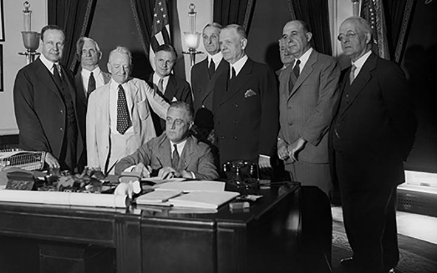

## Table of Contents

## What is the Glass-Steagall Act?

The Glass-Steagall Act was a law passed in the United States in 1933. It was created to help fix problems in the banking system after the stock market crash of 1929. The main goal of the Act was to separate commercial banks, which take deposits and make loans, from investment banks, which deal with stocks and bonds. This separation was meant to stop banks from taking too many risks with people's money.

The Act worked by setting up strict rules for banks. It said that commercial banks could not be involved in the risky activities of investment banks. This was important because it helped protect people's savings. The Glass-Steagall Act stayed in place for many years, but it was mostly repealed in 1999. Some people think that getting rid of the Act helped cause the financial crisis in 2008 because banks started taking more risks again.

## When was the Glass-Steagall Act passed?

The Glass-Steagall Act was passed in 1933. It was a law made to help fix the banking system after the stock market crashed in 1929. The main idea was to keep commercial banks, which handle people's savings and loans, separate from investment banks, which deal with stocks and bonds. This separation was important because it stopped banks from taking big risks with people's money.

The Act had strict rules that said commercial banks could not do the risky things that investment banks did. This helped keep people's savings safe. The Glass-Steagall Act was in place for a long time, but most of it was removed in 1999. Some people believe that taking away the Act led to the financial crisis in 2008 because banks started taking more risks again.

## What were the main provisions of the Glass-Steagall Act?

The Glass-Steagall Act had several important rules to help fix the problems in the banking system after the 1929 stock market crash. The main rule was to separate commercial banks from investment banks. Commercial banks are the ones that take in people's savings and give out loans. Investment banks, on the other hand, deal with buying and selling stocks and bonds. By keeping these two types of banks separate, the Act made sure that banks could not use people's savings to take big risks in the stock market.

Another key part of the Glass-Steagall Act was setting up the Federal Deposit Insurance Corporation (FDIC). The FDIC was created to protect people's money in banks. If a bank failed, the FDIC would make sure that people could still get their money back. This helped to stop bank runs, which is when a lot of people try to take their money out of a bank at the same time because they are worried the bank will fail. By giving people confidence in the safety of their savings, the Act helped to make the banking system more stable.

## Why was the Glass-Steagall Act introduced?

The Glass-Steagall Act was introduced in 1933 because of the big problems in the banking system after the stock market crashed in 1929. Many banks failed during this time, and people lost a lot of money. The main reason for the Act was to stop banks from taking too many risks with people's savings. Before the Act, banks could use people's money to buy and sell stocks and bonds, which was very risky. The Act fixed this by making a rule that separated commercial banks, which handle savings and loans, from investment banks, which deal with stocks and bonds.

Another big reason for the Glass-Steagall Act was to protect people's savings and make the banking system more stable. The Act created the Federal Deposit Insurance Corporation (FDIC), which made sure that if a bank failed, people could still get their money back. This helped to stop bank runs, where lots of people try to take their money out of a bank at the same time because they are worried it will fail. By giving people confidence in the safety of their savings, the Act helped to make the banking system more stable and trustworthy.

## How did the Glass-Steagall Act aim to protect the economy?

The Glass-Steagall Act aimed to protect the economy by fixing the problems in the banking system after the 1929 stock market crash. The main way it did this was by separating commercial banks from investment banks. Commercial banks are the ones that take in people's savings and give out loans. Investment banks deal with buying and selling stocks and bonds. By keeping these two types of banks separate, the Act made sure that banks could not use people's savings to take big risks in the stock market. This was important because it helped to stop banks from failing and losing people's money.

Another way the Glass-Steagall Act protected the economy was by setting up the Federal Deposit Insurance Corporation (FDIC). The FDIC was created to protect people's money in banks. If a bank failed, the FDIC would make sure that people could still get their money back. This helped to stop bank runs, which is when a lot of people try to take their money out of a bank at the same time because they are worried the bank will fail. By giving people confidence in the safety of their savings, the Act helped to make the banking system more stable. This stability was important for the overall health of the economy.

## What were the immediate effects of the Glass-Steagall Act on the banking industry?

The Glass-Steagall Act had a big impact on the banking industry right away. It made a clear line between commercial banks and investment banks. Commercial banks, which take in people's savings and give out loans, were not allowed to do the risky things that investment banks do, like buying and selling stocks and bonds. This meant that banks had to change how they worked. Some banks had to split into two parts: one part to keep doing the safe banking stuff, and another part to do the risky investment stuff. This separation helped to make the banking system safer because it stopped banks from using people's savings to take big risks in the stock market.

Another immediate effect was the creation of the Federal Deposit Insurance Corporation (FDIC). The FDIC was set up to protect people's money in banks. If a bank failed, the FDIC would make sure that people could still get their money back. This helped to stop bank runs, which is when a lot of people try to take their money out of a bank at the same time because they are worried the bank will fail. With the FDIC in place, people felt more confident about keeping their money in banks. This helped to make the banking system more stable and trustworthy right away.

## How did the Glass-Steagall Act influence the financial stability of the United States?

The Glass-Steagall Act helped make the United States' financial system more stable by separating commercial banks from investment banks. Commercial banks take in people's savings and give out loans, while investment banks deal with buying and selling stocks and bonds. Before the Act, banks could use people's savings to take big risks in the stock market, which was dangerous. By making a clear line between these two types of banks, the Act stopped banks from using people's money for risky investments. This made the banking system safer and more stable because banks were less likely to fail and lose people's money.

Another way the Glass-Steagall Act helped with financial stability was by creating the Federal Deposit Insurance Corporation (FDIC). The FDIC was set up to protect people's money in banks. If a bank failed, the FDIC would make sure that people could still get their money back. This helped stop bank runs, which happen when a lot of people try to take their money out of a bank at the same time because they are worried the bank will fail. By giving people confidence that their money was safe, the Act helped make the banking system more stable. This stability was important for the overall health of the economy.

## What were the long-term impacts of the Glass-Steagall Act on the banking sector?

The Glass-Steagall Act had a big impact on the banking sector over a long time. It kept commercial banks and investment banks separate for many years. This meant that banks could not use people's savings to take big risks in the stock market. As a result, the banking system became safer and more stable. Banks were less likely to fail, which helped to protect people's money and make the economy stronger. This stability lasted for a long time, until the Act was mostly repealed in 1999.

After the Glass-Steagall Act was repealed, some people think it led to more problems in the banking sector. Banks started to take more risks again because they could mix commercial and investment banking. This might have helped cause the financial crisis in 2008. Many people believe that bringing back the rules from the Glass-Steagall Act could help make the banking system safer again. Even though the Act is not in place anymore, it still affects how people think about banking rules and financial stability.

## When and why was the Glass-Steagall Act repealed?

The Glass-Steagall Act was mostly repealed in 1999. It was taken away because people thought that the rules were too strict and were stopping banks from making more money. Banks wanted to be able to do both commercial banking, which is taking in people's savings and giving out loans, and investment banking, which is buying and selling stocks and bonds. They believed that combining these activities would help them make more money and be more competitive.

The repeal of the Glass-Steagall Act was done through a new law called the Gramm-Leach-Bliley Act. This new law let banks mix commercial and investment banking again. Some people think that getting rid of the Glass-Steagall Act's rules helped cause the big financial crisis in 2008. They say that banks started taking too many risks again, which made the economy less stable. Even though the Glass-Steagall Act is not in place anymore, it still affects how people think about banking rules and financial stability today.

## What were the consequences of repealing the Glass-Steagall Act?

The repeal of the Glass-Steagall Act in 1999 had big effects on the banking industry. Before the repeal, banks had to keep their commercial banking, which is taking in people's savings and giving out loans, separate from their investment banking, which is buying and selling stocks and bonds. After the repeal, banks could mix these activities again. This meant banks could use people's savings to take bigger risks in the stock market. Banks thought this would help them make more money and be more competitive, but it also made the banking system less safe.

Some people believe that getting rid of the Glass-Steagall Act helped cause the big financial crisis in 2008. Banks started taking more risks because they could do both commercial and investment banking. When these risks did not pay off, it led to big problems in the economy. Many people lost their jobs and homes, and the government had to step in to help fix things. Even though the Glass-Steagall Act is not in place anymore, it still affects how people think about banking rules and financial stability today.

## How did the repeal of the Glass-Steagall Act contribute to the financial crisis of 2007-2008?

The repeal of the Glass-Steagall Act in 1999 let banks mix commercial banking, where they take in people's savings and give out loans, with investment banking, where they buy and sell stocks and bonds. Before the repeal, banks had to keep these activities separate, which made the banking system safer. But after the repeal, banks could use people's savings to take bigger risks in the stock market. They thought this would help them make more money and be more competitive. But it also made the banking system less safe because banks were more likely to fail if their risky investments did not pay off.

Some people believe that getting rid of the Glass-Steagall Act helped cause the big financial crisis in 2007-2008. Banks started taking more risks because they could do both commercial and investment banking. They invested in things like risky mortgage loans, which they thought would make them a lot of money. But when these investments failed, it caused big problems in the economy. Many people lost their jobs and homes, and the government had to step in to help fix things. Even though the Glass-Steagall Act is not in place anymore, it still affects how people think about banking rules and financial stability today.

## What are the current debates and opinions regarding the reinstatement of the Glass-Steagall Act?

There are a lot of debates and different opinions about bringing back the Glass-Steagall Act. Some people think it should be brought back because they believe it would make the banking system safer. They say that separating commercial banks from investment banks would stop banks from taking big risks with people's savings. This could help prevent another financial crisis like the one in 2008. These people argue that the rules of the Glass-Steagall Act worked well for a long time and should be used again to make the economy more stable.

On the other hand, some people are against bringing back the Glass-Steagall Act. They think that the old rules are too strict and would stop banks from making money and being competitive. They argue that banks should be allowed to do both commercial and investment banking because it helps them offer more services to their customers. These people believe that new rules and regulations put in place after the 2008 financial crisis are enough to keep the banking system safe. So, they do not see the need to go back to the old Glass-Steagall Act rules.

## References & Further Reading

[1]: ["The Banking Act of 1933," Federal Reserve History](https://www.federalreservehistory.org/essays/glass-steagall-act)

[2]: Hendershott, Terrence, Charles M. Jones, and Albert J. Menkveld. "Does Algorithmic Trading Improve Liquidity?" Journal of Finance, Vol. 66, No. 1, 2011.

[3]: Krugman, Paul. (2009). "The Return of Depression Economics and the Crisis of 2008." W. W. Norton & Company.

[4]: Stiglitz, Joseph. (2010). "Freefall: America, Free Markets, and the Sinking of the World Economy." W. W. Norton & Company.

[5]: Johnson, Simon, and James Kwak. (2010). "13 Bankers: The Wall Street Takeover and the Next Financial Meltdown." Pantheon Books.

[6]: ["Advances in Financial Machine Learning"](https://www.amazon.com/Advances-Financial-Machine-Learning-Marcos/dp/1119482089) by Marcos Lopez de Prado

[7]: ["Quantitative Trading: How to Build Your Own Algorithmic Trading Business"](https://books.google.com/books/about/Quantitative_Trading.html?id=j70yEAAAQBAJ) by Ernest P. Chan