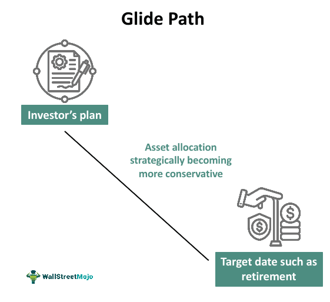

## Table of Contents

## What is a glide path in investment strategies?

A glide path in investment strategies is like a roadmap that guides how your investments change over time, especially as you get closer to a specific goal, like retirement. It usually starts with more risky investments, like stocks, when you're young and have time to recover from market ups and downs. As you get older, the glide path shifts your money into safer investments, like bonds, to protect your savings.

Think of it as adjusting your speed when landing an airplane. At the beginning of your investment journey, you're flying high and fast with riskier investments. But as you approach your goal, you slow down and descend smoothly by moving into less risky investments. This helps make sure you can reach your financial goals safely and smoothly.

## Why is a glide path important for investors?

A glide path is important for investors because it helps them manage risk as they get closer to their financial goals. When you're young and have a long time before you need your money, you can take more risks with your investments, like putting more money into stocks. This can help your savings grow more over time. But as you get older and closer to needing your money, like for retirement, you don't want to lose it all because of a sudden drop in the stock market. A glide path helps you shift your money into safer investments, like bonds, to protect what you've saved.

Using a glide path also makes investing easier because it gives you a plan to follow. Instead of trying to guess when to change your investments, a glide path does it for you automatically. This can save you a lot of stress and time, especially if you're not sure about how to manage your investments. By following a glide path, you can feel more confident that your money is being managed in a way that matches your age and how close you are to your financial goals.

## How does a glide path relate to asset allocation?

A glide path is all about how you change your asset allocation over time. Asset allocation is just a fancy way of saying how you split your money between different types of investments, like stocks, bonds, and cash. When you start investing, a glide path might tell you to put more money into stocks because they can grow a lot over time, but they're also riskier. As you get closer to your goal, like retirement, the glide path will guide you to move more of your money into bonds and cash, which are safer but don't grow as much.

This change in asset allocation is important because it helps you balance risk and reward. When you're young, you can handle more risk because you have time to recover if the stock market goes down. But as you get older, you want to protect what you've saved, so you need to lower your risk. The glide path does this by slowly changing your asset allocation to keep your investments safe while still trying to grow your money. It's like a plan that helps you make smart choices about your money without having to guess what to do next.

## What are the different types of glide paths?

There are mainly two types of glide paths: target-date glide paths and managed glide paths. Target-date glide paths are used in target-date funds, which are investment funds designed to reach a specific goal by a certain date, like retiring in 2040. These funds automatically adjust your investments based on how many years are left until that date. The closer you get to the target date, the more the fund shifts your money from risky investments like stocks to safer ones like bonds.

Managed glide paths, on the other hand, are more flexible and can be adjusted by a financial advisor or through a robo-advisor. Instead of following a set schedule based on a target date, managed glide paths can be changed based on your personal situation, like if you decide to retire earlier or later, or if the economy changes in a big way. This type of glide path gives you more control and can be tailored to fit your specific needs and goals.

Both types of glide paths help you manage your investments over time, but they do it in different ways. Target-date glide paths are simpler and good if you want a hands-off approach, while managed glide paths offer more customization and might be better if you want to work closely with an advisor or need more flexibility.

## How does a target-date fund use a glide path?

A target-date fund uses a glide path to automatically change how your money is invested as you get closer to your goal, like retiring in 2050. When you first invest, the fund might put most of your money into stocks because they can grow a lot over time, even though they're riskier. This is good when you're young and have many years before you need your money.

As the target date gets closer, the glide path shifts your money from stocks to safer investments like bonds. This helps protect your savings because you don't want to lose a lot of money right before you retire. The glide path does all this work for you, so you don't have to worry about when to change your investments. It's like having a smart plan that adjusts your money to match your age and how close you are to your goal.

## What is the difference between a static and a dynamic glide path?

A static glide path is like a set plan that doesn't change much. It follows a fixed schedule to move your money from risky investments like stocks to safer ones like bonds as you get closer to your goal, like retirement. Once the plan is set, it doesn't change based on what's happening in the market or your personal life. It's simple and easy to follow, but it might not be the best if things change a lot.

A dynamic glide path, on the other hand, can change based on what's happening around you. It's more flexible and can adjust your investments if the economy changes or if your life plans change, like if you decide to retire earlier or later. This type of glide path tries to keep your money safer and might help you earn more, but it needs more attention and might be more complicated to manage.

## How should an investor choose the right glide path for their portfolio?

Choosing the right glide path for your portfolio depends on your age, when you want to reach your goal, and how much risk you're okay with. If you're young and have a long time before you need your money, a glide path that starts with more stocks might be good for you. It can help your money grow a lot over time. But if you're closer to your goal, like retiring soon, you might want a glide path that moves your money into safer investments like bonds earlier. This helps protect what you've saved.

You should also think about whether you want a simple, set-it-and-forget-it plan or something that can change if things in your life or the economy change. A target-date fund with a static glide path is easy because it does all the work for you without changing. But if you want something that can be adjusted, like if you decide to retire earlier or if the market goes crazy, a managed glide path might be better. Talking to a financial advisor can help you figure out which type of glide path fits your needs best.

## What are the potential risks associated with following a glide path?

One risk of following a glide path is that it might not match your personal situation perfectly. Glide paths are usually set up for a typical investor, but everyone's life is different. If you have special needs or your plans change, like wanting to retire earlier or later, the glide path might not adjust quickly enough or in the right way. This could mean your money isn't invested as well as it could be for your specific goals.

Another risk is that glide paths can be too simple. They often follow a set plan without thinking about what's happening in the economy or the stock market. If there's a big change, like a crash or a boom, the glide path might not change your investments fast enough to protect your money or take advantage of new opportunities. This can lead to losing money or missing out on better investment chances.

## How does a glide path adjust as an investor approaches retirement?

As an investor gets closer to retirement, a glide path slowly changes how their money is invested. When you're young, the glide path might put most of your money into stocks because they can grow a lot over time, even though they're riskier. This is good because you have many years before you need your money, so you can handle more ups and downs in the market.

But as you get closer to retiring, the glide path starts moving your money from stocks to safer investments like bonds. This helps protect your savings because you don't want to lose a lot of money right before you need it. The glide path does this automatically, so you don't have to worry about when to make these changes. It's like a plan that keeps your money safe as you get ready for retirement.

## Can a glide path be customized for individual investor needs?

Yes, a glide path can be customized to fit individual investor needs. If you work with a financial advisor or use a robo-advisor, they can create a managed glide path that changes based on your life and goals. For example, if you decide to retire earlier or if you want to take more or less risk with your money, they can adjust your investments to match what you need.

This kind of customization can be really helpful because everyone's situation is different. A standard glide path might not work perfectly for you if your plans change or if you have special needs. By working with someone who can tailor your glide path, you can make sure your money is being invested in the best way for you, helping you reach your goals more smoothly.

## What are the latest research findings on the effectiveness of glide paths?

Recent research shows that glide paths can be really helpful for investors, especially those getting ready for retirement. Studies have found that using a glide path can help balance the risk and reward of investments over time. For example, a glide path that starts with more stocks and then moves to more bonds as you get closer to retirement can help your savings grow when you're young and then protect them when you're older. This can lead to better outcomes for many investors because it matches the way investments change with your age and needs.

However, some research also points out that glide paths might not work perfectly for everyone. A standard glide path might not be the best fit if your life plans change, like if you want to retire earlier or if you need to take more or less risk with your money. Some studies suggest that customizing your glide path with the help of a financial advisor could make it work better for your specific situation. This way, you can make sure your investments are always lined up with your personal goals and any changes in your life.

## How do glide paths adapt to changing economic conditions and market environments?

Glide paths are usually set up to follow a plan that doesn't change much, even if the economy or the market changes. This means they might not adjust quickly enough if there's a big economic event, like a crash or a boom. For example, if the stock market suddenly drops a lot, a standard glide path might still keep your money in stocks longer than you'd want, which could lead to bigger losses. On the other hand, if the market is doing really well, the glide path might move your money to safer investments too soon, and you might miss out on making more money.

However, some glide paths can be more flexible and can change based on what's happening in the economy or the market. These are called dynamic or managed glide paths. If you work with a financial advisor or use a robo-advisor, they can adjust your investments to match the current economic conditions. For instance, if the economy is going through a rough patch, they might move your money into safer investments earlier to protect it. This kind of customization can help your money be safer and possibly grow more, but it needs more attention and might be more complicated to manage.

## What is the understanding of Glide Path in Portfolio Management?

A glide path is an investment formula primarily used in target-date funds, where the asset allocation evolves over time as the target date nears. The core purpose of a glide path is to manage risk and return trade-offs over the lifecycle of an investment, particularly focusing on retirement planning. Initially, the allocation is skewed towards higher-risk, higher-return assets, such as equities, which offer growth potential. As the target date approaches, the allocation gradually shifts towards more conservative investments, such as fixed-income securities, to safeguard the accumulated wealth against market [volatility](/wiki/volatility-trading-strategies). 

The basic rationale behind this strategy is life-cycle investing. Younger investors, with relatively long time horizons, can afford greater exposure to equities since they have more time to recover from potential market downturns. Conversely, as investors age and approach retirement, their risk tolerance typically diminishes, warranting a shift towards stability and income generation to preserve capital and provide a steady income stream.

Glide paths are typically represented as linear functions or step-functions, outlining the transition from equities to bonds. In a simple linear glide path, the percentage of investment in equities might start at 90% for a young investor and gradually decline to 30% by the retirement date. This can be mathematically expressed as:

$$
\text{Equity Allocation} = \max(0, \text{Starting Equity} - \text{Age} \times \text{Annual Reduction Rate})
$$

Here, 'Starting Equity' might be 90%, and 'Annual Reduction Rate' would depend on the remaining years to the target date. 

Furthermore, the effectiveness of glide paths in adapting investment strategies is illustrated by their dynamic nature. By gradually transitioning the asset mix, glide paths respond to changing risk profiles over an investor's lifecycle. This adaptability ensures that investment strategies remain aligned with an individual's financial goals and risk appetite, providing a structured yet flexible avenue for achieving these targets. However, investors must still consider individualized factors and market conditions when aligning their portfolios with a standard glide path to achieve optimal outcomes.

## References & Further Reading

[1]: Bodie, Z., Kane, A., & Marcus, A. J. (2014). ["Investments"](https://books.google.com/books/about/EBOOK_Investments_Global_edition.html?id=BMsvEAAAQBAJ). McGraw-Hill Education.

[2]: Arnott, R. D., Sherrerd, K., & Foresti, S. (2013). ["Glide Path Illusion"](https://www.researchaffiliates.com/content/dam/ra/publications/pdf/241-the-glidepath-illusion.pdf). Research Affiliates.

[3]: ["Lifecycle Investing: A New, Safe, and Audacious Way to Improve the Performance of Your Retirement Portfolio"](https://www.amazon.com/Lifecycle-Investing-Audacious-Performance-Retirement/dp/0465018297) by Ian Ayres and Barry Nalebuff.

[4]: Grinold, R. C., & Kahn, R. N. (1999). ["Active Portfolio Management: A Quantitative Approach for Producing Superior Returns and Controlling Risk"](https://www.amazon.com/Active-Portfolio-Management-Quantitative-Controlling/dp/0070248826). McGraw-Hill.

[5]: ["Algorithmic Trading: Winning Strategies and Their Rationale"](https://www.amazon.com/Algorithmic-Trading-Winning-Strategies-Rationale-ebook/dp/B00CY5HC0U) by Ernie Chan.