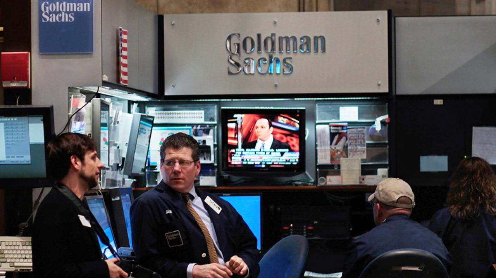

## Table of Contents

## What is the Global Alpha fund by Goldman Sachs?

The Global Alpha fund is a type of investment fund managed by Goldman Sachs. It is designed to invest in stocks and other assets from around the world. The goal of the fund is to make money for its investors by picking good investments and managing them well.

The fund is known for using a special way of choosing investments, called quantitative analysis. This means they use math and computers to decide which stocks to buy and sell. This approach helps them look at a lot of information quickly and make smart choices. Many people invest in the Global Alpha fund because they trust Goldman Sachs and believe in their methods.

## How was the Global Alpha fund established?

The Global Alpha fund was started by Goldman Sachs in 1990. A man named Cliff Asness helped create it. They wanted to make a fund that could invest in stocks from all over the world. They used a special way of choosing investments called quantitative analysis. This means they used math and computers to pick which stocks to buy and sell.

At first, the fund did really well. It made a lot of money for the people who invested in it. But over time, things got harder. The fund had some years where it did not do as well. Even so, many people still liked the fund because they believed in Goldman Sachs and their way of [picking](/wiki/asset-class-picking) investments.

## Who manages the Global Alpha fund?

The Global Alpha fund is managed by a team at Goldman Sachs. They are led by experienced people who know a lot about investing. The team uses computers and math to pick which stocks to buy and sell. This way of choosing investments is called quantitative analysis.

The fund was started by Cliff Asness in 1990. Since then, different people have led the team, but they all follow the same basic plan. They look at information from all over the world to find the best stocks to invest in. Their goal is to make money for the people who invest in the fund.

## What types of investments does the Global Alpha fund typically include?

The Global Alpha fund usually invests in stocks from many different countries. They pick stocks from places like the United States, Europe, and Asia. The fund looks for good companies to invest in, no matter where they are located. They use computers and math to decide which stocks to buy and sell.

Besides stocks, the Global Alpha fund might also invest in other things like bonds or currencies. Bonds are like loans to companies or governments, and currencies are the money used in different countries. The fund tries to spread out its investments to lower the risk. By investing in different types of assets, they hope to make money for the people who invest in the fund.

## What is the investment strategy of the Global Alpha fund?

The Global Alpha fund uses a special way of picking investments called quantitative analysis. This means they use computers and math to decide which stocks to buy and sell. They look at a lot of information from all over the world to find good companies to invest in. The fund picks stocks from many different countries, like the United States, Europe, and Asia. They want to find the best investments, no matter where they are located.

Besides stocks, the Global Alpha fund might also invest in other things like bonds and currencies. Bonds are like loans to companies or governments, and currencies are the money used in different countries. The fund tries to spread out its investments to lower the risk. By investing in different types of assets, they hope to make money for the people who invest in the fund. This way, if one type of investment does not do well, the others might still make money.

## How has the Global Alpha fund performed historically?

The Global Alpha fund started in 1990 and did really well at first. For many years, it made a lot of money for the people who invested in it. The fund used a special way of picking investments called quantitative analysis, which helped them find good stocks from all over the world. This early success made the fund very popular, and many people wanted to invest in it.

Over time, the performance of the Global Alpha fund has had ups and downs. There were years when the fund did not do as well as before. The stock market can be hard to predict, and even with their smart way of picking investments, the fund sometimes struggled. But overall, the Global Alpha fund has still been seen as a good choice by many investors because they trust Goldman Sachs and believe in their methods.

## What are the risks associated with investing in the Global Alpha fund?

Investing in the Global Alpha fund comes with some risks. One big risk is that the stock market can go up and down a lot. Even though the fund uses computers and math to pick good stocks, sometimes the market can be hard to predict. If the stocks they pick do not do well, the value of the fund can go down. This means people who invest in the fund could lose money.

Another risk is that the fund invests in many different countries. While this can help spread out the risk, it also means the fund can be affected by problems in different parts of the world. For example, if there is a big economic problem in Europe or Asia, it could hurt the stocks the fund has invested in those areas. So, the fund's performance can be influenced by things happening far away.

## How does the Global Alpha fund compare to other similar funds?

The Global Alpha fund by Goldman Sachs is known for using a special way of choosing investments called quantitative analysis. This means they use computers and math to pick stocks from all over the world. Compared to other similar funds, the Global Alpha fund has a strong reputation because it has been around since 1990 and has done well over many years. Other funds might use different ways to pick investments, like looking at company reports or talking to managers, but the Global Alpha fund's method is unique because it relies so much on data and technology.

However, like all funds, the Global Alpha fund has its ups and downs. Some years it does better than other similar funds, and some years it does worse. For example, funds that focus on specific areas like technology or healthcare might do better in certain years if those areas are doing well. But the Global Alpha fund tries to spread its investments across many different types of stocks and countries, which can help lower the risk compared to funds that focus on just one area. Overall, the Global Alpha fund is seen as a good choice by many investors because of its long history and the trust in Goldman Sachs.

## What are the fees and expenses associated with the Global Alpha fund?

Investing in the Global Alpha fund comes with some fees and expenses. There is a management fee, which is what the fund charges to pay for the people who run it. This fee is usually a small percentage of the money you have invested in the fund. For example, if the management fee is 1%, and you have $10,000 invested, you would pay $100 a year for the management of your investment.

There might also be other costs, like performance fees. These are extra fees that the fund charges if it does really well. The idea is that if the fund makes more money than expected, the people who run it get a little extra for doing a good job. These fees can add up, so it's important to understand them before you decide to invest in the Global Alpha fund.

## How can one invest in the Global Alpha fund?

To invest in the Global Alpha fund, you need to contact Goldman Sachs or work with a financial advisor who can help you. You can't just buy shares of the fund like you would with a regular stock. Instead, you need to go through a process where you apply to be an investor. This usually involves filling out some forms and showing that you have enough money to invest. Once you're approved, you can put your money into the fund.

After you invest, you'll need to keep an eye on how the fund is doing. You can usually check its performance online or by talking to your financial advisor. If you want to take your money out, you'll need to follow the fund's rules for withdrawals. Remember, there are fees and expenses to think about, so make sure you understand them before you start investing.

## What is the impact of global economic conditions on the performance of the Global Alpha fund?

The performance of the Global Alpha fund can be affected a lot by what's happening in the world's economy. Since the fund invests in stocks from many different countries, big changes in one part of the world can change how well the fund does. For example, if there's a big economic problem in Europe, the stocks the fund has there might go down in value. The same thing can happen if there's a problem in Asia or the United States. The fund tries to spread out its investments to lower the risk, but it's still hard to avoid all the ups and downs of the global economy.

The fund uses computers and math to pick stocks, which can help it do well even when the economy is not great. But even with this smart way of choosing investments, the fund can still be hurt by things like big economic crashes or sudden changes in the market. So, while the Global Alpha fund tries to make money for its investors no matter what's happening in the world, it's important to know that big global events can still affect how well the fund does.

## What advanced strategies does the Global Alpha fund employ to achieve alpha?

The Global Alpha fund uses a special way of picking investments called quantitative analysis to achieve alpha. This means they use computers and math to look at a lot of information from all over the world. They try to find patterns and trends that other people might miss. By doing this, they hope to pick stocks that will do better than the market average. This method helps them make smart choices and find good investments, even when the market is hard to predict.

Another strategy the fund uses is spreading out its investments. They don't just put all their money into one type of stock or one country. Instead, they invest in many different kinds of stocks and in many different places. This can help lower the risk because if one stock or one country does badly, the others might still do well. By doing this, the Global Alpha fund tries to make money for its investors no matter what's happening in the world's economy.

## References & Further Reading

[1]: Bergstra, J., Bardenet, R., Bengio, Y., & Kégl, B. (2011). ["Algorithms for Hyper-Parameter Optimization."](https://papers.nips.cc/paper/4443-algorithms-for-hyper-parameter-optimization) Advances in Neural Information Processing Systems 24.

[2]: ["Advances in Financial Machine Learning"](https://www.amazon.com/Advances-Financial-Machine-Learning-Marcos/dp/1119482089) by Marcos Lopez de Prado

[3]: ["Evidence-Based Technical Analysis: Applying the Scientific Method and Statistical Inference to Trading Signals"](https://www.amazon.com/Evidence-Based-Technical-Analysis-Scientific-Statistical/dp/0470008741) by David Aronson

[4]: ["Machine Learning for Algorithmic Trading"](https://github.com/stefan-jansen/machine-learning-for-trading) by Stefan Jansen

[5]: ["Quantitative Trading: How to Build Your Own Algorithmic Trading Business"](https://books.google.com/books/about/Quantitative_Trading.html?id=j70yEAAAQBAJ) by Ernest P. Chan