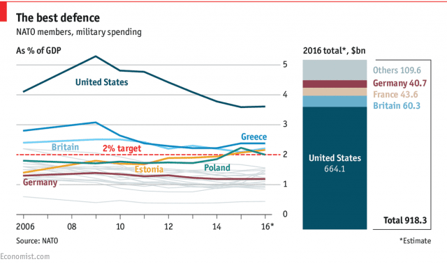

## Table of Contents

## What is antiterrorism expenditure?

Antiterrorism expenditure refers to the money a country or organization spends to prevent and fight terrorism. This includes costs for security measures, intelligence gathering, and military actions. Governments and international bodies allocate these funds to protect their citizens and maintain peace and stability.

These expenditures can cover a wide range of activities. For example, they might include funding for police and military training, installing surveillance systems, and supporting counterterrorism programs. The goal is to stop terrorist attacks before they happen and respond effectively if they do occur.

## Why is it important to track global antiterrorism expenditure by country?

Tracking global antiterrorism expenditure by country helps us understand how different nations are working to fight terrorism. By knowing how much money each country spends, we can see which countries are putting a lot of effort into stopping terrorism and which ones might need more help. This information can also show us if the spending is making a difference in keeping people safe.

It's also important because it can help countries learn from each other. If one country is spending a lot and having success, others can try to use similar methods. On the other hand, if a country is spending a lot but not seeing good results, it might need to change its approach. By sharing this information, countries can work together better to fight terrorism around the world.

## How is antiterrorism expenditure typically categorized?

Antiterrorism expenditure is usually divided into different groups based on what the money is used for. One big group is spending on security measures. This includes things like hiring more police officers, buying new equipment like cameras and metal detectors, and building stronger barriers around important places. Another group is intelligence and surveillance. This means spending money on gathering information about possible threats and keeping an eye on people or groups who might be planning attacks.

Another important category is military spending. This is money used for training soldiers, buying weapons, and sending troops to areas where there might be a terrorist threat. Some countries also spend money on programs that try to stop people from becoming terrorists in the first place. These programs might include education, job training, and other ways to help people feel like they belong and have a good future.

Tracking these different types of spending helps us see where the money is going and if it's helping to keep people safe. It also shows us how different countries are trying to fight terrorism and what they think is most important.

## Which countries spend the most on antiterrorism efforts?

The United States spends the most on antiterrorism efforts. They spend a lot of money on their military, intelligence, and security. This includes things like the Department of Homeland Security, the FBI, and the CIA. They also spend money on programs to help stop people from becoming terrorists. The U.S. spends billions of dollars every year to keep its people safe from terrorism.

Other countries that spend a lot on antiterrorism include the United Kingdom, France, and Russia. The UK spends money on its police, intelligence services like MI5 and MI6, and military. France has increased its spending since terrorist attacks in Paris. Russia spends a lot on its military and intelligence to fight terrorism, especially in areas like Chechnya. These countries all see terrorism as a big threat and spend a lot of money to fight it.

## What percentage of a country's budget is typically allocated to antiterrorism?

The percentage of a country's budget that goes to antiterrorism can be different for each country. It depends on how big a threat they think terrorism is and how much money they have to spend. For example, the United States spends a lot on antiterrorism because they see it as a big problem. They might spend around 1% to 2% of their total budget on these efforts, which adds up to billions of dollars each year.

Other countries might spend less because they have different priorities or fewer resources. For example, smaller countries or those that don't face as many terrorist threats might spend less than 1% of their budget on antiterrorism. The exact percentage can change from year to year based on what's happening in the world and what the government decides is most important.

## How has global antiterrorism expenditure changed over the past decade?

Over the past decade, global antiterrorism expenditure has generally increased. This is because many countries see terrorism as a bigger threat than before. After big attacks like those in Paris and Brussels, countries like France and Belgium spent more money to keep their people safe. The United States also kept spending a lot of money on antiterrorism, even after the wars in Iraq and Afghanistan ended. Overall, more money is being spent around the world to stop terrorism and keep people safe.

There are also changes in how countries spend their antiterrorism money. More countries are focusing on preventing terrorism before it happens. They are spending money on things like programs to help people who might be at risk of becoming terrorists. Intelligence and surveillance have also become more important. Countries are spending more on technology to watch for threats and gather information. While the total amount of money spent on antiterrorism has gone up, how it is spent has changed to try to be more effective at stopping terrorism.

## What are the main factors influencing a country's antiterrorism spending?

A country's antiterrorism spending is influenced by how big a threat they think terrorism is. If a country has had a lot of terrorist attacks, they will spend more money to stop it from happening again. For example, after attacks in Paris, France spent more on security and intelligence to keep people safe. The size of a country's budget also matters. Countries with more money can spend more on antiterrorism efforts. The United States spends a lot because they have a big budget and see terrorism as a major problem.

Another [factor](/wiki/factor-investing) is what the government thinks is most important. Some governments might focus more on military spending to fight terrorism in other countries, while others might spend more on police and surveillance at home. The political situation can also affect spending. If there is a lot of pressure from the public or other countries to do more about terrorism, a government might spend more money. Over time, as the threat of terrorism changes, countries might change how much they spend and what they spend it on to try to be more effective at stopping terrorism.

## How do different countries measure the effectiveness of their antiterrorism expenditures?

Different countries measure the effectiveness of their antiterrorism spending by looking at how many terrorist attacks they stop. They keep track of how many plots are stopped before they happen and how many attacks happen. If fewer attacks happen, they think their spending is working. They also look at how quickly they can respond to attacks and how well they can catch the people planning them. This helps them see if their money is being used in the right way.

Countries also use other ways to measure effectiveness. They might look at how happy people feel about their safety. If people feel safer, it could mean the antiterrorism efforts are working. Some countries also check if their programs to stop people from becoming terrorists are working. If fewer people are joining terrorist groups, they think their spending is helping. By using these different measures, countries can see if they need to spend more or spend their money differently to fight terrorism better.

## What are the challenges in comparing antiterrorism expenditure across countries?

Comparing antiterrorism spending across countries is hard because each country does it differently. Some countries might include military spending in their antiterrorism budget, while others might not. For example, the United States might count money spent on the Department of Defense as part of antiterrorism, but another country might only count police and intelligence spending. This makes it tricky to compare because what one country calls antiterrorism spending might be different from what another country calls it.

Another challenge is that not all countries share detailed information about how much they spend on fighting terrorism. Some countries might keep this information secret for security reasons. This means we might not have all the numbers we need to make a fair comparison. Also, the cost of things can be different in different countries. What costs a lot of money in one country might be cheaper in another, so even if two countries spend the same amount of money, it might not mean they are spending the same effort on fighting terrorism.

## How does antiterrorism spending correlate with actual terrorism incidents?

Antiterrorism spending can help reduce the number of terrorist attacks. When countries spend more money on things like police, intelligence, and military, they can stop more terrorist plots before they happen. For example, if a country spends a lot on surveillance and intelligence, they might be able to catch people planning attacks before they do anything. This means fewer attacks happen, and people feel safer. But, spending a lot of money does not always mean there will be no attacks. Sometimes, even with a lot of spending, a terrorist attack can still happen if the attackers find a way around the security measures.

It's hard to say exactly how much spending helps because other things can affect the number of attacks too. For example, if a country is in a war or has a lot of political problems, there might be more attacks even if they spend a lot on antiterrorism. Also, some countries might spend less money but still have fewer attacks because they focus on the right things, like programs to stop people from becoming terrorists. So, while spending more money can help lower the number of attacks, it's just one part of fighting terrorism, and other factors also play a big role.

## What are the future trends in global antiterrorism expenditure?

In the future, more countries will likely spend more money on fighting terrorism. This is because the threat of terrorism is seen as a big problem around the world. Countries will spend more on things like police, intelligence, and military to stop attacks before they happen. They might also spend more on programs that try to stop people from becoming terrorists in the first place. As technology gets better, countries will spend more on things like surveillance and data analysis to find threats faster.

Another trend we might see is countries working together more to fight terrorism. They might share money and information to be better at stopping attacks. This could mean more spending on international programs and working with other countries. But, how much countries spend can change if the world becomes more or less peaceful. If there are fewer attacks, countries might spend less. But if new threats come up, spending could go up again to keep people safe.

## How do international collaborations impact individual country's antiterrorism budgets?

International collaborations can change how much a country spends on fighting terrorism. When countries work together, they can share the cost of big projects. For example, they might work together on a new surveillance system or a program to stop people from joining terrorist groups. This can mean a country does not have to spend as much money on its own because other countries are helping to pay for it. But, working together can also mean a country needs to spend more money. If they join a big international group to fight terrorism, they might have to pay more to be part of it.

These collaborations can also help a country spend its money better. When countries share information and ideas, they can learn from each other. This can help them spend their money on things that really work to stop terrorism. For example, if one country finds a good way to stop attacks, other countries can use the same idea. This can make their antiterrorism spending more effective. But, if countries do not work well together, they might end up spending more money without getting better results. So, how much a country spends can go up or down depending on how well they work with other countries.

## References & Further Reading

[1]: Cushman, T. (2003). "National Security and the International System After September 11: Strength or Decline?" Journal of International Affairs, 6(1), 10-15. [Link](https://en.wikipedia.org/wiki/Battle_of_Khe_Sanh)

[2]: Barnett, T. P. M. (2005). "The Pentagon's New Map: War and Peace in the Twenty-First Century." Berkley Trade. [Link](https://archive.org/details/pentagonsnewmapw00barn)

[3]: Schwartz, M. (2010). "Defense Spending and the Economy." Congressional Research Service. [Link](https://apps.dtic.mil/sti/tr/pdf/ADA513870.pdf)

[4]: Stockholm International Peace Research Institute (SIPRI). (2023). "Trends in World Military Expenditure, 2023." [Link](https://www.sipri.org/publications/2024/sipri-fact-sheets/trends-world-military-expenditure-2023)

[5]: National Commission on Terrorist Attacks Upon the United States. (2004). "The 9/11 Commission Report: Final Report of the National Commission on Terrorist Attacks Upon the United States." W. W. Norton & Company. [Link](https://911commission.gov/report/911Report_Exec.htm)

[6]: Bilmes, L., & Stiglitz, J. E. (2010). "The Three Trillion Dollar War: The True Cost of the Iraq Conflict." W. W. Norton & Company. [Link](https://www.hks.harvard.edu/publications/three-trillion-dollar-war-true-cost-iraq-conflict)

[7]: Clarke, R. A., & Knake, R. K. (2012). "Cyber War: The Next Threat to National Security and What to Do About It." HarperCollins. [Link](https://www.mca-marines.org/wp-content/uploads/Cyber-War-Clarke-Knake.pdf)