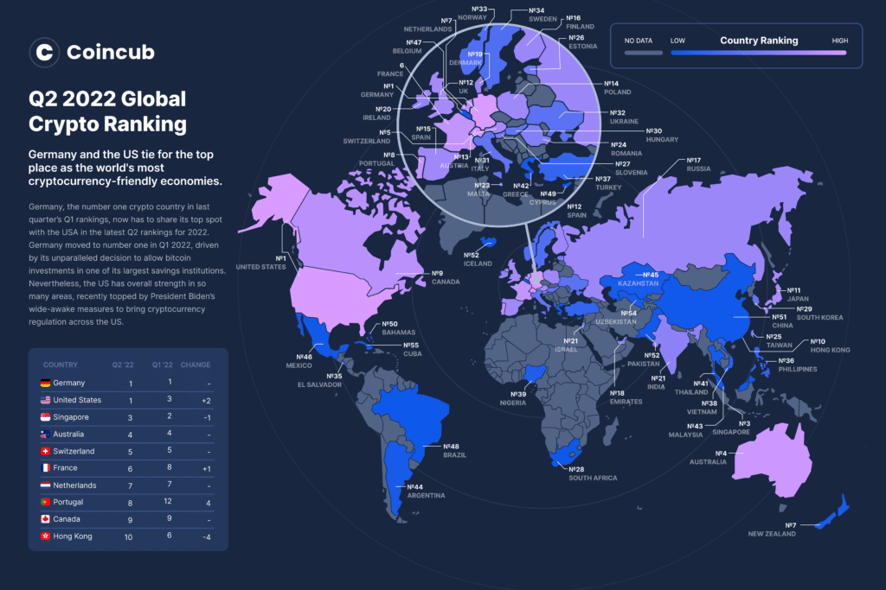

## Table of Contents

## What is Bitcoin and why is it significant?

Bitcoin is a type of digital money that you can use to buy things online. It was created in 2009 by someone using the name Satoshi Nakamoto. Unlike regular money, Bitcoin is not controlled by any government or bank. Instead, it uses a technology called blockchain, which is like a public record book that keeps track of all Bitcoin transactions. You can send and receive Bitcoins using a computer or smartphone, and you store them in a digital wallet.

Bitcoin is significant because it was the first cryptocurrency, which means it opened the door for many other digital currencies. It has changed the way people think about money and how it can be used. Bitcoin allows people to make transactions directly with each other without needing a bank or other middleman. This can be faster and cheaper, especially for sending money across different countries. Also, because Bitcoin is not controlled by any one group, it gives people more freedom and privacy in their financial dealings.

## What qualifies a location as a Bitcoin hotspot?

A location becomes a Bitcoin hotspot when a lot of people there use Bitcoin and there are many places where you can spend it. This could be because the people in that area believe in the idea of Bitcoin or because it's easy for them to use it. For example, if a city has many stores, restaurants, and services that accept Bitcoin, it makes it more convenient for people to use it every day.

Also, a place can become a Bitcoin hotspot if it has events or meetups where people come together to talk about and learn about Bitcoin. These gatherings can attract more people to use Bitcoin and can help businesses see the benefits of accepting it. Over time, this can create a community that supports and grows the use of Bitcoin in that area.

## How can someone new to Bitcoin get started?

To get started with Bitcoin, you first need to set up a digital wallet. A digital wallet is like a bank account but for Bitcoin. You can download a wallet app on your smartphone or computer. There are many different wallet apps, so pick one that is easy for you to use. Once you have your wallet set up, you can get some Bitcoin. You can buy Bitcoin from a special website called an exchange, or you might get some from a friend who already has Bitcoin.

After you have some Bitcoin in your wallet, you can start using it. You can spend Bitcoin at places that accept it, like some online stores or even some local shops. You can also send Bitcoin to other people, just like sending money through a bank. It's a good idea to start with small amounts until you feel comfortable with how it works. Remember, Bitcoin can go up or down in value, so it's important to learn as much as you can and be careful with how much you spend or invest.

## What are the top cities known for Bitcoin adoption?

Some cities are really good at using Bitcoin. One of them is San Francisco in the United States. A lot of people there like new technology and there are many places where you can spend Bitcoin. Another city is Tokyo in Japan. Japan made Bitcoin legal to use, so many stores and restaurants accept it. Berlin in Germany is also a big Bitcoin city. People in Berlin like new ideas and there are lots of Bitcoin meetups and events.

Another city that uses Bitcoin a lot is Zurich in Switzerland. Switzerland is known for its banks and money, so it makes sense that they would be good with Bitcoin too. In Miami, USA, the city government even pays some workers in Bitcoin, and there are big Bitcoin conferences there. These cities show that Bitcoin can be used in different ways and by different kinds of people.

## What factors contribute to a city becoming a Bitcoin hotspot?

A city becomes a Bitcoin hotspot when a lot of people there start using Bitcoin and there are many places where you can spend it. This can happen because the people in the city believe in Bitcoin or because it's easy for them to use it. For example, if a city has many stores, restaurants, and services that accept Bitcoin, it makes it more convenient for people to use it every day. Also, if the city has a good internet connection and people know how to use technology, it helps Bitcoin grow there.

Another reason a city can become a Bitcoin hotspot is if it has events or meetups where people come together to talk about and learn about Bitcoin. These gatherings can attract more people to use Bitcoin and can help businesses see the benefits of accepting it. Over time, this can create a community that supports and grows the use of Bitcoin in that area. When the government or local leaders also support Bitcoin, it can make the city even more of a hotspot.

## How do Bitcoin hotspots influence local economies?

Bitcoin hotspots can help local economies by bringing more business to stores and services that accept Bitcoin. When a lot of people in a city use Bitcoin, more shops and restaurants start accepting it. This can attract people from other places who want to use Bitcoin, which means more customers and more money for these businesses. Also, Bitcoin events and meetups can bring people to the city, helping hotels, restaurants, and other businesses make more money.

On the other hand, Bitcoin can also make things a bit tricky for local economies. Since Bitcoin's value can go up and down a lot, it can be hard for businesses to know how much they will get for their goods and services. This can make some businesses worried about accepting Bitcoin. But if the city has a strong community that supports Bitcoin, it can help businesses feel more sure about using it. Overall, Bitcoin hotspots can bring both good and challenging changes to local economies.

## What are the regulatory environments like in major Bitcoin hotspots?

In major Bitcoin hotspots, the rules about using Bitcoin can be different. In San Francisco, the government does not have strict rules about Bitcoin, which means people and businesses can use it freely. This helps Bitcoin grow because people feel safe using it. In Tokyo, Japan, the government made rules that say Bitcoin is okay to use. They even say that businesses have to protect people's Bitcoin, which makes people trust it more. In Berlin, Germany, the government treats Bitcoin like regular money for some things, but they also have rules to stop people from using it for bad things.

In Zurich, Switzerland, the government is friendly to Bitcoin and other new kinds of money. They have rules that help businesses know how to use Bitcoin safely. This makes Zurich a good place for Bitcoin to grow. In Miami, the city government even pays some workers in Bitcoin and has rules that support using it. These different rules show how cities can help or slow down Bitcoin, depending on how they treat it.

## How do Bitcoin hotspots differ in terms of infrastructure and technology?

Bitcoin hotspots have different kinds of technology and ways to help people use Bitcoin. In San Francisco, there are a lot of tech companies and people who know how to use computers well. This makes it easy for them to use Bitcoin because they have good internet and can learn about it quickly. In Tokyo, Japan, they have special machines called ATMs where you can buy and sell Bitcoin. These machines make it easy for people to get Bitcoin and use it in stores. In Berlin, Germany, there are many places where you can learn about Bitcoin, like meetups and events. This helps people understand how to use it and makes the technology more common.

In Zurich, Switzerland, the technology is very advanced, and they have rules that help businesses use Bitcoin safely. This means that people in Zurich can trust that their Bitcoin is safe and can use it in many places. In Miami, the city government even pays some workers in Bitcoin and has good internet and technology to help people use it. Each of these cities has different kinds of technology and ways to help people use Bitcoin, but they all make it easier for people to use it every day.

## What role do Bitcoin ATMs play in these hotspots?

Bitcoin ATMs are important in Bitcoin hotspots because they make it easy for people to buy and sell Bitcoin. In places like Tokyo, you can find these machines in many spots around the city. People can go to a Bitcoin ATM, put in money, and get Bitcoin right away. This makes it simple for anyone to start using Bitcoin, even if they don't know much about computers. It's like using a regular ATM but for digital money.

These ATMs also help businesses in Bitcoin hotspots. When people can easily get Bitcoin, they are more likely to spend it at stores and restaurants that accept it. This can bring more customers to these places and help the local economy grow. In cities like San Francisco and Miami, Bitcoin ATMs show that the city supports using Bitcoin, which can attract more people who want to use this new kind of money.

## How are businesses in Bitcoin hotspots adapting to cryptocurrency?

Businesses in Bitcoin hotspots are starting to accept Bitcoin as a way to pay for things. They see that a lot of people in their city want to use Bitcoin, so they put up signs that say they accept it. This can bring in more customers because people who like Bitcoin will come to their store or restaurant. Some businesses even use special machines called Bitcoin ATMs, which make it easy for people to buy Bitcoin and then spend it right away. By accepting Bitcoin, these businesses can also save money on fees that they would normally pay to banks or credit card companies.

Also, businesses in Bitcoin hotspots are learning about how to keep Bitcoin safe. They use special computer programs to protect their customers' Bitcoin and make sure it doesn't get stolen. Some businesses even pay their workers in Bitcoin, which can be a good way to attract people who are interested in using it. Overall, businesses in these cities are trying new things with Bitcoin to see how it can help them grow and serve their customers better.

## What are the challenges faced by Bitcoin hotspots?

Bitcoin hotspots face some challenges because Bitcoin can be hard to understand. Not everyone knows how to use it, and some people might be scared to try something new. This can make it tough for businesses to decide if they should accept Bitcoin. Also, since Bitcoin's value can go up and down a lot, businesses might worry about losing money if they accept it. They have to figure out how to handle these changes without losing too much.

Another challenge is that the rules about Bitcoin can be different in each place. Some cities have rules that help Bitcoin grow, but others might have strict rules that make it hard to use. This can be confusing for businesses and people who want to use Bitcoin. Also, even though Bitcoin hotspots have a lot of people using it, there can still be problems with technology. Not everyone has good internet or knows how to use the special apps and machines needed for Bitcoin. These challenges can slow down how fast Bitcoin grows in these cities.

## What future trends are expected in global Bitcoin hotspots?

In the future, more and more cities around the world are expected to become Bitcoin hotspots. This is because more people are learning about Bitcoin and how to use it. As more people start using Bitcoin, more businesses will accept it, making it easier for everyone to use it every day. Cities with good technology and internet will likely become even bigger Bitcoin hotspots. They might have more special machines like Bitcoin ATMs and more places where people can learn about and use Bitcoin.

Another trend we might see is that governments in these cities will start making rules to help Bitcoin grow safely. They might make laws to protect people's Bitcoin and make it easier for businesses to accept it. This could make people trust Bitcoin more and use it more often. As Bitcoin becomes more common, it might also start being used for things like paying taxes or buying big things like houses. This would show that Bitcoin is becoming a normal part of how people use money in these cities.

## References & Further Reading

[1]: Bergstra, J., Bardenet, R., Bengio, Y., & Kégl, B. (2011). ["Algorithms for Hyper-Parameter Optimization."](https://papers.nips.cc/paper/4443-algorithms-for-hyper-parameter-optimization) Advances in Neural Information Processing Systems 24.

[2]: ["Advances in Financial Machine Learning"](https://www.amazon.com/Advances-Financial-Machine-Learning-Marcos/dp/1119482089) by Marcos Lopez de Prado

[3]: ["Evidence-Based Technical Analysis: Applying the Scientific Method and Statistical Inference to Trading Signals"](https://www.amazon.com/Evidence-Based-Technical-Analysis-Scientific-Statistical/dp/0470008741) by David Aronson

[4]: ["Machine Learning for Algorithmic Trading"](https://github.com/stefan-jansen/machine-learning-for-trading) by Stefan Jansen

[5]: ["Quantitative Trading: How to Build Your Own Algorithmic Trading Business"](https://www.amazon.com/Quantitative-Trading-Build-Algorithmic-Business/dp/1119800064) by Ernest P. Chan