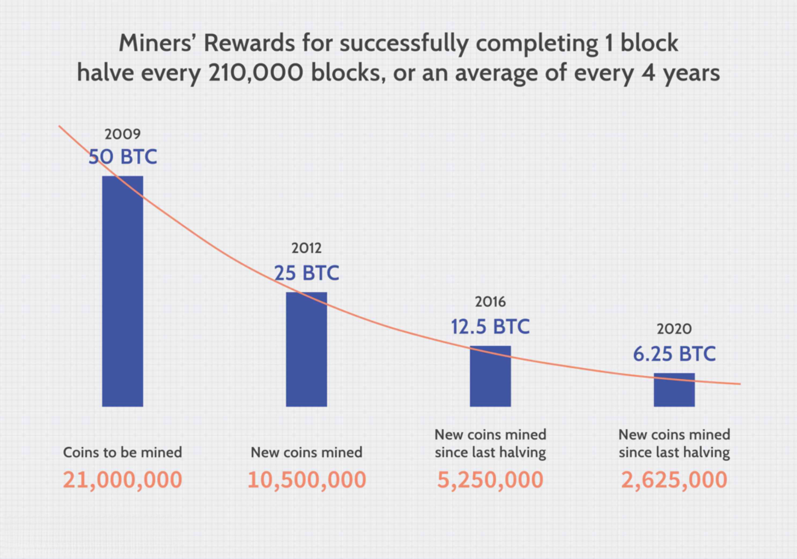

Bitcoin has significantly transformed the financial landscape since its inception in 2009, offering a decentralized alternative to traditional financial systems. As the first cryptocurrency, Bitcoin introduced a novel way of transferring and storing value, leveraging blockchain technology to ensure transparency and security in transactions. Over the years, Bitcoin's influence has grown, paving the way for an entire ecosystem of digital currencies and financial innovations.

One of the most notable developments in the cryptocurrency market is the rise of algorithmic trading. Algorithmic trading utilizes automated software to execute trades based on predefined criteria, allowing for swift and efficient trading processes. This method has become increasingly popular in cryptocurrency markets due to their high volatility and the need for rapid decision-making. Algorithmic trading minimizes the risk of emotional decision-making, enabling traders to respond to market opportunities in real-time.



The expansion of cryptocurrency trading, particularly algorithmic trading, has become a key focus in many cities across the globe. These cities, distinguished by their embracement of cryptocurrency and blockchain technology, have become hotspots for Bitcoin algorithmic trading. Factors such as technological infrastructure, regulatory environment, and the presence of blockchain-centered companies play crucial roles in establishing these urban centers as thriving environments for crypto trading activities. 

This article explores several key cities that have emerged as prominent players in the Bitcoin algorithmic trading space. Each of these cities has successfully integrated digital currencies into their economies, fostering an environment ripe for innovation and growth in the cryptocurrency trading sector.

## Table of Contents

## Understanding Bitcoin Algorithmic Trading

Algorithmic trading, often referred to as algo trading, involves the use of computer programs to execute trades based on predefined strategies. These strategies rely on mathematical models and rules, allowing systems to make trades with speed and efficiency beyond human capabilities. In the cryptocurrency market, particularly with Bitcoin, algorithmic trading has gained significant traction, primarily because it addresses two key areas: speed and emotional detachment.

In the fast-paced world of cryptocurrency, where prices can fluctuate drastically within seconds, the ability to execute trades swiftly is invaluable. Algorithmic trading systems can perform trades in milliseconds, ensuring that traders can take advantage of even the minutest price variations that can lead to profitable opportunities. This capacity for rapid execution allows traders to respond almost instantaneously to market conditions, which is a critical advantage in a volatile market like Bitcoin.

Moreover, [algorithmic trading](/wiki/algorithmic-trading) minimizes the impact of emotional decision-making. Trading based on emotions such as fear and greed can lead to irrational decisions and significant losses. By relying on algorithmic systems, trading decisions follow strict logic and defined criteria, reducing human error. These systems execute trades based strictly on data, allowing traders to stick to their strategies regardless of market turbulence.

The process of algorithmic trading can be broken down into several stages. Initially, a trading strategy is developed, often utilizing historical data to simulate how the strategy would have performed in the past. Various algorithms, ranging from simple moving averages to complex [machine learning](/wiki/machine-learning) models, can be employed. Here's a basic example in Python, illustrating a simple moving average (SMA) crossover strategy for Bitcoin trading:

```python
import pandas as pd

# Load your Bitcoin historical data into a DataFrame
# Suppose df has a 'Close' column with closing prices

df['SMA50'] = df['Close'].rolling(window=50).mean()
df['SMA200'] = df['Close'].rolling(window=200).mean()

# Generate the buy and sell signals
df['Signal'] = 0
df['Signal'][df['SMA50'] > df['SMA200']] = 1  # Buy signal
df['Signal'][df['SMA50'] < df['SMA200']] = -1 # Sell signal

# Execute trades based on the signals
for i in range(1, len(df)):
    if df['Signal'].iloc[i] == 1 and df['Signal'].iloc[i-1] != 1:
        print(f"Buying Bitcoin at {df['Close'].iloc[i]} on day {i}")
    elif df['Signal'].iloc[i] == -1 and df['Signal'].iloc[i-1] != -1:
        print(f"Selling Bitcoin at {df['Close'].iloc[i]} on day {i}")
```

This code demonstrates a straightforward crossover strategy where a "buy" signal is generated when the 50-day SMA crosses above the 200-day SMA, and a "sell" signal is triggered when the opposite happens. Such algorithmic strategies, while simplistic, form the foundation for more complex systems used in real-world trading environments.

Algorithmic trading, with its capability to process vast amounts of data and execute trades with precision, continues to evolve. Its integration into Bitcoin trading signifies a shift towards more technological and data-driven approaches in the financial markets, making it an indispensable tool for modern traders.

## Top U.S. Cities for Bitcoin Algo Trading

Los Angeles has emerged as a prominent hub for blockchain businesses, bolstering a substantial infrastructure conducive to Bitcoin algorithmic trading. The city's robust technological ecosystem supports a growing number of blockchain startups and established companies, creating a vibrant community for innovation. Additionally, the wide availability of Bitcoin ATMs across Los Angeles facilitates easy access to [cryptocurrency](/wiki/cryptocurrency), making it an attractive location for traders. This abundance of ATMs not only proves beneficial for individual traders but also enhances the overall trading environment by offering [liquidity](/wiki/liquidity-risk-premium) and ease of transactions.

Houston is another significant city known for its infrastructure supporting Bitcoin trading activities. The city has seen a rise in cryptocurrency interest, driven by local initiatives and investment in blockchain technologies. Houston's strategic focus on integrating blockchain solutions into various industries has created a conducive environment for algorithmic trading. The city’s expanding tech scene, coupled with supportive local policies, provides a fertile ground for Bitcoin traders looking to leverage algorithmic strategies.

Chicago stands out as a powerhouse in the Bitcoin trading landscape, boasting over 1,100 Bitcoin ATMs, which are crucial in providing accessibility and fostering a crypto-friendly environment. Its significant presence of blockchain businesses establishes Chicago as a pivotal player in the cryptocurrency market. The city's rich financial history and sophisticated trading infrastructure attract a wide range of algorithmic traders. This robust environment is further supported by the presence of the Chicago Mercantile Exchange (CME), which offers Bitcoin futures trading, enhancing Chicago's position as a central hub for Bitcoin algorithmic trading in the United States.

## Leading Global Cities for Bitcoin Algo Trading

Sydney has positioned itself as a leading city in Australia for Bitcoin algorithmic trading, underpinned by a robust blockchain ecosystem. The city is home to numerous blockchain startups and tech initiatives that foster innovation in cryptocurrency trading technologies. Sydney's strategic approach towards adopting blockchain technology has encouraged both local and international traders to engage in algorithmic trading of Bitcoin and other cryptocurrencies. The presence of entities such as the Australian Digital Currency Association further supports this growth by advocating for regulatory frameworks that facilitate the use of digital currencies and blockchain technologies.

Hong Kong stands as a pivotal hub for cryptocurrency activity globally, largely due to its vibrant financial sector and openness to technological advancements. The city houses a multitude of cryptocurrency exchanges and blockchain enterprises, making it an attractive destination for Bitcoin algorithmic trading. Hong Kong's regulatory framework has generally been favorable, promoting a dynamic environment where crypto trading can thrive. The city is known for its advanced financial infrastructure and innovative technology practices, which support efficient and fast-paced trading operations, including algorithmic strategies.

Warsaw has emerged as a key player in Europe with a growing number of cryptocurrency businesses contributing to its Bitcoin algorithmic trading scene. The Polish capital is witnessing significant developments in fintech and blockchain, creating an environment conducive to crypto trading. Warsaw's expanding ecosystem of blockchain startups and crypto-friendly merchants makes it an attractive location for traders looking to employ algorithmic methods. Furthermore, Poland's regulatory stance towards cryptocurrency, which leans towards a balanced approach ensuring both innovation and consumer protection, enhances Warsaw's position as a burgeoning center for crypto trading activities.

## Factors Contributing to the Rise of Algo Trading in These Cities

The rise of algorithmic trading in key cities around the world is influenced by several factors that create conducive environments for such activities. One of the primary factors is the availability of Bitcoin ATMs and crypto-friendly merchants. The presence of Bitcoin ATMs facilitates easier access to cryptocurrencies, thereby encouraging participation in crypto trading activities. For instance, cities like Los Angeles and Chicago have a significant number of Bitcoin ATMs, making them accessible for both casual users and professional traders. The availability of crypto-friendly merchants extends the usability of cryptocurrencies beyond trading platforms and into everyday transactions, further embedding Bitcoin into the local economy.

Another crucial [factor](/wiki/factor-investing) is the presence of blockchain and tech companies that foster innovation. These companies provide the necessary technology and development support to advance algorithmic trading. Cities such as Sydney and Warsaw have vibrant blockchain ecosystems, spurred by numerous startups and established tech firms working on blockchain-related projects. This concentration of tech expertise encourages the development of sophisticated trading algorithms and the creation of platforms that can handle complex trading strategies efficiently.

Supportive regulatory environments also play a significant role in the proliferation of algorithmic trading in these cities. City governments that adopt crypto-friendly policies tend to attract more crypto businesses and investors. For example, Hong Kong's regulatory framework has traditionally been open to cryptocurrency operations, encouraging major exchanges and blockchain companies to establish a presence there. A clear and supportive regulatory environment minimizes the risk associated with trading cryptocurrencies, making it an attractive proposition for traders and investors seeking stability and legitimacy.

Together, these factors—accessibility through ATMs and merchants, innovative tech environments, and supportive regulations—create ecosystems in which algorithmic trading can thrive, positioning these cities as pioneers in Bitcoin trading activities.

## The Future of Bitcoin Algorithmic Trading

Bitcoin algorithmic trading is poised for significant transformation as adoption expands and technological advancements continue to evolve. As more cities worldwide embrace Bitcoin, they are likely to establish themselves as emerging hubs for trading activities, supported by enhancing trading infrastructures. This anticipated growth aligns with global shifts towards digital assets, marking a progressive acceptance of cryptocurrency.

Technological innovations are central to this evolution. Algorithmic trading leverages automated systems to execute trades with minimal human intervention, optimizing speed, efficiency, and accuracy. As technology progresses, trading algorithms are expected to become even more sophisticated and effective. Enhanced machine learning models and [artificial intelligence](/wiki/ai-artificial-intelligence) are set to drive this, providing traders with predictive analytics and real-time decision-making capabilities. For instance, neural networks could be utilized to predict price movements based on historical data and market indicators. This evolution is likely to increase trading efficiency, enabling traders to capitalize on fleeting market opportunities.

Consideration of regulatory landscapes is also crucial to understanding the future of Bitcoin algorithmic trading. Regulatory environments vary worldwide, with some regions adopting crypto-friendly policies that encourage trading and innovation, while others impose strict regulations. The future trajectory of Bitcoin trading will largely depend on how these regulations evolve. For instance, supportive regulations can attract blockchain companies and tech talent, fostering a conducive environment for trading activities. Conversely, stringent regulations may hinder the growth of Bitcoin trading in certain regions. 

The interplay between technological advancements and regulatory frameworks will significantly impact the global landscape of Bitcoin algorithmic trading. Cities that adapt to these changes both technologically and legislatively are likely to emerge as new hotspots for Bitcoin trading. As blockchain technologies and cryptocurrencies gain broader acceptance, the positive [momentum](/wiki/momentum) is expected to continue, reinforcing the integration of digital currencies into the global economic fabric.

## Conclusion

The growth of Bitcoin algorithmic trading underscores the increasing acceptance and integration of cryptocurrency into global financial systems. Cities such as Los Angeles, Hong Kong, and Sydney are at the forefront of this transformation, becoming pivotal in the digital currency landscape. These cities are not only embracing digital currencies but are also fostering an environment that encourages technological advancements and innovation in algorithmic trading.

Los Angeles, with its strong blockchain business presence and extensive Bitcoin ATM access, supports a thriving ecosystem for cryptocurrency activities. The city's infrastructure facilitates seamless Bitcoin transactions, enabling both entrepreneurs and traders to partake in the growing digital economy.

Hong Kong, renowned for its numerous crypto exchanges and blockchain companies, acts as a central hub in Asia for cryptocurrency trading. The city's regulatory framework and financial market infrastructure provide a conducive environment for the proliferation of Bitcoin algorithmic trading, attracting global traders and investors.

Sydney, emerging as a leader in Australia, boasts a robust blockchain ecosystem, making it a significant player in the crypto market. The city's supportive regulatory policies and emphasis on technology-driven solutions contribute to its standing as a preferred destination for Bitcoin trading.

These cities illustrate how innovation and adoption of digital currencies can drive economic growth and integration into traditional financial systems. As technological advancements continue to refine trading algorithms and enhance trading efficiency, these cities are well-positioned to solidify their roles as global leaders in Bitcoin trading. This trajectory not only highlights the transformative potential of cryptocurrencies but also signals a future where digital currencies play a foundational role in economic activities worldwide.

## References & Further Reading

[1]: Bergstra, J., Bardenet, R., Bengio, Y., & Kégl, B. (2011). ["Algorithms for Hyper-Parameter Optimization."](https://papers.nips.cc/paper/4443-algorithms-for-hyper-parameter-optimization) Advances in Neural Information Processing Systems 24.

[2]: ["Advances in Financial Machine Learning"](https://www.amazon.com/Advances-Financial-Machine-Learning-Marcos/dp/1119482089) by Marcos Lopez de Prado

[3]: ["Evidence-Based Technical Analysis: Applying the Scientific Method and Statistical Inference to Trading Signals"](https://www.amazon.com/Evidence-Based-Technical-Analysis-Scientific-Statistical/dp/0470008741) by David Aronson

[4]: ["Machine Learning for Algorithmic Trading"](https://github.com/stefan-jansen/machine-learning-for-trading) by Stefan Jansen

[5]: ["Quantitative Trading: How to Build Your Own Algorithmic Trading Business"](https://www.amazon.com/Quantitative-Trading-Build-Algorithmic-Business/dp/1119800064) by Ernest P. Chan