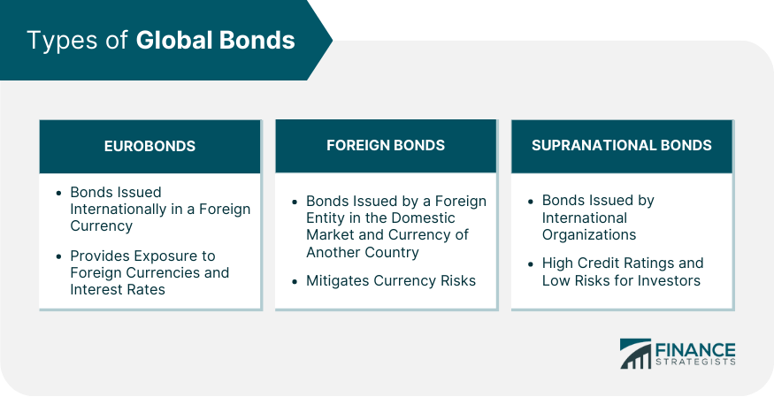

The investment bond market is a fundamental part of the global financial system, enabling investors to diversify their portfolios and manage risk effectively. Bonds represent a reliable way for governments, corporations, and institutions to raise capital, while offering investors fixed or variable returns over time. Within this market, global bonds have emerged as a critical instrument. Issued in multiple currencies across international markets, they allow issuers to access capital on a wide scale and provide investors the opportunity to diversify their investments across different regions and currencies.

Algorithmic trading, another pivotal aspect of modern finance, has significantly reshaped the bond market landscape. By leveraging computer algorithms and advanced data analytics, algorithmic trading enhances the efficiency and accuracy of bond trading activities. These algorithms can process vast datasets in real time, identifying optimal trading opportunities and executing transactions at speeds beyond human capability. The integration of these technologies in bond trading has introduced new strategies and efficiencies, encouraging a more dynamic and responsive financial market.



Understanding the global bond market and the impact of algorithmic trading is essential for making informed investment decisions today. Investors can benefit from grasping the dynamics of these financial instruments and trading strategies, which hold the potential to optimize portfolio performance. By exploring the mechanisms and advantages associated with global bonds and algorithmic trading, investors are better equipped to navigate the complexities of the current financial environment and capitalize on emerging opportunities.

## Table of Contents

## What Are Global Bonds?

Global bonds are debt securities issued across various international markets and are a critical financial instrument for both issuers and investors. They serve as a means for governments, corporations, and financial institutions to obtain capital from a diverse investor base, enabling the diversification of funding sources and risk. These bonds not only provide financial flexibility to issuers but also attract investors seeking diversification across different markets.

A defining characteristic of global bonds is their availability across multiple currencies, accommodating investors worldwide who may prefer transactions in their local currency or another stable foreign denomination. This diversity also assists issuers in managing currency risks associated with interest and principal repayments. Furthermore, global bonds can [carry](/wiki/carry-trading) either fixed or floating interest rates, allowing issuers to tailor offerings according to prevailing market conditions and investor appetite. Fixed interest rates provide predictable income streams to bondholders, while floating rates may offer protection against interest rate fluctuations but with uncertain cash flows.

Distinguishing between global bonds and Eurobonds is essential for investors and issuers alike. While both are international debt instruments, global bonds are generally issued in several countries simultaneously and are available to a wide range of international investors. In contrast, Eurobonds are issued outside the jurisdiction of the country where the currency is denominated. For example, a bond denominated in U.S. dollars but issued outside the U.S. is classified as a Eurobond.

Global bonds thereby enhance portfolio diversification, offer a hedge against specific national economic instabilities, and provide opportunities to exploit favorable economic conditions in emerging or stable markets. Understanding these distinctions helps investors and issuers make informed decisions, ensuring financial strategies align with market dynamics and currency environments.

## Importance and Benefits of Investing in Global Bonds

Investing in global bonds provides several strategic advantages, primarily due to the diversity of markets and currencies they encompass. Global bonds are debt securities issued in international markets by various entities, ranging from governments to large corporations. This variety allows investors to spread their investments across different geopolitical and economic environments, thus mitigating risks associated with concentrating assets in a single market.

One of the primary benefits of investing in global bonds is their ability to hedge against domestic [interest rate](/wiki/interest-rate-trading-strategies) fluctuations and currency risks. When domestic interest rates rise, the value of domestic bonds typically falls, but global bonds can offer stability since their performance is tied to the interest rate cycles of multiple countries. Moreover, holding bonds in different currencies enables investors to offset currency depreciation in their home country against potential gains in foreign currencies, providing a natural hedge.

Furthermore, global bonds often offer higher returns than domestic bonds. This is largely due to the diverse environments in which these bonds are issued. Issuers might be located in regions with varying levels of economic growth and monetary policy, which can influence yield differentials. For example, economies with higher growth potentials, like emerging markets, often provide bonds with more attractive yields to compensate for the increased risk premium associated with economic and political uncertainties.

The appeal of global bonds also lies in their ability to provide exposure to the growth potential of emerging markets. These markets can present opportunities for significant yield enhancement as they typically experience higher growth rates compared to developed markets. Investing in these regions allows investors to capitalize on economic expansion, urbanization, and industrialization trends.

The risk-return profile of global bonds is another compelling [factor](/wiki/factor-investing). By diversifying across multiple countries and currencies, investors can optimize the balance of risk and return in their portfolios. This diversification reduces the unsystematic risk, or the risk unique to a single market or issuer, thus enhancing overall portfolio performance. The potential for higher yield, coupled with risk mitigation through geographic and currency diversification, makes global bonds a valuable component of a sophisticated investment strategy.

Overall, global bonds offer a means to achieve higher returns while managing risks through diversification, currency exposure, and tapping into emerging growth markets. These characteristics make them an attractive option for investors seeking to enhance their portfolio performance sustainably in the global financial landscape.

## Algorithmic Trading in the Bond Market

Algorithmic trading in the bond market involves the use of computer programs and algorithms to execute trades with efficiency and precision. This form of trading leverages technological advancements to process large volumes of data rapidly, allowing it to perform complex calculations and analyses that identify optimal trading opportunities. These algorithms can encompass a variety of strategies, including [arbitrage](/wiki/arbitrage), [market making](/wiki/market-making), and diversified investment strategies, each tailored to capitalize on specific market conditions.

Arbitrage in the bond market often involves spotting price differentials between related securities or markets and executing trades that exploit these inconsistencies for profit. Algorithms can identify such opportunities by scanning various markets simultaneously and executing trades in fractions of a second, which is crucial in capturing short-lived arbitrage opportunities.

Market making, another critical application of [algorithmic trading](/wiki/algorithmic-trading) in bonds, involves quoting both buy and sell prices for a financial instrument to facilitate [liquidity](/wiki/liquidity-risk-premium). Algorithms that automate market making adjust quotes based on real-time market data and trading signals, thus providing continuous bid and ask prices. This activity not only enhances liquidity but also reduces the bid-ask spread, ultimately contributing to market efficiency.

The execution of complex investment strategies through algorithmic trading is made possible by the capability of algorithms to integrate various data inputs and run simulations to forecast price movements. By analyzing historical data as well as real-time market information, algorithms can predict price trends and execute trades at optimal points, maximizing potential returns while minimizing risks.

One of the significant advantages of algorithmic trading is its ability to reduce human errors. By automating the trading process, algorithms minimize the influence of emotional and cognitive biases that can affect decision-making in human traders. Additionally, algorithms operate at speeds far beyond human capability, executing trades in milliseconds, which is critical in fast-moving markets.

Algorithmic trading significantly impacts the liquidity and efficiency of the bond market. It enhances liquidity by ensuring that there are consistent and immediate buy and sell orders, reducing transaction costs and increasing market participation. Furthermore, by executing trades quickly and accurately, algorithmic trading contributes to more efficient price discovery, as prices more accurately reflect available information.

In conclusion, algorithmic trading has become a pivotal component of modern bond markets. Its ability to process vast quantities of data swiftly and execute trades with precision contributes to increased liquidity and improved market efficiency. As technology continues to evolve, further advancements in algorithmic trading are expected to drive even greater efficiencies in the bond market.

## Challenges and Considerations

Global bonds and algorithmic trading are pivotal in modern finance, each bringing its unique set of challenges alongside opportunities. One primary concern in global bond investment is currency exchange risk. As bonds are issued in various currencies, fluctuations in exchange rates can significantly influence bond values and yields, creating unpredictability in returns. Interest rate [volatility](/wiki/volatility-trading-strategies) adds another layer of complexity. Market interest rates and bond prices are inversely related, meaning shifts in interest rates can impact the market value of bonds, potentially affecting an investor's total return.

Algorithmic trading, despite its advantages, presents its own set of challenges. High-frequency trading and the use of complex algorithms necessitate robust technological infrastructure. This includes powerful computing systems capable of processing large data sets and executing trades within microseconds. Additionally, skilled management is essential to develop, monitor, and refine these algorithms to maintain a competitive edge and ensure accuracy in trading decisions.

Regulatory considerations must also be accounted for. Different regions possess distinct regulatory frameworks governing financial markets and trading practices. Compliance with these regulations is crucial to avoid legal issues and financial penalties. Moreover, market risks associated with algorithmic trading, such as flash crashes and technical glitches, can disrupt markets and lead to substantial losses.

Market research and strategic planning are vital to tackling these challenges. Investors must conduct comprehensive research to understand the market dynamics and identify potential risks and opportunities. By employing strategic planning, they can devise and implement mitigation strategies to navigate the unpredictable nature of global markets effectively. It is through this informed and proactive approach that investors can surmount the challenges posed by global bonds and algorithmic trading.

## Future Trends in Global Bonds and Algorithmic Trading

The evolution of technology continues to significantly enhance the capabilities of algorithmic trading within the bond market. This advancement in technology allows traders to harness sophisticated algorithms that can perform complex calculations and analyze large datasets at unprecedented speeds. As a result, trading decisions can be made more efficiently and with greater precision, enabling traders to capitalize on market opportunities that were previously inaccessible. 

Sustainable and green bonds have become increasingly prominent in the global debt market. These bonds are designed to finance projects with environmental benefits, such as renewable energy initiatives or sustainable infrastructure projects. The growing focus on sustainability is encouraging more investors to incorporate these bonds into their portfolios, aligning financial goals with environmental responsibility. This trend is expected to continue as both institutional and retail investors become more environmentally conscious.

In terms of geographical opportunities, emerging markets present fertile ground for global bond investments. Emerging economies often offer higher yields compared to developed markets, attracting investors seeking growth potential. However, investing in these markets requires careful consideration of geopolitical and economic factors. As globalization progresses, the integration of emerging market bonds into global investment strategies will likely become more prevalent.

The integration of Artificial Intelligence (AI) and Machine Learning (ML) into trading strategies is poised to revolutionize how bonds are traded. These technologies can enhance the predictive accuracy of algorithms by identifying patterns and trends that are not immediately evident to human traders. For instance, [machine learning](/wiki/machine-learning) models can be trained to predict bond price movements based on a vast array of variables, from macroeconomic indicators to historical price data. Implementing a simple linear regression model in Python might look like this:

```python
import numpy as np
from sklearn.linear_model import LinearRegression

# Sample data: bond prices and macroeconomic indicators
bond_prices = np.array([...])
indicators = np.array([...])

# Reshape data for the model
X = indicators.reshape(-1, 1)
y = bond_prices

# Create and fit the model
model = LinearRegression()
model.fit(X, y)

# Predict future bond prices
future_indicators = np.array([...]).reshape(-1, 1)
predictions = model.predict(future_indicators)
```

Investors must remain vigilant about global economic developments and innovations in trading technologies. As financial landscapes evolve, staying informed will be essential to leverage new investment opportunities and mitigate risks. This includes monitoring policy changes, economic reforms, and technological advancements. By doing so, investors can adapt their strategies to maintain a competitive edge in the market.

In summary, the future of global bonds and algorithmic trading is characterized by technological growth, sustainable finance, opportunities in emerging markets, and the transformative power of AI and ML. Investors who adeptly navigate these trends are likely to see enhanced portfolio performance and sustained returns.

## Conclusion

The global bond market and algorithmic trading are vital components of today’s investment landscape, offering diversification and efficiency to investors. Understanding the workings and benefits of these financial instruments and strategies can empower investors to make informed decisions. The global bond market provides opportunities for diversification across various markets and currencies, serving as a hedge against local economic risks. Similarly, algorithmic trading enhances market efficiency by executing trades at optimal prices and with speed and precision, reducing the likelihood of human error.

Despite the potential challenges such as currency risks and the need for technological infrastructure, global bonds and algorithmic trading present substantial prospects for growth and diversification in investment portfolios. As financial technology continues to evolve, staying updated on technological and market developments is crucial. Integration of innovative technologies like Artificial Intelligence and Machine Learning could revolutionize trading strategies, while the rise of sustainable and green bonds in global markets indicates emerging investment opportunities.

Ultimately, informed investors who adapt to these advancements are better equipped to navigate the complexities of global financial markets. By leveraging the opportunities provided by global bonds and algorithmic trading, investors can enhance their portfolio performance, ensuring both stability and growth in an ever-evolving financial ecosystem.

## References & Further Reading

[1]: ["The Bond Book: Everything Investors Need to Know About Treasuries, Municipals, GNMAs, Corporates, Zeros, Bond Funds, Money Market Funds, and More"](https://www.amazon.com/Bond-Book-Third-Everything-Treasuries/dp/007166470X) by Annette Thau

[2]: Choudhry, M. (2010). ["An Introduction to Bond Markets."](https://onlinelibrary.wiley.com/doi/book/10.1002/9781118371961) Wiley.

[3]: Fabozzi, F. J. (2007). ["Fixed Income Analysis."](https://books.google.com/books/about/Fixed_Income_Analysis.html?id=lujLawVLS3YC) John Wiley & Sons.

[4]: ["Algorithmic and High-Frequency Trading"](https://www.amazon.com/Algorithmic-High-Frequency-Trading-Mathematics-Finance/dp/1107091144) by Álvaro Cartea, Sebastian Jaimungal, and José Penalva

[5]: Narang, R. K. (2009). ["Inside the Black Box: The Simple Truth About Quantitative Trading."](https://onlinelibrary.wiley.com/doi/book/10.1002/9781118267738) John Wiley & Sons.

[6]: ["Bond Markets, Analysis, and Strategies"](https://mitpress.mit.edu/9780262046275/bond-markets-analysis-and-strategies/) by Frank J. Fabozzi

[7]: Daskalaki, C., & Skiadopoulos, G. (2011). ["Should investors include commodities in their portfolios after all? New evidence."](https://www.sciencedirect.com/science/article/pii/S0378426611000938) Journal of Banking & Finance.