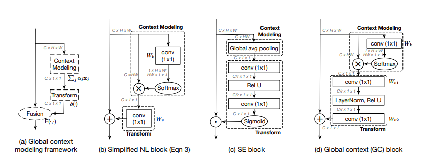

## Table of Contents

## What is a Global Context Module in machine learning?

A Global Context Module (GCM) in machine learning is a part of a neural network that helps the model understand the big picture of the data it's looking at. Imagine you're trying to find a specific book in a huge library. Instead of looking at each book one by one, you might first get a sense of the library's layout and where different types of books are kept. Similarly, a GCM helps the model by giving it a broad view of the entire input, making it easier to understand and process the information more effectively.

In technical terms, a GCM usually works by creating a context vector that represents the global information of the input data. This vector is then used to guide the processing of local features, allowing the model to make better predictions or classifications. For example, in image recognition, a GCM might help the model understand the overall scene of a picture before focusing on specific details, leading to more accurate results. By incorporating global context, these modules enhance the performance of neural networks in various applications, from image processing to natural language understanding.

## How does a Global Context Module enhance model performance?

A Global Context Module helps a machine learning model by giving it a bigger picture of the data. Think of it like looking at a map before you start a journey. When the model knows the overall layout or theme of the data, it can make better decisions about the smaller parts. This is especially useful in tasks like understanding pictures or texts, where knowing the whole context can help figure out what's going on in specific parts.

By using a Global Context Module, the model can process information more efficiently. It does this by creating a special summary, called a context vector, that captures the main ideas of the entire input. This summary helps guide the model as it looks at the details, making its predictions or classifications more accurate. For example, in a picture of a forest, the module might help the model understand it's a forest scene before focusing on individual trees or animals, leading to better overall performance.

## What are the key components of a Global Context Module?

A Global Context Module has a few main parts that help it work well. The first part is the feature extraction layer, which takes the input data and turns it into a set of features that the model can understand better. These features are then used to create a context vector, which is like a summary of the whole input. This context vector is made by a pooling operation, where the model looks at all the features and combines them into one big picture.

The second important part is the fusion mechanism, which mixes the global context vector with the local features. This helps the model use the big picture to make better decisions about the smaller parts of the data. For example, if the model is looking at a picture, the global context might tell it that it's a city scene, and then it can use this information to better understand the buildings or cars in the picture.

Overall, the Global Context Module improves how a model works by giving it a broad view of the data. This broad view, or global context, helps the model see how different parts of the data fit together. By combining this global view with the detailed, local information, the model can make more accurate predictions or classifications.

## Can you explain the process of integrating a Global Context Module into a neural network?

Integrating a Global Context Module into a neural network involves a few key steps that help the model understand the big picture of the data. First, you need to decide where to add the Global Context Module within the network's architecture. Typically, it's placed after the feature extraction layers but before the final classification or prediction layers. This placement allows the module to use the features extracted from the input data to create a global context vector. The module starts by taking the output from the feature extraction layers and applies a pooling operation, like global average pooling, to create a context vector that summarizes the entire input. This context vector represents the global information and is crucial for enhancing the model's understanding of the data.

Once the global context vector is created, the next step is to integrate it with the local features. This is done through a fusion mechanism, which can be as simple as concatenating the context vector with the local feature maps or using more complex operations like attention mechanisms. The fused features then flow through the rest of the network, where they help guide the model's decision-making process. By incorporating the global context, the model can make more informed and accurate predictions or classifications. For example, in an image recognition task, understanding the overall scene (like a city or a forest) can help the model better identify specific objects within the image.

## What types of neural networks benefit most from Global Context Modules?

Global Context Modules are particularly useful for neural networks that deal with complex data where understanding the overall context is important. For example, Convolutional Neural Networks (CNNs) used in image recognition tasks benefit a lot from Global Context Modules. These networks often need to understand the whole scene of an image to correctly identify objects within it. By adding a Global Context Module, the CNN can get a better sense of the entire image, making it easier to spot and classify objects accurately.

Another type of network that benefits from Global Context Modules is Recurrent Neural Networks (RNNs), especially in natural language processing tasks. When processing text, understanding the context of the entire sentence or paragraph can greatly improve the model's performance. For instance, a Global Context Module can help an RNN understand the main theme of a text before diving into the specifics, leading to better language understanding and generation. Both CNNs and RNNs, therefore, see significant improvements in performance and accuracy when equipped with Global Context Modules.

## How do Global Context Modules handle long-range dependencies in data?

Global Context Modules help neural networks understand long-range dependencies in data by giving them a big-picture view. Imagine you're reading a long story. Sometimes, to understand a part of the story, you need to remember something that happened much earlier. A Global Context Module works like a summary of the entire story, helping the model keep track of important details from the beginning to the end. This summary, or context vector, is created by looking at all the data and combining it into one big picture. By doing this, the module makes it easier for the model to see how different parts of the data are connected, even if they are far apart.

For example, in a long piece of text, a word at the beginning might be important to understand a word at the end. A Global Context Module helps the model by capturing the overall theme or context of the text. This way, when the model processes each word, it can use the global context to make better sense of the relationships between words, no matter how far apart they are. By incorporating this global view, the model can handle long-range dependencies more effectively, leading to more accurate predictions and a deeper understanding of the data.

## What are the computational costs associated with using Global Context Modules?

Using Global Context Modules can make a neural network work better, but it also adds to the amount of computing power needed. When you add a Global Context Module, you have to do extra steps like pooling to make the context vector and then mix this vector with the rest of the data. These steps take more time and use more computer memory. For example, if you're working with big images or long texts, the extra work to understand the whole picture can slow things down.

The good news is that the extra work can often be worth it because the model can understand the data better and make more accurate guesses. But you need to think about how much more computing power you can use. If you're working on a computer with limited resources, adding a Global Context Module might make things too slow. So, it's a balance between making the model better and keeping the computing costs manageable.

## How can Global Context Modules be optimized for better efficiency?

To make Global Context Modules work better without using too much computer power, you can try a few things. One way is to use smarter pooling methods. Instead of looking at every part of the data to make the context vector, you could use techniques like adaptive pooling or selective pooling. These methods focus on the most important parts of the data, which can save time and memory. Another way is to use smaller context vectors. By making the summary of the data smaller, you reduce the amount of extra work the computer has to do. This can help the model run faster without losing too much accuracy.

Another approach is to use efficient fusion methods when combining the global context with local features. For example, instead of adding the context vector to every local feature, you could use attention mechanisms that only apply the context where it's most needed. This can make the model more efficient because it doesn't have to do extra work everywhere. Also, you can use techniques like pruning or quantization to make the whole network smaller and faster. By carefully choosing where to apply these optimizations, you can keep the benefits of Global Context Modules while making them work better on computers with less power.

## What are some common challenges faced when implementing Global Context Modules?

One common challenge when implementing Global Context Modules is figuring out where to put them in the neural network. You want to place them where they can help the most without slowing down the whole system too much. If you put them too early, they might not have enough information to make a good summary. If you put them too late, they might not help the model understand the data better. Finding the right spot can take a lot of trying different things and testing to see what works best.

Another challenge is balancing the extra computing work with the benefits of using Global Context Modules. These modules need more time and memory to create the context vector and mix it with the rest of the data. This can make the model slower, especially if you're working with big data like large images or long texts. You have to decide if the better understanding of the data is worth the extra computing cost. Sometimes, you might need to use tricks like making the context vector smaller or using smarter ways to mix the global context with local features to keep things running smoothly.

## Can you discuss any recent advancements or variations of Global Context Modules?

Recent advancements in Global Context Modules include the development of more efficient pooling methods. Researchers have been working on adaptive pooling techniques, which focus on the most relevant parts of the input data to create a more effective context vector. This helps reduce the computational cost while maintaining or even improving the model's performance. Another variation is the use of attention mechanisms within Global Context Modules. These mechanisms allow the model to pay more attention to certain parts of the data based on their importance, which can lead to better understanding and processing of long-range dependencies.

In addition to these, there have been efforts to integrate Global Context Modules with other advanced neural network architectures. For example, combining them with Transformer models has shown promising results in natural language processing tasks. By leveraging the self-attention mechanisms of Transformers, Global Context Modules can better capture the overall context of a text, leading to improved performance in tasks like text classification and language translation. These advancements highlight the ongoing research aimed at enhancing the capabilities and efficiency of Global Context Modules, making them more applicable across various domains and data types.

## How do Global Context Modules compare to other attention mechanisms in terms of effectiveness?

Global Context Modules and other attention mechanisms both help neural networks understand data better, but they do it in different ways. Global Context Modules create a summary of the whole input, called a context vector, which helps the model see the big picture. This is useful for tasks where understanding the overall context is important, like recognizing objects in a picture or understanding a long text. On the other hand, other attention mechanisms, like those used in Transformer models, focus on specific parts of the data that are most important at any given moment. They help the model pay more attention to certain details, which can be very effective for tasks like language translation where the relationship between words is key.

In terms of effectiveness, Global Context Modules are great at handling long-range dependencies because they give the model a broad view of the data. This can lead to better performance in tasks where the overall context matters a lot. However, attention mechanisms can be more flexible and precise, allowing the model to zoom in on the most relevant parts of the data. This makes them very effective for tasks that require detailed understanding of specific relationships within the data. Both approaches have their strengths, and sometimes combining them can lead to even better results, as seen in some recent advancements where Global Context Modules are integrated with attention mechanisms in Transformer models.

## What future developments can we expect in the field of Global Context Modules?

In the future, we can expect Global Context Modules to become even more efficient and powerful. Researchers are working on new ways to make these modules use less computer power while still helping models understand data better. One idea is to use smarter ways to create the context vector, like focusing only on the most important parts of the data. This can make the modules faster and use less memory. Another idea is to combine Global Context Modules with other advanced techniques, like attention mechanisms in Transformer models. This could help the models understand both the big picture and the small details at the same time, making them even better at tasks like understanding pictures or texts.

We might also see Global Context Modules being used in more types of neural networks and for more kinds of tasks. Right now, they are mostly used in image recognition and language understanding, but in the future, they could help with things like predicting how diseases spread or understanding how people behave. As computers get faster and better, it will be easier to use these modules without slowing things down too much. This means that more people and companies will be able to use Global Context Modules to make their models work better, leading to new discoveries and improvements in many fields.