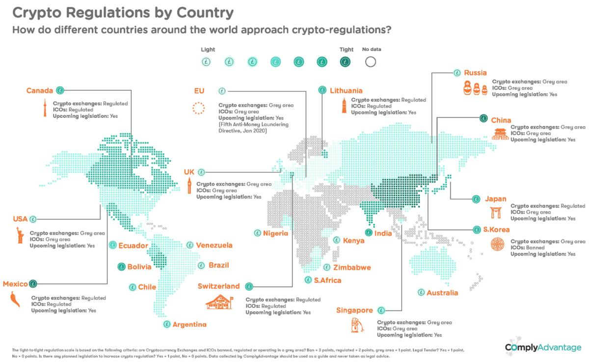

## Table of Contents

## What is cryptocurrency and why is it important to regulate it?

Cryptocurrency is a type of digital money that you can use to buy things online. It's different from regular money because it's not controlled by banks or governments. Instead, it uses special computer codes to keep track of who owns what. Bitcoin is the most famous cryptocurrency, but there are many others like Ethereum and Dogecoin. People use cryptocurrencies to buy things, invest, or even just to try out new technology.

Regulating cryptocurrency is important for a few reasons. First, it helps protect people from scams and fraud. Since cryptocurrencies are not controlled by banks, it can be easier for bad people to trick others into losing their money. Regulations can help stop these scams and make sure that people's money is safe. Second, regulating cryptocurrencies can help keep the financial system stable. If too many people start using cryptocurrencies and something goes wrong, it could affect the whole economy. By setting rules, governments can help prevent big problems and make sure that cryptocurrencies can be used safely and fairly.

## What are the main objectives of cryptocurrency regulations?

The main objectives of cryptocurrency regulations are to protect people who use them and to keep the financial system safe. When people use cryptocurrencies, they can sometimes be tricked by scammers who want to steal their money. Regulations help stop these bad people by setting rules that everyone has to follow. This makes it safer for people to use cryptocurrencies without worrying about losing their money to fraud.

Another important goal is to make sure that the use of cryptocurrencies does not cause big problems for the economy. If a lot of people start using cryptocurrencies and something goes wrong, it could affect everyone's money. Regulations help prevent this by making sure that cryptocurrencies are used in a way that does not hurt the overall financial system. This way, people can use cryptocurrencies to buy things, invest, or try new technology without causing trouble for others.

## How do different countries classify cryptocurrencies (e.g., as currency, commodity, or security)?

Different countries classify cryptocurrencies in various ways, often depending on their laws and how they see cryptocurrencies fitting into their financial systems. Some countries, like Japan, classify certain cryptocurrencies like Bitcoin as a type of currency. This means they can be used to buy things and are treated similarly to regular money. Other countries, like the United States, might classify some cryptocurrencies as commodities. This is because they can be bought and sold like gold or oil. The U.S. Commodity Futures Trading Commission (CFTC) sees Bitcoin and similar cryptocurrencies as commodities.

In some cases, cryptocurrencies might be classified as securities. This happens when they are seen as investments, like stocks or bonds. The U.S. Securities and Exchange Commission (SEC) has said that some cryptocurrencies, especially those that promise returns to investors, are securities. This means they have to follow strict rules to protect people who invest in them. Other countries might not have clear rules yet and are still figuring out how to classify cryptocurrencies. This can make it confusing for people who want to use or invest in them.

## What are some common regulatory approaches to cryptocurrencies around the world?

Around the world, countries have different ways to regulate cryptocurrencies. Some countries have strict rules to make sure people are safe when they use or invest in cryptocurrencies. They might require companies that deal with cryptocurrencies to get special licenses, report their activities, and follow rules to prevent fraud and money laundering. For example, in the United States, companies that deal with cryptocurrencies might need to follow rules from the SEC or the CFTC, depending on how the [cryptocurrency](/wiki/cryptocurrency) is classified. Other countries, like Japan, have laws that recognize cryptocurrencies as a type of money and have set up rules to protect users.

On the other hand, some countries have lighter rules or are still figuring out what to do about cryptocurrencies. They might not have clear laws yet, so people and businesses have more freedom but also more risk. For example, in some European countries, the rules can vary from one country to another, making it tricky for people who want to use cryptocurrencies across borders. Some countries, like China, have banned certain types of cryptocurrency activities to stop people from losing money and to keep control over their financial systems. Overall, the way countries regulate cryptocurrencies can be very different, reflecting their unique concerns and goals.

## How does the regulatory environment for cryptocurrencies in the United States differ from that in the European Union?

In the United States, the regulatory environment for cryptocurrencies is split between different agencies. The Securities and Exchange Commission (SEC) treats some cryptocurrencies as securities, which means they have to follow strict rules to protect investors. The Commodity Futures Trading Commission (CFTC) sees other cryptocurrencies, like Bitcoin, as commodities, similar to gold or oil. This means they have different rules to follow. Also, the Financial Crimes Enforcement Network (FinCEN) makes sure that companies dealing with cryptocurrencies follow rules to stop money laundering. This can make things confusing for people and businesses because they have to figure out which rules apply to them.

In the European Union, the approach to regulating cryptocurrencies is more uniform across countries but still has some differences. The EU has the Markets in Crypto-Assets (MiCA) regulation, which sets rules for crypto-assets across all member countries. This helps make things clearer and safer for people who want to use or invest in cryptocurrencies. However, some countries in the EU might have their own additional rules, which can make things a bit more complicated for businesses that want to work in different EU countries. Overall, the EU tries to have a more coordinated approach, while the U.S. has a more divided system with different agencies in charge.

## What specific regulations have been implemented by Japan regarding cryptocurrencies?

Japan has some of the clearest rules about cryptocurrencies. They say that Bitcoin and other similar cryptocurrencies are a type of money. This means people can use them to buy things. Japan also made a law called the Payment Services Act. This law says that companies that deal with cryptocurrencies have to get a special license. They have to follow strict rules to keep people's money safe and stop bad things like fraud and money laundering.

Another important rule in Japan is about protecting people who use cryptocurrencies. If a company that deals with cryptocurrencies goes bankrupt, they have to return people's money first. This makes people feel safer when they use cryptocurrencies. Japan also keeps a close eye on how cryptocurrencies are used to make sure they don't cause problems for the whole economy. These rules help make Japan a safe place for people to use and invest in cryptocurrencies.

## How have countries like China and India approached the regulation of cryptocurrencies?

China has taken a very strict approach to regulating cryptocurrencies. The government has banned many activities related to cryptocurrencies, like trading them on exchanges and using them to raise money. They did this because they were worried about fraud and wanted to keep control over their financial system. Even though people can still own cryptocurrencies, it's hard for them to use them in China. The government is also working on its own digital currency, called the Digital Yuan, which they can control more easily.

India has had a bit of a back-and-forth approach to cryptocurrencies. At first, the government was very strict and tried to ban them completely. They were worried about fraud and money laundering. But then, the courts said that the ban was too harsh. Now, India is trying to come up with new rules that let people use cryptocurrencies but also keep them safe. The government is thinking about making a law that would treat cryptocurrencies like other financial assets, with rules to stop fraud and protect people's money.

## What are the roles of international organizations like the Financial Action Task Force (FATF) in shaping global cryptocurrency regulations?

The Financial Action Task Force (FATF) is an important group that helps make rules about money and crime around the world. They work to stop bad things like money laundering and funding terrorism. When it comes to cryptocurrencies, the FATF has made special rules to make sure that people who use them are safe and that bad people can't use them to do illegal things. They say that companies that deal with cryptocurrencies have to follow rules just like banks do. This means they have to check who their customers are and report any strange activities to stop crime.

These rules from the FATF are important because many countries listen to what they say. When the FATF makes new rules, countries often change their own laws to match. This helps make sure that people can use cryptocurrencies safely no matter where they are. It also makes it harder for bad people to use cryptocurrencies to hide their crimes because the rules are the same everywhere. By working together, countries can better protect their people and keep the financial system safe.

## How do Anti-Money Laundering (AML) and Know Your Customer (KYC) regulations apply to cryptocurrencies?

Anti-Money Laundering (AML) and Know Your Customer (KYC) rules are important for keeping cryptocurrencies safe. AML rules are there to stop people from using cryptocurrencies to hide where dirty money came from. This means that companies that deal with cryptocurrencies have to watch for and report any strange activities that might be someone trying to launder money. KYC rules are about knowing who is using the service. Companies have to check the identity of their customers to make sure they are who they say they are. This helps stop fraud and makes it harder for bad people to use cryptocurrencies for illegal things.

Both AML and KYC rules help make the world of cryptocurrencies safer. When companies follow these rules, they can better protect their users and stop criminals from using cryptocurrencies to do bad things. Many countries have made these rules a must for companies that deal with cryptocurrencies. This way, people can use cryptocurrencies with less worry about losing their money to scams or helping criminals.

## What are the challenges faced by regulators in keeping up with the rapid evolution of cryptocurrency technologies?

Regulators face a big challenge in keeping up with how fast cryptocurrency technologies change. New types of cryptocurrencies and ways to use them pop up all the time. This makes it hard for rules to stay current. Regulators have to learn about new tech and figure out if it's safe for people to use. But by the time they make new rules, the technology might have changed again. This can make it tough to protect people from scams and keep the financial system stable.

Another challenge is that cryptocurrencies don't stop at country borders. People can use them anywhere in the world, but each country might have different rules. This can make it hard for regulators to work together and make sure that rules are fair and effective everywhere. It also makes it easier for bad people to find places with weak rules and use them to do illegal things. So, regulators have to work together across countries to make sure that cryptocurrencies are safe for everyone to use.

## How do decentralized finance (DeFi) platforms complicate the regulatory landscape?

Decentralized finance, or DeFi, platforms make it harder for regulators to keep things in order. These platforms work without a central authority, like a bank, which makes it tough to apply the usual rules. Since DeFi runs on computer code and is spread out across the world, it can be hard to know who to hold responsible if something goes wrong. This means that rules about knowing who customers are and stopping money laundering, which are important for keeping people safe, can be hard to follow on DeFi platforms.

Also, because DeFi platforms can be used by anyone anywhere, they add to the challenge of making rules that work across different countries. Each country might have its own ideas about how to regulate cryptocurrencies, but DeFi doesn't care about borders. This can lead to confusion and gaps in the rules, making it easier for bad people to do things like fraud or money laundering. Regulators need to find new ways to watch over and protect people using DeFi without stopping the good things it can do for finance.

## What future trends can we expect in global cryptocurrency regulations?

In the future, we can expect more countries to work together on cryptocurrency rules. Right now, each country has its own way of doing things, which can be confusing. But as more people use cryptocurrencies, countries will see the need to make rules that everyone can follow. This will help keep people safe and stop bad things like fraud and money laundering. Groups like the Financial Action Task Force (FATF) will keep helping countries come up with these shared rules.

Another trend will be more rules for new types of cryptocurrencies and technologies, like DeFi. These new things are changing fast, and regulators will need to keep up. They will make rules that protect people but also let them use these new technologies. This might mean new ways of watching over cryptocurrencies to make sure they are safe without stopping the good things they can do. It's a tricky balance, but it's important for the future of money and finance.

## References & Further Reading

[1]: Zohar, A. (2015). ["Bitcoin: Under the Hood."](https://dl.acm.org/doi/10.1145/2701411) Communications of the ACM, 58(9), 104-113.

[2]: Mougayar, W. (2016). ["The Business Blockchain: Promise, Practice, and Application of the Next Internet Technology."](https://books.google.com/books/about/The_Business_Blockchain.html?id=CEsPDAAAQBAJ) Wiley.

[3]: Narayanan, A., Bonneau, J., Felten, E., Miller, A., & Goldfeder, S. (2016). ["Bitcoin and Cryptocurrency Technologies: A Comprehensive Introduction."](https://press.princeton.edu/books/hardcover/9780691171692/bitcoin-and-cryptocurrency-technologies) Princeton University Press.

[4]: Harwick, C. (2016). ["Cryptocurrency and the Problem of Intermediation."](https://papers.ssrn.com/sol3/papers.cfm?abstract_id=2523771) The Independent Review, 20(4), 569-588.

[5]: Yermack, D. (2015). ["Is Bitcoin a Real Currency? An Economic Appraisal."](https://www.nber.org/papers/w19747) National Bureau of Economic Research Working Paper No. 19747.

[6]: Global Legal Research Directorate Staff. (2021). ["Regulation of Cryptocurrency Around the World."](https://www.loc.gov/item/2021687419/) The Law Library of Congress.

[7]: Eichengreen, B. (2019). ["From Commodity to Fiat and Now to Crypto: What Does History Tell Us?"](https://www.nber.org/papers/w25426) National Bureau of Economic Research Working Paper No. 25426.

[8]: Chuen, D.L. K. (2015). ["Handbook of Digital Currency: Bitcoin, Innovation, Financial Instruments, and Big Data."](https://www.sciencedirect.com/book/9780128021170/handbook-of-digital-currency) Academic Press.

[9]: Campbell-Verduyn, M. (Ed.). (2018). ["Bitcoin and Beyond: Cryptocurrencies, Blockchains and Global Governance."](https://www.taylorfrancis.com/books/oa-edit/10.4324/9781315211909/bitcoin-beyond-malcolm-campbell-verduyn) Routledge.