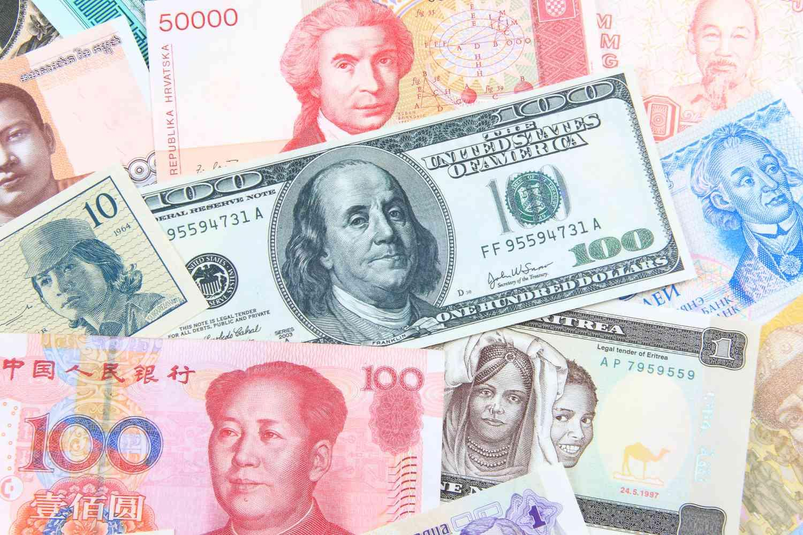

## Table of Contents

## What is a global currency?

A global currency is a type of money that is used all over the world. It would be the same in every country, so people wouldn't need to change their money when they travel or do business with other countries. Right now, we use different currencies like the US dollar, the Euro, and the Japanese yen. A global currency would make it easier for everyone to buy and sell things across borders.

The idea of a global currency has been talked about for a long time. Some people think it would be good because it could make the world economy more stable. If there was one currency, it might be easier to control things like inflation and keep prices steady. But there are also challenges. Different countries have different economies and needs, so it might be hard to make everyone agree on one currency. Also, some countries might worry about losing control over their own money and economy.

## How does a global currency differ from national currencies?

A global currency is money that every country in the world uses. It's different from national currencies, like the US dollar or the Euro, because those are only used in one country or a group of countries. With a global currency, you wouldn't need to change your money when you travel or do business with people from other countries. It would be the same everywhere.

National currencies are controlled by the government of each country. They can change how much their money is worth or how much it costs to buy things. With a global currency, one group or organization would be in charge of it, not individual countries. This could make things simpler, but it also means countries would have less control over their own economy. Some people think a global currency would make the world's money system more stable, while others worry about losing the power to make decisions about their own money.

## What are the potential benefits of a global currency?

A global currency could make it easier for people to buy and sell things all over the world. Right now, if you want to buy something from another country, you have to change your money into their money. This can be hard and sometimes you lose money because of the exchange rates. With a global currency, you wouldn't need to do this. It would be like using the same money everywhere, so trading and doing business would be simpler and cheaper.

Another benefit is that a global currency could make the world's money system more stable. Right now, different countries have their own money, and the value of that money can go up and down a lot. This can make it hard for businesses and people to plan for the future. If there was one global currency, it might be easier to keep the value of money steady. This could help prevent big problems like inflation, where prices go up a lot, and make the world economy more predictable and safe.

## What are the challenges and risks associated with implementing a global currency?

One big challenge with a global currency is getting all countries to agree on it. Every country has its own economy and needs, and they might not want to give up control over their own money. Some countries might worry that a global currency would be bad for them, especially if their economy is different from others. It's hard to make everyone happy and agree on one way to manage money for the whole world.

Another risk is that a global currency might not work well for everyone. Right now, countries can change their money policies to help their own people. If there's one global currency, countries might not be able to do this anymore. This could be a problem if a country needs to make quick changes to help its economy. Also, if something goes wrong with the global currency, it could affect the whole world, not just one country. This could make big problems even bigger.

Lastly, setting up a global currency would be really hard and take a lot of time. You'd need a new group or organization to manage it, and that group would have to be trusted by everyone. Making new rules for money and getting all countries to follow them would be a big job. There could be a lot of disagreements and problems along the way.

## How would a global currency affect international trade?

A global currency would make international trade a lot easier. Right now, when countries trade with each other, they have to change their money into the money of the country they are trading with. This can be hard and sometimes you lose money because of the exchange rates. With a global currency, everyone would use the same money, so you wouldn't need to change it. This would make buying and selling things across borders simpler and cheaper. Businesses would save money and time, and it could help more trade happen around the world.

However, there could also be some challenges. If there's one global currency, countries might not be able to use their own money policies to help their trade. Right now, a country can make its money cheaper or more expensive to help its businesses sell more things to other countries. With a global currency, they might not be able to do this anymore. This could be a problem if a country needs to help its own businesses. Also, if something goes wrong with the global currency, it could affect trade everywhere, not just in one country. This could make big problems even bigger.

## What role would central banks play in a global currency system?

In a global currency system, central banks would have a different role than they do now. Right now, each country has its own central bank that controls its own money. They decide how much money to print and what the interest rates should be. With a global currency, there would be one big central bank in charge of the world's money. This bank would make decisions for everyone, not just one country. It would have to think about what's best for the whole world, not just one place.

This change could be hard for countries. They might not like giving up control over their own money. Right now, if a country's economy is having problems, its central bank can try to fix it by changing the money rules. With a global currency, countries wouldn't be able to do this anymore. They would have to trust the global central bank to make good choices for everyone. If the global central bank makes a mistake, it could cause problems for the whole world, not just one country.

## What historical attempts have been made to establish a global currency?

There have been a few times in history when people tried to make a global currency. One big try was after World War II, when countries met at a place called Bretton Woods. They made a plan to use the US dollar as the main money for the world. The dollar was linked to gold, so it was supposed to be stable. This system worked for a while, but it didn't last. In the 1970s, the US stopped linking the dollar to gold, and the plan fell apart.

Another idea that people have talked about is called the bancor. This was an idea from John Maynard Keynes, a famous economist, during the same Bretton Woods meetings. The bancor was supposed to be a new kind of money that countries would use to trade with each other. It was never used, but the idea has come up again and again when people talk about making a global currency. Even though these attempts didn't work, they show that people have been thinking about a global currency for a long time.

## How might a global currency impact global economic stability?

A global currency could make the world's economy more stable. Right now, different countries have their own money, and the value of that money can go up and down a lot. This can make it hard for businesses and people to plan for the future. If there was one global currency, it might be easier to keep the value of money steady. This could help prevent big problems like inflation, where prices go up a lot, and make the world economy more predictable and safe.

However, a global currency could also cause new problems. If there's one currency for the whole world, one group would be in charge of it. If this group makes a mistake, it could cause problems for everyone, not just one country. Also, right now, countries can change their money policies to help their own economy. With a global currency, they might not be able to do this anymore. This could be a problem if a country needs to make quick changes to help its people. So, while a global currency could make things more stable, it could also make it harder for countries to help themselves if they run into trouble.

## What are the political implications of adopting a global currency?

Adopting a global currency would change how countries work together. Right now, each country has its own money and can make its own rules about it. If there was one global currency, countries would have to agree on one set of rules for everyone. This could be hard because different countries want different things. Some countries might not want to give up control over their own money. They might worry that a global currency would be bad for them, especially if their economy is different from others. It would take a lot of talking and agreeing to make everyone happy.

Another big issue is who would be in charge of the global currency. Right now, each country has its own central bank that makes decisions about money. With a global currency, there would be one big group in charge of the world's money. This group would have a lot of power, and countries might not like that. They might worry about losing control over their own economy. Also, if this group makes a mistake, it could cause problems for the whole world, not just one country. So, the political challenge of a global currency is figuring out how to share power and make decisions that are fair for everyone.

## How would a global currency be managed and regulated?

A global currency would need a special group to manage it. This group would be like a big central bank for the whole world. They would decide how much money to make, what the interest rates should be, and how to keep the money's value steady. Right now, each country has its own central bank that makes these choices. With a global currency, all countries would have to agree to let this one group make the decisions for everyone. This could be hard because different countries want different things, and they might not like giving up control over their own money.

The group in charge of the global currency would also have to make rules that everyone follows. These rules would be about how to use the money, how to trade with it, and what to do if something goes wrong. Right now, countries can change their own money rules to help their people. With a global currency, they wouldn't be able to do this anymore. They would have to trust the global group to make good choices for everyone. If the group makes a mistake, it could cause problems for the whole world, not just one country. So, managing a global currency would be a big job that needs a lot of trust and agreement from everyone.

## What technological infrastructure would be needed to support a global currency?

To have a global currency, we would need a strong computer system that works all over the world. This system would need to keep track of all the money in the world, make sure it's safe, and let people use it easily. It would need to be fast and always working, so people can use their money whenever they need to. The system would also need to be able to talk to banks and businesses everywhere, so they can use the global currency too.

Another important part of the technology would be making sure the money is safe from hackers and other bad people. The system would need to use special codes and checks to make sure no one can steal the money or change how much it's worth. It would also need to keep good records of all the money moving around, so if something goes wrong, it can be fixed quickly. All of this technology would need to work together to make sure the global currency is easy to use and safe for everyone.

## What are the expert opinions on the feasibility and desirability of a global currency?

Experts have different opinions about whether a global currency is a good idea and if it could really happen. Some experts think a global currency would be good because it could make the world's money system more stable. They say it would be easier for people to buy and sell things all over the world without having to change their money. But, these experts also say it would be really hard to get all countries to agree on one currency. They think it would take a lot of time and effort to make everyone happy and to set up the right rules and systems.

Other experts are not so sure about a global currency. They worry that it might not be fair to all countries, especially the ones with smaller economies. These experts think that a global currency could make it harder for countries to help their own people if they need to change their money rules quickly. They also worry about who would be in charge of the global currency and if that group could make good choices for everyone. Many experts think that while a global currency is an interesting idea, it would be very hard to make it work in the real world.

## References & Further Reading

[1]: Bordo, M. D., & Eichengreen, B. (1993). ["A Retrospective on the Bretton Woods System: Lessons for International Monetary Reform."](https://www.nber.org/books-and-chapters/retrospective-bretton-woods-system-lessons-international-monetary-reform) University of Chicago Press.

[2]: Friedman, B. M. (1990). ["Monetary Sovereignty as a Monetary Policy Rule."](https://scholar.harvard.edu/bfriedman/publications/handbook-monetary-economics-vols-1-2) The Economic Journal, 100(400), 982-992.

[3]: Gomber, P., Arndt, B., Lutat, M., & Uhle, T. (2011). ["High-Frequency Trading."](https://www.semanticscholar.org/paper/High-Frequency-Trading-Gomber-Arndt/3d0ba8179934e0a45e85a184d1ec526616e2e213) Working Paper, Goethe University Frankfurt.

[4]: International Monetary Fund. (2020). ["Special Drawing Rights (SDR)."](https://www.imf.org/en/Topics/special-drawing-right) Factsheet.

[5]: Kaminska, I. (2010). ["Anatomy of the Flash Crash."](https://en.wikipedia.org/wiki/2010_Flash_Crash) Financial Times.

[6]: "Currency Wars: The Making of the Next Global Crisis" by James Rickards

[7]: "The Alchemy of Finance" by George Soros

[8]: Burniske, C., & Tatar, J. (2018). ["Cryptoassets: The Innovative Investor's Guide to Bitcoin and Beyond."](https://www.amazon.com/Cryptoassets-Innovative-Investors-Bitcoin-Beyond/dp/1260026671) McGraw-Hill Education.

[9]: Narang, R. (2009). ["Inside the Black Box: A Simple Guide to Quantitative and High-Frequency Trading."](https://www.wiley.com/en-us/Inside+the+Black+Box%3A+A+Simple+Guide+to%26nbsp%3BQuantitative+and+High+Frequency+Trading%2C+2nd+Edition-p-9781118416990) Wiley Finance.