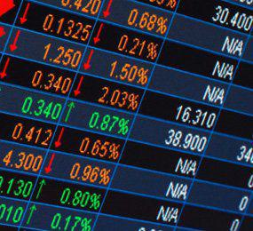

The global financial market has undergone significant transformations over the past few decades, with the currency exchange market positioned at the forefront of these changes. As a pivotal component of international finance, the currency exchange market facilitates the seamless trade of currencies across borders, contributing to global economic interconnectivity. The integration of algorithmic trading represents a major shift in currency trading strategies and market dynamics, introducing efficiency and sophistication to trading processes.

Algorithmic trading involves the use of complex algorithms and high-speed computing to execute trades, providing traders with enhanced speed and precision. This integration has fundamentally altered traditional trading practices, allowing for the automation of complex trading strategies that were previously not feasible at such scales. The adoption of algorithmic trading has also facilitated the processing of large volumes of trades with minimal latency, further increasing market efficiency.

The article examines various exchange systems and their evolution, from the fixed exchange rate systems of the Bretton Woods era to the current floating exchange rate regimes. These systems underpin international trade by establishing mechanisms for currency conversion and valuation, thereby influencing economic policies and international relations. The development of electronic trading platforms has modernized these systems, introducing new functionalities and regulatory considerations that enhance accessibility and transparency.

Technological advancements continue to reshape the landscape of global currency markets. Innovations such as artificial intelligence, machine learning, and cloud-based systems are driving the development of advanced trading algorithms, enabling traders to analyze vast datasets and predict market trends more accurately. The proliferation of mobile and web-based trading platforms has democratized access to currency trading, allowing a broader range of participants to engage in financial markets.

This article highlights the interplay between exchange systems and algorithmic trading, illustrating how their convergence creates more efficient and intricate global markets. By exploring the latest trends, challenges, and opportunities within global currency trading and algorithmic systems, stakeholders can better understand the evolving dynamics of modern financial markets and the potential for future growth and innovation.

## Table of Contents

## Understanding Exchange Systems in Currency Trade

Exchange systems are fundamental to global currency trade, enabling the seamless transaction of currencies across international borders. Historically, these systems have undergone significant transformations, reflecting shifts in international economic policies and technological advancement.

The Bretton Woods Agreement, established in 1944, marked a pivotal point in the history of currency exchange systems. It introduced a system of fixed exchange rates by pegging currencies to the U.S. dollar, which was convertible to gold. This system facilitated post-war economic stability and growth. However, it fell apart in the early 1970s due to its inability to address growing economic imbalances and the inability of the U.S. to maintain the gold exchange standard.

Following the collapse of the Bretton Woods system, countries gradually moved toward floating exchange rate mechanisms. This shift allowed currency values to fluctuate based on market forces like supply and demand, rather than being tied to a specific value of gold or another currency. Floating exchange rates have since become the dominant mechanism, providing countries with greater autonomy in monetary policy. This transition significantly impacts international trade and economic relationships, as it introduces variability and risk into cross-border transactions.

Modern exchange platforms, leveraged by technological advancements, greatly differ from their historical counterparts. Platforms like the Electronic Broking Services (EBS) and Reuters Dealing, as well as decentralized networks, serve as the backbone for currency trading today. These platforms are designed to handle high volumes of transactions with speed and efficiency, providing traders with real-time data and analytics.

Regulatory environments vary across jurisdictions, affecting how currency trades are executed. Regulatory bodies such as the Financial Conduct Authority (FCA) and Commodity Futures Trading Commission (CFTC) impose rules to ensure transparency, fairness, and stability in financial markets. Regulatory frameworks are essential in managing systemic risks and preventing market manipulation and fraud.

Technological advancements are continuously impacting traditional exchange systems, enhancing their efficiency and user-friendliness. Algorithmic trading, for instance, enables high-frequency trades, allowing market participants to execute large numbers of transactions within microseconds. This has increased [liquidity](/wiki/liquidity-risk-premium) and reduced spreads, benefiting both traders and the overall market.

Moreover, technological tools like blockchain and distributed ledger technologies are poised to further revolutionize exchange systems. These innovations promise increased transparency, reduced transaction costs, and enhanced security in currency trade. Additionally, the integration of [machine learning](/wiki/machine-learning) and [artificial intelligence](/wiki/ai-artificial-intelligence) can optimize trading strategies and predict market trends more accurately.

In summary, exchange systems are crucial to facilitating global currency trade. They have evolved from the Bretton Woods era's fixed exchange rates to today's dynamic and technologically sophisticated platforms, profoundly impacting international trade and economic relations. As technology continues to advance, these systems are likely to become even more efficient and accessible, presenting both challenges and opportunities for market participants.

## Algorithmic Trading in the Global Market

Algorithmic trading, particularly within the [forex](/wiki/forex-system) market, signifies a fundamental transformation in global financial trading mechanisms. Traditionally reliant on human decision-making, trading has shifted dramatically towards automation, spearheaded by sophisticated algorithms. Algorithmic trading can be defined as the use of electronic platforms to enter trading orders with computers rather than human intervention, often at speeds significantly faster than traditional manual methods. According to a 2022 report from the Bank for International Settlements, [algorithmic trading](/wiki/algorithmic-trading) accounts for nearly 80% of all trades in the forex market, highlighting its increasing dominance in this sector.

The advantages of algorithmic trading are manifold. One of the most notable is speed; algorithms are capable of analyzing multiple markets and executing orders at a pace that is unattainable for human traders. This swiftness ensures that trading opportunities can be seized almost instantaneously, optimizing potential profits. Additionally, algorithmic trading enhances accuracy, significantly reducing the potential for human error that can accompany manual trading. Algorithms can be designed to handle complex trading strategies that involve vast numbers of variables, enabling traders to execute intricate strategies that would be impractical manually. 

However, algorithmic trading is not without its challenges. Market [volatility](/wiki/volatility-trading-strategies) presents a significant hurdle, as rapid price swings can lead to substantial losses if not managed carefully. Algorithms rely on historical data and may not always predict unprecedented market conditions, leading to potential financial exposure. Furthermore, regulatory constraints pose challenges, as trading regulations vary widely across countries and necessitate constant adaptation to ensure compliance.

Looking ahead, the prospects for algorithmic trading are promising, with continuous advancements in technology likely to amplify its impact on global markets. As artificial intelligence and machine learning technologies progress, algorithms are expected to become even more adept at analyzing data and predicting market trends. This evolution may result in even more efficient markets with enhanced liquidity. However, it also raises concerns about market stability and the need for robust regulatory frameworks to safeguard against unethical practices and systemic risk.

In conclusion, algorithmic trading is redefining the landscape of forex markets, offering substantial benefits in terms of speed and accuracy. Despite facing challenges like market volatility and regulatory hurdles, its future potential remains vast. Continuous technological innovation promises to further refine these systems, underscoring the importance for financial stakeholders to stay abreast of these developments and adapt to a rapidly evolving trading environment.

## Technological Innovations Driving Currency Trade

Technological advancements have profoundly impacted global currency trade, introducing innovations that enhance market accessibility and efficiency. Among these, artificial intelligence (AI) and machine learning (ML) are at the forefront, fundamentally altering how trading algorithms are developed. AI and ML facilitate the creation of sophisticated models capable of analyzing vast datasets, identifying patterns, and executing trades with precision and speed. These technologies enable predictive analytics, allowing traders to forecast market trends based on historical data and real-time inputs, thereby enhancing decision-making processes and reducing the room for human error.

The adoption of AI and ML in currency trading is supported by various statistical methods and mathematical models, notably time-series analysis and [deep learning](/wiki/deep-learning) frameworks, like recurrent neural networks (RNNs) and [long short](/wiki/equity-long-short)-term memory (LSTM) networks. These models handle the complexity and non-linearity of financial data, improving the accuracy of predictions relating to currency movements.

Cloud computing has emerged as a critical component of trading infrastructure, offering scalability, flexibility, and cost-effectiveness. By leveraging cloud-based platforms, trading firms can access high-performance computing resources necessary for processing large volumes of data. This capability is crucial for executing algorithmic trades that require rapid processing and low latency. Cloud computing also facilitates the development of algorithmic models, enabling teams to collaborate seamlessly and deploy updates more efficiently. Furthermore, the accessibility of cloud services ensures that smaller firms can compete with traditional financial institutions by minimizing upfront technical investment.

Mobile and web-based platforms have democratized currency trading by providing individuals with unprecedented access to market data and tools from virtually anywhere. These platforms have reduced barriers to entry, allowing a wider demographic to participate in currency trading. They offer user-friendly interfaces and a suite of analytical tools that empower traders to execute trades, monitor portfolios, and manage risks in real-time. The proliferation of mobile platforms, in particular, aligns with the increasing reliance on smartphones and the internet, thus amplifying the reach of currency markets.

Data analytics, underpinning many technological innovations, plays a vital role in transforming currency trading. The extraction of actionable insights from massive datasets allows traders to make informed decisions based on empirical evidence. This process involves utilizing descriptive, predictive, and prescriptive analytics to assess market conditions and strategize accordingly. By applying techniques such as regression analysis, clustering, and Monte Carlo simulations, traders can quantify risks and optimize strategies to maximize returns.

In summary, the convergence of AI, ML, cloud computing, mobile platforms, and data analytics is reshaping global currency trade. These innovations not only enhance the efficiency and accessibility of markets but also equip traders with the tools needed to navigate an increasingly competitive landscape. As technology continues to evolve, its role in currency trading will likely expand, offering further opportunities for innovation and growth in the financial sector.

## Challenges and Risks in Algorithmic Trading

Algorithmic trading, despite its transformative impact on the financial markets, poses several challenges and risks that necessitate careful consideration and mitigation strategies. One of the most significant concerns is high-frequency trading ([HFT](/wiki/high-frequency-trading-strategies)). HFT involves executing a large number of orders at extremely high speeds, often in fractions of a second. While this can enhance liquidity and price efficiency, it can also lead to market manipulation tactics such as "quote stuffing," where overwhelming the market with a large number of buy or sell orders can create confusion and distort genuine price discovery processes.

Another challenge is the risk of algorithmic failures, which can result in significant financial losses. These failures may arise from technical glitches, coding errors, or poor algorithmic design. For example, the "Flash Crash" of May 6, 2010, saw the Dow Jones Industrial Average plummet nearly 1,000 points within minutes, largely attributed to erroneous trading activities involving algorithms that malfunctioned. Such events underscore the importance of robust algorithm testing and validation procedures to prevent unexpected behavior.

Regulatory challenges also pose significant concerns, as different countries adopt varied approaches to ensure market stability and protect investors. Regulators globally face the task of balancing innovation with stability, which involves updating existing frameworks or creating new regulations that address the unique risks of algorithmic trading. For instance, the European Union introduced the Markets in Financial Instruments Directive II (MiFID II), which includes specific provisions aimed at curbing risks associated with high-frequency and algorithmic trading.

To mitigate these challenges, several strategies can be employed. A critical approach is the implementation of circuit breakers, which temporarily halt trading during significant market movements, allowing time to address underlying issues. Additionally, deploying advanced monitoring systems equipped with machine learning algorithms can enhance the detection of anomalous trading patterns indicative of potential algorithmic malfunctions or manipulative activities.

Risk management frameworks must also be established to limit exposure to volatile market conditions. This includes setting predefined risk thresholds, employing stop-loss orders, and maintaining a diversified trading portfolio. Furthermore, continuous education and training of traders and developers can help ensure that they remain up-to-date with the latest algorithmic trading practices and regulatory requirements.

In conclusion, addressing the challenges and risks inherent in algorithmic trading is imperative to maintain its role as a productive component of the financial markets. These efforts involve a combination of technological innovation, regulatory oversight, and comprehensive risk management strategies.

## Conclusion

The transformative role of exchange systems and algorithmic trading in modern financial markets is profound, creating a landscape that is both efficient and responsive to market demands. Exchange systems, historically rooted in fixed-rate regimes like the Bretton Woods system, have evolved into complex, floating exchange rate mechanisms that allow for greater flexibility and responsiveness to global economic changes. These systems facilitate the seamless exchange of currencies across borders, enabling international trade and investment to flourish. By providing a structured platform for currency transactions, they help stabilize and standardize the economic relationships between nations, contributing to global economic growth.

Algorithmic trading, a more recent development, enhances market efficiency through precision and speed in executing trades. Statistical evidence suggests that algorithmic trading now accounts for a significant portion of forex market transactions. The ability to process complex trades quickly and accurately allows for greater liquidity and tighter spreads, contributing significantly to the overall stability and integrity of financial markets. However, this increased efficiency comes with inherent risks, such as the potential for market manipulation and technical failures. Incidents involving high-frequency trading or poorly designed algorithms can lead to significant financial perturbations.

Striking a balance between leveraging these technological advancements and managing associated risks is crucial. Technological safeguards and regulatory frameworks must evolve in tandem to ensure that the benefits of these systems are not overshadowed by potential drawbacks. Countries have begun to develop robust regulatory environments to oversee these trading activities, aiming to mitigate risks without stifling innovation.

Looking to the future, the direction of currency markets will likely be shaped by continued technological growth and increasing automation. Artificial intelligence and machine learning are expected to play a more significant role in developing advanced trading algorithms, while cloud computing may enhance the scalability and accessibility of trading platforms. These technologies are likely to democratize access to financial markets further, opening up new opportunities for traders of all sizes.

To thrive in this rapidly changing environment, stakeholders in the financial sector need to remain informed about ongoing technological advancements and evolving market dynamics. Continuous education and adaptation to new tools and strategies will be essential for traders, financial institutions, and regulators. By staying engaged and proactive, these stakeholders can harness the full potential of innovative exchange systems and algorithmic trading, ensuring their productive integration into global financial markets.

## References & Further Reading

[1]: ["The Impact of Algorithmic Trading in the Forex Market"](https://traderfactor.com/the-rise-of-algorithmic-trading-in-the-forex-market/) - Bank for International Settlements, 2022

[2]: ["Advances in Financial Machine Learning"](https://www.amazon.com/Advances-Financial-Machine-Learning-Marcos/dp/1119482089) by Marcos Lopez de Prado

[3]: ["The Bretton Woods Transcripts"](https://centerforfinancialstability.org/brettonwoods_docs.php) by Kurt Schuler and Andrew Rosenberg

[4]: ["Machine Learning for Algorithmic Trading"](https://github.com/stefan-jansen/machine-learning-for-trading) by Stefan Jansen

[5]: ["Quantitative Trading: How to Build Your Own Algorithmic Trading Business"](https://www.amazon.com/Quantitative-Trading-Build-Algorithmic-Business/dp/1119800064) by Ernest P. Chan