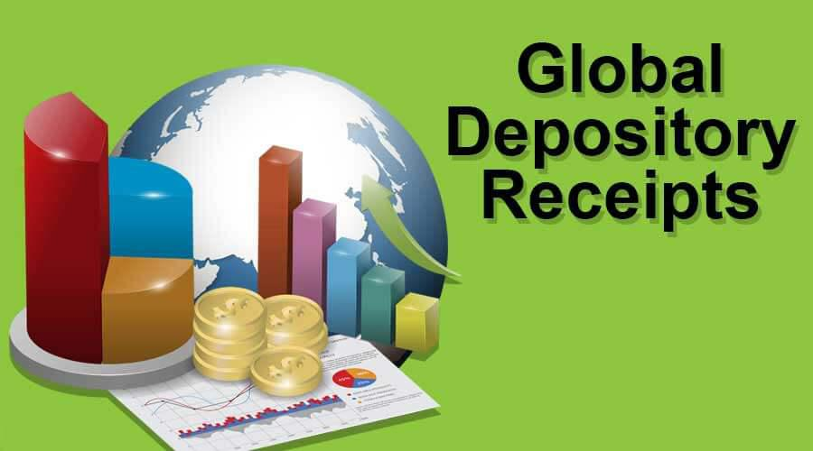

Global Depositary Receipts (GDRs) are crucial instruments for companies aiming to access international capital markets. By facilitating the trading of shares of foreign companies on local stock exchanges, GDRs present a strategic opportunity for companies to diversify their investor base and raise capital beyond their domestic boundaries. They enable businesses to attract investment from international investors who might otherwise face significant hurdles in acquiring shares of foreign companies. This cross-border financial instrument not only broadens investment avenues for global investors but also supports companies in their growth and expansion endeavors.

This article delves into the convergence of GDRs and algorithmic trading, a sophisticated form of trading that leverages algorithms and electronic platforms to execute financial transactions at an optimal pace. The rising sophistication of algorithmic trading has transformed the trading landscape, making it imperative to explore how it interacts with GDRs to enhance market efficiency. Algorithmic trading offers significant advantages, such as identifying arbitrage opportunities and optimizing trade executions, which can be particularly advantageous when dealing with GDRs and their underlying shares.



In examining GDRs, it is essential to understand their mechanics, including how they are issued and traded, as well as the benefits and challenges they present. The issuance of GDRs involves depositing shares with a custodian bank, which then facilitates their trading on international exchanges. This process opens a portal to global capital markets, providing companies with a wider reach. However, it also introduces complexities such as currency risks, administrative fees, and tax considerations, which companies must navigate carefully. By understanding these dynamics, stakeholders can make informed decisions when participating in international finance markets.

Through this exploration, we aim to provide comprehensive insights into GDRs, highlighting their significance in global finance while also considering the opportunities and challenges presented by the integration of algorithmic trading.

## Table of Contents

## Understanding Global Depositary Receipts (GDRs)

Global Depositary Receipts (GDRs) are instrumental in allowing companies to extend their capital-raising activities beyond the confines of their domestic markets. Primarily, GDRs serve as financial instruments, representing shares in a foreign company. These instruments enable companies to access a vast pool of potential international investors by trading on local stock exchanges outside their home market.

The essential mechanism of GDRs involves a domestic company depositing its shares with a custodian bank. This depository then issues GDRs representing these shares, which can be traded on international exchanges. This process permits investors from different regions to invest in foreign companies without the complexities typically associated with cross-border investments. As such, GDRs broaden the investor base for companies and can potentially increase the liquidity of their shares.

Comparatively, GDRs share similarities with another financial instrument known as American Depositary Receipts (ADRs). Both financial instruments facilitate foreign investments by trading on exchanges within the investor's local market. ADRs, however, specifically pertain to shares of foreign companies trading on U.S. exchanges. GDRs provide a broader geographic scope and are typically listed on European or other non-U.S. exchanges. Another key distinction lies in their respective regulatory requirements and market reach. ADRs comply with U.S. Securities and Exchange Commission (SEC) regulations, whereas GDRs align with the regulatory stipulations of the exchange they are listed on, potentially affording greater flexibility in certain jurisdictions.

GDRs and ADRs contribute significantly to diversifying the portfolios of international investors while offering foreign companies a viable pathway to global capital markets. This dual benefit underscores the strategic value of these instruments in facilitating cross-border financial mobility and investment.

## Mechanics of GDR Issuance

Global Depositary Receipts (GDRs) are integral financial instruments that facilitate cross-border investment by allowing companies to issue shares to international investors. The issuance of GDRs involves a well-coordinated process primarily managed by depositary banks, which are critical intermediaries in this international financial operation.

### Role of Depositary Banks

Depositary banks are central to the GDR issuance process. They are responsible for acting as a bridge between the foreign company and international investors. These institutions issue the GDRs against shares deposited with a custodian bank in the home country of the foreign company. The depositary bank essentially creates a negotiable financial instrument (the GDR) that represents one or more underlying shares of the foreign company. 

### Issuance Process

1. **Selection of Depositary Bank**: The foreign company selects a depositary bank to manage the issuance. This selection is crucial as depositary banks ensure compliance with financial regulations and investment standards in the target international market.

2. **Custodian Bank Arrangement**: The foreign company's shares are deposited with a custodian bank in the company's home country. The custodian bank holds these shares on behalf of the depositary bank.

3. **Creation of GDRs**: The depositary bank issues GDRs in exchange for the shares held by the custodian bank. The number of GDRs issued can represent a single share, multiple shares, or a fraction of a share, depending on the negotiated terms and investor requirements.

4. **Listing on International Exchanges**: GDRs are subsequently listed on one or more international stock exchanges, where they can be traded by investors. Popular exchanges for GDR listings include the London Stock Exchange (LSE) and the Luxembourg Stock Exchange.

### Denomination and Trading

GDRs are typically denominated in a currency that is widely accepted and stable, often the U.S. dollar or the euro. This denomination choice helps mitigate currency risk for international investors. Once listed, GDRs can be traded in exchange for the underlying shares held by the custodian bank. The trading of GDRs provides [liquidity](/wiki/liquidity-risk-premium) for the company's shares outside its home market, thereby appealing to a broader investor base.

### Example Code for GDR Pricing

To calculate the price of a GDR, consider the formula:
$$
\text{GDR Price} = \left( \frac{\text{Number of Shares}}{\text{Number of GDRs}} \right) \times \text{Price of Underlying Share} \times \text{Exchange Rate}
$$

For an illustrative Python calculation:

```python
def calculate_gdr_price(num_shares, num_gdrs, share_price, exchange_rate):
    gdr_price = (num_shares / num_gdrs) * share_price * exchange_rate
    return gdr_price

# Example usage
num_shares = 2
num_gdrs = 1
share_price = 50  # in home currency
exchange_rate = 1.2  # home currency to USD

gdr_price = calculate_gdr_price(num_shares, num_gdrs, share_price, exchange_rate)
print(f"The GDR Price is: {gdr_price}")
```

This example demonstrates how variations in share numbers and exchange rates affect the GDR price, reflecting its sensitivity to market fluctuations.

Trading GDRs across various global exchanges allows investors to gain indirect access to foreign equities while providing companies with diversified capital sources. Understanding these mechanics is vital for entities aiming to leverage GDRs for international [capital raising](/wiki/hedge-fund-capital-raising) and investment opportunities.

## Algorithmic Trading and GDRs

Algorithmic trading is a method of executing orders using pre-programmed trading instructions that account for variables such as time, price, and [volume](/wiki/volume-trading-strategy). This systematic approach to trading is often employed to execute large orders that would be difficult to handle manually, especially when involving complex financial instruments like Global Depositary Receipts (GDRs).

GDRs offer a unique opportunity for [algorithmic trading](/wiki/algorithmic-trading), particularly in exploiting [arbitrage](/wiki/arbitrage) opportunities. Arbitrage is the practice of taking advantage of a price difference between two or more markets. In the context of GDRs, which are traded on global exchanges while representing underlying shares in a foreign company, disparities can occur between the price of the GDR and the underlying equity. Algorithmic trading systems can be designed to consistently monitor these markets, identifying and executing trades that capture these price discrepancies. 

### Advantages of Algorithms in GDR Trading

1. **Speed and Efficiency**: Algorithmic trading systems can analyze vast amounts of data across various markets in real-time, allowing them to act faster than any human trader. This speed is critical in arbitrage strategies where price differences might last only for a few seconds.

2. **Precision**: Algorithms can execute trades with precision according to predetermined criteria, avoiding the risks associated with human error. For example, a program can be set to execute a buy order if the price of a GDR drops to a certain level compared to the underlying asset, ensuring that the strategy is executed perfectly every time.

3. **Scalability**: With algorithmic trading, investors can manage large trading volumes across multiple markets efficiently. The automation allows for scaling operations without proportionally increasing the trading costs.

### Challenges and Considerations

However, there are significant challenges and considerations when engaging in algorithmic trading of GDRs:

1. **Liquidity Concerns**: GDRs might not always exhibit the same level of liquidity as other financial instruments. Algorithms must be sophisticated enough to handle scenarios where trading volumes are low, which could impact the ability to enter or exit positions quickly without affecting the market price.

2. **Market Volatility**: While algorithms can manage trades at high speeds, volatile market conditions can lead to unpredictable outcomes. Algorithms must be designed to react appropriately to sudden market shifts, either by halting trading or adjusting strategies on-the-fly.

3. **Data Quality and Latency**: The success of algorithmic trading depends heavily on the quality and speed of data processing. Ensuring access to accurate, real-time data is crucial. Latency, or delays in receiving and processing data, can result in missed opportunities or erroneous trades.

4. **Regulatory Compliance**: Algorithmic traders must navigate complex international regulations, which can vary significantly between countries. Compliance ensures that strategies not only perform well but also adhere to legal standards, reducing the risk of penalties.

### Example 

Here is a simple Python pseudocode example illustrating how an algorithm could monitor differences between GDRs and their underlying shares:

```python
def monitor_gdr_arbitrage(gdr_price, underlying_price, threshold):
    if abs(gdr_price - underlying_price) > threshold:
        if gdr_price > underlying_price:
            execute_trade("sell", "GDR")   # execute selling the higher-priced GDR
            execute_trade("buy", "underlying")  # execute buying the undervalued underlying share
        else:
            execute_trade("buy", "GDR")   # execute buying the undervalued GDR
            execute_trade("sell", "underlying")  # execute selling the higher-priced underlying share

# Hypothetical prices
gdr_price = 102
underlying_price = 100
threshold = 1.5

monitor_gdr_arbitrage(gdr_price, underlying_price, threshold)
```

This example illustrates the basic logic an algorithm might follow, highlighting the simplicity and efficiency of automating trading decisions where GDRs and their corresponding underlying shares are involved.

## Advantages and Disadvantages of GDRs

Global Depositary Receipts (GDRs) serve as a pivotal mechanism for companies aiming to broaden their access to international investors and enhance their financial liquidity. Unlike local exchanges, GDRs offer companies the ability to reach a diverse pool of investors worldwide, thereby augmenting their investor base. The expanded investor base can lead to increased liquidity for the company’s shares. This is largely due to the higher number of trades and transactions occurring on an international scale, potentially raising the share price and market valuation of the company. Furthermore, GDRs offer investors an easier route to investing in foreign companies without the need for complicated cross-border transactions. This benefit is particularly advantageous for investors looking to diversify their portfolios internationally.

However, GDRs are not without their drawbacks. One of the primary disadvantages is the exposure to currency risks. Since GDRs are typically denominated in a foreign currency, adverse exchange rate movements can impact the value of the investment. This can introduce an additional layer of [volatility](/wiki/volatility-trading-strategies), especially in unstable economic conditions. Another significant drawback is the higher administrative fees associated with GDR issuance and management. Companies often have to pay substantial fees to depositary banks for their services, which can erode potential profits from using GDRs. Additionally, tax implications can be a concern for both companies and investors. Different tax regimes across countries can complicate the tax obligations and impact the net returns of investments made via GDRs.

In the decision-making process, companies and investors weigh these advantages and disadvantages meticulously. Companies take into account the expanded investor base and potential increase in liquidity against the costs and risks associated with GDRs. For investors, the decision often rests on the balance between achieving international diversification and managing the associated financial and administrative risks. A comprehensive assessment that includes currency fluctuations, tax obligations, and fee structures is essential. This careful evaluation helps both companies and investors determine whether GDRs align with their strategic financial goals and risk appetite.

## Case Studies and Examples

Global Depositary Receipts (GDRs) serve as pivotal instruments for numerous companies aiming to broaden their capital reach to international markets. Several real-world cases provide valuable insights into how companies effectively utilize GDRs to amplify their global presence.

### Phillips 66

Phillips 66, a renowned energy manufacturing and logistics company, has used GDRs strategically to diversify its investor base beyond the United States. By issuing GDRs, Phillips 66 aimed to attract a wider range of institutional and retail investors, particularly from Europe. This move not only facilitated additional capital inflow but also enhanced the company's visibility in international markets. The issuance strategy involved collaborating with a depositary bank, which played a crucial role in managing the GDRs. This strategy enabled Phillips 66 to mitigate geographic concentration risks by tapping into new pools of global investors.

### Various Industries Leveraging GDRs

Industries beyond the energy sector similarly employ GDRs to bolster their capital and global presence. The technology sector, for instance, sees frequent utilization of GDRs among companies looking to achieve rapid international expansion. By listing GDRs on major stock exchanges, technology firms can quickly penetrate multiple foreign markets, thereby accelerating growth and market penetration.  

Banks and financial institutions also find GDRs advantageous, as these instruments allow them to raise significant capital without the constraints of local regulatory frameworks. This is particularly true for banks seeking to offer their shares to investors in financial hubs such as London or Hong Kong, thereby strengthening their international credibility and trust.

Additionally, the pharmaceutical industry heavily relies on GDRs to secure funding for research and development activities, which often require substantial investment upfront with a long payback period. GDRs provide these companies with access to foreign investors who are keen on investing in innovative biomedical solutions.

These examples illustrate the versatile application of GDRs across various industries, highlighting their role in facilitating international capital flows and enhancing a company's global market reach. Such strategic use of GDRs underscores their significance in contemporary international finance, enabling firms not only to raise capitals but also to establish and expand their presence in the global marketplace.

## Future Outlook and Opportunities

Global Depositary Receipts (GDRs) have continuously played a significant role in connecting global investors with foreign companies, and their future outlook remains promising due to several emerging trends. 

**Technological Advancements and AI in GDR Transactions**

The integration of technological advancements and [artificial intelligence](/wiki/ai-artificial-intelligence) (AI) in financial markets is expected to significantly enhance the efficiency of GDR transactions. AI algorithms can improve transaction speed and accuracy, reducing the operational costs associated with trading GDRs. Automated systems can manage large volumes of data and execute trades at optimal prices, thus enhancing liquidity and minimizing the likelihood of human error. Machine learning models can also predict market trends, helping investors make informed decisions about GDR investments.

Blockchain technology is another innovation that could revolutionize GDR transactions by ensuring heightened security and transparency. Blockchain's decentralized nature can streamline the settlement process, reduce fraud risks, and ensure the integrity of GDR records. These technological advancements can make GDR markets more accessible and appealing to a larger pool of global investors.

**Opportunities in Emerging Markets**

Emerging markets present significant opportunities for companies utilizing GDRs. These markets often exhibit higher growth potential due to favorable demographic trends, increasing urbanization, and expanding middle classes demanding diverse investment products. By issuing GDRs, companies in emerging markets can attract foreign capital, which supports their expansion plans and boosts investor confidence. Foreign investors, in turn, gain exposure to high-growth regions without the necessity of navigating complex local regulations.

Moreover, GDRs provide a vehicle for emerging market companies to circumvent restrictive domestic financial markets, offering an alternative means to acquire capital at potentially lower costs. This access to international capital can drive innovation and infrastructure development, fostering further economic growth within these regions.

In summary, the future of GDRs looks optimistic, driven by technological advances and the rising prominence of emerging markets in the global economy. These factors can offer substantial benefits to both issuing companies and investors, amplifying the role of GDRs in international finance.

## Conclusion

Global Depositary Receipts (GDRs) play a pivotal role in bridging the gap between global investors and foreign companies. By providing a mechanism for international investment, GDRs enable companies to access a wider investor base beyond their domestic markets, thereby facilitating foreign direct investment and enhancing liquidity. This accessibility not only assists companies in raising capital but also offers investors an opportunity to diversify their portfolios with international assets without the complexities of cross-border transactions.

Integrating algorithmic trading with GDRs can significantly enhance investment returns. Algorithmic trading, known for its speed and efficiency, can identify and exploit arbitrage opportunities between GDRs and their underlying assets. This process, driven by complex algorithms and high-frequency trading techniques, ensures that traders can respond instantaneously to market discrepancies, optimizing profit margins. The use of algorithms in trading GDRs also minimizes human error, reduces transaction costs, and allows for the management of large volumes of trade, leading to greater market efficiency.

However, the complexities of international finance and trading present numerous challenges that necessitate ongoing research and adaptation. Continuous advancements in technology, such as the integration of artificial intelligence and [machine learning](/wiki/machine-learning) in trading algorithms, reflect the dynamic nature of global capital markets. These technologies promise to further transform how GDRs are traded, offering enhanced predictive capabilities and better risk management.

To effectively navigate this evolving landscape, both companies and investors must remain adaptable and informed. This involves not just adopting new technologies, but also understanding regulatory changes, market trends, and economic shifts. By doing so, they can better manage risks and capitalize on the opportunities that GDRs and algorithmic trading present in the global economy.

## References & Further Reading

[1]: Bader, M. H. (2019). ["Global Depositary Receipts: A Guide to GDRs and Capital Raising"](https://www.fca.org.uk/publication/ukla/fca-tn-607-1.pdf). Cambridge University Press.

[2]: Madhavan, A. (2012). ["Exchange-Traded Funds, Market Structure, and the Flash Crash"](https://rpc.cfainstitute.org/en/research/financial-analysts-journal/2012/exchange-traded-funds-market-structure-and-the-flash-crash). The Review of Financial Studies, 25(9), 3295-3330.

[3]: Lopez de Prado, M. (2018). ["Advances in Financial Machine Learning"](https://www.amazon.com/Advances-Financial-Machine-Learning-Marcos/dp/1119482089). Wiley.

[4]: Fung, H., & Fung, H. (1999). ["Global Depositary Receipts (GDRs): An Analysis"](https://psycnet.apa.org/record/1999-15342-005). Journal of International Financial Markets, Institutions and Money, 9(1), 57-72.

[5]: Chan, E., P. (2008). ["Quantitative Trading: How to Build Your Own Algorithmic Trading Business"](https://github.com/ftvision/quant_trading_echan_book). Wiley Trading.