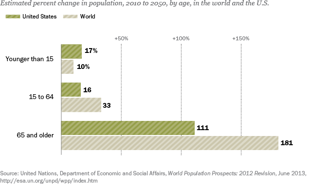

## Table of Contents

## What is an aging population?

An aging population means that there are more old people in a country or area compared to young people. This happens when people are living longer because of better healthcare and when fewer babies are being born. As a result, the average age of the people in that place goes up.

This can create some challenges. For example, there might not be enough young people to take care of the old people or to work in jobs that are important for the country. Governments might need to spend more money on healthcare and pensions for the elderly. On the other hand, older people often have a lot of experience and wisdom to share, which can be good for society.

## How is an aging population measured?

An aging population is measured by looking at the average age of people in a country or area. This is done by taking the ages of everyone and finding out what the middle age is. If this middle age keeps going up over time, it means the population is aging. Another way to measure it is by looking at the percentage of people who are old, usually those over 65 years old. If this percentage is getting bigger, it shows the population is aging.

Another measure is the old-age dependency ratio. This is a number that shows how many old people there are compared to the number of working-age people. If this ratio goes up, it means there are more old people who might need support from fewer working-age people. All these measures help governments and researchers understand how the population is changing and plan for the future.

## What are the current global trends in population aging?

Population aging is happening all over the world, but it is more common in some places than others. In many rich countries like Japan, Italy, and Germany, the number of old people is growing fast. This is because people in these countries are living longer and having fewer babies. In Japan, for example, about a quarter of the people are over 65 years old. This trend is also starting to happen in some middle-income countries like China and Brazil, where people are also living longer and having fewer children.

In poorer countries, population aging is not as big of a problem yet, but it is starting to happen. In places like Africa, the population is still quite young, but as healthcare gets better, people are starting to live longer. This means that even in these countries, the number of old people will start to grow in the future. Around the world, the number of people over 60 is expected to double by the year 2050, which means that more and more countries will need to think about how to take care of their aging populations.

Governments and organizations are trying to plan for this change. They are looking at ways to make sure there are enough jobs, healthcare, and support for old people. Some countries are encouraging people to have more babies, while others are trying to help old people stay healthy and active for longer. It's a big challenge, but by understanding these trends, countries can prepare better for the future.

## How does an aging population affect economic growth?

An aging population can slow down economic growth because there are fewer young people to work in jobs. When there are more old people and fewer young people, there might not be enough workers to keep businesses running well. This can make it hard for the economy to grow because businesses need workers to make things and provide services. Also, old people might not spend as much money as young people, which can also slow down the economy. If people are not buying as much, businesses might not make as much money, and this can lead to less growth.

On the other hand, older people can help the economy in some ways. They often have a lot of experience and can share their knowledge with younger workers. This can make businesses more productive. Also, older people might have saved up money over their lives, and when they spend this money, it can help the economy. Governments can help by making policies that encourage older people to keep working if they want to, and by making sure there are good healthcare and support systems so that older people can stay healthy and active. This can help balance out some of the challenges that come with an aging population.

## What are the impacts of an aging population on labor markets?

An aging population can change the labor market by making it harder to find enough workers. When there are more old people and fewer young people, there might not be enough people to fill all the jobs. This can cause problems for businesses because they need workers to make things and provide services. It can also mean that wages might go up because businesses have to pay more to attract the workers they need. This can be good for workers but can make it harder for businesses to make money.

Older workers can help the labor market too. They have a lot of experience and can teach younger workers new skills. This can make businesses more productive and help them grow. Governments can help by making it easier for older people to keep working if they want to. They can offer flexible work options or training programs to help older workers stay in the job market. This can help balance out the challenges of having an aging population and keep the labor market strong.

## How does an aging population influence healthcare systems?

An aging population puts a lot of pressure on healthcare systems. As people get older, they often need more medical care. This means hospitals and doctors might get very busy. It can be hard to find enough doctors and nurses to take care of everyone. Also, older people might need more expensive treatments and medicines, so the cost of healthcare can go up. Governments might need to spend more money on healthcare to make sure everyone gets the care they need.

On the other hand, an aging population can also help healthcare systems in some ways. Older people often have a lot of experience and can help train younger doctors and nurses. They can share their knowledge and help make healthcare better. Governments can help by making plans to take care of older people. They can build more hospitals and clinics, train more doctors and nurses, and find ways to make healthcare cheaper. By doing these things, healthcare systems can be ready for an aging population and keep everyone healthy.

## What are the fiscal challenges posed by an aging population?

An aging population can make it hard for governments to manage their money. When there are more old people, governments might have to spend more on things like healthcare and pensions. Old people often need more medical care, and this can cost a lot of money. Pensions are payments that old people get when they stop working, and if there are more old people, the government has to pay more pensions. This means the government might need to find more money or spend less on other things.

On the other hand, an aging population can mean there are fewer young people working and paying taxes. Taxes are the money that people and businesses pay to the government, and this money helps pay for things like healthcare and pensions. If there are fewer young people working, the government might not get as much tax money. This can make it hard to pay for everything that old people need. Governments might have to make tough choices about where to spend their money and how to make sure they have enough for everyone.

## How can social security systems be sustained with an aging population?

An aging population can make it hard to keep social security systems going. Social security is money that the government gives to old people when they stop working. When there are more old people, the government needs to pay more social security. But if there are fewer young people working and paying taxes, the government might not get enough money to pay for all the social security. This can be a big problem because the government needs to find a way to have enough money for everyone.

One way to help is by making changes to the social security system. Governments can encourage people to work longer before they start getting social security. This means there will be more people paying taxes and fewer people needing social security right away. Another way is to make the social security system more efficient, like by finding ways to pay for it without spending as much money. Governments can also think about other ways to get money, like raising taxes or finding new ways to make money. By doing these things, social security systems can keep working even with an aging population.

## What policy measures can governments implement to mitigate the economic effects of an aging population?

Governments can do a few things to help the economy when the population is getting older. One way is to encourage people to keep working even when they are older. This can be done by offering flexible work options or training programs that help older people stay in their jobs. When older people keep working, they can keep paying taxes and using their experience to help businesses. Another way is to help more women and young people join the workforce. By making it easier for them to find jobs, there will be more people working and paying taxes, which can help the economy grow.

Governments can also change how they spend their money to deal with an aging population. They might need to spend more on healthcare and pensions for old people, but they can also find ways to make these things cheaper. For example, they can focus on keeping people healthy so they don't need as much medical care. Governments can also look for new ways to make money, like raising taxes or finding other sources of income. By doing these things, they can make sure they have enough money to take care of everyone and keep the economy strong.

Another important policy measure is to encourage immigration. By welcoming more young people from other countries, governments can bring in new workers who can help fill jobs and pay taxes. This can help balance out the effects of an aging population and keep the economy growing. By using these different policy measures, governments can make sure their countries are ready for an aging population and can keep the economy strong.

## How do different countries approach the economic challenges of an aging population?

Different countries are trying to deal with the economic challenges of an aging population in their own ways. In Japan, where a lot of people are old, the government is encouraging older people to keep working. They offer flexible work options and training programs to help older workers stay in their jobs. Japan also tries to bring in more young workers from other countries to help fill jobs and pay taxes. This helps keep the economy strong even with so many old people.

In Europe, countries like Germany and Italy are also facing aging populations. They are trying to help more women and young people join the workforce. By making it easier for them to find jobs, these countries can have more people working and paying taxes. They are also trying to find ways to spend less on healthcare and pensions, like by focusing on keeping people healthy so they don't need as much medical care. Some European countries are also welcoming more immigrants to bring in new workers and help the economy.

In the United States, the approach includes raising the age at which people can start getting social security. This means people have to work longer before they can retire, which helps the government have more money for everyone. The U.S. also encourages immigration to bring in more young workers. By doing these things, the country tries to balance out the effects of an aging population and keep the economy growing.

## What are the long-term economic implications of an aging population on global markets?

An aging population can change the way global markets work over a long time. When there are more old people and fewer young people, there might not be enough workers to keep businesses running well. This can make it hard for the economy to grow because businesses need workers to make things and provide services. It can also mean that wages might go up because businesses have to pay more to attract the workers they need. This can be good for workers but can make it harder for businesses to make money. If people are not buying as much, businesses might not make as much money, and this can lead to less growth in global markets.

On the other hand, older people can help the economy in some ways. They often have a lot of experience and can share their knowledge with younger workers. This can make businesses more productive and help them grow. Also, older people might have saved up money over their lives, and when they spend this money, it can help the economy. Governments can help by making policies that encourage older people to keep working if they want to, and by making sure there are good healthcare and support systems so that older people can stay healthy and active. By doing these things, countries can balance out some of the challenges that come with an aging population and help keep global markets strong.

## How can technological advancements help address the economic challenges of an aging population?

Technological advancements can help with the economic challenges of an aging population by making it easier for old people to stay healthy and active. New medical technologies can help doctors find and treat health problems early, which can save money on healthcare. Also, technology like telemedicine lets old people talk to doctors from home, so they don't have to go to the hospital as much. This can help keep healthcare costs down. Robots and smart devices can help old people stay in their own homes longer, which can also save money because they don't have to move to a care home.

Technology can also help older people keep working if they want to. Computers and the internet make it easier for old people to work from home or do jobs that don't need them to be in the office all the time. This can help businesses because they can use the experience of older workers. Technology can also make businesses more productive. For example, machines can do some of the work that people used to do, which can help fill the gap when there are not enough young workers. By using technology in these ways, countries can deal with the economic challenges of an aging population and keep their economies strong.

## References & Further Reading

[1]: Harper, S. (2014). ["Economic and social implications of aging societies."](https://pubmed.ncbi.nlm.nih.gov/25359967/) Nature 514, 538–539.

[2]: Lewis, M. (2014). ["Flash Boys: A Wall Street Revolt."](https://en.wikipedia.org/wiki/Flash_Boys) W. W. Norton & Company.

[3]: López de Prado, M. (2018). ["Advances in Financial Machine Learning."](https://www.amazon.com/Advances-Financial-Machine-Learning-Marcos/dp/1119482089) Wiley.

[4]: SEC and CFTC (2010). ["Findings Regarding the Market Events of May 6, 2010."](https://www.sec.gov/news/studies/2010/marketevents-report.pdf) Report of the staffs of the CFTC and SEC to the Joint Advisory Committee on Emerging Regulatory Issues. 

[5]: OECD (2019). ["Pensions at a Glance 2019: OECD and G20 Indicators."](https://www.oecd.org/en/publications/pensions-at-a-glance-2019_b6d3dcfc-en.html) OECD Publishing, Paris.