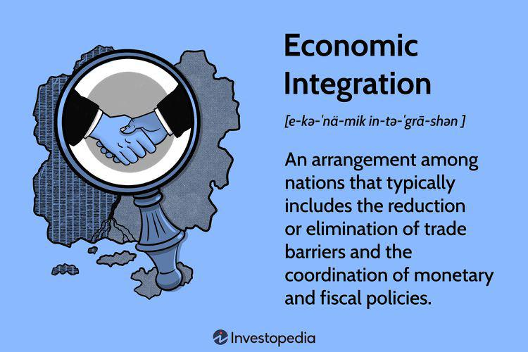

The global economy today is navigating a confluence of significant challenges. Two of the most pressing are the demographic trend of aging populations and the swift advancement of algorithmic trading systems. These dynamics are not only reshaping economic forecasts but also influencing the strategic decisions of policymakers, investors, and businesses globally.

Aging populations are a demographic trend observed in many parts of the world and are characterized by a rising median age in a nation's demographic distribution. This shift is largely due to declining birth rates and improvements in healthcare that lead to increased longevity. Countries experiencing these changes face various economic impacts, including escalated healthcare costs, mounting pension obligations, and potential labor shortages as fewer workers support a growing number of retirees. In response, innovative solutions that enhance workforce mobility, reform retirement policies, and upgrade healthcare systems are imperative to maintain economic stability.

Parallelly, the financial sector has witnessed radical transformations with the rise of algorithmic trading. This modern trading technique utilizes high-speed computer programs to make numerous trades, capitalizing on minute market inefficiencies. While this increases market efficiency and optimizes trading strategies, it also introduces new risks such as heightened market volatility and potential flash crashes. These phenomena compel a reevaluation of regulatory strategies to balance the drive for innovation with the need for investor protection.

Understanding the intersection of these demographic and technological forces is vital for stakeholders. These factors have the power to redefine global economic structures and require a strategic approach to leverage opportunities while mitigating associated risks. As these trends continue to evolve, a comprehensive analysis is crucial to decipher complex economic patterns and forecast future developments. Consequently, strategic foresight and collaborative global action will be essential in navigating these intertwined economic drivers, allowing stakeholders to anticipate changes and adapt accordingly for sustainable economic growth.

## Table of Contents

## The Economic Implications of an Aging Population

An aging population is a notable demographic trend characterized by the rising median age within a country due to factors such as declining birth rates and increased longevity. This shift poses significant economic challenges that merit careful consideration and innovative policy responses.

One of the primary economic challenges associated with an aging population is the increased burden on healthcare systems. As people age, their healthcare needs typically become more complex and costly. This can lead to a surge in healthcare expenditures, which often require adjustments in both public and private sector budgeting. The increased demand for healthcare services necessitates not only more financial resources but also an expansion of healthcare infrastructure and workforce.

Concurrently, pension systems face mounting pressures. With a larger proportion of the population entering retirement, and living longer post-retirement, pension systems must be sustainable and robust enough to support retirees adequately. This situation may result in higher pension contributions from the working population or the potential for reduced benefits unless governments undertake reform measures. Addressing these pension burdens may involve extending the retirement age or transitioning from pay-as-you-go systems to other models that balance sustainability and adequacy.

The labor market also experiences shifts, as labor force participation may decline with the aging demographic. A smaller working-age population can lead to lower overall economic productivity and growth prospects. To counteract potential productivity losses, there is a critical need for policies that promote workforce mobility and skill enhancement. Encouraging older workers to remain active in the labor market through flexible work arrangements and lifelong learning initiatives can help mitigate these effects.

Finally, rethinking retirement systems is crucial for ensuring long-term sustainability. This could involve incentivizing private saving schemes, adjusting benefits structures, or reshaping retirement norms to accommodate longer life expectancies. Policymakers must balance fiscal responsibility with social equity to design systems that are both fair and financially viable over the long term.

In summary, the economic implications of an aging population are multifaceted and require comprehensive strategies that consider healthcare, pension reform, labor market dynamics, and retirement planning. Effective policy interventions can help societies manage the challenges of an aging demographic while optimizing the opportunities it presents.

## The Rise of Algorithmic Trading

Algorithmic trading employs computerized systems to execute a high [volume](/wiki/volume-trading-strategy) of financial market trades at rapid speeds, fundamentally transforming the landscape of modern finance. These systems leverage complex algorithms to analyze vast datasets and identify optimal trading strategies, significantly enhancing efficiency. The process not only minimizes human error but also enables traders to act on market opportunities within fractions of a second, a feat unachievable through manual trading. 

The efficiency of [algorithmic trading](/wiki/algorithmic-trading) is one of its greatest appeals. By processing large datasets, it optimizes decision-making, thereby enabling traders to develop sophisticated strategies tailored to specific market conditions. Algorithms can continuously adjust to new information, ensuring trades align with broader investment goals and market forecasts. In this context, algorithmic trading can be seen as a pursuit of "alpha," the term used to describe strategies that outperform a benchmark index.

However, the advantages of algorithmic trading come with notable risks. One of the most significant concerns is the potential for increased market [volatility](/wiki/volatility-trading-strategies). Algorithmic systems, when operating on similar strategies or reacting to the same market signals, can exacerbate price swings. This contributes to phenomena known as "flash crashes," where market prices plummet and rebound almost instantaneously. An infamous example occurred on May 6, 2010, when the Dow Jones Industrial Average dropped nearly 1,000 points before recovering within minutes, partially attributed to algorithm-driven trades. 

To responsibly harness the benefits of algorithmic trading, it is crucial to address regulatory challenges and ethical considerations. Regulators worldwide face the difficult task of keeping pace with rapid technological advancements while ensuring investor protection. The development and enforcement of robust regulatory frameworks are essential to mitigate systemic risks. These frameworks often include measures such as circuit breakers, which temporarily halt trading during extreme volatility, and stress tests to evaluate the resilience of financial systems under adverse conditions.

Balancing innovation and investor protection is a pressing challenge for regulators globally. Innovation is essential for maintaining competitive markets and delivering value to investors. However, unchecked technological advances can lead to significant financial instability. Therefore, continuous dialogue between regulators, financial institutions, and technology developers is necessary to form a comprehensive understanding of the implications of algorithmic trading and to formulate effective regulatory policies.

In summary, algorithmic trading represents a significant shift in financial markets, offering numerous benefits while posing substantial risks. By implementing meticulous regulatory measures and fostering innovation, the financial sector can leverage algorithmic trading to enhance market efficiencies and drive future growth.

## Intersecting Challenges in Global Economics

The intersection of an aging population and algorithmic trading brings with it a host of complex challenges and opportunities that shape the global economy. As populations in many developed countries age, the economic strains are palpable in the increased demand for healthcare services, pensions, and social security systems. These demands invariably lead to higher public expenditure, which can strain national budgets and affect economic growth. Simultaneously, advancements in algorithmic trading provide potential avenues for easing some of these financial pressures by offering more efficient investment strategies and improving market efficiencies.

Algorithmic trading, with its ability to execute trades at lightning speeds and analyze vast datasets, can potentially optimize asset allocation and enhance returns on investments. This can be particularly beneficial for pension funds and other retirement-related savings instruments, which are grappling with the challenges of funding an aging demographic with fewer young workers paying into these systems. By leveraging data and predictive analytics, algorithmic trading can help in devising better investment strategies that could mitigate some of the financial burdens associated with an aging population.

However, the benefits of algorithmic trading are not without risks. The volatility introduced by such trading mechanisms can increase market instability, posing threats to countries with aging populations that may already face economic vulnerabilities. Market corrections or crashes triggered by automated trading algorithms could disproportionately affect countries with fragile economies, exacerbating the economic challenges posed by an aging populace.

A coordinated global effort is needed to address the challenges at the intersection of these two trends. Collaboration between governments, regulators, and financial institutions is essential to create a balanced approach that harnesses technological advancements while ensuring economic stability. Regulatory frameworks must evolve to address the unique risks posed by algorithmic trading, providing safeguards against excessive market volatility without stifling innovation.

Case studies from various nations highlight strategies for managing these challenges. For instance, countries with robust regulatory systems and agile policy frameworks tend to better navigate the complexities introduced by both aging populations and rapid technological changes in financial markets. These case studies can offer valuable lessons in crafting policies that effectively balance the demands of an aging society with the dynamic nature of modern financial systems.

Ultimately, while algorithmic trading presents opportunities to address some financial pressures associated with aging populations, it is imperative that these technological solutions are deployed responsibly. Through careful regulation and global cooperation, it is possible to mitigate risks while capitalizing on technological advances to drive sustainable economic growth.

## Potential Solutions and Policy Recommendations

Proactive measures are crucial in tackling the dual challenges of aging populations and the proliferation of algorithmic trading. Addressing these issues requires a multifaceted approach that emphasizes education, regulation, collaboration, and financial literacy.

First, encouraging life-long learning and skill development is vital to mitigate workforce shortages resulting from demographic changes. An aging population tends to lead to a shrinking labor force, thereby necessitating policies that promote continuous skill enhancement for workers of all ages. This can be achieved through government incentives for educational programs and partnerships with educational institutions to create curricula that align with evolving market needs.

Second, it is essential to establish robust regulatory frameworks for algorithmic trading to limit potential risks while fostering innovation. Algorithmic trading can lead to increased market volatility and systemic risks, as evidenced by incidents like the 2010 "Flash Crash" [1]. Policymakers must develop stringent regulations that ensure transparency and accountability in trading practices. This involves setting clear guidelines on the usage of trading algorithms and implementing real-time monitoring systems to detect irregularities promptly.

Moreover, cross-sector collaboration between governments, financial institutions, and technology companies is necessary for crafting comprehensive solutions. By working together, these entities can share insights and resources to address the complexities of integrating algorithmic trading within financial markets. Public-private partnerships can lead to the development of innovative tools and strategies that leverage technology for improved market efficiency and stability.

Additionally, promoting financial literacy is a key strategy to empower individuals in an increasingly complex market environment. As trading technologies become more sophisticated, individuals need a deeper understanding of financial markets to make informed decisions. Educational initiatives aimed at enhancing financial literacy can help consumers and investors navigate the risks and opportunities presented by algorithmic trading.

In conclusion, the challenges posed by aging populations and the rise of algorithmic trading are significant, yet they can be managed through strategic policy initiatives. By fostering skill development, implementing robust regulations, encouraging cross-sector collaboration, and enhancing financial literacy, societies can navigate these economic drivers effectively, ensuring stability and growth in the global economy.

Reference:
[1] SEC, 2010. Findings regarding the market events of May 6, 2010. U.S. Securities and Exchange Commission.

## Conclusion

The global economy is currently navigating a critical juncture, heavily influenced by the dual challenges of demographic changes and technological advancements. Strategic foresight and coordinated international efforts are essential to effectively address these complex issues. These challenges are not isolated; rather, they are deeply interconnected, with each influencing the other's trajectory and impact on the economic landscape.

Understanding the intersection between an aging population and algorithmic trading is vital for preparing stakeholders to face future economic realities. As populations age, traditional economic structures are strained under the weight of increased healthcare costs, pension liabilities, and shrinking workforces. Meanwhile, algorithmic trading introduces both improved efficiencies and heightened risks, such as increased market volatility. Recognizing this intersection allows for better-informed policy-making and investment strategies that are adaptive and forward-thinking.

The way forward involves managing the inherent risks while simultaneously seizing the opportunities presented by these influential economic drivers. For instance, embracing technological advancements in trading can lead to enhanced market operations and returns, countering some economic pressures from an aging demographic. However, this requires a delicate balance between promoting innovation and ensuring sufficient regulatory oversight to protect against systemic risks.

Ultimately, constructing resilient economic systems requires integrating solutions across various sectors and international borders. By fostering collaboration among governments, businesses, and financial institutions, the global community can develop robust strategies tailored to these challenges. This collaborative approach is instrumental in achieving sustainable global economic growth, ensuring that future generations inherit an economic environment capable of withstanding the twin forces of demographic shifts and technological progress.

## References & Further Reading

[1]: Harper, S. (2014). ["Economic and social implications of aging societies."](https://pubmed.ncbi.nlm.nih.gov/25359967/) Nature 514, 538–539.

[2]: Lewis, M. (2014). ["Flash Boys: A Wall Street Revolt."](https://en.wikipedia.org/wiki/Flash_Boys) W. W. Norton & Company.

[3]: López de Prado, M. (2018). ["Advances in Financial Machine Learning."](https://www.amazon.com/Advances-Financial-Machine-Learning-Marcos/dp/1119482089) Wiley.

[4]: SEC and CFTC (2010). ["Findings Regarding the Market Events of May 6, 2010."](https://www.sec.gov/news/studies/2010/marketevents-report.pdf) Report of the staffs of the CFTC and SEC to the Joint Advisory Committee on Emerging Regulatory Issues. 

[5]: OECD (2019). ["Pensions at a Glance 2019: OECD and G20 Indicators."](https://www.oecd.org/en/publications/pensions-at-a-glance-2019_b6d3dcfc-en.html) OECD Publishing, Paris.