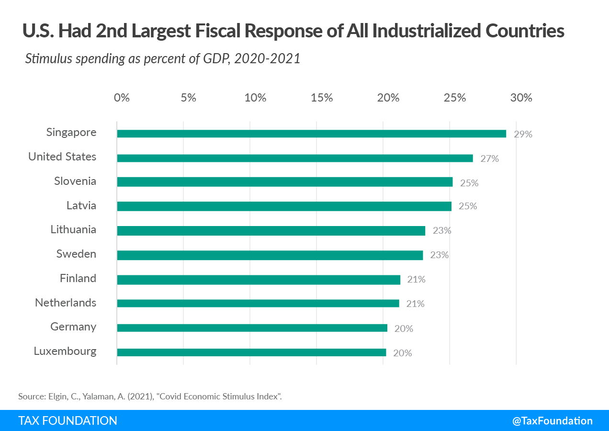

The COVID-19 pandemic initiated a cascade of economic complications globally, necessitating swift and innovative measures from governments and financial institutions. These measures were implemented to alleviate the immediate economic distress and set a foundation for recovery. The unprecedented scale of the economic disruption brought by lockdowns, travel restrictions, and shifts in consumer behavior required rapid responses to stabilize markets and sustain livelihoods. Key actions included emergency fiscal policies, monetary interventions, and economic stimulus packages designed to provide liquidity and support to businesses and individuals affected by the pandemic's economic impacts.

In response to these challenges, algorithmic trading has emerged as a crucial component in navigating the volatile financial markets. This trading methodology uses advanced mathematical models and computer programs to execute trades at speeds and frequencies that are impossible for human traders. The market conditions created by the pandemic—with increased volatility and rapid fluctuations—highlighted the advantages of algorithmic trading, which can quickly adapt to changing market dynamics. As a result, it has gained prominence as an effective tool for managing financial instability and seizing market opportunities.

This article explores the varied global strategies employed to deliver economic stimulus and relief during the pandemic and assesses the potential influence of algorithmic trading on future economic policies and recovery strategies. By examining how countries tailored their economic interventions to suit their unique challenges, we can understand the potential for algorithmic trading to inform policy decisions and shape economic recovery. Such an analysis is crucial for gaining insights into the intersection of economic stimulus policies and algorithmic trading, providing an understanding of their combined impact on the evolving global financial landscape.

## Table of Contents

## Global Economic Challenges During COVID-19

The COVID-19 pandemic precipitated a profound upheaval in global economies, as governments worldwide imposed lockdowns and restrictions to curb the spread of the virus. These measures, while necessary for public health, catalyzed a series of economic disruptions. The immediate consequence was a contraction in global economic activity, as businesses faced unprecedented challenges in adapting to the new normal. Key industries such as travel, hospitality, and retail were severely affected, with abrupt declines in demand and significant disruptions to supply chains.

The impact on the travel and hospitality sectors was particularly stark, as international and domestic travel ground to a halt. Airlines experienced massive revenue losses, leading to layoffs and furloughs. Hotels and restaurants faced closures, some permanently, due to the steep reduction in customer numbers. Retail businesses, especially those reliant on physical storefronts, struggled with decreased foot traffic and supply shortages, which underscored vulnerabilities in just-in-time inventory systems.

In response to these challenges, governments globally scrambled to implement economic measures designed to cushion the blow. These often took the form of fiscal stimulus packages aimed at maintaining consumer spending and preserving livelihoods. For example, direct payments to individuals, loans, and grants to businesses, and enhanced unemployment benefits were common strategies designed to staunch the economic bleeding.

The economic challenges were not uniform across all regions, as countries experienced varying degrees of impact based on their initial economic conditions and healthcare infrastructure. Advanced economies could leverage extensive monetary and fiscal tools, while emerging markets faced more significant constraints due to limited resources and higher debt levels. This disparity highlighted the importance of tailored policy responses that considered the specific economic and social contexts of different nations.

Ultimately, the pandemic underscored the necessity for timely and effective economic policy interventions. By addressing immediate needs while laying the groundwork for recovery, countries aimed to mitigate short-term hardships and set the stage for long-term stability. This context provides the backdrop for understanding the array of economic stimulus measures that were globally implemented as countermeasures during the crisis.

## Global Economic Stimulus and Relief Measures

During the COVID-19 pandemic, countries worldwide implemented various economic relief measures to support their economies. These measures were critical in mitigating the economic fallout from the disruptions caused by the virus. This section examines the strategies adopted by the United States, the European Union, China, and developing countries, as well as the pivotal role played by central banks.

The United States pursued a robust fiscal response, enacting several stimulus bills, such as the Coronavirus Aid, Relief, and Economic Security (CARES) Act. This included direct payments to individuals, expanded unemployment benefits, and assistance to businesses, aiming to provide immediate financial relief and stimulate consumer spending. Subsequent packages, including the American Rescue Plan, continued to support households and businesses through additional funding and extended unemployment insurance.

In contrast, the European Union launched large-scale recovery funds, notably the €750 billion Next Generation EU (NGEU) fund. This initiative focused on promoting investment and reform to drive a sustainable and resilient recovery across member states. The funding supported green and digital transitions, aiming for long-term structural improvements while addressing immediate economic needs.

China adopted a distinct approach, emphasizing investment-driven stimuli and easing monetary policies. The Chinese government increased spending on infrastructure projects and technological innovation to spur economic growth. Simultaneously, the People’s Bank of China implemented measures to lower reserve requirements and cut interest rates, ensuring [liquidity](/wiki/liquidity-risk-premium) in financial markets.

Developing countries, facing constrained fiscal capacities and heightened vulnerabilities, often sought financial assistance from international organizations such as the International Monetary Fund (IMF) and World Bank. These institutions provided emergency funding and debt relief to help countries cope with the economic shock, aiming to sustain essential health and social expenditures.

Central banks globally played a crucial role in stabilizing financial markets by lowering interest rates and initiating quantitative easing (QE) policies. These measures involved purchasing government securities and other financial assets to inject liquidity into the economy, prevent credit market freezes, and bolster confidence. For example, the Federal Reserve slashed interest rates to near-zero levels and expanded its balance sheet significantly through QE, helping to ease financial conditions and support economic recovery.

Evaluating these economic measures' scope and effectiveness provides valuable insights into their impact on the pandemic's economic trajectory. While fiscal stimuli helped buffer immediate economic contractions, long-term recovery depends on sustained policy efforts and structural reforms. Analyzing these responses highlights the importance of coordinated fiscal and monetary interventions in addressing unprecedented economic challenges.

## Algorithmic Trading in Pandemic-era Markets

Algorithmic trading gained significant traction during the COVID-19 pandemic, primarily due to its capacity to handle extreme market [volatility](/wiki/volatility-trading-strategies) with speed and accuracy. These sophisticated trading systems utilize complex algorithms to process vast datasets and execute trades at high speeds, surpassing human capabilities. This ability proved advantageous as markets experienced unprecedented fluctuations driven by economic uncertainties and rapid policy changes globally.

Advanced algorithms are designed to detect and capitalize on market inefficiencies in real-time, allowing traders to swiftly adapt their strategies to ongoing market conditions. During the pandemic, these algorithms demonstrated their potential by identifying patterns and opportunities that might otherwise remain unexploited due to the sheer [volume](/wiki/volume-trading-strategy) and velocity of data involved. For instance, [machine learning](/wiki/machine-learning) techniques in [algorithmic trading](/wiki/algorithmic-trading) enhanced the prediction of price movements through historical data analysis and real-time market sentiments.

The pandemic accelerated the adoption of technology across financial markets, leading to an increased volume of trades being executed through algorithmic systems. According to a report by the Bank for International Settlements, algorithmic trading accounted for a substantial portion of trading activities across various markets. This shift towards automated trading has underscored the importance of technological advancements in maintaining market liquidity and efficiency during turbulent times.

Algorithmic strategies during the pandemic also played a crucial role in risk management. By employing portfolio diversification techniques and continuously updating portfolio compositions based on real-time analytics, these systems effectively mitigated risks associated with market volatility. For example, algorithms that use Monte Carlo simulations or Value at Risk (VaR) models allowed traders to predict potential losses and adjust their portfolios accordingly, thereby enhancing their resilience against unexpected market shifts.

In conclusion, the rise of algorithmic trading during the pandemic has emphasized its importance in modern financial markets. As markets continue to evolve, the reliance on algorithmic strategies for managing risk and optimizing trading performance is expected to grow. This trend reflects an ongoing transformation in how trading is conducted, with algorithmic systems becoming integral to navigating the complexities and uncertainties inherent in global financial markets.

## The Intersection of Economic Policies and Algorithmic Trading

The COVID-19 pandemic prompted sweeping economic policies, particularly focused on liquidity provisions and market interventions, which reshaped trading environments. These policy measures included [interest rate](/wiki/interest-rate-trading-strategies) cuts, quantitative easing, and government-backed loan schemes, strategically implemented to stabilize and stimulate economies under severe stress. Algorithmic trading systems, known for their rapid execution and precision, adapted swiftly to these new conditions, optimizing their strategies to anticipate and respond to policy changes effectively.

As central banks and governments rolled out stimulus packages, algorithmic trading systems used complex models and machine learning techniques to analyze high volumes of data related to policy measures, market trends, and economic forecasts. These systems adjusted their trading strategies dynamically, taking into account factors such as interest rate fluctuations, inflation expectations, and fiscal stimulus data, thereby aligning investment portfolios with the anticipated macroeconomic shifts.

The interaction between economic policies and algorithmic trading illuminated the significance of real-time data analysis and strategic adaptability. For instance, algorithms could quickly interpret central bank announcements and adjust trading positions accordingly, capturing opportunities or hedging against risks in milliseconds. This adaptive capacity was crucial during a period marked by unprecedented market volatility and rapid economic changes.

Moving forward, understanding the interplay between algorithmic trading and economic policies could significantly enhance investment strategies and policy-making. Algorithms may evolve to incorporate broader datasets and more predictive analytics, potentially employing [artificial intelligence](/wiki/ai-artificial-intelligence) to simulate future economic scenarios and optimize asset allocations. Moreover, financial institutions might increasingly rely on algorithms to forecast the impacts of potential policy shifts and prepare accordingly, thereby shaping economic landscapes in a highly interconnected and data-driven financial world.

In summary, the pandemic underscored the pivotal role of algorithmic trading in managing financial instability and responding to economic policies. As such, it is likely to influence the development of new economic strategies and the emergence of innovative trading practices in the post-pandemic era.

## Concluding Thoughts on Pandemic-induced Economic Dynamics

The long-term impact of COVID-19 on global economies continues to shape financial landscapes significantly. The massive rollout of economic stimulus packages, tailored to counteract pandemic-induced disruptions, played a vital role. However, it remains crucial to continually evaluate their effectiveness. An enduring analysis of these measures will inform future policy directions, ensuring the prompt adaptation to changing economic and market conditions.

Algorithmic trading has become increasingly pivotal in stabilizing tumultuous markets. By leveraging advanced technologies, trading algorithms can swiftly react to market fluctuations and capitalize on transient opportunities. The growing reliance on algorithmic trading underscores its essential function in navigating economic uncertainties. The fast-paced, data-driven nature of algorithms offers a tangible advantage over traditional trading methods, particularly in volatile periods caused by events like the pandemic.

The COVID-19 crisis illuminated the urgent need for resilience and adaptability in global financial systems. This necessity is directly attributed to advancements in policy-making and technology. Policymakers worldwide are now tasked with integrating these technological innovations into their strategic planning processes. This integration not only helps absorb economic shocks but also guides the development of more robust and flexible financial frameworks.

Looking ahead, these developments could redefine economic strategies and reshape financial practices. The intersection of economic policies and algorithmic trading during the pandemic has set a precedent for future interactions between policy frameworks and technological advancements. The ability to anticipate and respond to global challenges will likely hinge on the symbiotic relationship between forward-thinking policies and cutting-edge trading technologies, ensuring a more resilient global economy in the face of unforeseen hurdles.

## References & Further Reading

[1]: Bergstra, J., Bardenet, R., Bengio, Y., & Kégl, B. (2011). ["Algorithms for Hyper-Parameter Optimization."](https://dl.acm.org/doi/10.5555/2986459.2986743) Advances in Neural Information Processing Systems 24.

[2]: ["Advances in Financial Machine Learning"](https://www.amazon.com/Advances-Financial-Machine-Learning-Marcos/dp/1119482089) by Marcos Lopez de Prado

[3]: ["Evidence-Based Technical Analysis: Applying the Scientific Method and Statistical Inference to Trading Signals"](https://www.amazon.com/Evidence-Based-Technical-Analysis-Scientific-Statistical/dp/0470008741) by David Aronson

[4]: ["Machine Learning for Algorithmic Trading"](https://github.com/stefan-jansen/machine-learning-for-trading) by Stefan Jansen

[5]: ["Quantitative Trading: How to Build Your Own Algorithmic Trading Business"](https://www.amazon.com/Quantitative-Trading-Build-Algorithmic-Business/dp/1119800064) by Ernest P. Chan