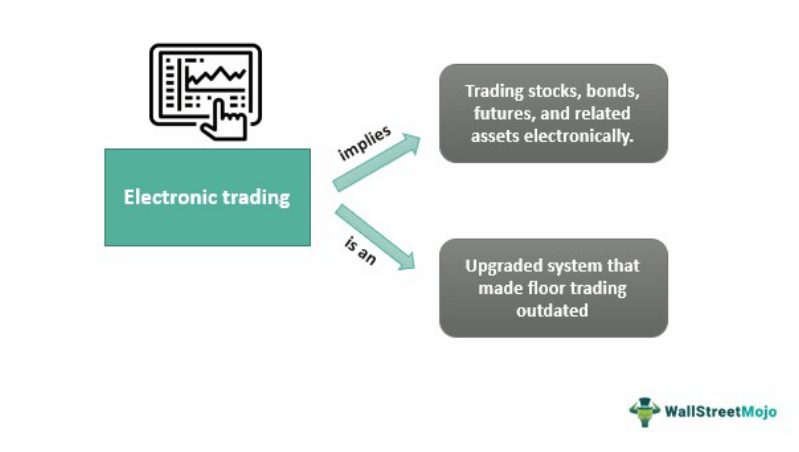

## Table of Contents

## What is a Global Electronic Trading Company?

A Global Electronic Trading Company is a business that buys and sells electronic products all over the world. These companies deal with items like smartphones, laptops, and other gadgets. They work with manufacturers, distributors, and retailers in different countries to make sure these products reach customers everywhere. They use the internet and other technology to handle their business, making it easier to trade across borders.

These companies often have offices or warehouses in many countries to help with shipping and customer service. They need to understand different languages and cultures to do business well. They also have to follow the rules and laws of each country they work in. This can be challenging, but it helps them reach more people and offer a wide range of products.

## How does a Global Electronic Trading Company operate?

A Global Electronic Trading Company operates by buying electronic products from manufacturers all over the world. They then sell these products to distributors or directly to customers in different countries. They use the internet and other technology to manage their business. This helps them keep track of their products and communicate with their partners and customers easily. They also have offices or warehouses in many countries to help with shipping and customer service.

These companies need to understand different languages and cultures to do business well. They also have to follow the rules and laws of each country they work in. This can be challenging, but it helps them reach more people and offer a wide range of products. By working with many different partners and using technology, they can make sure that customers around the world get the electronic products they need.

## What are the main products or services offered by a Global Electronic Trading Company?

A Global Electronic Trading Company mainly deals with electronic products like smartphones, laptops, tablets, and other gadgets. They buy these items from manufacturers all over the world and then sell them to distributors or directly to customers. This means they offer a wide range of products that people use every day for work, school, or fun.

In addition to selling products, these companies also provide services like shipping and customer support. They have warehouses and offices in many countries to make sure products can be delivered quickly and easily. They also help customers with any problems they have with their products, making sure they are happy with their purchases.

## What are the benefits of trading through a Global Electronic Trading Company?

Trading through a Global Electronic Trading Company has many benefits. One big benefit is that you can get a lot of different electronic products from all over the world. These companies work with many manufacturers, so they can offer a wide range of gadgets like smartphones, laptops, and tablets. This means you have more choices and can find exactly what you need.

Another benefit is that these companies make it easier to buy and sell products across different countries. They use the internet and other technology to handle their business, so you can order products from anywhere and have them shipped to your door. They also have offices and warehouses in many countries, which helps with quick and reliable shipping. Plus, they provide good customer service to help with any problems you might have with your products.

## How does a Global Electronic Trading Company ensure the security of transactions?

A Global Electronic Trading Company makes sure transactions are safe by using strong security systems. They use things like encryption to keep your information private when you buy something. They also have special security checks to make sure no one else can use your account without your permission. This way, you can feel safe when you shop with them.

These companies also follow the rules and laws about keeping transactions safe in each country they work in. They work with banks and other financial services to make sure payments are secure. They keep an eye on transactions all the time to spot anything strange or risky. By doing all these things, they help keep your money and personal information safe when you buy electronic products from them.

## What are the key markets that a Global Electronic Trading Company focuses on?

A Global Electronic Trading Company focuses on big markets like North America, Europe, and Asia. These places have a lot of people who want to buy electronic products like smartphones and laptops. These companies work hard to make sure they can sell their products in these big markets. They do this by understanding what people in these areas like and need.

They also look at smaller markets in places like Africa and Latin America. These areas are growing fast, and more people there are starting to buy electronic products. By selling to these smaller markets, the companies can reach more customers and help them get the gadgets they want. This way, they can grow their business and make more people happy with their products.

## What role does technology play in the operations of a Global Electronic Trading Company?

Technology is very important for a Global Electronic Trading Company. It helps them buy and sell electronic products all over the world. They use the internet to talk to manufacturers, distributors, and customers in different countries. This makes it easy to keep track of their products and make sure they get to the right place on time. They also use special computer programs to manage their business, like keeping track of what they have in their warehouses and how much they are selling.

Technology also helps keep transactions safe. These companies use encryption to protect customer information when they buy something. They also have systems to watch for anything strange or risky in their transactions. This way, they can make sure that people's money and personal information are safe. By using technology, these companies can reach more people and make their business run smoothly.

## How does a Global Electronic Trading Company handle international regulations and compliance?

A Global Electronic Trading Company has to follow the rules and laws of each country they work in. This can be hard because every country has different rules about selling electronic products. The company needs to learn these rules and make sure they do everything right. They often hire people who know about the laws in different countries to help them. This way, they can sell their products without any problems.

These companies also need to keep up with changes in the rules. Laws can change, and the company has to know about these changes quickly. They use special computer programs to help them stay updated. By following all the rules, they can keep selling their products all over the world and make sure their customers are happy.

## What are the challenges faced by a Global Electronic Trading Company in different regions?

A Global Electronic Trading Company faces many challenges when working in different regions. One big challenge is understanding and following the different rules and laws in each country. Every place has its own rules about selling electronic products, and the company needs to know these rules well. They have to make sure they follow all the laws to avoid problems. This can be hard because the rules can change, and the company needs to keep up with these changes quickly.

Another challenge is dealing with different languages and cultures. The company needs to talk to people in different countries, and this can be tough if they don't speak the same language. They also need to understand what people in each region like and need. This helps them sell the right products to the right people. It takes a lot of work to learn about different cultures and make sure everyone is happy with their products.

Lastly, there are challenges with shipping and logistics. Moving products from one country to another can be slow and expensive. The company needs to find good ways to get their products to customers quickly and safely. They also need to deal with things like customs and taxes, which can be complicated. By solving these challenges, the company can keep their customers happy and grow their business around the world.

## How does a Global Electronic Trading Company manage logistics and supply chain?

A Global Electronic Trading Company manages logistics and supply chain by working with many partners all over the world. They buy products from manufacturers and then need to get these products to distributors or customers. They use special computer programs to keep track of where their products are and when they need to be shipped. These programs help them plan the best way to move products from one place to another. They also work with shipping companies to make sure products are delivered quickly and safely. This can be hard because they need to deal with different countries and their rules about shipping and customs.

The company also needs to manage their warehouses well. They have warehouses in many countries to store their products before they are shipped out. They use technology to keep track of what is in each warehouse and make sure they have enough products to meet customer needs. They also need to plan for things like delays or problems with shipping. By working closely with their partners and using good technology, they can make sure their products get to customers on time. This helps them keep their customers happy and grow their business.

## What advanced strategies does a Global Electronic Trading Company use to optimize trading?

A Global Electronic Trading Company uses smart strategies to make their trading better. They use special computer programs to look at data and see what people are buying. This helps them know which products to sell more of and where to sell them. They also use the internet to talk to their partners and customers quickly. This helps them get products to people faster and makes their business run smoothly. They also work with other companies to share information and find new ways to sell their products.

Another way they optimize trading is by using technology to keep their prices good. They look at what other companies are charging and make sure their prices are fair. They also use special deals and discounts to get more customers. They plan their shipping carefully to make sure products get to people on time. By doing all these things, they can sell more products and make their customers happy.

## What future trends are likely to impact the operations of a Global Electronic Trading Company?

In the future, Global Electronic Trading Companies will be affected by new technology. One big trend is the use of [artificial intelligence](/wiki/ai-artificial-intelligence) (AI) and [machine learning](/wiki/machine-learning). These technologies can help companies understand what people want to buy and how to sell it to them better. They can also make it easier to manage warehouses and shipping. Another trend is the growth of online shopping. More people are buying things on the internet, so these companies need to make their online stores better and easier to use.

Another important trend is the focus on being green and sustainable. People are starting to care more about the environment, so companies need to find ways to sell their products without hurting the planet. This means using less packaging and finding ways to ship products that use less energy. Also, rules about selling electronic products might change, and companies need to be ready for that. By keeping up with these trends, Global Electronic Trading Companies can keep their customers happy and grow their business.

## References & Further Reading

[1]: Aldridge, I. (2009). ["High-Frequency Trading: A Practical Guide to Algorithmic Strategies and Trading Systems."](https://www.tradebit.com/usr/ledsin/pub/9003/_excerpt_High-frequencyTrading.pdf) Wiley.

[2]: Patterson, S. (2013). ["Dark Pools: High-Speed Traders, A.I. Bandits, and the Threat to the Global Financial System."](https://dl.acm.org/doi/10.5555/2385786) Crown Business.

[3]: Lewis, M. (2014). ["Flash Boys: A Wall Street Revolt."](https://en.wikipedia.org/wiki/Flash_Boys) W. W. Norton & Company.

[4]: ["Trading at the Speed of Light: How Ultrafast Algorithms Are Transforming Financial Markets"](https://www.amazon.com/Trading-Speed-Light-Algorithms-Transforming/dp/0691211388) by Donald MacKenzie

[5]: Hasbrouck, J., & Saar, G. (2013). ["Low-Latency Trading."](https://www.sciencedirect.com/science/article/abs/pii/S1386418113000165) Journal of Financial Markets, 16(4), 646-679.