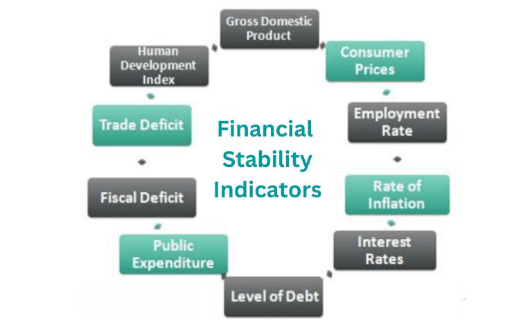

## Table of Contents

## What is the global financial services sector?

The global financial services sector includes banks, insurance companies, investment firms, and other businesses that help people and organizations manage their money. This sector is very important because it helps the world's economy to grow and stay stable. People use these services to save money, borrow money, invest, and protect themselves from financial risks.

This sector works all around the world, and it is affected by what happens in different countries. For example, if one country's economy is doing well, it can help other countries too. But if one country has financial problems, it can cause problems for other countries as well. Governments and international organizations try to make rules to keep the financial services sector safe and fair for everyone.

## What are the main types of financial services?

Financial services include many different kinds of help for people and businesses with their money. There are banks that keep your money safe and let you take it out when you need it. They also give loans, which means they let you borrow money that you have to pay back with interest. Another type is insurance, which protects you if something bad happens, like if your house burns down or you get sick. Insurance companies will help pay for the damage or the medical bills.

There are also investment services, where companies help you grow your money by putting it into things like stocks, bonds, or real estate. These investments can make more money over time, but they can also lose money, so they come with risks. Lastly, there are financial advisors and planners who give advice on how to manage your money better. They can help you make a plan to save for the future, like for retirement or for your kids' education.

All these services work together to help people and businesses manage their money, save for the future, and protect themselves from unexpected problems. They are important for keeping the economy running smoothly.

## How does the financial services sector impact the global economy?

The financial services sector plays a big role in the global economy. It helps money move around the world, which lets businesses grow and create jobs. When banks give loans, businesses can start new projects or expand. This can lead to more jobs and more things being made or sold. Also, when people invest their money in stocks or bonds, it helps companies get the money they need to keep running and growing. So, the financial services sector is like the engine that keeps the economy moving.

But, the financial services sector can also cause problems if it is not managed well. If banks or investment firms take too many risks, it can lead to a financial crisis. This happened in 2008 when many banks failed and it caused a big economic downturn around the world. When the financial services sector has problems, it can make it hard for people to get loans, and businesses might have to close. This can slow down the whole economy. That's why governments and international organizations make rules to try to keep the financial services sector safe and stable.

## What are the key trends affecting the financial services sector?

Technology is changing the financial services sector a lot. More people are using their phones and computers to do banking, investing, and paying for things. This is called digital banking. It's easier and faster, but it also means banks need to keep their systems safe from hackers. Another big change is using data and computers to make decisions. This is called [artificial intelligence](/wiki/ai-artificial-intelligence) (AI) and big data. Banks use these tools to understand their customers better and offer them services that fit their needs. Also, there are new types of money, like cryptocurrencies, that are changing how people think about and use money.

Another important trend is that more people want to invest in ways that are good for the environment and society. This is called sustainable or ethical investing. People want their money to help make the world better, not just make more money. Governments are also making new rules to protect people and make sure the financial services sector is fair and safe. These rules can change how banks and other financial companies do business. All these trends are making the financial services sector more complicated but also more interesting and important for the future.

## How has technology transformed financial services?

Technology has changed financial services a lot by making it easier for people to do banking and manage their money. Now, you can use your phone or computer to check your bank account, pay bills, or even get a loan without going to a bank. This is called digital banking. It saves time and makes things more convenient. But, because everything is online, banks need to make sure their systems are safe from hackers who might try to steal money or personal information. So, they use special security tools to protect customers.

Another big change is how banks use computers and data to make decisions. This is called artificial intelligence (AI) and big data. Banks use these tools to learn more about what their customers want and need. For example, they can suggest the best savings account or investment for someone based on their spending habits. Also, there are new types of money called cryptocurrencies, like Bitcoin, which people can use to buy things or invest. These new technologies are making the financial services sector more advanced and helpful, but they also bring new challenges that banks need to handle carefully.

## What are the major regulatory frameworks governing the financial services sector globally?

The financial services sector is governed by many rules to make sure it is safe and fair for everyone. One important set of rules is called Basel III. These rules were made by a group called the Basel Committee on Banking Supervision. They help banks have enough money to cover any losses and make sure they don't take too many risks. Another big set of rules is the Dodd-Frank Act in the United States. This law was made after the 2008 financial crisis to stop banks from doing things that could hurt the economy again. It makes banks be more careful with their money and protects people from risky financial products.

There are also international rules like the Financial Action Task Force (FATF) that work to stop money laundering and terrorist financing. The FATF makes guidelines that countries should follow to keep their financial systems clean. In Europe, the Markets in Financial Instruments Directive (MiFID II) is another important set of rules. It aims to protect investors and make financial markets more transparent. All these rules together help keep the financial services sector stable and trustworthy, so people can feel safe using banks and other financial services.

## How do geopolitical events influence the financial services sector?

Geopolitical events, like wars or changes in government, can have a big impact on the financial services sector. When something big happens in one country, it can make people worried about their money. They might start taking their money out of banks or stop investing. This can cause problems for banks and other financial companies. For example, if there is a war, people might think their money is not safe in that country's banks. They might move their money to banks in other countries, which can make the first country's economy weaker.

Also, when countries put sanctions on each other, it can affect how money moves around the world. Sanctions are like punishments where one country stops doing business with another country. This can make it hard for banks to work with each other and can slow down trade. For example, if a country is sanctioned, its banks might not be able to use the international banking system as easily. This can make it harder for that country's businesses to get loans or invest, which can hurt the economy. So, geopolitical events can create a lot of uncertainty and change how the financial services sector works.

## What are the challenges faced by emerging markets in the financial services sector?

Emerging markets face several challenges in their financial services sector. One big problem is that many people in these countries don't have bank accounts or access to financial services. This is called financial exclusion. It happens because there are not enough banks in rural areas, and many people don't have the right documents or enough money to start an account. This makes it hard for people to save money, get loans, or invest, which can slow down the country's economy.

Another challenge is that emerging markets often have less stable economies. This means their money can lose value quickly, and it can be hard for banks to get enough money to lend out. Also, rules and laws about finance might not be as strong or well-enforced as in richer countries. This can make it easier for banks to take big risks, which can lead to financial crises. Governments in emerging markets need to work hard to make their financial systems stronger and more inclusive, so everyone can benefit from them.

## How do financial services firms manage risks, and what are the common risk management strategies?

Financial services firms manage risks by using different strategies to keep their business safe and stable. One common way is through risk assessment, where they look at all the things that could go wrong and figure out how likely they are to happen. They use tools like stress tests to see how their business would handle a big problem, like an economic downturn. Another strategy is diversification, where firms spread their money across different types of investments or loans. This way, if one investment fails, it won't hurt the whole business. They also use hedging, which means they buy special financial products to protect against losses. For example, if a bank thinks interest rates might go up, it can buy a product that will help cover any losses from that happening.

Another important part of risk management is setting rules and limits on how much risk the firm can take. This is called risk appetite. Firms decide how much they are willing to lose and make sure they don't go over that limit. They also have strong internal controls and checks to make sure everyone follows the rules. Compliance is another big part, where firms make sure they follow all the laws and regulations that apply to them. This helps them avoid fines and other problems. By using these strategies, financial services firms can protect themselves and their customers from big financial losses.

## What role do fintech companies play in the evolution of the financial services sector?

Fintech companies are changing the financial services sector by using new technology to make things easier and faster for people. They create apps and online platforms that let you do banking, investing, and paying for things from your phone or computer. This is called digital banking. Fintech companies also use special computer programs, like artificial intelligence, to help people make better decisions about their money. For example, they can suggest the best way to save or invest based on what you usually do with your money. This makes financial services more personal and convenient.

But fintech companies also bring new challenges. Because everything is online, they need to make sure their systems are very safe from hackers who might try to steal money or personal information. Also, fintech companies can sometimes make it hard for traditional banks because they offer new and different services. This can make the financial services sector more competitive, which is good for customers but can be hard for banks. Governments are trying to make new rules to make sure fintech companies are safe and fair, so everyone can benefit from the new technology.

## How can financial services firms enhance their competitive advantage in a global market?

Financial services firms can enhance their competitive advantage in a global market by focusing on technology and innovation. By using new tools like artificial intelligence and big data, firms can understand their customers better and offer services that meet their needs more closely. For example, they can create apps that make banking easier and faster, or use AI to give personalized advice on saving and investing. This not only makes customers happier but also helps firms stand out from their competitors. Additionally, by adopting fintech solutions, firms can reach more people, especially in areas where traditional banking is hard to access, which can help them grow their business globally.

Another way to gain a competitive edge is through strong risk management and compliance. By carefully managing risks, firms can avoid big losses and keep their customers' trust. This means using strategies like diversification and hedging to protect against financial downturns. Also, by following all the rules and regulations in different countries, firms can operate smoothly and avoid fines or other problems. This is important because the global market has many different rules, and being good at compliance can help firms enter new markets more easily. By focusing on these areas, financial services firms can become stronger and more successful in the global market.

## What are the future predictions for the global financial services sector in terms of growth and innovation?

The global financial services sector is expected to keep growing in the future. More and more people will use digital banking, where they can do everything from their phones or computers. This will make banking easier and faster. Also, more people will start using cryptocurrencies like Bitcoin, which could change how we think about money. Countries with growing economies, called emerging markets, will see a lot of this growth. As more people in these countries get bank accounts and start investing, the financial services sector will get bigger.

Innovation will also play a big role in the future of the financial services sector. Companies will use new technology like artificial intelligence to help people make better choices about their money. For example, AI can suggest the best way to save or invest based on what someone usually does with their money. Also, there will be more focus on sustainable and ethical investing, where people want their money to help the environment and society. Governments will make new rules to keep up with these changes and make sure the financial services sector stays safe and fair for everyone.

## References & Further Reading

[1]: Chan, E. P. (2013). ["Algorithmic Trading: Winning Strategies and Their Rationale,"](https://github.com/ftvision/quant_trading_echan_book) John Wiley & Sons.

[2]: "Cloud and On-premise Trading Solutions," Financial Solutions White Paper, TechInsights, 2022.

[3]: European Commission. (2021). ["Regulatory Approaches to Algorithmic Trading: Study on the Adequacy and Effectiveness of Risk Management Practices."](https://commission.europa.eu/funding-tenders/find-funding/eu-funding-programmes_en)

[4]: Lopez de Prado, M. (2018). ["Advances in Financial Machine Learning,"](https://www.amazon.com/Advances-Financial-Machine-Learning-Marcos/dp/1119482089) John Wiley & Sons.

[5]: Jansen, S. (2018). ["Machine Learning for Algorithmic Trading."](https://www.amazon.com/Hands-Machine-Learning-Algorithmic-Trading/dp/178934641X) 

[6]: Aronson, D. R. (2007). ["Evidence-Based Technical Analysis: Applying the Scientific Method and Statistical Inference to Trading Signals,"](https://onlinelibrary.wiley.com/doi/book/10.1002/9781118268315) Wiley.

[7]: Chan, E. P. (2009). ["Quantitative Trading: How to Build Your Own Algorithmic Trading Business,"](https://github.com/ftvision/quant_trading_echan_book) John Wiley & Sons.