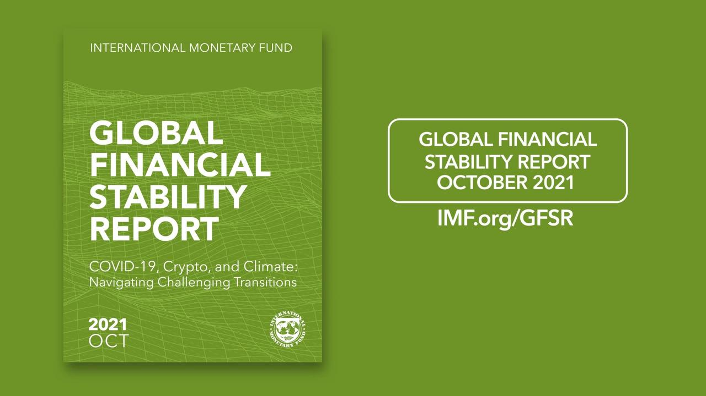

## Table of Contents

## What is the Global Financial Stability Report (GFSR)?

The Global Financial Stability Report (GFSR) is a report published by the International Monetary Fund (IMF) twice a year. It looks at the health of the global financial system and tries to spot any risks that could cause problems. The report gives advice to countries and financial institutions on how to keep the financial system stable and strong.

The GFSR covers a wide range of topics, including how well banks and other financial institutions are doing, the risks from high levels of debt, and how changes in financial markets might affect the world economy. It also talks about new risks, like those from technology and climate change. By providing this information, the GFSR helps policymakers and financial experts make better decisions to protect the global economy.

## Who publishes the Global Financial Stability Report?

The International Monetary Fund (IMF) publishes the Global Financial Stability Report (GFSR). The IMF is an organization that helps countries work together on money matters and makes sure the world's economy stays stable.

The GFSR comes out twice a year. It looks at the health of the world's financial systems and points out any dangers that could cause trouble. The report helps leaders and money experts make smart choices to keep the global economy safe.

## How often is the Global Financial Stability Report released?

The Global Financial Stability Report (GFSR) is released twice a year. This means you can expect a new report every six months.

The report is put out by the International Monetary Fund (IMF). It helps people understand how healthy the world's money systems are and warns about any dangers that might cause problems.

## What is the primary purpose of the GFSR?

The main goal of the Global Financial Stability Report (GFSR) is to look at the health of the world's money systems and find any risks that could cause trouble. It helps people understand what's going on with banks, how much debt there is, and how changes in the money markets might affect the world's economy. The report is made by the International Monetary Fund (IMF) to help everyone see what's happening in the financial world.

The GFSR also gives advice to countries and money experts on how to keep the financial system strong and stable. It talks about new risks, like those from technology and climate change. By sharing this information, the report helps leaders and money experts make better choices to protect the global economy.

## What kind of information does the GFSR typically include?

The Global Financial Stability Report (GFSR) typically includes information about how well banks and other financial institutions are doing around the world. It looks at things like how much money banks have and if they are making good or bad loans. The report also talks about how much debt countries and companies have, and if that debt is too high, it might cause problems. It looks at how money markets are changing and how those changes could affect the world's economy.

The GFSR also points out new risks that could cause trouble. For example, it might talk about risks from new technology or from climate change. It gives advice on how countries and financial institutions can keep the money system stable and strong. By sharing all this information, the report helps leaders and money experts make better choices to protect the global economy.

## How does the GFSR assess global financial stability?

The Global Financial Stability Report (GFSR) assesses global financial stability by looking at how well banks and other financial institutions are doing around the world. It checks if banks have enough money and if they are making good loans. The report also looks at how much debt countries and companies have. If the debt is too high, it could cause problems. The GFSR also studies how money markets are changing and how those changes might affect the world's economy. By looking at all these things, the report can tell if the global financial system is healthy or if there are risks that could cause trouble.

The GFSR also talks about new risks that might affect financial stability. For example, it might discuss risks from new technology or from climate change. The report gives advice on how countries and financial institutions can keep the money system strong and stable. By sharing all this information, the GFSR helps leaders and money experts make better choices to protect the global economy. This way, everyone can work together to make sure the world's money system stays safe and sound.

## What are the key indicators used in the GFSR to measure financial stability?

The Global Financial Stability Report (GFSR) uses several key indicators to measure financial stability. One important indicator is how well banks and other financial institutions are doing. The report looks at things like the amount of money banks have and the quality of the loans they make. If banks have enough money and their loans are good, it's a sign that the financial system is stable. Another indicator is the level of debt that countries and companies have. If debt is too high, it could cause problems and make the financial system less stable.

The GFSR also looks at how money markets are changing and how those changes might affect the world's economy. This includes watching things like interest rates and how much people are investing in different kinds of assets. If money markets are stable and growing in a healthy way, it's a good sign for financial stability. The report also considers new risks, like those from technology or climate change, because these can affect the stability of the financial system too. By looking at all these indicators, the GFSR can give a good picture of how stable the global financial system is.

## How does the GFSR influence global financial policies and regulations?

The Global Financial Stability Report (GFSR) influences global financial policies and regulations by giving important information about the health of the world's money systems. When leaders and money experts read the GFSR, they see where the risks are and what could cause trouble. This helps them make better rules and laws to keep the financial system safe. For example, if the report says that banks are not doing well, countries might make new rules to make sure banks have more money to handle problems.

The GFSR also talks about new risks, like those from technology or climate change. When the report points out these risks, it can lead to new policies to deal with them. For instance, if the report warns about the dangers of climate change on the financial system, countries might create new rules to make sure banks and other institutions are ready for these changes. By sharing all this information, the GFSR helps everyone work together to make the world's money system stronger and more stable.

## Can you explain the methodology used in the GFSR for data analysis?

The Global Financial Stability Report (GFSR) uses a special way to look at information about the world's money systems. They gather a lot of numbers from banks, countries, and markets all over the world. Then, they use these numbers to see if the financial system is healthy or if there are problems. They check things like how much money banks have, the quality of the loans they give out, and how much debt countries and companies have. They also look at how money markets are changing and if those changes might cause trouble.

To make sense of all this information, the GFSR uses different tools and methods. They might use math to see how different parts of the financial system are connected. They also look at past events to understand what might happen in the future. By putting all these pieces together, they can see the big picture of global financial stability. This helps them give good advice on how to keep the money system strong and safe.

## How does the GFSR address emerging risks and vulnerabilities in the financial system?

The Global Financial Stability Report (GFSR) keeps an eye on new risks and problems in the world's money systems. It looks at things like new technology or climate change that could cause trouble. The report uses numbers and information from all over the world to see where these new risks are coming from. By doing this, the GFSR can warn everyone about these dangers before they become big problems.

When the GFSR finds new risks, it gives advice on how to deal with them. For example, if the report sees that climate change could hurt banks, it might suggest new rules to make sure banks are ready for these changes. By sharing this information, the GFSR helps leaders and money experts make better choices to keep the money system strong and safe. This way, everyone can work together to handle new risks and keep the world's money system stable.

## What role does the GFSR play in international economic surveillance?

The Global Financial Stability Report (GFSR) is a big part of watching over the world's money systems. It's made by the International Monetary Fund (IMF) and comes out twice a year. The GFSR looks at how banks and other money places are doing all over the world. It checks if they have enough money and if they're making good loans. The report also looks at how much debt countries and companies have. If there's too much debt, it could cause problems. By looking at all this, the GFSR helps everyone see if the money system is healthy or if there are risks that could cause trouble.

The GFSR also talks about new risks that might affect the money system. For example, it might warn about dangers from new technology or from climate change. When the report points out these risks, it helps leaders and money experts make better rules and laws to keep the money system safe. By sharing all this information, the GFSR helps everyone work together to make sure the world's money system stays strong and stable. This way, countries can make smart choices to protect their economies and the world's money system.

## How can financial analysts and policymakers utilize the insights from the GFSR to make informed decisions?

Financial analysts and policymakers can use the insights from the Global Financial Stability Report (GFSR) to make smart choices about the world's money systems. The GFSR gives a lot of information about how banks and other money places are doing. It tells them if banks have enough money and if they're making good loans. It also talks about how much debt countries and companies have. If the debt is too high, it could cause problems. By looking at all this, financial analysts and policymakers can see where the risks are and what they need to do to keep the money system strong and safe.

The GFSR also helps by pointing out new risks that might affect the money system. For example, it might warn about dangers from new technology or from climate change. When financial analysts and policymakers read about these risks in the GFSR, they can make new rules and laws to deal with them. This helps them get ready for problems before they happen. By using the information from the GFSR, financial analysts and policymakers can work together to make the world's money system more stable and protect their economies.

## References & Further Reading

[1]: IMF. (2023). [Global Financial Stability Report](https://www.imf.org/en/Publications/GFSR/Issues/2023/04/11/global-financial-stability-report-april-2023). International Monetary Fund.

[2]: Hirshleifer, D., & Teoh, S. H. (2003). ["Limited Investor Attention and Stock Market Misreactions to Accounting Information."](https://www.sciencedirect.com/science/article/pii/S0165410103000648) The Review of Financial Studies, 15(4), 931-964.

[3]: Biais, B., Foucault, T., & Moinas, S. (2015). ["Equilibrium High-Frequency Trading."](https://www.sciencedirect.com/science/article/abs/pii/S0304405X15000288) The Review of Financial Studies, 28(5), 1273-1293.

[4]: Aldridge, I. (2013). ["High-Frequency Trading: A Practical Guide to Algorithmic Strategies and Trading Systems."](https://www.amazon.com/High-Frequency-Trading-Practical-Algorithmic-Strategies/dp/1118343506) John Wiley & Sons.

[5]: Cartea, Á., Jaimungal, S., & Penalva, J. (2015). ["Algorithmic and High-Frequency Trading."](https://assets.cambridge.org/97811070/91146/frontmatter/9781107091146_frontmatter.pdf) Cambridge University Press.

[6]: Menkveld, A. J. (2013). ["High Frequency Trading and the New Market Makers."](https://papers.ssrn.com/sol3/papers.cfm?abstract_id=1722924) The Review of Financial Studies, 27(4), 1041-1074.