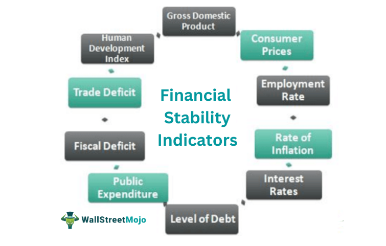

The International Monetary Fund (IMF), a critical institution aimed at fostering global monetary cooperation, releases the Global Financial Stability Report (GFSR) twice a year, specifically in April and October. This report serves as an essential tool in assessing the stability of global financial markets. Central to its objectives is the examination of emerging-market financing conditions, which are crucial for understanding the global economic landscape.

In addition to evaluating current market conditions, the GFSR places significant emphasis on identifying financial and structural imbalances that could potentially endanger global financial stability. These assessments are instrumental in guiding policymakers and regulators in making informed decisions to preempt and mitigate financial crises.



A notable trend highlighted in recent discussions is the increasing influence of algorithmic trading within financial markets. This form of trading, relying on complex algorithms and massive data sets, has transformed market dynamics by enhancing transaction speed and efficiency. However, its expanding role necessitates a deeper understanding of its potential impacts on global stability.

In this article, we aim to explore the key themes of the latest GFSR, with a particular focus on the emergence and implications of algorithmic trading. Through this analysis, we seek to underscore the interconnectedness of modern financial practices and their collective influence on market stability worldwide.

## Table of Contents

## Understanding the Global Financial Stability Report

The Global Financial Stability Report (GFSR), published biannually by the International Monetary Fund (IMF), provides an extensive evaluation of systemic risks affecting global markets. Its primary focus revolves around debt management and the status of emerging market conditions. The GFSR aims to offer a comprehensive assessment of the current financial landscape, aiming to identify potential crises and deliver strategic insights for proactive mitigation.

The report meticulously outlines recommendations targeted at policymakers and financial regulators to address identified risks. These guidelines are crafted to strengthen the resilience of financial systems by promoting informed decision-making and prudent policy interventions. The recommendations often emphasize the need for countries to implement robust financial regulations and consistent monitoring mechanisms.

In recent editions, the GFSR has highlighted critical areas of concern, such as housing markets and the escalation of both public and private debt levels. The housing sector, in particular, is scrutinized for its susceptibility to price bubbles and potential overvaluation, which could precipitate broader economic instability. Additionally, the growing burdens of debt—whether in the public domain or private sectors—pose significant challenges, potentially limiting governments' fiscal space and affecting economic outcomes if not managed effectively.

Furthermore, vulnerabilities within the financial sector itself have been underscored as a pressing issue. These vulnerabilities may manifest as weaknesses in financial institutions, inadequate capital buffers, or insufficient regulatory frameworks to manage emerging risks. The GFSR's evaluation serves as a critical resource for understanding these risks and advocating for necessary reforms aimed at enhancing financial sector robustness.

Overall, the GFSR functions as a key instrument for advancing global financial stability by illuminating systemic risks and paving the way for remediation through sound policy advice.

## Key Highlights from the Latest GFSR

The Global Financial Stability Report (GFSR) outlines several key concerns affecting the stability of international financial markets amid ongoing economic and geopolitical uncertainties. Of particular note, the report emphasizes the elevated risks stemming from the current disconnect between unstable economic conditions and persistently low financial market [volatility](/wiki/volatility-trading-strategies). This gap suggests that financial markets may not be fully pricing in the existing economic risks, which could lead to abrupt adjustments and potential market disruptions should unforeseen events occur.

A significant portion of the report's scrutiny is directed towards the worrying levels of both private and public debt. Persistent high debt levels pose considerable risks to economic stability, as they can amplify the impact of economic downturns through increased borrowing costs and reduced fiscal space for counter-cyclical measures. Moreover, the GFSR highlights financial vulnerabilities in emerging markets, where external conditions such as fluctuating exchange rates and capital flow volatility can exacerbate these issues.

In addressing these challenges, the GFSR underscores the critical need for timely policy interventions. Strategic policy actions are deemed essential to mitigate risks effectively and prevent the escalation of financial instability. This includes employing macroprudential measures to curb excessive debt accumulation and deploying fiscal policies that strengthen economic resilience. By doing so, policymakers can better navigate the uncertainties plaguing global financial markets and enhance overall financial system stability.

## The Role of Algorithmic Trading in Global Markets

Algorithmic trading has fundamentally altered the landscape of global financial markets by vastly improving the speed and efficiency of transactions. At its core, [algorithmic trading](/wiki/algorithmic-trading) involves deploying sophisticated algorithms and leveraging expansive datasets to conduct trades that capitalize on market inefficiencies. These algorithms are designed to identify optimal pricing scenarios, execute trades in milliseconds, and manage large volumes of transactions without human intervention.

The integration of algorithmic trading into mainstream financial practices has been driven by several key factors. Firstly, the reliance on data analytics and computational power allows market participants to gain insights and respond to market movements faster than ever before. This capability is crucial in markets where asset prices can fluctuate significantly based on news events and other triggers.

Moreover, algorithmic trading platforms utilize various strategies, such as statistical [arbitrage](/wiki/arbitrage), [market making](/wiki/market-making), and [trend following](/wiki/trend-following). Statistical arbitrage, for example, involves exploiting price differences between correlated assets, while market making provides [liquidity](/wiki/liquidity-risk-premium) by offering simultaneous buy and sell quotes. Here is a simple example of how a basic [statistical arbitrage](/wiki/statistical-arbitrage) algorithm might be implemented in Python:

```python
import numpy as np

def calculate_spread(asset1_prices, asset2_prices):
    return np.array(asset1_prices) - np.array(asset2_prices)

def generate_trading_signal(spread, threshold=1.0):
    # Simple signal: buy when the spread is below threshold, sell when above
    signals = np.where(spread < -threshold, 1, 0)  # buy signal
    signals = np.where(spread > threshold, -1, signals)  # sell signal
    return signals

# Example prices
asset1 = [100, 102, 101, 103, 107]
asset2 = [98, 101, 100, 102, 108]

spread = calculate_spread(asset1, asset2)
signals = generate_trading_signal(spread)

print("Spread:", spread)
print("Trading Signals:", signals)
```

This code snippet demonstrates a simplistic approach where a trading signal is generated based on the spread between two correlated assets. Such algorithmic approaches, albeit more complex in real-world applications, exhibit the principles at work in high-frequency trading environments.

As algorithmic trading becomes increasingly prevalent, it highlights the greater dependency of financial markets on technological infrastructure. This embedding into financial systems provides liquidity, reduces transaction costs, and enhances price discovery. However, it also raises concerns about market robustness, especially in terms of unintended volatility spikes and the resilience of trading systems under extreme conditions.

In conclusion, the shift towards algorithmic trading represents a transformative advancement for global financial markets. It underscores the need for continued innovation and adaptation within trading strategies to ensure market efficiency and stability, juxtaposed against the inherent risks introduced by the rapid automation and interconnectedness of market operations.

## Implications of Algorithmic Trading on Financial Stability

Algorithmic trading has introduced both efficiencies and complexities into financial markets. While it has streamlined trading by increasing speed and precision, it has also amplified market volatility, particularly during financial distress. One of the notable risks arising from algorithmic trading is the occurrence of 'flash crashes.' These events are characterized by sudden, extreme sell-offs in the market occurring within minutes. While markets often recover quickly from such disruptions, the immediate impact can be significant, affecting liquidity and investor confidence.

Flash crashes are primarily driven by automatic trading systems executing trades at high frequencies without human intervention. In some cases, the cascading effect of such trades triggers stop-loss orders and margin calls, further exacerbating the market decline. The interconnectedness of global markets means that disturbances in one market can propagate rapidly across others, increasing systemic risk.

The rise of [artificial intelligence](/wiki/ai-artificial-intelligence) (AI) in algorithmic trading has added another layer of complexity. AI systems employ [machine learning](/wiki/machine-learning) algorithms to analyze vast datasets and identify trading opportunities. While these systems can uncover non-obvious patterns and make high-speed decisions, they also create challenges for regulatory bodies tasked with monitoring market activity. Unlike traditional algorithmic systems, AI-driven trading programs adapt and evolve based on new data, making it difficult to predict their behavior in unprecedented market conditions.

Effective regulation of algorithmic trading, particularly with AI, necessitates the development of robust frameworks that ensure market stability. Regulators face the challenge of maintaining a balance between fostering financial innovation and preventing systemic risks. Enhanced transparency in trade execution algorithms, rigorous stress testing of trading systems, and improved cross-border cooperation among regulators are crucial in managing the risks associated with algorithmic trading.

## Policy Recommendations from the GFSR

The Global Financial Stability Report (GFSR) frequently emphasizes the necessity of robust regulatory frameworks to address the complexities introduced by algorithmic trading. The primary recommendation is for the implementation of enhanced regulatory systems to effectively govern algorithmic trading activities. These frameworks would account for the advanced techniques and speed at which these trading systems operate, ensuring market integrity and mitigating systemic risks.

Coordination among global financial regulators is another critical recommendation from the GFSR. As financial markets are increasingly interconnected, risks can quickly propagate across borders, making global cooperation essential. The GFSR suggests that regulators work together to create a cohesive strategy for overseeing algorithmic trading. This collaboration could involve sharing information about algorithmic trading activities and coordinating policy responses to mitigate cross-border financial risks effectively.

Moreover, the report underscores the importance of transparency in trading processes. Increasing transparency can help regulators and market participants understand the mechanics behind algorithmic trades, allowing for more informed decision-making. This transparency is crucial in detecting and preventing market manipulations or anomalies that could lead to wider financial instability.

Finally, the GFSR calls for better risk management strategies within financial institutions. By incorporating robust risk assessment models and stress testing procedures, institutions can more effectively anticipate and respond to potential adverse market conditions induced by algorithmic trading. These strategies should be designed to assess both the individual risks posed by trading algorithms and their cumulative impact on the broader financial system. Such comprehensive risk management is vital to maintaining stability in increasingly automated markets.

## Conclusion

The Global Financial Stability Report (GFSR) is instrumental in identifying and addressing vulnerabilities within global financial systems. It fulfills a critical function by not only spotlighting potential threats but also proposing corrective actions. Algorithmic trading, while significantly improving market efficiency through rapid execution and exploitation of market inefficiencies, introduces complex challenges that could affect financial stability. As this method of trading becomes entwined with mainstream financial operations, the inherent risks, such as elevated market volatility and systemic risks during periods of financial stress, become more pronounced.

In response, policymakers and financial institutions must promptly adjust to these evolving market dynamics. A proactive approach is required, emphasizing the necessity for prudent regulatory oversight and the establishment of robust frameworks to manage the risks associated with algorithmic trading. This involves enhancing transparency, improving risk management strategies, and ensuring effective coordination among global regulators to manage cross-border financial risks efficiently.

The future stability of global financial systems depends significantly on achieving a balance between fostering trading innovation and implementing rigorous regulatory measures. Such a balance will be crucial to maintaining the integrity and stability of financial markets and ensuring they can withstand unforeseen shocks and stresses.

## References & Further Reading

[1]: IMF. (2023). [Global Financial Stability Report](https://www.imf.org/en/Publications/GFSR/Issues/2023/04/11/global-financial-stability-report-april-2023). International Monetary Fund.

[2]: Hirshleifer, D., & Teoh, S. H. (2003). ["Limited Investor Attention and Stock Market Misreactions to Accounting Information."](https://www.sciencedirect.com/science/article/pii/S0165410103000648) The Review of Financial Studies, 15(4), 931-964.

[3]: Biais, B., Foucault, T., & Moinas, S. (2015). ["Equilibrium High-Frequency Trading."](https://www.sciencedirect.com/science/article/abs/pii/S0304405X15000288) The Review of Financial Studies, 28(5), 1273-1293.

[4]: Aldridge, I. (2013). ["High-Frequency Trading: A Practical Guide to Algorithmic Strategies and Trading Systems."](https://www.amazon.com/High-Frequency-Trading-Practical-Algorithmic-Strategies/dp/1118343506) John Wiley & Sons.

[5]: Cartea, Á., Jaimungal, S., & Penalva, J. (2015). ["Algorithmic and High-Frequency Trading."](https://assets.cambridge.org/97811070/91146/frontmatter/9781107091146_frontmatter.pdf) Cambridge University Press.

[6]: Menkveld, A. J. (2013). ["High Frequency Trading and the New Market Makers."](https://papers.ssrn.com/sol3/papers.cfm?abstract_id=1722924) The Review of Financial Studies, 27(4), 1041-1074.