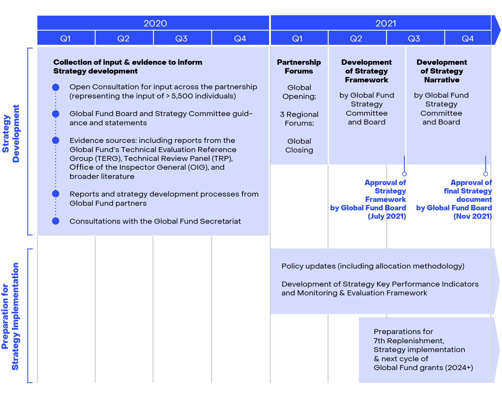

## Table of Contents

## What is the Global Fund?

The Global Fund is an organization that helps fight diseases like AIDS, tuberculosis, and malaria around the world. It was started in 2002 and works by collecting money from different countries, companies, and people. This money is then used to support programs in countries where these diseases are a big problem. The goal is to make sure everyone can get the medicine and care they need, no matter where they live.

The Global Fund works with local groups, governments, and other organizations to make sure the money is used in the best way possible. They focus on helping the most vulnerable people and making sure the programs are run well. By working together, they have been able to save millions of lives and help many people get the treatment they need.

## What are the main objectives of the Global Fund?

The Global Fund's main goal is to stop AIDS, tuberculosis, and malaria from spreading and to help people who have these diseases. They do this by giving money to programs in countries where these diseases are a big problem. The money helps buy medicine, train health workers, and make sure people can get the care they need.

Another important goal is to focus on helping the most vulnerable people. This means they try to reach those who are often left out, like people living in poor areas or those who don't have easy access to healthcare. By working with local groups and governments, the Global Fund makes sure that the money is used in the best way to help as many people as possible.

Overall, the Global Fund wants to save lives and make sure everyone can get the treatment they need, no matter where they live. They believe that by working together and using money wisely, they can make a big difference in fighting these diseases around the world.

## How is the Global Fund structured?

The Global Fund is run by a group of people from different countries, organizations, and communities. This group is called the Board, and they make the big decisions about how to use the money and where to help. The Board has members from governments, groups that fight AIDS, TB, and malaria, private companies, and people who have these diseases or work in health. They meet a few times a year to talk about what's working and what needs to change.

The Global Fund also has a Secretariat, which is like the office that does the day-to-day work. The Secretariat is based in Geneva, Switzerland, and they handle things like sending money to programs, checking how the programs are doing, and making sure everything follows the rules. They work closely with the countries and groups that get the money to make sure it's used well and that it's helping people.

There are also groups called Country Coordinating Mechanisms (CCMs) in each country where the Global Fund works. These groups include people from the government, health workers, and community members. They decide which programs should get the money and make sure these programs are doing what they're supposed to do. This helps make sure the money is used in the best way for the people in that country.

## Who are the key partners and stakeholders of the Global Fund?

The Global Fund works with many different groups to fight AIDS, TB, and malaria. These partners include governments from countries where the diseases are a big problem, as well as countries that give money to help. They also work with groups that focus on health, like the World Health Organization and UNAIDS. Private companies and foundations, like the Bill & Melinda Gates Foundation, also help by giving money and sharing their knowledge.

Another important group of partners are the communities affected by these diseases. This includes people living with AIDS, TB, or malaria, and the organizations that support them. They help make sure the money is used in ways that really help people. The Global Fund also works with other groups that give money for health, like PEPFAR and the President's Malaria Initiative, to make sure their efforts work well together.

All these partners and stakeholders play a key role in making sure the Global Fund can do its job well. By working together, they help make sure that money is used wisely and that it reaches the people who need it the most. This teamwork is what makes the Global Fund successful in fighting these diseases around the world.

## How does the Global Fund raise and allocate its funds?

The Global Fund raises money by asking for donations from different places. This includes governments from rich countries, private companies, and foundations like the Bill & Melinda Gates Foundation. They also get money from people who want to help fight AIDS, TB, and malaria. Every few years, the Global Fund holds a big meeting called a replenishment conference where they ask for new pledges of money. This helps them plan how much they can spend on programs in the coming years.

Once the Global Fund has the money, they give it to programs in countries where AIDS, TB, and malaria are big problems. They do this through a group in each country called the Country Coordinating Mechanism (CCM). The CCM decides which programs should get the money and makes sure these programs are doing what they're supposed to do. The Global Fund checks to make sure the money is being used well and that it's helping people. They also work with other groups to make sure the money is used in the best way possible.

## What are the primary areas of investment for the Global Fund?

The Global Fund mainly spends its money on fighting AIDS, tuberculosis, and malaria. They use the money to buy medicine and supplies that people need to get better. They also pay for things like testing kits and mosquito nets, which help stop these diseases from spreading. The Global Fund also helps train health workers so they can take care of people with these diseases and teach others how to stay healthy.

Another big area where the Global Fund spends money is on making health systems stronger. This means they help build clinics and labs where people can get care. They also work on making sure there are enough health workers and that they have the tools they need. By doing this, the Global Fund helps make sure that even people in poor or hard-to-reach areas can get the help they need.

## How does the Global Fund ensure transparency and accountability in its operations?

The Global Fund works hard to make sure everyone can see how they use their money and that they are doing things the right way. They do this by sharing lots of information about where the money comes from and where it goes. They have a website where anyone can look at reports and see how much money is being spent on different programs. They also have a group called the Office of the Inspector General that checks to make sure the money is being used correctly. If they find any problems, they work to fix them and make things better.

Another way the Global Fund makes sure they are doing things right is by working closely with the countries and groups that get the money. They have rules that everyone has to follow, and they check to make sure these rules are being followed. They also ask people in the communities to help watch over the programs and make sure the money is helping people. By doing all these things, the Global Fund tries to make sure they are being fair and honest in everything they do.

## What are some of the major achievements of the Global Fund?

The Global Fund has made a big difference in fighting AIDS, TB, and malaria. They have helped save millions of lives by giving money to programs that buy medicine, train health workers, and make sure people can get the care they need. Because of the Global Fund, many more people are getting tested and treated for these diseases. They have also helped stop these diseases from spreading by giving out things like mosquito nets and teaching people how to stay healthy.

Another big achievement of the Global Fund is making health systems stronger. They have helped build clinics and labs in places where it's hard to get healthcare. This means more people can get the help they need, even if they live in poor or hard-to-reach areas. The Global Fund has also worked to make sure there are enough health workers and that they have the tools they need to do their jobs well. By doing all these things, the Global Fund has made a real difference in the lives of many people around the world.

## How does the Global Fund measure the impact of its investments?

The Global Fund keeps track of how well their money is helping by looking at different things. They see how many people are getting tested and treated for AIDS, TB, and malaria. They also check if fewer people are getting sick with these diseases. The Global Fund uses numbers and reports to see if the programs they are helping are working. They ask the countries and groups they work with to give them information about how many people they are helping and what is happening with the diseases.

To make sure they are doing a good job, the Global Fund also talks to people in the communities. They ask people who have these diseases or who work in health if the programs are helping. This helps them understand if the money is making a difference in people's lives. By looking at all this information, the Global Fund can see if they need to change anything to help more people. They use this information to make their programs better and to make sure they are using the money in the best way possible.

## What challenges does the Global Fund face in achieving its goals?

The Global Fund faces many challenges in its work to fight AIDS, TB, and malaria. One big problem is getting enough money. Even though many countries and groups give money, it's hard to raise enough to help everyone who needs it. The Global Fund has to decide how to use the money they have in the best way possible. They also have to make sure the money goes to the places where it can help the most people. This can be tricky because different countries have different needs.

Another challenge is making sure the programs they help are working well. The Global Fund has to check that the money is being used correctly and that it's really helping people. They need to work with local groups and governments to make sure everything is done right. Sometimes, there are problems like not enough health workers or not enough medicine. The Global Fund has to find ways to solve these problems so they can keep helping people. It's a big job, but they keep trying to make things better.

## How does the Global Fund collaborate with local governments and NGOs?

The Global Fund works closely with local governments and NGOs to make sure their programs help as many people as possible. They do this by setting up groups called Country Coordinating Mechanisms (CCMs) in each country they work in. These groups include people from the government, health workers, and community members. Together, they decide which programs should get money from the Global Fund. This helps make sure the money is used in the best way for the people in that country. The Global Fund also checks to make sure the programs are doing what they're supposed to do and that the money is being used correctly.

The Global Fund also works with NGOs to reach people who might not get help otherwise. These organizations often know the needs of their communities very well. They can help make sure the money goes to the right places and that it's helping the people who need it the most. The Global Fund listens to what these groups say and uses their knowledge to make their programs better. By working together with local governments and NGOs, the Global Fund can make a bigger difference in fighting AIDS, TB, and malaria.

## What future strategies is the Global Fund planning to implement to enhance its effectiveness?

The Global Fund is always looking for ways to do a better job at fighting AIDS, TB, and malaria. One of their main plans is to focus on using their money in the smartest way possible. This means they want to spend more money on things that work really well and less on things that don't help as much. They also want to work more closely with other groups that fight these diseases. By working together, they can share what they know and make sure their efforts help more people. Another big part of their plan is to keep making health systems stronger. This means helping build more clinics and making sure there are enough health workers who have the tools they need.

Another important strategy is to reach more people who are often left out. The Global Fund wants to make sure that everyone, no matter where they live or how much money they have, can get the help they need. They plan to do this by working even more closely with local groups and communities. These groups know what people need and can help make sure the money goes to the right places. The Global Fund also wants to keep using new technology and ideas to fight these diseases. By trying new things and learning from what works, they can keep getting better at helping people.

## References & Further Reading

[1]: Bergstra, J., Bardenet, R., Bengio, Y., & Kégl, B. (2011). ["Algorithms for Hyper-Parameter Optimization"](https://dl.acm.org/doi/10.5555/2986459.2986743). Advances in Neural Information Processing Systems 24.

[2]: ["Advances in Financial Machine Learning"](https://www.amazon.com/Advances-Financial-Machine-Learning-Marcos/dp/1119482089) by Marcos Lopez de Prado.

[3]: ["Evidence-Based Technical Analysis: Applying the Scientific Method and Statistical Inference to Trading Signals"](https://www.amazon.com/Evidence-Based-Technical-Analysis-Scientific-Statistical/dp/0470008741) by David Aronson.

[4]: ["Machine Learning for Algorithmic Trading"](https://github.com/stefan-jansen/machine-learning-for-trading) by Stefan Jansen.

[5]: ["Quantitative Trading: How to Build Your Own Algorithmic Trading Business"](https://www.amazon.com/Quantitative-Trading-Build-Algorithmic-Business/dp/1119800064) by Ernest P. Chan.