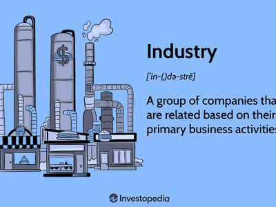

## Table of Contents

## What is the Global Industry Classification Standard (GICS) and who developed it?

The Global Industry Classification Standard (GICS) is a way to group companies into different categories based on what they do. It helps investors and analysts understand and compare companies more easily. GICS divides companies into 11 main groups, like Energy, Health Care, and Information Technology. Each group is then split into more specific categories, making it easier to see how companies are similar or different.

GICS was developed by two big companies, MSCI and S&P Global. They created it to make a standard system that everyone could use, no matter where they are in the world. This helps people talk about industries and companies in the same way, making it easier to do business and invest across different countries.

## How is GICS structured and what are its main components?

GICS is set up like a big tree with branches that get smaller and smaller. It starts with 11 big groups, called sectors, like Energy, Materials, and Consumer Discretionary. Each sector is then divided into more specific groups called industry groups. These industry groups are further split into industries, and finally into sub-industries. This way, companies can be sorted into very specific categories, making it easier to compare them.

The main components of GICS are the sectors, industry groups, industries, and sub-industries. For example, a company might be in the Health Care sector, then in the Health Care Equipment & Services industry group, then in the Health Care Equipment industry, and finally in the Medical Equipment sub-industry. This structure helps investors and analysts understand what a company does and how it fits into the bigger picture of the economy.

## What are the four levels of classification in GICS?

GICS has four levels of classification that help organize companies into groups. The first level is called sectors. There are 11 sectors, like Energy, Materials, and Information Technology. Sectors are the biggest groups and they help people see the main areas of the economy.

The second level is industry groups. Each sector is divided into industry groups, which are a bit smaller and more specific. For example, the Information Technology sector might be split into industry groups like Software & Services or Technology Hardware & Equipment. The third level is industries, which are even smaller groups within the industry groups. An industry group like Software & Services might have industries like Application Software or IT Consulting & Other Services. The fourth and final level is sub-industries, which are the most specific groups. An industry like Application Software might have sub-industries like Enterprise Software or Home Entertainment Software. These four levels help people understand and compare companies in a detailed way.

## How does GICS help in financial analysis and investment decisions?

GICS helps in financial analysis and investment decisions by giving a clear way to group and compare companies. It sorts companies into different categories, starting with big groups like sectors and going down to very specific groups like sub-industries. This makes it easier for people to see how companies are similar or different, which is important when they are trying to decide where to invest their money. For example, if someone wants to invest in the technology sector, GICS helps them see all the different kinds of technology companies they can choose from, like software companies or hardware makers.

Using GICS also helps people understand trends and changes in the economy. By looking at how companies in different GICS categories are doing, analysts can spot which parts of the economy are growing or shrinking. This information can guide investment decisions, like choosing to invest in industries that are doing well. For instance, if the Health Care sector is growing, an investor might decide to put more money into companies in that sector. Overall, GICS makes it easier for people to make smart choices about where to invest their money by providing a clear and organized way to look at companies and industries.

## Can you explain how companies are assigned to specific GICS categories?

Companies are assigned to specific GICS categories by looking at what they mainly do. For example, if a company mostly makes cars, it would be put in the Consumer Discretionary sector, the Automobiles & Components industry group, the Automobile Manufacturers industry, and the Passenger Cars sub-industry. The people who decide where a company goes, like MSCI and S&P Global, look at what the company says it does in its official documents and how it makes money. They make sure the company fits best in the category that matches its main business.

Sometimes, a company might do a lot of different things, like a big company that makes both phones and cars. In these cases, the company is put in the category that represents the biggest part of its business. If making phones is the biggest part, the company would go into the Information Technology sector, even if it also makes cars. This way, the GICS system keeps things clear and organized, helping people understand and compare companies easily.

## What are the benefits of using GICS for investors and analysts?

Using GICS helps investors and analysts a lot because it makes it easy to group and compare companies. GICS sorts companies into categories from big groups like sectors down to small groups like sub-industries. This way, people can see how companies are similar or different, which is really important when deciding where to put their money. For example, if someone wants to invest in technology, GICS helps them find all the different kinds of technology companies, like those that make software or hardware.

Another benefit of GICS is that it helps people see trends and changes in the economy. By looking at how companies in different GICS categories are doing, analysts can tell which parts of the economy are growing or shrinking. This information can guide investment choices, like choosing to invest in industries that are doing well. If the Health Care sector is growing, an investor might decide to put more money into companies in that sector. Overall, GICS makes it easier for people to make smart choices about where to invest their money by providing a clear and organized way to look at companies and industries.

## How often is the GICS methodology updated and why is this important?

The GICS methodology is usually updated once a year. Sometimes, if there are big changes in the economy or in how companies work, there might be extra updates. It's important to keep GICS updated because it helps make sure that the way companies are grouped stays accurate and useful. If the economy changes and new kinds of businesses pop up, GICS needs to change too, so it can still help people understand and compare companies the right way.

Keeping GICS up to date is also important for investors and analysts. They rely on GICS to make smart choices about where to put their money. If GICS isn't updated, it might not show the newest trends or the newest kinds of businesses. This could make it harder for people to understand the economy and make good investment decisions. So, updating GICS regularly helps everyone keep up with the changing world of business.

## How does GICS compare to other industry classification systems like ICB and SIC?

GICS, the Global Industry Classification Standard, is one of several systems used to group companies into categories. It was made by MSCI and S&P Global and sorts companies into 11 sectors, then into more specific groups like industry groups, industries, and sub-industries. This system is used a lot around the world and helps investors and analysts compare companies easily. Another system is the Industry Classification Benchmark (ICB), which was made by FTSE Russell and Dow Jones. ICB also uses four levels of classification, but it has 10 industries instead of GICS's 11 sectors. Both GICS and ICB are used globally, but they might group some companies differently because they use different ways to decide where a company fits.

The Standard Industrial Classification (SIC) system is older and was made by the U.S. government. It sorts companies into 10 broad sectors and then into more detailed categories, but it only goes to four levels, like GICS and ICB. SIC is mostly used in the U.S. and doesn't update as often as GICS or ICB, which can make it less useful for understanding new kinds of businesses. GICS is more up-to-date and used more around the world, which makes it a good choice for investors and analysts who want to compare companies globally. Each system has its own way of grouping companies, so the best one to use can depend on what someone needs and where they are.

## What are some challenges or limitations associated with using GICS?

Using GICS can have some challenges. One big challenge is that not all companies fit neatly into one category. Some companies do a lot of different things, and it can be hard to decide which GICS group they should go in. For example, a company that makes both cars and phones might not fit perfectly in just one sector. This can make it harder for investors and analysts to compare companies because the categories might not always be clear.

Another limitation is that GICS updates once a year, but the economy and businesses can change faster than that. If new kinds of businesses start up, they might not be included in GICS until the next update. This can make it tough for people to keep up with the newest trends and make the best investment choices. Also, because GICS is made by MSCI and S&P Global, it might not be the best fit for everyone, especially if they are used to a different classification system like ICB or SIC.

## Can you provide examples of how GICS has been used in market research or portfolio management?

GICS is really helpful for market research because it helps people organize and understand big groups of companies. For example, a market researcher might want to look at how the tech industry is doing. They can use GICS to find all the companies in the Information Technology sector and then break it down into smaller groups like Software & Services or Technology Hardware & Equipment. This helps them see trends, like if software companies are growing faster than hardware companies. By looking at these trends, researchers can make reports that help investors understand where the market is going and which parts of the tech industry might be good to invest in.

In portfolio management, GICS helps investors pick the right mix of companies to invest in. For example, an investor might want to spread their money across different industries to lower their risk. They can use GICS to choose companies from different sectors, like Energy, Health Care, and Consumer Discretionary. This way, if one sector doesn't do well, the other sectors might balance it out. Also, if an investor thinks a certain industry, like renewable energy, is going to grow, they can use GICS to find companies in that industry and add them to their portfolio. This helps them make smart choices about where to put their money based on what's happening in the economy.

## How does GICS facilitate global investment and sector analysis?

GICS helps with global investment by giving a common way to group companies all over the world. It was made by MSCI and S&P Global, so it's used by many people everywhere. This means that investors from different countries can talk about companies and industries in the same way. For example, if someone in the U.S. wants to invest in a company in Japan, they can use GICS to see what industry the Japanese company is in and compare it to similar companies in the U.S. This makes it easier for investors to find good opportunities in different countries and understand how companies fit into the global economy.

GICS also helps with sector analysis by breaking down the economy into clear groups. It sorts companies into 11 big sectors, like Energy, Health Care, and Information Technology, and then into smaller groups like industry groups, industries, and sub-industries. This helps analysts see how different parts of the economy are doing. For example, if they want to know if the tech industry is growing, they can look at all the companies in the Information Technology sector and see how they're doing. This information can guide investment decisions, like choosing to invest more in sectors that are growing. Overall, GICS makes it easier for people to understand and invest in the global market.

## What future developments or enhancements are expected for GICS?

In the future, GICS might change to keep up with new kinds of businesses and new ways of doing things. As the world changes, new industries like green energy or [artificial intelligence](/wiki/ai-artificial-intelligence) might become more important. GICS will need to add new categories to include these new businesses. Also, the way GICS groups companies might get better, so it can be more accurate and useful for investors and analysts. They might update GICS more often than once a year to make sure it stays current with the fast-changing economy.

Another thing that could happen is that GICS might work better with other classification systems like ICB or SIC. Right now, these systems are different, and that can make things confusing for people who use more than one. If GICS can find a way to work together with these other systems, it would help everyone understand and compare companies more easily. Overall, the goal is to make GICS even better at helping people make smart choices about where to invest their money.

## References & Further Reading

[1]: GICS Methodology by MSCI. ["GICS Methodology."](https://www.msci.com/documents/1296102/11185224/GICS+Methodology+2020.pdf/9caadd09-790d-3d60-455b-2a1ed5d1e48c?t=1578405935658) MSCI.

[2]: MSCI and S&P Dow Jones Indices. ["The Global Industry Classification Standard (GICS)."](https://www.msci.com/our-solutions/indexes/gics) S&P Global.

[3]: Chan, Ernest P. ["Algorithmic Trading: Winning Strategies and Their Rationale."](https://github.com/ftvision/quant_trading_echan_book) Wiley, 2013.

[4]: ["The Handbook of Financial Data and Risk Information II: Volume 2."](https://www.amazon.com/Handbook-Financial-Data-Risk-Information/dp/1107012023) Edited by Margarita S. Brose, Mark Grinblatt, Bruce D. Grundy, and Neyman Jeff. Cambridge University Press, 2014.

[5]: James, Gareth, Witten, Daniela, Hastie, Trevor, and Tibshirani, Robert. ["An Introduction to Statistical Learning: with Applications in R."](https://link.springer.com/book/10.1007/978-1-0716-1418-1) Springer, 2013.

[6]: Aldridge, Irene. ["High-Frequency Trading: A Practical Guide to Algorithmic Strategies and Trading Systems."](https://www.amazon.com/High-Frequency-Trading-Practical-Algorithmic-Strategies/dp/1118343506) Wiley, 2013.

[7]: Lopez de Prado, Marcos. ["Advances in Financial Machine Learning."](https://www.amazon.com/Advances-Financial-Machine-Learning-Marcos/dp/1119482089) John Wiley & Sons, 2018.