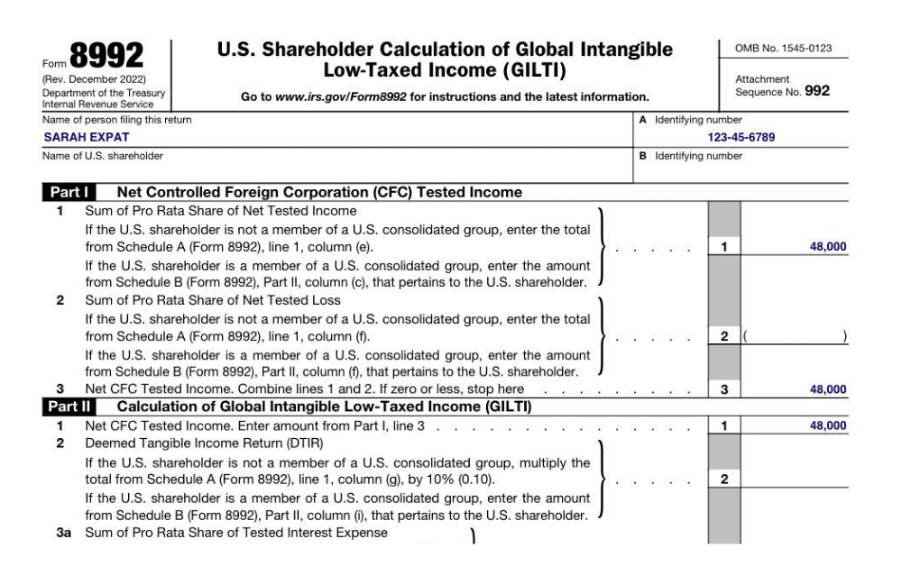

## Table of Contents

## What is Global Intangible Low-Taxed Income (GILTI)?

Global Intangible Low-Taxed Income, or GILTI, is a tax provision introduced by the U.S. government as part of the Tax Cuts and Jobs Act of 2017. It aims to prevent U.S. multinational companies from shifting their profits to low-tax jurisdictions. GILTI applies to income earned by foreign subsidiaries of U.S. companies that exceeds a certain threshold, which is considered to be from intangible assets like patents or trademarks. This income is then subject to U.S. taxation, even if it is earned overseas.

The idea behind GILTI is to ensure that U.S. companies pay a fair share of taxes on income that might otherwise be taxed at a very low rate or not at all. The tax rate on GILTI is lower than the standard corporate tax rate, but it still serves as a deterrent against profit shifting. Companies can claim a foreign tax credit for taxes paid to other countries on this income, which helps to reduce the overall U.S. tax liability. This provision encourages companies to keep more of their operations and profits within the U.S., promoting a more level playing field in international taxation.

## Why was GILTI introduced by the U.S. tax code?

GILTI was introduced by the U.S. tax code to stop big American companies from moving their profits to countries with low taxes. Before GILTI, companies could use tricks to make their money appear in places where they didn't have to pay much tax. This was not fair to other businesses and countries. By making companies pay some tax on this foreign money, GILTI helps to make things more equal.

The U.S. government wanted to keep more tax money at home and make sure that American companies were not just using other countries to avoid taxes. GILTI makes companies think twice before moving their profits overseas. It also gives them a little break on the tax rate and lets them claim some credit for taxes paid abroad, which helps to balance things out. This way, the U.S. can still collect some tax on money earned anywhere in the world by American companies.

## How does GILTI affect U.S. multinational corporations?

GILTI makes U.S. multinational corporations pay taxes on some of the money they earn in other countries. It focuses on the extra profit that comes from things like patents or brand names, which is often moved to places with low taxes. Now, these companies have to pay a U.S. tax on this money, even if it's earned overseas. The tax rate is lower than the normal corporate tax, but it still means they can't avoid taxes completely by moving profits abroad.

This change encourages companies to keep more of their business and profits in the U.S. because they know they'll have to pay some tax on foreign earnings anyway. It also makes things fairer for smaller businesses that can't move their profits around the world. Companies can get a credit for taxes they pay in other countries, which helps lower their U.S. tax bill. Overall, GILTI helps the U.S. collect more tax from big companies and stops them from using tax tricks to keep more money.

## What are the basic steps to calculate GILTI?

To calculate GILTI, you first need to figure out the total income of all the foreign companies owned by the U.S. company. This includes money made from selling things, services, and any other income. Then, you subtract the costs of running these foreign companies, like salaries and rent. After that, you need to find out how much of this income comes from things like patents or brand names, which is called "intangible income." You do this by taking 10% of the money the foreign companies used to buy things like buildings or machines. If the total income is more than this 10%, the extra part is considered GILTI.

Once you know the GILTI amount, you need to calculate the tax on it. The U.S. government taxes GILTI at a special rate, which is lower than the normal corporate tax rate. You can also reduce the tax you owe by claiming a credit for any taxes the foreign companies paid in their countries. This credit helps lower the U.S. tax bill. By following these steps, U.S. companies can figure out how much GILTI they have and how much tax they need to pay on it.

## What is considered 'intangible income' under GILTI rules?

Under GILTI rules, 'intangible income' is the extra money a company makes that comes from things you can't touch, like patents, trademarks, and copyrights. These are called intangible assets because they don't have a physical form but can still make a lot of money for a company. GILTI looks at this kind of income because companies often move it to countries with low taxes to avoid paying more tax at home.

To figure out intangible income, you start with the total income from foreign companies owned by a U.S. company. Then, you subtract 10% of what these foreign companies spent on things like buildings or machines. If the total income is more than this 10%, the extra part is considered intangible income and is subject to GILTI tax. This way, GILTI makes sure that money made from these special assets is taxed fairly.

## How do you determine the 'tested income' of a Controlled Foreign Corporation (CFC)?

To find the 'tested income' of a Controlled Foreign Corporation (CFC), you start by looking at all the money the CFC made during the year. This includes income from selling things, providing services, and any other sources of money. Then, you subtract all the costs of running the business, like salaries, rent, and other expenses. What's left after these subtractions is the 'tested income'. This number is important because it helps figure out if the CFC has any income that needs to be taxed under GILTI rules.

The 'tested income' can be positive or negative. If it's positive, it means the CFC made more money than it spent, and this profit might be subject to GILTI tax. If it's negative, it means the CFC lost money, and this loss can be used to reduce the GILTI tax on other CFCs owned by the same U.S. company. Calculating the 'tested income' correctly is key to understanding how much GILTI tax a U.S. company might owe on its foreign earnings.

## What is the role of the 'net deemed tangible income return' in GILTI calculations?

The 'net deemed tangible income return' is an important part of figuring out GILTI. It helps decide how much of a foreign company's money comes from things you can't touch, like patents or brand names. To find the 'net deemed tangible income return', you take 10% of what the foreign company spent on things like buildings or machines. This 10% is seen as the money made from these physical things. If the foreign company's total income is more than this 10%, the extra part is considered to be from intangible assets and is subject to GILTI tax.

This calculation helps make sure that companies can't avoid taxes by moving their intangible income to countries with low taxes. By setting aside a certain amount as coming from physical assets, GILTI focuses on taxing the extra income that comes from patents, trademarks, and other intangible assets. This way, the U.S. can collect taxes on the profits that might otherwise go untaxed or be taxed at a very low rate in other countries.

## How does the foreign tax credit apply to GILTI?

The foreign tax credit helps U.S. companies lower their GILTI tax bill. When a U.S. company's foreign company pays taxes in another country, the U.S. company can use this foreign tax credit to reduce the amount of GILTI tax they owe to the U.S. government. This credit works by letting the company take the amount of tax they paid in the foreign country and subtract it from their U.S. GILTI tax. This makes sure that the same income isn't taxed twice, once in the foreign country and again in the U.S.

There are rules about how much foreign tax credit a company can use for GILTI. The credit is limited to the amount of U.S. tax that the GILTI income would owe. This means if the foreign taxes are higher than the U.S. GILTI tax, the company can't use the extra foreign tax to reduce other U.S. taxes. By using the foreign tax credit, companies can make their GILTI tax bill smaller, which helps balance out the impact of having to pay U.S. taxes on their foreign earnings.

## What are the differences between GILTI and Subpart F income?

GILTI and Subpart F income are both ways the U.S. government taxes money that U.S. companies make in other countries, but they focus on different kinds of income. Subpart F income is about money that comes from certain activities that are easy to move to low-tax countries, like interest, dividends, and some kinds of service income. If a foreign company owned by a U.S. company makes this kind of money, it has to be reported and taxed right away, even if the money stays overseas. This rule helps stop companies from hiding their profits in places with low taxes.

GILTI, on the other hand, is about the extra money that comes from things you can't touch, like patents or brand names. It looks at all the money a foreign company makes and then subtracts a certain amount to see if there's any extra profit from these intangible assets. If there is, that extra profit is taxed under GILTI rules. Unlike Subpart F, GILTI taxes this income at a lower rate and lets companies use foreign tax credits to reduce what they owe. Both rules are meant to make sure U.S. companies pay a fair share of taxes on their foreign earnings, but they target different types of income and use different methods to calculate the tax.

## How do recent tax reforms impact GILTI calculations?

Recent tax reforms have changed how GILTI is calculated, making it a bit more complicated but also giving companies some new ways to lower their tax bills. One big change is the introduction of the Corporate Alternative Minimum Tax (CAMT), which can affect how much GILTI tax a company has to pay. CAMT is a special tax that makes sure big companies pay at least a certain amount of tax, even if they use other tax breaks. This means companies need to think about both GILTI and CAMT when figuring out their taxes.

Another important change is that the tax reforms have adjusted the rules for how companies can use foreign tax credits to reduce their GILTI tax. Now, there are new limits on how much of these credits companies can use, which can make their GILTI tax higher. But, there are also new ways to [carry](/wiki/carry-trading) forward unused foreign tax credits to future years, which can help companies save on taxes later. These changes mean that companies need to be careful and plan their taxes well to make the most of the new rules.

## What advanced strategies can be used to minimize GILTI liability?

One way to lower GILTI tax is by using foreign tax credits smartly. When a U.S. company's foreign branch pays taxes in another country, the U.S. company can use those taxes to reduce their GILTI tax. The key is to make sure they use as much of these credits as they can each year. If they can't use all the credits right away, they can save them for future years. This way, they can slowly lower their GILTI tax over time. Also, companies can look for countries where the tax rates are higher to pay more foreign taxes, which then gives them more credits to use against GILTI.

Another strategy is to change how the company is set up. Companies can move their intangible assets, like patents or trademarks, to places where the tax rules are better for them. This can help lower the amount of income that counts as GILTI. They can also think about setting up their foreign branches in a way that makes their 'tested income' lower. By doing this, they can reduce the amount of income that gets taxed under GILTI rules. It's all about planning and making smart choices about where and how to run their business to pay less tax.

## How does GILTI interact with other international tax provisions like FDII and BEAT?

GILTI works together with other tax rules like FDII and BEAT to make sure big U.S. companies pay a fair amount of tax on their money, no matter where they earn it. FDII, which stands for Foreign-Derived Intangible Income, gives U.S. companies a special tax break on money they make from selling things or services to people outside the U.S. This tax break helps balance out the GILTI tax, which taxes money made from intangible assets like patents or trademarks in other countries. By having both GILTI and FDII, the U.S. government tries to keep companies from moving their profits overseas while also encouraging them to sell more stuff abroad.

BEAT, or Base Erosion and Anti-Abuse Tax, is another rule that works with GILTI. BEAT is meant to stop companies from using tricks to lower their U.S. taxes by paying a lot of money to their own foreign branches for things like services or interest. If a company does this too much, BEAT makes them pay a special tax that's higher than the normal corporate tax rate. This rule can affect how much GILTI tax a company ends up paying because it changes how they move money around their different parts. Together, GILTI, FDII, and BEAT help make sure that big companies can't avoid paying their fair share of taxes.

## What is the GILTI Calculation Process?

Global intangible low-taxed income (GILTI) is a complex facet of international tax compliance, aiming to prevent U.S. corporations from eroding the domestic tax base by shifting profits to jurisdictions with favorable tax regimes. The calculation of GILTI primarily revolves around the income of controlled foreign corporations (CFCs) that surpasses a 10% return on tangible assets, often referred to as the qualified business asset investment (QBAI).

The primary formula for calculating GILTI is:

$$
\text{GILTI} = \text{Net CFC Tested Income} - \left( 10\% \times \text{QBAI} \right) - \text{Net Interest Expense}
$$

1. **Net CFC Tested Income:**
   This is the sum total of the gross income of all CFCs owned by a U.S. shareholder, minus the associated deductions. It excludes several types of income, such as income that is already subject to U.S. taxation under Subpart F and effectively connected income with a U.S. trade or business.

2. **Qualified Business Asset Investment (QBAI):**
   QBAI represents the total adjusted basis of tangible property used in a trade or business, which is depreciable and owned by CFCs. The calculation requires averaging the QBAI over the [course](/wiki/best-algorithmic-trading-courses) of the tax year, typically by summing quarterly positions.

3. **Net Interest Expense:**
   This encompasses interest paid or accrued by CFCs against interest income received. Proper handling of interest expenses is critical as it adjusts the net tested income and thereby impacts the GILTI inclusion.

Accurate calculation of GILTI necessitates a keen understanding of these components. Incorrect determination can lead to significant tax liabilities and non-compliance penalties. Corporations must adopt thorough accounting practices to accurately quantify their QBAI and related interest expenses. Additionally, engagement with tax professionals can enhance understanding and fulfillment of obligations, thus ensuring optimal strategic outcomes in international tax planning.

## What are the strategies for managing GILTI?

Businesses facing the implications of Global Intangible Low-Taxed Income (GILTI) have various strategies at their disposal to manage and mitigate its impact. A key approach involves leveraging foreign tax credits (FTCs). By utilizing FTCs, corporations can reduce the overall U.S. tax liability associated with foreign-earned income. For instance, if a foreign jurisdiction imposes a substantial tax on a corporation, the FTC allows this tax to be credited against the U.S. GILTI tax, thus avoiding double taxation.

Another effective strategy is engaging in jurisdictions with high effective tax rates. Operating in countries where the effective tax rate equals or exceeds 13.125% can significantly reduce GILTI liability, since taxes paid in these jurisdictions offset the U.S. tax on GILTI. This method necessitates a detailed analysis of each jurisdiction's tax landscape to identify favorable locations for business activities.

Structuring international operations plays a critical role in mitigating GILTI exposure. Corporations can adjust their operations to concentrate tangible investments or enhance the profitability of foreign subsidiaries. This involves a strategic allocation of assets and income to maximize the benefit from the 10% return on qualified business asset investment (QBAI), which is exempt from GILTI calculations. The formula for GILTI is: 

$$
\text{GILTI} = \text{Net CFC Tested Income} - (0.10 \times \text{QBAI}) - \text{Net Interest Expense}
$$

Proper structuring can ensure that tangible assets are utilized effectively, thereby reducing the GILTI inclusion amount.

Expert tax planning remains crucial in navigating the complex GILTI regime. Tax specialists can provide insights into optimizing international tax strategies, predict tax liabilities, and identify opportunities for tax savings. This often involves a detailed exploration of the intersection between GILTI and other tax provisions, such as the Section 250 deduction, which provides a deduction against GILTI income for certain domestic corporations, potentially lowering the effective tax rate on GILTI.

In summary, managing GILTI requires a comprehensive strategy that incorporates FTCs, jurisdictional tax rate analysis, tactical structuring of operations, and expert tax guidance. These efforts not only mitigate GILTI exposure but also enhance the overall tax efficiency and profitability of international business operations.

## References & Further Reading

[1]: Kleinbard, Edward D. (2011). ["Stateless Income."](https://papers.ssrn.com/sol3/papers.cfm?abstract_id=1791769) Florida Tax Review, Vol. 11, No. 9.

[2]: ["Tax Cuts and Jobs Act: Exempting Foreign Income."](https://www.irs.gov/newsroom/tax-cuts-and-jobs-act-a-comparison-for-large-businesses-and-international-taxpayers) (2017). Joint Committee on Taxation, JCX-16-17.

[3]: ["OECD/G20 Base Erosion and Profit Shifting Project: Inclusive Framework on BEPS."](https://www.oecd.org/en/topics/base-erosion-and-profit-shifting-beps.html) (2019). OECD.

[4]: Clausing, Kimberly A. (2019). ["Profit Shifting Before and After the Tax Cuts and Jobs Act."](https://taxpolicycenter.org/sites/default/files/clausing_tcja_profit.pdf) National Tax Journal, 72(4): 703-726. 

[5]: Garcia-Bernardo, J., Janský, P., & Zucman, G. (2019). ["Did the Tax Cuts and Jobs Act Reduce Profit Shifting by US Multinational Companies?"](https://www.nber.org/papers/w30086) National Bureau of Economic Research, Working Paper No. 24701.