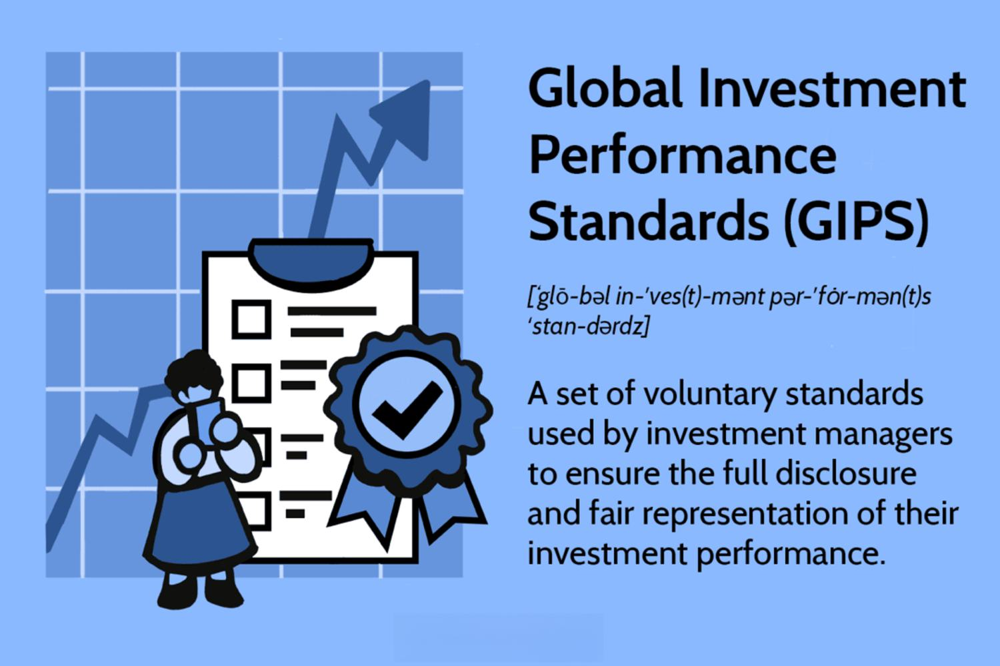

## Table of Contents

## What are the Global Investment Performance Standards (GIPS)?

The Global Investment Performance Standards (GIPS) are a set of rules that help investment firms show their performance results in a fair and clear way. These standards were created by the CFA Institute to make sure that investors can trust the performance data they see. By following GIPS, firms can show how well their investments have done over time, which helps investors make better decisions.

GIPS are used all around the world and help to create a common way of reporting performance. This means that no matter where an investor is, they can compare the performance of different investment firms easily. The standards cover things like how to calculate returns, how to show performance, and how to make sure the data is correct. This helps to build trust between investors and investment firms.

## Who created the GIPS standards and why were they developed?

The Global Investment Performance Standards (GIPS) were created by the CFA Institute. The CFA Institute is a group that helps people in the investment world by giving them education and setting standards. They made GIPS to solve a big problem: investors were finding it hard to trust and compare the performance numbers that different investment firms were showing.

GIPS were developed to make sure that all investment firms around the world show their performance in a fair and clear way. Before GIPS, firms could use different methods to calculate returns, which made it confusing for investors to compare them. By having a common set of rules, GIPS helps investors trust the performance data they see and make better choices about where to put their money.

## What are the main objectives of adhering to GIPS?

The main goal of following the Global Investment Performance Standards (GIPS) is to make sure that investors can trust the performance numbers they see from investment firms. When firms follow GIPS, they use the same rules to show how well their investments have done. This helps investors believe that the numbers are fair and not made up or changed to look better. Trust is very important in the investment world, and GIPS helps build that trust by making sure everyone plays by the same rules.

Another important aim of GIPS is to help investors compare different investment firms easily. Before GIPS, firms could use different ways to calculate their returns, which made it hard for investors to see which firm was really doing better. By having a common standard, GIPS makes it easier for investors to look at performance data from firms all around the world and make smart choices about where to invest their money. This clear way of showing performance helps investors feel more confident in their decisions.

## How do GIPS standards benefit investors?

GIPS standards help investors by making sure that the performance numbers they see from investment firms are honest and fair. When all firms follow the same rules, investors can trust that the numbers haven't been changed to look better. This is important because trust is a big part of deciding where to put your money. If investors feel they can trust the numbers, they are more likely to make good choices about their investments.

Another way GIPS standards help investors is by making it easier to compare different firms. Before GIPS, firms could use different ways to show how well they were doing, which made it confusing for investors. Now, with GIPS, all firms use the same way to show their performance. This means investors can look at numbers from different firms around the world and see which ones are doing better. This clear way of showing performance helps investors feel more sure about where to invest their money.

## What types of firms are required to comply with GIPS?

GIPS standards are not a law that all firms must follow. Instead, they are a set of rules that firms can choose to follow. Many investment firms, like those that manage money for other people, decide to follow GIPS because it helps them show their performance in a way that investors can trust. These firms might include asset managers, investment advisors, and other types of financial firms that handle investments.

Firms that want to show they are serious about being honest and clear with their performance numbers often choose to follow GIPS. This can be important for firms that work with big investors, like pension funds or big companies, who want to make sure they can trust the performance data they see. While following GIPS is voluntary, many firms see it as a good way to build trust with their clients and stand out in the investment world.

## What are the key components of the GIPS standards?

The key components of the GIPS standards help make sure that investment firms show their performance in a fair and clear way. One important part is how firms calculate returns. GIPS tells firms to use the same way of figuring out returns, so investors can trust the numbers. Another part is about showing performance. GIPS says firms should show their performance for different periods of time, like one year, three years, and longer. This helps investors see how well a firm has done over time.

Another key part of GIPS is about making sure the data is correct. Firms have to check their numbers and make sure they are right. This is called verification, and it helps build trust with investors. GIPS also talks about how firms should show their performance to clients. They need to give clear reports that are easy to understand. This way, investors can see all the important information they need to make good choices about where to invest their money.

## How does a firm go about claiming compliance with GIPS?

To claim compliance with GIPS, a firm needs to follow all the rules set by the CFA Institute. This means they have to calculate their returns the way GIPS says, show their performance for different time periods, and make sure all their numbers are correct. They also need to give clear reports to their clients that are easy to understand. If a firm does all these things, they can say they are following GIPS.

After a firm starts following all the GIPS rules, they can say they are compliant. But they have to keep following the rules all the time. They can't just follow them for a little while and then stop. If they want to, they can also get a special check called verification. This is when someone else looks at their numbers to make sure they are doing everything right. This can help build even more trust with their clients.

## What are the differences between GIPS and local regulatory standards?

GIPS and local regulatory standards both aim to make sure that investors can trust the performance numbers they see from investment firms. But they are different in some important ways. GIPS is a set of rules created by the CFA Institute that firms can choose to follow. It's meant to be used all around the world, so it helps investors compare firms from different countries easily. Local regulatory standards, on the other hand, are rules set by governments or other groups in specific countries or areas. These rules can be different in each place and might not be the same as GIPS.

Another big difference is that GIPS focuses a lot on making sure performance numbers are shown in a fair and clear way. It tells firms how to calculate returns, how long to show performance for, and how to make sure the numbers are correct. Local regulatory standards might cover these things too, but they can also include other rules about how firms should act or what they need to tell investors. Sometimes, local standards might be stricter or more detailed than GIPS, and firms have to follow both if they want to claim they are compliant with GIPS.

## Can you explain the concept of 'composite' in GIPS?

In GIPS, a composite is a way to group together similar types of investments that a firm manages. It's like putting all the same kinds of apples in one basket so you can see how well they are doing together. For example, if a firm manages different portfolios that all focus on U.S. stocks, they might put all those portfolios into one composite. This helps the firm show how well they do with U.S. stocks overall, instead of showing the performance of each portfolio separately.

Composites are important because they help investors see a clear picture of how a firm does with certain types of investments. By grouping similar portfolios together, firms can show their performance in a way that is easy to understand and compare. This also helps make sure that firms are being honest and fair when they show their numbers. If a firm only showed the best-performing portfolios, it wouldn't give a true picture of how they do overall. Composites help solve this problem by showing the performance of all similar portfolios together.

## What are the challenges firms face when trying to comply with GIPS?

Firms face several challenges when trying to comply with GIPS. One big challenge is making sure all their numbers are correct and follow the GIPS rules. This can be hard because it means changing how they calculate returns and making sure they show performance for different time periods. Firms also need to keep good records and make sure everything is checked and verified, which can take a lot of time and effort.

Another challenge is that GIPS is a global standard, but firms also have to follow local rules in their own country. Sometimes, these local rules can be different from GIPS, and firms have to figure out how to follow both sets of rules at the same time. This can be confusing and might need extra work to make sure they are doing everything right.

Lastly, getting everyone in the firm to understand and follow GIPS can be tough. It means training staff and making sure everyone knows the rules. This can be hard, especially in big firms where different people are in charge of different parts of the business. But if everyone doesn't follow the rules, the firm can't say they are compliant with GIPS, so it's really important to get it right.

## How are GIPS standards updated and who is involved in the process?

GIPS standards are updated by the GIPS Executive Committee, which is part of the CFA Institute. This group looks at how well the standards are working and if they need to change. They talk to people in the investment world, like firms that follow GIPS and investors who use the standards, to get their ideas. If they decide changes are needed, they make new rules and then ask for feedback from everyone who might be affected. After getting feedback, they might change the new rules a bit before they are final.

Once the new rules are ready, the CFA Institute tells everyone about the changes. They give firms time to start using the new rules, usually a few years. This way, firms can get ready and make sure they are following the new standards correctly. The whole process of updating GIPS takes a lot of work and involves many people to make sure the standards stay fair and helpful for everyone in the investment world.

## What advanced strategies can firms implement to go beyond basic GIPS compliance?

Firms can go beyond basic GIPS compliance by focusing on transparency and communication. They can provide more detailed reports to clients, showing not just the required performance data but also additional information like risk metrics and portfolio characteristics. By doing this, firms can help clients understand their investment strategies better and build stronger trust. For example, they might explain how they manage risk or why certain investments were chosen. This extra information can make clients feel more confident and informed about their investments.

Another strategy is to use technology to improve how they handle and show performance data. Firms can use software that helps them track and verify their numbers more easily, making sure they are always accurate and compliant with GIPS. They can also use data visualization tools to make their reports more clear and easy to understand. By being at the forefront of technology, firms can not only meet GIPS standards but also show their clients that they are modern and efficient. This can set them apart from other firms and make them more attractive to investors.

## References & Further Reading

[1]: CFA Institute. ["Global Investment Performance Standards (GIPS®)."](https://rpc.cfainstitute.org/en/gips-standards)

[2]: Wiley Online Library. ["Performance Measurement in Algorithmic Trading."](https://onlinelibrary.wiley.com/doi/10.1111/jofi.12882)

[3]: Investopedia. ["Understanding Algorithmic Trading Strategies."](https://www.investopedia.com/terms/a/algorithmictrading.asp)

[4]: Securities and Exchange Commission (SEC). ["Algorithmic Trading Compliance and Risk Controls."](https://blog.counselstack.com/algorithmic-trading-regulations-compliance-risk-controls/)

[5]: Financial Conduct Authority (FCA). ["Key Regulatory Considerations for High-Frequency and Algorithmic Trading."](https://www.fca.org.uk/)

[6]: Risk.net. ["Challenges in Performance Reporting for Algorithmic Trading."](https://www.investopedia.com/articles/markets/012716/four-big-risks-algorithmic-highfrequency-trading.asp)

[7]: The Journal of Portfolio Management. ["Implementation of GIPS in Algorithmic Trading: Case Studies and Insights."](https://jpm.pm-research.com/front) Available through financial databases.