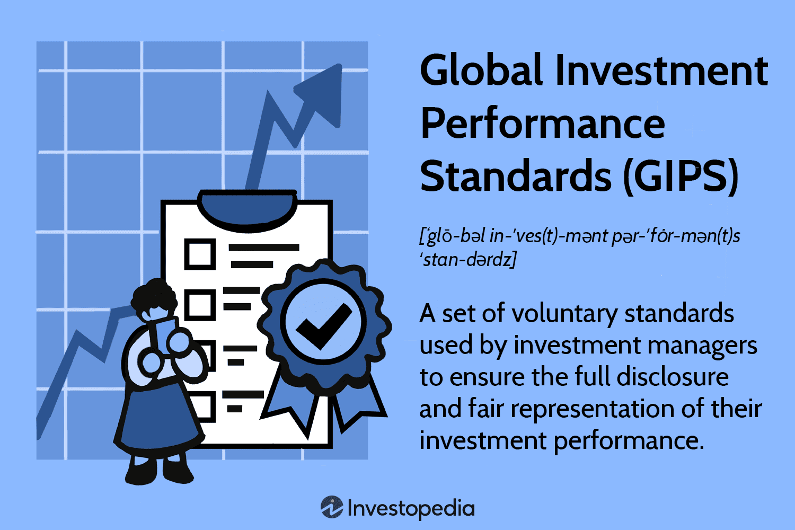

## Table of Contents

## What are Global Investment Performance Standards (GIPS)?

Global Investment Performance Standards (GIPS) are a set of ethical standards used by investment firms to make sure they show their investment results in a fair and clear way. They help investors compare the performance of different investment managers around the world. GIPS were created by the CFA Institute, which is a big group that helps set standards for people who work in finance.

Following GIPS means that investment firms have to follow certain rules when they report how well their investments are doing. This includes showing all their investments, not just the ones that did well, and explaining how they calculate their returns. By using these standards, investors can trust that the performance numbers they see are accurate and can make better decisions about where to put their money.

## Who developed the GIPS and why were they created?

The Global Investment Performance Standards (GIPS) were developed by the CFA Institute. The CFA Institute is a big group of people who work in finance and they wanted to make sure that everyone reports their investment results in a fair and honest way. They created GIPS to help investors around the world trust the numbers they see and make better choices about where to invest their money.

GIPS were created because there was a problem with how investment firms were showing their performance. Some firms were only showing their best results and hiding the ones that didn't do so well. This made it hard for investors to know the truth about how well an investment manager was doing. GIPS set rules that make firms show all their results, not just the good ones, so investors can compare different managers fairly and make smarter investment decisions.

## What is the main purpose of adhering to GIPS?

The main purpose of adhering to GIPS is to make sure that investment firms show their results in a fair and clear way. This helps investors trust the numbers they see and compare different investment managers easily. When firms follow GIPS, they have to show all their investments, not just the ones that did well. This means investors get a true picture of how well a firm is doing, which helps them make better choices about where to put their money.

Another important reason for following GIPS is to make sure that the way investment performance is reported is the same all over the world. This is really helpful for investors who want to look at investment options in different countries. By having a common standard, investors can understand and compare performance data from different places without getting confused. This makes the whole investment world more open and honest.

## How do GIPS benefit investment firms and their clients?

GIPS help investment firms by making them look more trustworthy and professional. When a firm follows GIPS, it shows clients and potential clients that they are open and honest about their performance. This can attract more investors because people feel more comfortable putting their money with a firm that follows clear and fair rules. Also, GIPS help firms stand out in a crowded market. By showing they meet high standards, firms can compete better against others and grow their business.

For clients, GIPS make it easier to compare different investment managers. When all firms follow the same rules, clients can look at the performance numbers and know they are fair and accurate. This helps clients make smarter choices about where to invest their money. They can see how well a firm has done over time and across all their investments, not just the ones that did well. This way, clients get a true picture of what to expect and can feel more confident in their investment decisions.

## What are the key components of the GIPS standards?

The key components of the GIPS standards include rules on how investment firms should show their performance. One important part is that firms have to show all their investments, not just the ones that did well. This means they can't hide bad results to make themselves look better. Another key part is how firms calculate their returns. GIPS set clear rules on how to do this so that everyone is doing it the same way. This makes it easier for investors to compare different firms.

Another important component is that firms have to explain any changes they make to their performance numbers. For example, if they add or remove investments, they have to say why and show how it affects their results. GIPS also require firms to show how much risk they took to get their returns. This helps investors understand if a high return came from smart investing or just taking big risks. By following these rules, firms can show their performance in a way that is fair and easy for investors to understand.

Lastly, GIPS standards focus on making sure that the way performance is reported is the same all over the world. This means that whether you're looking at a firm in the United States or one in Japan, the performance numbers should be easy to compare. GIPS also require firms to get checked by an outside group to make sure they are following the rules correctly. This helps keep everything honest and gives investors more confidence in the numbers they see.

## How can an investment firm claim GIPS compliance?

To claim GIPS compliance, an investment firm needs to follow all the rules set by the GIPS standards. This means they have to show all their investments, not just the good ones, and calculate their returns the way GIPS says. They also need to explain any changes they make to their performance numbers and show how much risk they took to get their returns. It's important that they do this the same way as other firms around the world so investors can compare them easily.

Once a firm thinks they are following all the rules, they need to get checked by an outside group. This group looks at everything the firm does to make sure they are really following GIPS. If the outside group says everything is okay, then the firm can say they are GIPS compliant. This helps investors trust the firm's performance numbers and feel more confident about where they put their money.

## What are the challenges of implementing GIPS?

Implementing GIPS can be hard for investment firms because it takes a lot of work and money. They need to change how they keep track of their investments and make sure they are doing everything the right way. This might mean buying new computer systems or hiring people who know a lot about GIPS. Also, firms have to get checked by an outside group to make sure they are following the rules. This can cost a lot of money and take a long time.

Another challenge is that all the people in the firm need to understand and follow GIPS. This means training everyone, from the top bosses to the people who do the daily work. It can be hard to make sure everyone knows the rules and does things the right way all the time. If someone makes a mistake, it can cause big problems and make it hard for the firm to say they are GIPS compliant.

Lastly, keeping up with GIPS can be tough because the rules can change. The CFA Institute might update the standards, and firms have to keep learning and changing how they do things to stay compliant. This means they always have to be ready to learn new things and make changes, which can be a lot of work.

## How do GIPS differ from other performance presentation standards?

GIPS are different from other performance presentation standards because they are made to be used all over the world. Many other standards are only used in one country or region. GIPS help investors compare investment firms from different places easily. They make sure that everyone calculates returns and shows results the same way, no matter where they are. This makes it easier for investors to trust the numbers they see and make smart choices about where to put their money.

Another way GIPS differ is that they focus a lot on being fair and honest. They make firms show all their investments, not just the ones that did well. This is different from some other standards that might let firms hide bad results. GIPS also require firms to explain any changes they make to their performance numbers and show how much risk they took. This gives investors a clearer and more complete picture of how well a firm is doing.

## Can you explain the concept of 'composite' in GIPS?

In GIPS, a 'composite' is a way to group together similar investments that a firm manages. Think of it like sorting different kinds of fruits into baskets. Each basket, or composite, holds only one type of fruit, like apples or oranges. In the same way, a firm might have one composite for all their U.S. stock investments and another for their European bond investments. This helps investors see how well the firm is doing with different types of investments without mixing them all together.

Composites are important because they make it easier for investors to compare the performance of different investment managers. When a firm shows results for a composite, it means they are showing how all their similar investments did together, not just [picking](/wiki/asset-class-picking) the best ones. This makes the performance numbers more honest and clear. By using composites, investors can get a true picture of how well a firm manages a specific type of investment, which helps them make better decisions about where to put their money.

## What are the verification processes for GIPS compliance?

To check if a firm is following GIPS, they need to go through a verification process. This means an outside group, called a verifier, looks at everything the firm does to make sure they are doing it the right way. The verifier checks all the firm's records, how they calculate their returns, and how they show their performance. They also make sure the firm is showing all their investments, not just the good ones. This can take a lot of time and money, but it's important to make sure the firm is being honest and fair.

If the verifier says everything looks good, the firm can say they are GIPS compliant. This helps investors trust the firm's performance numbers. But, the verification doesn't stop there. Firms need to keep getting checked to make sure they are still following the rules. The CFA Institute, which made GIPS, might also change the rules sometimes. So, firms have to keep learning and updating how they do things to stay compliant. This means the verification process is something they have to do again and again to keep their GIPS status.

## How have GIPS evolved over time and what future changes are anticipated?

GIPS have changed a lot since they started in 1999. At first, they were mostly used in the U.S., but now they are used all over the world. Over the years, the CFA Institute has made the rules clearer and added new ones to make sure firms show their performance in a fair way. For example, they added rules about showing how much risk firms take and how they should handle different types of investments. These changes help investors trust the numbers they see and make better choices about where to put their money.

In the future, GIPS are likely to keep changing to fit the needs of investors and the investment world. One big change might be more rules about new types of investments, like ones that focus on the environment or social issues. As more people want to invest in these areas, GIPS might need to explain how to show their performance. Also, as technology gets better, GIPS might use new tools to check if firms are following the rules. This could make the process faster and easier. Overall, GIPS will keep trying to make sure investment performance is shown in a clear and honest way, so investors can trust the numbers and make smart decisions.

## What are the international implications and adaptations of GIPS?

GIPS are used all over the world to help investors compare how well different investment firms are doing. They make sure that firms show their performance in the same way, no matter where they are. This is really helpful for investors who want to look at investment options in different countries. Without GIPS, it would be hard to compare numbers from firms in the U.S. with those from firms in Europe or Asia. By having a common standard, investors can trust the numbers they see and make better choices about where to put their money.

Different countries have their own rules about showing investment performance, so GIPS have to fit with these local rules. This means that sometimes GIPS need to be changed a bit to work well in different places. For example, in some countries, there might be extra rules about showing how much risk firms take. GIPS have to make sure they include these rules so that firms can follow both GIPS and their local laws. This helps make sure that GIPS are useful and fair for everyone, no matter where they are.

## References & Further Reading

[1]: ["Global Investment Performance Standards (GIPS) Handbook"](https://www.gipsstandards.org/wp-content/uploads/2021/03/gips-handbook-3rd-edition.pdf) by CFA Institute

[2]: Lopez de Prado, M. (2018). ["Advances in Financial Machine Learning."](https://www.amazon.com/Advances-Financial-Machine-Learning-Marcos/dp/1119482089) Wiley.

[3]: Chan, E. P. (2009). ["Quantitative Trading: How to Build Your Own Algorithmic Trading Business."](https://github.com/ftvision/quant_trading_echan_book) Wiley.

[4]: Aronson, D. R. (2006). ["Evidence-Based Technical Analysis: Applying the Scientific Method and Statistical Inference to Trading Signals."](https://onlinelibrary.wiley.com/doi/book/10.1002/9781118268315) Wiley.

[5]: Jansen, S. (2020). ["Machine Learning for Algorithmic Trading."](https://github.com/stefan-jansen/machine-learning-for-trading) Packt Publishing.

[6]: Bergstra, J., Bardenet, R., Bengio, Y., & Kégl, B. (2011). ["Algorithms for Hyper-Parameter Optimization."](https://dl.acm.org/doi/10.5555/2986459.2986743) Advances in Neural Information Processing Systems 24.

[7]: Pardo, R. (2008). ["The Evaluation and Optimization of Trading Strategies."](https://onlinelibrary.wiley.com/doi/book/10.1002/9781119196969) Wiley.

[8]: Hasbrouck, J. (2007). ["Empirical Market Microstructure: The Institutions, Economics, and Econometrics of Securities Trading."](https://academic.oup.com/book/52241) Oxford University Press.