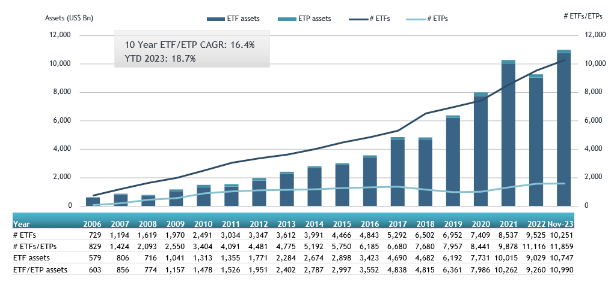

## Table of Contents

## What are ETFs and how do they work?

ETFs, or Exchange-Traded Funds, are a type of investment that works a lot like a regular stock. You can buy and sell them on a stock exchange, just like you would with shares of a company. An ETF is made up of a basket of different investments, like stocks, bonds, or commodities. This means that when you buy one ETF, you're actually investing in many different things at once. This can help spread out your risk because if one investment in the ETF goes down, the others might go up and balance it out.

ETFs are managed by professionals who choose which investments to include in the fund. They aim to match the performance of a specific index, like the S&P 500, which tracks the stock performance of 500 large companies in the U.S. When the index goes up, the ETF usually goes up too, and when the index goes down, the ETF usually goes down as well. This makes ETFs a popular choice for people who want to invest in the overall market without having to pick individual stocks themselves.

## Why should someone consider investing in ETFs for global investment?

Someone should consider investing in ETFs for global investment because they offer a simple way to invest in many different countries and markets at once. Instead of picking individual stocks from around the world, which can be hard and risky, you can buy one ETF that already includes a mix of investments from different places. This can help spread out your risk because if one country's market goes down, another country's market might go up and balance it out.

ETFs also make it easier to take advantage of growth in different parts of the world. For example, if you think that emerging markets like Brazil or India will grow a lot in the future, you can buy an [ETF](/wiki/etf-trading-strategies) that focuses on those markets. This way, you don't have to know everything about those countries' economies or companies. The ETF managers will do the research and pick the investments for you. Plus, ETFs are usually cheaper than buying a lot of different stocks on your own because they have lower fees.

## What are the benefits of ETFs compared to other investment vehicles?

ETFs have several benefits compared to other investment vehicles. One big benefit is that they are easy to buy and sell. You can trade them on a stock exchange just like regular stocks, which means you can buy or sell them whenever the market is open. This is different from mutual funds, which you can only buy or sell at the end of the day. ETFs also usually have lower fees than mutual funds because they are passively managed, meaning they track an index instead of trying to beat it.

Another benefit of ETFs is that they help you spread out your risk. When you buy an ETF, you're investing in a basket of different things, like stocks, bonds, or commodities. This means if one investment goes down, the others might go up and balance it out. This is called diversification, and it's harder to do if you're buying individual stocks or bonds. ETFs also let you invest in specific markets or themes, like technology or green energy, without having to pick individual companies. This can make it easier to take advantage of trends or growth in different parts of the economy.

## How can beginners start investing in global ETFs?

To start investing in global ETFs, beginners should first open a brokerage account. This is like a bank account but for buying and selling investments. Many online brokers offer easy-to-use platforms where you can search for ETFs that focus on different parts of the world, like Europe, Asia, or emerging markets. Once you have an account, you can look for ETFs that match your interests or goals. For example, if you want to invest in fast-growing economies, you might choose an ETF that focuses on countries like India or Brazil.

After choosing an ETF, you can place an order to buy it through your brokerage account. Most platforms let you buy ETFs with just a few clicks. It's a good idea to start with a small amount of money to get comfortable with the process. As you learn more, you can invest more. Remember, investing in global ETFs can help spread out your risk because they include many different investments from around the world. This way, if one country's market goes down, another might go up and balance it out.

## What are the key factors to consider when choosing global ETFs?

When choosing global ETFs, it's important to think about what you want to achieve with your investment. Are you looking to grow your money over a long time, or do you need income right away? This can help you decide between ETFs that focus on growth, like those in emerging markets, or ones that pay dividends, like some ETFs in developed markets. Also, consider how much risk you're willing to take. Some global ETFs can be riskier because they invest in countries with less stable economies. You should pick ETFs that match your comfort level with risk.

Another thing to look at is the fees you'll have to pay. ETFs usually have lower fees than other types of funds, but they can still vary a lot. Lower fees mean you get to keep more of your money over time. It's also good to check how well the ETF has done in the past. While past performance doesn't guarantee future results, it can give you an idea of how the ETF might do. Lastly, think about how easy it is to buy and sell the ETF. Some ETFs are more popular and easier to trade, which can be important if you need to sell your investment quickly.

## How do geopolitical events affect global ETF performance?

Geopolitical events can have a big impact on global ETFs. These events can be things like wars, elections, or trade disagreements between countries. When something big happens, it can change how people feel about investing in certain countries or regions. For example, if there's a war in a country, people might pull their money out of ETFs that invest in that country because they think it's too risky. This can make the ETF's value go down.

On the other hand, good news can make people want to invest more in a region. If two countries sign a new trade deal, it might make people think that the economies of those countries will do better. This can push up the value of ETFs that invest in those countries. So, when you're thinking about investing in global ETFs, it's important to keep an eye on what's happening around the world because these events can affect your investment.

## What are the tax implications of investing in global ETFs?

When you invest in global ETFs, you need to think about taxes. If the ETF invests in companies from other countries, you might have to pay taxes in those countries. This is called foreign withholding tax. It's usually a small percentage of the dividends you get from the ETF. The exact amount can be different depending on where the ETF invests and what tax treaties are in place between your country and the countries where the ETF is investing.

Another thing to think about is capital gains tax. If you sell your ETF for more than you paid for it, you'll have to pay tax on the profit. This can be different depending on how long you held the ETF. If you held it for a short time, you might pay a higher tax rate than if you held it for a long time. Also, some countries have different rules about how they tax gains from foreign investments. It's a good idea to talk to a tax advisor to understand all the rules and make sure you're paying the right amount of tax.

## How can investors use ETFs to diversify their global investment portfolio?

Investors can use ETFs to diversify their global investment portfolio by buying ETFs that focus on different parts of the world. Instead of putting all your money into one country or region, you can spread it out across many. For example, you could buy an ETF that invests in Europe, another that invests in Asia, and another that focuses on emerging markets like Brazil or India. This way, if one part of the world's economy is doing badly, the other parts might be doing well and help balance out your investment.

ETFs make it easy to diversify because they already include a mix of different investments. When you buy one global ETF, you're investing in many companies from different countries at once. This can help lower your risk because if one company or country's market goes down, the others might go up and balance it out. Plus, ETFs are usually cheaper than buying a lot of different stocks on your own because they have lower fees. So, by using global ETFs, you can spread out your investments and potentially grow your money while keeping costs down.

## What are some advanced strategies for trading global ETFs?

One advanced strategy for trading global ETFs is to use sector rotation. This means you move your money between different parts of the world or different industries based on what's doing well at the time. For example, if you think technology companies in Asia are going to do better than energy companies in Europe, you could sell your Europe energy ETF and buy an Asia technology ETF. This can help you take advantage of trends and possibly make more money, but it also means you need to keep a close eye on what's happening in different parts of the world.

Another strategy is to use options to hedge your bets. Options are contracts that give you the right to buy or sell an ETF at a certain price in the future. If you own a global ETF and you're worried it might go down because of a big event, like an election in a country where the ETF invests, you can buy a "put" option. This option lets you sell the ETF at today's price even if it goes down later. It's like insurance for your investment. This can protect your money, but options can be tricky and might cost you money if you're not careful.

## How do currency fluctuations impact returns on global ETFs?

Currency fluctuations can have a big impact on the returns you get from global ETFs. When you invest in a global ETF, you're not just investing in the companies or assets inside the ETF, but also in the currencies of the countries where those companies are based. If the currency of a country where your ETF invests goes up compared to your home currency, it can make your investment worth more when you convert it back. But if that currency goes down, it can make your investment worth less, even if the companies in the ETF are doing well.

This is something to think about when you're [picking](/wiki/asset-class-picking) global ETFs. If you think a certain country's currency is going to get stronger, you might want to invest more in ETFs that focus on that country. But if you think it's going to get weaker, you might want to be careful or look for ETFs that help protect against currency changes. Some ETFs are designed to do this by using different strategies, like investing in currency hedges. These can help lower the risk from currency changes, but they might also cost a bit more because of the extra work involved.

## What role do emerging markets play in global ETF investment strategies?

Emerging markets can be a big part of global ETF investment strategies because they often grow faster than more developed countries. When you invest in an ETF that focuses on emerging markets, like Brazil, India, or China, you're betting that these countries' economies will do well in the future. This can be a good way to make more money, but it can also be riskier because these countries can have ups and downs. Still, many investors like to include some emerging market ETFs in their portfolio to take advantage of this potential for high growth.

To use emerging market ETFs smartly, it's important to spread out your investments. Instead of putting all your money into one emerging market, you can buy ETFs that invest in several different countries. This way, if one country's economy has problems, the others might do well and help balance things out. Also, keep in mind that things like political changes or economic policies in these countries can affect your investment. So, it's good to stay informed and maybe even talk to a financial advisor to make the best choices for your global ETF strategy.

## How can investors assess the risk and potential return of different global ETFs?

Investors can assess the risk and potential return of different global ETFs by looking at a few key things. One important thing is the past performance of the ETF. While past performance doesn't guarantee future results, it can give you an idea of how the ETF has done before. You can check how much the ETF's value has gone up or down over time. Another thing to look at is the [volatility](/wiki/volatility-trading-strategies) of the ETF. Volatility means how much the ETF's price can change in a short time. If an ETF's price goes up and down a lot, it's more risky but might also have a chance for higher returns.

It's also helpful to understand where the ETF invests its money. If it focuses on emerging markets, it might be riskier but could offer higher returns because these markets can grow a lot. On the other hand, ETFs that invest in more stable, developed markets might be less risky but have smaller returns. You should also think about the fees you'll have to pay. Lower fees mean you keep more of your money, which can make a big difference over time. By looking at these things, you can get a better idea of how risky an ETF might be and what kind of returns you could expect.

## References & Further Reading

[1]: Bergstra, J., Bardenet, R., Bengio, Y., & Kégl, B. (2011). ["Algorithms for Hyper-Parameter Optimization."](https://papers.nips.cc/paper/4443-algorithms-for-hyper-parameter-optimization) Advances in Neural Information Processing Systems.

[2]: Marco Lopez de Prado. ["Advances in Financial Machine Learning."](https://www.amazon.com/Advances-Financial-Machine-Learning-Marcos/dp/1119482089) John Wiley & Sons, 2018.

[3]: David Aronson. ["Evidence-Based Technical Analysis: Applying the Scientific Method and Statistical Inference to Trading Signals."](https://www.amazon.com/Evidence-Based-Technical-Analysis-Scientific-Statistical/dp/0470008741) John Wiley & Sons, 2006.

[4]: Stefan Jansen. ["Machine Learning for Algorithmic Trading."](https://github.com/stefan-jansen/machine-learning-for-trading) Packt Publishing, 2018.

[5]: Ernest P. Chan. ["Quantitative Trading: How to Build Your Own Algorithmic Trading Business."](https://www.amazon.com/Quantitative-Trading-Build-Algorithmic-Business/dp/0470284889) John Wiley & Sons, 2009.