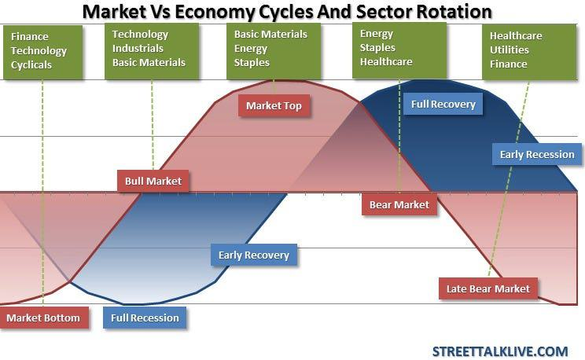

The global investment landscape is continuously reshaping, driven by technological advancements, economic shifts, and new financial instruments. At the forefront of this evolution are Exchange-Traded Funds (ETFs) and algorithmic trading, both playing significant roles in international investing. ETFs have emerged as versatile tools that offer investors a straightforward and cost-effective mechanism to gain exposure to a diversified range of international markets. They provide the flexibility of stock with the diversity of mutual funds, enabling individuals and institutions to tap into global growth opportunities without the complexities usually associated with direct foreign investments.

Algorithmic trading has revolutionized the financial markets by using computers to execute pre-programmed trading instructions at high speed and volume. This modern approach to trading leverages algorithms to manage risk, increase efficiency, and optimize returns. By analyzing vast amounts of market data in real time, algorithms can identify trends and execute trades with a speed and precision unattainable by human traders. The integration of algorithmic trading with ETFs allows for the dynamic management of investment portfolios, responding swiftly to market changes and optimizing international asset allocation.



The convergence of ETFs and algorithmic trading maximizes global investment potential. It enables investors to dynamically allocate their portfolio across various global markets, adapting to shifting economic indicators and geopolitical factors. Additionally, informed decision-making is crucial to global asset allocation. Investors must navigate complex financial environments, assess international market risks, and apply robust analytical tools to optimize their portfolios. Utilizing these tools and strategies helps ensure that investment decisions are not only timely but also aligned with investors' financial goals and risk tolerance.

Ultimately, the key to success in global investments lies in making informed decisions that take into account the multifaceted nature of international markets. By understanding the tools at their disposal, investors can better position themselves to capitalize on opportunities and mitigate risks in an ever-evolving global landscape.

## Table of Contents

## Understanding International Investing

International investing involves allocating capital across global financial markets, aiming to build a portfolio that spans different countries and regions. This approach not only provides exposure to varied economic environments but also taps into opportunities unavailable in domestic markets. By understanding international investing, investors can diversify and potentially enhance the overall performance of their portfolios.

Economic globalization has transformed the investment landscape, providing unprecedented access to foreign markets. As trade barriers diminish and technology bridges geographic gaps, investors can now participate in global economic growth. Economic globalization increases the breadth of investment opportunities, allowing investors to target growth sectors or industries flourishing abroad.

One significant advantage of international investing is diversification. Portfolios that consist solely of domestic assets may be subject to local economic fluctuations, whereas international investments can mitigate domestic market [volatility](/wiki/volatility-trading-strategies). By investing in a mix of countries, sectors, and currencies, investors can reduce risks associated with local market downturns. Moreover, international assets may outperform domestic investments due to varying economic cycles, presenting opportunities for growth even when the domestic market is sluggish.

However, investing internationally comes with its own set of risks and challenges. Currency risk, for instance, can affect returns as changes in exchange rates impact the value of foreign investments. Political instability and regulatory differences also add layers of complexity to international investments, potentially affecting volatility and accessibility. To manage these risks, investors can diversify across diverse geographical regions and employ hedging strategies to mitigate currency exposure.

Economic indicators are vital tools in assessing international investment opportunities. Metrics like GDP growth, inflation rates, and employment [statistics](/wiki/bayesian-statistics) can provide insights into a country's economic health and guide investment decisions. Additionally, geopolitical factors, such as trade agreements, conflicts, and diplomatic relations, can significantly influence international markets, impacting investment risks and returns.

The integration of economic indicators with geopolitical analysis helps investors make informed decisions when entering international markets, balancing opportunities against potential pitfalls. By understanding and managing these variables, investors are better positioned to capitalize on the benefits of international diversification while mitigating associated risks.

## Role of ETFs in Global Investments

Exchange-Traded Funds (ETFs) have become a fundamental instrument in global investments, providing investors with an efficient and cost-effective way to gain exposure to international markets. ETFs are investment funds that trade on stock exchanges, similar to individual stocks. They typically track an index, commodity, or a basket of assets, and offer several benefits, including diversification, [liquidity](/wiki/liquidity-risk-premium), and transparency.

**Simplification of International Investing**

ETFs simplify the process of investing in foreign markets by allowing investors to access a broad range of international securities through a single investment vehicle. This is particularly advantageous for those looking to diversify their portfolios beyond domestic assets without the need to deal with the complexities and risks of direct foreign investments. For instance, an investor interested in the Japanese market can purchase a Japan-specific [ETF](/wiki/etf-trading-strategies) rather than dealing with the intricacies of Japanese stocks directly.

**Comparison with Mutual Funds and Individual Stocks**

When compared to mutual funds, ETFs generally offer lower expense ratios due to their passive management style, which often involves replicating the performance of an index. Mutual funds, particularly active ones, tend to have higher management fees because of the research and analysis involved in selecting individual securities. On the other hand, while individual stocks offer focused exposure, they lack the diversification inherent in ETFs. For international investing, ETFs provide a middle ground, combining the diversification of mutual funds with the trading flexibility of stocks.

**Examples of Popular International and Global Market ETFs**

Several ETFs cater to international and global market investing. Notable examples include the iShares MSCI Emerging Markets ETF (EEM), which provides exposure to emerging market economies, and the Vanguard FTSE All-World ex-US ETF (VEU), which offers access to a diverse array of global markets excluding the United States. These ETFs are designed to mirror their respective indices, offering investors a vehicle to invest in specified geographical areas or economic sectors.

**Performance, Costs, and Liquidity Evaluation**

The performance of ETFs is influenced by the index or assets they track, as well as market conditions. Their costs are generally lower than those of mutual funds, contributing to their appeal as a cost-effective investment option. Expense ratios for ETFs can range from 0.03% to 1% or more, depending on the complexity and management strategy of the ETF. 

Liquidity is another critical [factor](/wiki/factor-investing); ETFs are traded on exchanges and can be bought or sold throughout the trading day, similar to stocks. This liquidity is beneficial for investors who require the flexibility to enter or [exit](/wiki/exit-strategy) positions quickly in response to market dynamics. 

Overall, ETFs serve as a cornerstone in global investment strategies, aiding investors in achieving diversified international exposure with greater ease and at a reduced cost compared to traditional investment vehicles.

 to Algorithmic Trading

Algorithmic trading, often referred to as algo trading, involves the use of computer algorithms to [carry](/wiki/carry-trading) out trading decisions at speeds and frequencies that are beyond human capabilities. These algorithms are programmed to follow specific criteria and execute trades in response to real-time market data. The growing importance of [algorithmic trading](/wiki/algorithmic-trading) can be attributed to its ability to optimize the execution of large orders, reduce transaction costs, and mitigate the impact of human emotional bias on investment decisions.

### Enhancing Efficiency in Executing Large Orders

Algorithms enhance efficiency by breaking down large orders into smaller parcels, thereby minimizing market impact and reducing the likelihood of slippage. Slippage is the difference between the intended execution price and the actual price encountered in the market. By strategically timing the execution of order segments, algorithms can optimize execution prices.

For instance, a basic strategy for executing large orders is the **Time-Weighted Average Price (TWAP)** algorithm, which spreads an order evenly over a specified time period. Another strategy is the **Volume-Weighted Average Price (VWAP)**, which executes trades proportionally to market trading volumes, achieving trades closer to the average price throughout the day.

### Types of Algorithmic Trading Strategies

1. **Trend Following Strategies**: These rely on technical indicators such as moving averages to exploit upward or downward market trends. Since trend following neglects short-term fluctuations, it requires systematic monitoring for entry and exit signals.

2. **Arbitrage Strategies**: These involve exploiting price discrepancies in different markets or instruments. Arbitrage algorithms search for momentary inefficiencies and execute trades to capture small profit margins.

3. **Market Making and Liquidity Providing**: Such strategies involve setting both bid and offer prices to gain the spread. Algorithms adjust quotes in response to market conditions to maintain profitability and manage risk exposure.

4. **Statistical Arbitrage**: Algorithms analyze statistical relationships between different instruments or markets, executing trades based on historical price correlations and deviations.

### Role of Technology in Enabling Real-Time Market Analysis

The integration of advanced technologies, such as [machine learning](/wiki/machine-learning) and [artificial intelligence](/wiki/ai-artificial-intelligence), into algorithmic trading strategies allows for the real-time analysis of vast datasets. These technologies enhance pattern recognition and predictive accuracy in relation to security price movements. High-frequency trading ([HFT](/wiki/high-frequency-trading-strategies)), a subset of algorithmic trading, relies heavily on sophisticated technologies to execute orders in milliseconds or microseconds, exploiting even the tiniest discrepancies for profit.

A Python example illustrating a simple moving average crossover strategy might look like this:

```python
import pandas as pd

# Load data
data = pd.read_csv('market_data.csv')

# Calculate moving averages
data['Short_MA'] = data['Close'].rolling(window=40).mean()
data['Long_MA'] = data['Close'].rolling(window=100).mean()

# Generate signal
data['Signal'] = 0
data['Signal'][40:] = np.where(data['Short_MA'][40:] > data['Long_MA'][40:], 1, -1)

# Plot for visualization (optional)
import matplotlib.pyplot as plt

plt.figure(figsize=(12,6))
plt.plot(data['Close'], label='Price')
plt.plot(data['Short_MA'], label='40-day MA')
plt.plot(data['Long_MA'], label='100-day MA')
plt.legend()
plt.show()
```

### Regulatory and Ethical Considerations

Regulation and ethics play crucial roles in algo trading, as the speed and [volume](/wiki/volume-trading-strategy) of trades can lead to market distortions and systemic risks if not properly controlled. Regulatory bodies, such as the SEC in the United States and the FCA in the UK, enforce stringent compliance requirements and monitor trading activities to ensure transparency and fairness. Ethical considerations involve ensuring that trading algorithms do not exploit unfair advantages or engage in deceitful practices.

Moreover, the **Flash Crash** of 2010 highlighted the need for robust controls and risk management protocols to prevent the destabilizing effects of high-speed algorithmic activities. Traders must ensure that ethical guidelines are adhered to, promoting sustainable and responsible trading practices across global markets.

## Integrating ETFs and Algo Trading in Global Investment Strategies

Integrating Exchange-Traded Funds (ETFs) and algorithmic trading presents a strategic opportunity for enhancing global investment portfolios. This approach leverages the efficiency and diversification benefits of ETFs with the speed and precision provided by algorithmic trading systems.

### Steps to Combine ETFs and Algorithmic Trading for Optimal Global Portfolios

The integration process begins with the selection of suitable ETFs that align with investment objectives and risk tolerance. Once selected, the next step involves designing and implementing an algorithmic trading strategy tailored to these ETFs. This strategy can include technical analysis, statistical [arbitrage](/wiki/arbitrage), or other algorithm-driven approaches to exploit market inefficiencies.

**Algorithmic Optimization of ETF Management**: Algorithms offer tremendous advantages in managing ETF investments. By automating the trading process, they enhance decision-making with access to massive datasets and real-time analysis. Algorithms can continually adjust ETF portfolios based on predefined parameters or evolving market conditions, ensuring optimal asset allocation and minimizing human error.

### Advantages of Algorithms in Managing ETF Investments

Algorithms facilitate efficient large-scale data processing, allowing investors to capitalize on short-lived opportunities. They reduce latency in implementing investment decisions, crucial in today's fast-paced markets. An algorithm can be programmed to monitor price fluctuations across multiple exchanges and execute trades instantly, which is vital when dealing with global markets that operate across different time zones.

### Automated Strategies in Responding to Market Changes

Automated strategies enable swift adaptation to market changes by continuously scanning financial markets for signals or trends. For instance, algorithms can be set to trigger buy or sell orders based on specific criteria, such as crossing moving averages or breaking resistance levels. This capability is especially advantageous for global investments, where market dynamics can shift rapidly and unpredictably.

#### Example Code for Moving Average Crossover Strategy

Below is an example of a simple moving average crossover strategy using Python and the `pandas` library:

```python
import pandas as pd

# Load historical data
data = pd.read_csv('etf_data.csv')

# Calculate moving averages
data['SMA_50'] = data['Close'].rolling(window=50).mean()
data['SMA_200'] = data['Close'].rolling(window=200).mean()

# Generate trading signals
data['Signal'] = 0
data.loc[data['SMA_50'] > data['SMA_200'], 'Signal'] = 1  # Buy signal
data.loc[data['SMA_50'] < data['SMA_200'], 'Signal'] = -1  # Sell signal

print(data[['Date', 'Close', 'Signal']].tail())
```

### Case Studies of Successful Integration

Several investment firms have demonstrated the successful integration of ETFs and algorithmic trading. For example, firms like Renaissance Technologies have leveraged high-frequency trading algorithms with ETFs to achieve remarkable returns. Their strategies involve complex statistical models and proprietary algorithms, offering insights into the potential of this integrated approach.

### Future Potential and Innovations

Looking forward, the marriage of ETFs and algorithmic trading is poised to benefit from advancements in technologies such as artificial intelligence and machine learning. These innovations promise more sophisticated algorithms capable of adaptive learning and predictive analytics, enhancing the accuracy and profitability of investment strategies. As financial technology continues to evolve, the integration of these elements will likely become increasingly seamless, providing investors with greater opportunities for global diversification and risk management. 

In conclusion, while integrating ETFs with algorithmic trading offers compelling benefits, it requires a robust understanding of both financial markets and algorithmic systems. Continuous adaptation to technological and market changes will be key to maximizing the potential of these powerful investment tools.

## Challenges and Considerations

When implementing sophisticated financial strategies such as the integration of Exchange-Traded Funds (ETFs) and algorithmic trading in global investment portfolios, investors face several challenges. Paramount among these is the necessity for rigorous risk management and due diligence. The complexity of international markets requires investors to be acutely aware of currency fluctuations, regulatory environments, and political instability. These variables can significantly impact investment outcomes, hence emphasizing the importance of a structured approach to risk assessment.

In algorithmic trading, technological and operational risks are critical concerns. System failures, software bugs, and connectivity issues can lead to significant financial losses or missed opportunities. To mitigate these risks, robust infrastructure and regular system audits are essential. Standards for best practices in coding and system reliability must be stringently adhered to, ensuring that the trading algorithms operate as intended under various market conditions.

When selecting ETFs for international exposure, several considerations come into play, such as the fund's liquidity, its expense ratio, and its underlying assets. Investors should aim to choose ETFs that are not only aligned with their investment goals but also offer sufficient liquidity to facilitate seamless entry and exit from positions. The expense ratio of an ETF, which reflects the operational costs of managing the fund, is a crucial factor, as it directly affects an investor's net returns. Therefore, ETFs with lower expense ratios are generally preferred, provided they meet other investment criteria.

Another key aspect is understanding the tax implications associated with a global investment portfolio. Different jurisdictions have varying tax treatments for capital gains, dividends, and interest income. Investors must be aware of these tax obligations to optimize their after-tax returns. In some cases, international tax treaties can be leveraged to minimize the tax burden, but such strategies require careful planning and expertise in international tax law.

The challenges and considerations outlined above underscore the necessity for investors to maintain a comprehensive understanding of both market dynamics and the technical aspects of their investment strategies. By doing so, they can better navigate the complexities of global investing and enhance their potential for success in a competitive financial landscape.

## Conclusion

The integration of international investing, Exchange-Traded Funds (ETFs), and algorithmic trading provides numerous benefits for investors seeking to diversify and optimize their portfolios. International investing offers the opportunity to access a broader range of markets and economies, thereby reducing risk and potentially enhancing returns through geographic diversification. ETFs, with their ease of access to diversified foreign markets and relatively lower costs, facilitate this by simplifying the investment process. Meanwhile, algorithmic trading introduces speed and efficiency in executing trades, allowing investors to respond rapidly to market changes and optimize their strategies.

Staying updated with global market trends is crucial for investors aiming to capitalize on these benefits. The financial landscape is continually evolving due to technological advancements, regulatory changes, and shifting economic conditions. By keeping abreast of these trends, investors can make informed decisions and adjust their strategies accordingly.

The fast pace of technological innovation necessitates ongoing learning and adaptation. New tools and platforms regularly emerge, offering enhanced capabilities for data analysis, risk management, and trade execution. Investors should remain open to these advancements and continuously seek to upgrade their skills and knowledge to harness the full potential of the evolving investment environment.

The global financial market offers immense potential for growth and diversification. As economies develop and interconnectivity increases, new investment opportunities arise. By effectively integrating international investments, ETFs, and algorithmic trading, investors can position themselves to benefit from these opportunities, achieving both growth and risk mitigation.

For investors looking to expand their portfolios, several actionable insights emerge:

1. **Diversification**: Utilize ETFs to gain exposure to a variety of international markets, which can help mitigate risk and enhance returns.
2. **Technology Adoption**: Employ algorithmic trading to improve trade efficiency and react quickly to global market movements, ensuring optimal portfolio management.
3. **Continual Education**: Engage in continuous learning to stay informed about global economic indicators, geopolitical factors, and technological innovations influencing financial markets.
4. **Risk Management**: Assess and manage risks associated with international investments, including currency fluctuations and political instability, to protect portfolio value.

By embracing these strategies, investors can effectively navigate the complexities of global investing and leverage the opportunities presented by the integration of international assets, ETFs, and algorithmic trading.

## References & Further Reading

[1]: Bergstra, J., Bardenet, R., Bengio, Y., & Kégl, B. (2011). ["Algorithms for Hyper-Parameter Optimization."](https://papers.nips.cc/paper/4443-algorithms-for-hyper-parameter-optimization) Advances in Neural Information Processing Systems.

[2]: Marco Lopez de Prado. ["Advances in Financial Machine Learning."](https://www.amazon.com/Advances-Financial-Machine-Learning-Marcos/dp/1119482089) John Wiley & Sons, 2018.

[3]: David Aronson. ["Evidence-Based Technical Analysis: Applying the Scientific Method and Statistical Inference to Trading Signals."](https://www.amazon.com/Evidence-Based-Technical-Analysis-Scientific-Statistical/dp/0470008741) John Wiley & Sons, 2006.

[4]: Stefan Jansen. ["Machine Learning for Algorithmic Trading."](https://github.com/stefan-jansen/machine-learning-for-trading) Packt Publishing, 2018.

[5]: Ernest P. Chan. ["Quantitative Trading: How to Build Your Own Algorithmic Trading Business."](https://www.amazon.com/Quantitative-Trading-Build-Algorithmic-Business/dp/0470284889) John Wiley & Sons, 2009.