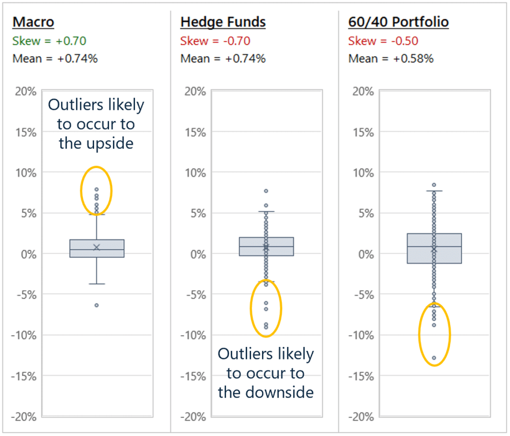

## Table of Contents

## What is a global macro hedge fund?

A global macro hedge fund is a type of investment fund that focuses on making big bets on the overall economic and political trends around the world. Instead of investing in individual stocks or bonds, these funds look at things like interest rates, currency values, and economic policies in different countries. They try to predict how these big-picture factors will change and then make investments based on those predictions.

These funds often use a lot of borrowed money, or leverage, to increase their potential profits. This can make their returns very high if their predictions are correct, but it also means they can lose a lot of money if they are wrong. Because they are betting on broad economic trends, global macro hedge funds can be less affected by the performance of individual companies or industries, but they still face risks from unexpected events like political changes or economic crises.

## How do global macro hedge funds differ from other types of hedge funds?

Global macro hedge funds are different from other hedge funds because they focus on big economic and political trends around the world, rather than on individual stocks or industries. They look at things like interest rates, currency values, and government policies to make their investment decisions. Other types of hedge funds, like equity hedge funds, might focus more on picking specific stocks or sectors they think will do well. Global macro funds try to predict how the whole economy will move and make big bets based on those predictions.

Another key difference is that [global macro](/wiki/global-macro-strategy) hedge funds often use a lot of borrowed money, or leverage, to try to increase their profits. This can make their returns very high if their predictions are right, but it also means they can lose a lot if they are wrong. Other hedge funds might use leverage too, but global macro funds tend to use it more because they are betting on broad trends rather than individual assets. This approach can lead to big wins or big losses, depending on how well they predict the global economy.

## What are the main investment strategies used by global macro hedge funds?

Global macro hedge funds use different strategies to make money from big changes in the world economy. One common strategy is called directional trading. This means they bet on which way things like interest rates, currencies, or stock markets will move. For example, if they think the US dollar will get stronger, they might buy dollars or invest in things that will go up in value if the dollar gets stronger. They use a lot of research and data to try to guess what will happen next in the economy.

Another strategy is relative value trading. This is when they look for price differences between similar investments and try to make money from those differences. For example, if they see that two countries' bonds are not priced the same even though they should be, they might buy the cheaper one and sell the more expensive one, hoping to profit when the prices even out. Global macro hedge funds also often use leverage, which means borrowing money to make bigger bets. This can lead to big wins or big losses, depending on how well their predictions turn out.

## Who are the typical investors in global macro hedge funds?

The typical investors in global macro hedge funds are often wealthy individuals and families who have a lot of money to invest. They are usually looking for ways to grow their wealth and are willing to take on more risk for the chance of higher returns. These investors often have a good understanding of financial markets and are comfortable with the ups and downs that come with investing in global macro funds.

Institutional investors, like pension funds, endowments, and insurance companies, also invest in global macro hedge funds. These organizations manage large amounts of money and use global macro funds as part of their overall investment strategy. They are looking for ways to diversify their investments and potentially earn higher returns than they might get from more traditional investments. Both types of investors are attracted to global macro hedge funds because of their potential for high returns, even though they know there is also a higher risk of losing money.

## What are the risks associated with investing in global macro hedge funds?

Investing in global macro hedge funds can be risky because they often use a lot of borrowed money, or leverage, to make big bets on the world economy. If their guesses about things like interest rates, currency values, or government policies are wrong, they can lose a lot of money very quickly. This means that investors might see big ups and downs in the value of their investment, and there's a chance they could lose more money than they put in.

Another risk is that global events can be hard to predict. Things like political changes, natural disasters, or unexpected economic shifts can throw off the fund's plans. Because these funds bet on big trends, even small surprises can lead to big losses. Investors need to be ready for these kinds of surprises and understand that the value of their investment can change a lot because of things they can't control.

## How do global macro hedge funds predict and capitalize on global economic trends?

Global macro hedge funds try to guess what will happen in the world economy by looking at a lot of information. They study things like interest rates, how much money countries have, and what governments are doing. They also pay attention to news and events around the world, like elections or big policy changes. By putting all this information together, they try to figure out which way the economy is going to move. They might think, for example, that one country's currency is going to get stronger because its economy is doing well, or that another country's interest rates are going to go up because of new government rules.

Once they have an idea of what might happen, global macro hedge funds make big bets to try to make money from these trends. They might buy or sell currencies, invest in government bonds, or trade in stock markets based on their guesses. Because they often use a lot of borrowed money to make these bets bigger, they can make a lot of money if they are right. But if they are wrong, they can also lose a lot. This is why they spend so much time trying to predict the future of the global economy, even though it's really hard to do.

## What role do geopolitical events play in the strategies of global macro hedge funds?

Geopolitical events, like wars, elections, or big policy changes, are really important for global macro hedge funds. These funds watch these events closely because they can change how economies work around the world. For example, if there's a big election in a country, the new leaders might change laws or policies that affect the economy. This can make the country's currency stronger or weaker, or change how much people want to invest there. Global macro hedge funds try to guess what will happen after these events and make their investment choices based on those guesses.

Because geopolitical events can be hard to predict, they add a lot of risk to the strategies of global macro hedge funds. If something unexpected happens, like a sudden change in government or a new trade agreement, it can mess up the fund's plans. But if the fund can guess right about what will happen, they can make a lot of money. So, they spend a lot of time studying these events and trying to understand how they might affect the world economy.

## Can you explain the use of leverage in global macro hedge fund strategies?

Global macro hedge funds often use leverage to try to make more money from their investments. Leverage means borrowing money to make bigger bets on the economy. If they think a certain currency will go up in value, for example, they might borrow a lot of money to buy more of that currency. This can lead to big wins if their guess is right, because they can make money on a larger amount of the currency than they could with just their own money.

But using leverage also makes things riskier. If the currency they bet on goes down instead of up, they can lose a lot of money very quickly. Because they borrowed money to make the bet bigger, they have to pay back the loan even if their investment loses value. This means they might lose more money than they started with. So, while leverage can help them make more money when they are right, it can also lead to big losses if they are wrong.

## How do global macro hedge funds manage their portfolios to maximize returns?

Global macro hedge funds try to make the most money by guessing what will happen in the world economy. They look at a lot of information, like interest rates, currency values, and what governments are doing. They use this information to decide where to put their money. They might buy or sell currencies, invest in government bonds, or trade in stock markets based on their guesses. They also often borrow money, or use leverage, to make their bets bigger. This can lead to big wins if they guess right, but it also means they can lose a lot if they are wrong.

To manage their portfolios, these funds keep a close eye on the news and events around the world. They know that things like elections, wars, or new laws can change how economies work. If they can guess what will happen after these events, they can make their investments in a way that will make them the most money. But because it's hard to predict the future, they have to be ready for surprises and adjust their investments quickly if things don't go as planned. This means they are always trying to balance the chance of making a lot of money with the risk of losing a lot.

## What are some historical examples of successful global macro hedge fund trades?

One famous example of a successful global macro [hedge fund](/wiki/hedge-fund-trading-strategies) trade happened in the 1990s. George Soros, who ran the Quantum Fund, made a huge bet against the British pound. He thought the pound was too strong and that Britain would have to leave the European Exchange Rate Mechanism, which was keeping the pound's value high. In 1992, Soros borrowed a lot of pounds and sold them, betting that the price would go down. When Britain did leave the mechanism, the pound fell a lot, and Soros made about $1 billion in one day. This trade is known as "Black Wednesday" and showed how big bets on currencies can lead to huge profits.

Another example is from the late 1990s when Julian Robertson's Tiger Management fund bet against the Japanese yen. At the time, Japan's economy was struggling, and Robertson thought the yen would get weaker. He sold yen, betting that its value would drop. When the yen did fall, Tiger Management made a lot of money from this trade. This showed how global macro hedge funds can make money by guessing what will happen in different countries' economies and making big bets based on those guesses.

## How do regulatory environments affect the operations of global macro hedge funds?

Regulatory environments can have a big impact on how global macro hedge funds work. Different countries have different rules about what these funds can and can't do. For example, some places might limit how much money the funds can borrow, or how much they can invest in certain things like currencies or government bonds. These rules can make it harder for the funds to make the big bets they want to make. If the rules change, the funds might have to change their strategies or move their operations to a different country where the rules are more friendly to their way of doing things.

Also, global macro hedge funds have to follow rules about reporting their activities and being open about what they are doing. Governments want to make sure these funds are not doing anything risky that could hurt the economy. This means the funds have to spend time and money making sure they are following all the rules. Sometimes, strict regulations can make it harder for them to act quickly on their guesses about the economy, which is important for making money. So, the regulatory environment can affect how much money they can make and how they manage their risks.

## What advanced analytical tools and technologies do global macro hedge funds employ to enhance their decision-making processes?

Global macro hedge funds use a lot of fancy tools and technology to help them make better guesses about the world economy. They use big computers to look at a lot of information at once, like numbers about interest rates, how much money countries have, and what people are saying in the news. These computers can find patterns and connections that people might miss. They also use special math models to try to predict what will happen next. These models can be very complicated, but they help the funds make smarter bets on things like currencies and bonds.

Another tool they use is called [machine learning](/wiki/machine-learning). This is a type of computer program that can learn from past information and get better at guessing what will happen in the future. For example, it can look at old data about how a country's economy did after certain events and use that to make better predictions about what might happen next. Global macro hedge funds also use high-speed trading systems to buy and sell things very quickly. This can help them take advantage of small changes in the market before other people do. All these tools help the funds make better decisions and try to make more money, but they also make things more complicated and can add to the risks they take.

## References & Further Reading

[1]: ["Global Macro Trading: Profiting in a New World Economy"](https://www.amazon.com/Global-Macro-Trading-Profiting-Bloomberg/dp/111836242X) by Greg Gliner.

[2]: ["Dynamic Hedging: Managing Vanilla and Exotic Options"](https://www.amazon.com/Dynamic-Hedging-Managing-Vanilla-Options/dp/0471152803) by Nassim Nicholas Taleb.

[3]: Woods, M., & Urich, S. "Global Macro Hedge Funds: Techniques and Opportunities." CFA Institute Journal Review, 2019.

[4]: Pojarliev, M., & Levich, R. M. (2011). ["A New Look at Currency Investing."](https://rpc.cfainstitute.org/-/media/documents/book/rf-publication/2012/rf-v2012-n4-1-pdf.pdf) Financial Analysts Journal, 67(2), 62-80.

[5]: [Barroso, P., & Santa-Clara, P. (2015).](https://papers.ssrn.com/sol3/papers.cfm?abstract_id=2041429) "Momentum Has Its Moments." Journal of Financial Economics, 116(1), 111-120.

[6]: Bacmann, J. F., & Scholz, H. (2002). ["Alternative Performance Measures for Hedge Funds."](http://w.performance-measurement.org/BacmannScholz2003.pdf) Alternative Investment Research.

[7]: Kissell, R. (2014). ["The Science of Algorithmic Trading and Portfolio Management."](https://www.sciencedirect.com/book/9780124016897/the-science-of-algorithmic-trading-and-portfolio-management) Academic Press. 

[8]: ["Inside the Black Box: A Simple Guide to Quantitative and High-Frequency Trading"](https://www.amazon.com/Inside-Black-Box-Quantitative-Frequency/dp/1118362411) by Rishi K. Narang.