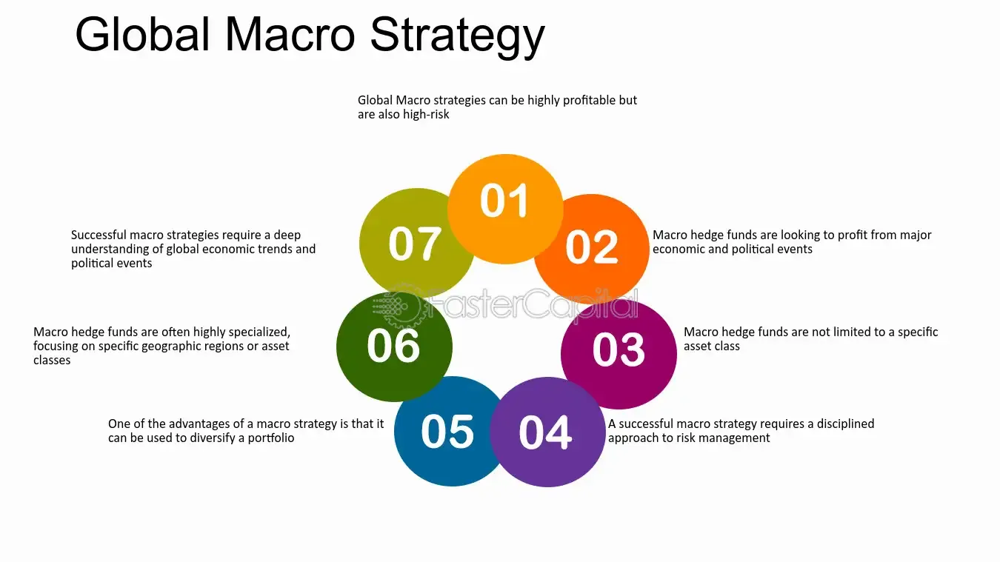

## Table of Contents

## What is a global macro strategy?

A global macro strategy is a way of investing that looks at the big picture of the world's economy. People who use this strategy try to predict what will happen to different countries' economies, interest rates, and currencies. They use this information to decide where to invest their money. For example, if they think a country's economy will grow, they might buy stocks or bonds from that country.

This strategy involves looking at many different things, like politics, natural disasters, and changes in technology. Investors using a global macro strategy might buy and sell things like stocks, bonds, currencies, and commodities. They aim to make money by betting on the big trends they see happening around the world. It's a bit like trying to guess the weather for the whole planet and then deciding what clothes to wear based on that guess.

## How does a global macro strategy differ from other investment strategies?

A global macro strategy is different from other investment strategies because it focuses on the big picture of the world's economy. Instead of looking at just one company or industry, people using this strategy try to predict what will happen to whole countries' economies, interest rates, and currencies. They use this big picture to decide where to put their money. For example, if they think a country's economy will do well, they might buy stocks or bonds from that country. This is different from strategies that focus on picking individual stocks or investing in specific sectors, like technology or healthcare.

Another way a [global macro](/wiki/global-macro-strategy) strategy differs is that it looks at many different factors that can affect the world's economy. These can include things like politics, natural disasters, and changes in technology. Investors using this strategy might buy and sell a wide range of things, like stocks, bonds, currencies, and commodities. They aim to make money by betting on the big trends they see happening around the world. This is different from strategies that focus on a smaller set of investments or that rely on detailed analysis of individual companies.

## What are the main types of funds that use global macro strategies?

Funds that use global macro strategies are mainly of two types: hedge funds and mutual funds. Hedge funds are private investment funds that can use a lot of different ways to make money, like borrowing money to invest more or using complex financial tools. They often use global macro strategies to bet on big changes in the world's economy, like what will happen to different countries' currencies or interest rates. Because hedge funds can be risky, they are usually only for rich people or big investors.

Mutual funds, on the other hand, are more open to everyone. They pool money from many people to invest in different things, like stocks and bonds. Some mutual funds use global macro strategies to guide their investments, but they usually have rules that make them less risky than hedge funds. These rules might limit how much they can borrow or what kinds of investments they can make. So, while both types of funds can use global macro strategies, hedge funds tend to be more flexible and riskier, while mutual funds are more accessible and safer.

## What are the key economic indicators that global macro funds focus on?

Global macro funds pay close attention to many different economic indicators to make their investment decisions. Some of the main ones they look at are interest rates, inflation rates, and employment numbers. Interest rates are important because they affect how much it costs to borrow money and how much people can earn from saving. If interest rates go up, borrowing becomes more expensive, which can slow down the economy. Inflation rates tell investors how fast prices are going up. If inflation is high, money loses value quickly, and people might want to invest in things that can keep up with rising prices. Employment numbers show how many people have jobs. If more people are working, it usually means the economy is doing well, and people have more money to spend.

Another set of indicators that global macro funds focus on includes gross domestic product (GDP), trade balances, and currency exchange rates. GDP measures the total value of all goods and services produced in a country. If GDP is growing, it's a sign that the economy is getting bigger. Trade balances show whether a country is exporting more than it's importing, or the other way around. A positive trade balance can be good for a country's currency because it means more money is coming in from other countries. Currency exchange rates are also crucial because they affect how much a country's money is worth compared to other countries. If a country's currency gets stronger, it can make its exports more expensive and imports cheaper, which can have big effects on the economy. By keeping an eye on these indicators, global macro funds try to predict big changes and make smart investment choices.

## How do global macro funds use leverage and derivatives in their strategies?

Global macro funds often use leverage to make their investments bigger and potentially earn more money. Leverage means borrowing money to invest more than they have. For example, if a fund has $100, it might borrow another $100 to invest $200. This can make profits bigger if their investments go up in value, but it also makes losses bigger if things go down. Because global macro funds look at big trends in the world's economy, they think they can make good guesses about what will happen, so they use leverage to bet more on those guesses.

Derivatives are another tool global macro funds use. Derivatives are financial contracts that get their value from something else, like stocks, bonds, or currencies. For example, a fund might buy a futures contract that lets them buy a currency at a set price in the future. If they think the currency will go up, they can make money from the difference. Derivatives can be complex, but they let funds make bets on things without actually owning them. This can be useful for global macro funds because they often want to bet on big changes in the world's economy without buying and selling lots of different things directly.

## What are the typical risk management techniques employed by global macro funds?

Global macro funds use different ways to manage risk because their strategies can be risky. One way they do this is by diversifying their investments. This means they spread their money across many different things, like stocks, bonds, and currencies from different countries. If one investment does badly, the others might do well and balance it out. Another way is by using stop-loss orders. These are instructions to sell an investment if it drops to a certain price. This helps limit how much money they can lose on any one bet.

Another technique global macro funds use is called hedging. Hedging means making another investment that can protect them if their main investment goes down. For example, if they think a currency will go down, they might buy a derivative that will make money if that happens. This can help them not lose as much money. They also keep a close eye on their overall risk by using something called [value at risk](/wiki/var-value-at-risk) (VaR). VaR is a way to measure how much they could lose in a bad situation. By watching this, they can adjust their investments to stay within a level of risk they are comfortable with.

## Can you explain the role of geopolitical events in shaping global macro strategies?

Geopolitical events play a big role in shaping global macro strategies. These events are things like wars, elections, or big changes in government policies. When something big happens in the world, it can change how countries' economies work. For example, if two countries start a trade war, it can make their currencies go up or down and change how much people want to buy things from those countries. Global macro funds watch these events closely because they want to guess what will happen next and decide where to put their money. If they think a country will do better because of a new policy, they might buy more of that country's stocks or bonds.

Another way geopolitical events affect global macro strategies is by changing how safe or risky it seems to invest in certain places. For example, if there is a war or a big protest, investors might think it's too risky to put money in that country. They might move their money to a safer place, like a country that seems more stable. This can make the safe country's currency stronger and the risky country's currency weaker. Global macro funds try to predict these moves and use them to make money. By understanding how geopolitical events can shake up the world's economy, they can make smarter choices about where to invest.

## How do global macro funds adapt their strategies in response to market cycles?

Global macro funds change their strategies depending on where they think the market is in its cycle. A market cycle is like the ups and downs that markets go through over time. When the market is going up, or in a bull market, global macro funds might take more risks. They might buy more stocks or use more leverage to bet on the market growing even more. They look for signs that the economy is doing well, like low unemployment and growing GDP, and invest in things that do well when times are good.

On the other hand, when the market is going down, or in a bear market, global macro funds become more careful. They might sell some of their riskier investments and buy things that are safer, like government bonds. They watch for signs that the economy might be slowing down, like rising unemployment or falling GDP, and adjust their investments to protect their money. By understanding where the market is in its cycle, global macro funds try to make the best choices to make money and avoid big losses.

## What are some historical examples of successful global macro trades?

One famous example of a successful global macro trade is when George Soros made a huge bet against the British pound in 1992. He thought the pound was too strong and would have to be devalued. He borrowed a lot of pounds and sold them, betting that he could buy them back later for less money. When the British government couldn't keep the pound's value up, Soros made about $1 billion in profit. This trade is known as "Black Wednesday" because it caused a lot of trouble for the UK economy.

Another example is when [hedge fund](/wiki/hedge-fund-trading-strategies) manager John Paulson made a big bet that the U.S. housing market would crash in the mid-2000s. He bought a lot of credit default swaps, which are like insurance policies that pay out if certain loans go bad. When the housing market did crash in 2007 and 2008, Paulson's fund made around $15 billion in profit. This was one of the biggest wins in the history of global [macro trading](/wiki/macro-trading).

## How do global macro funds measure and evaluate their performance?

Global macro funds measure and evaluate their performance by looking at how much money they make or lose over time. They often use a number called the return on investment (ROI) to see how well they are doing. This number shows how much more money they have at the end of a certain time compared to the beginning. They also compare their performance to a benchmark, which is like a standard they want to beat. A common benchmark is something like the S&P 500, which is a big group of stocks. If the fund does better than the benchmark, it's doing well. If it does worse, it might need to change its strategy.

Another way global macro funds evaluate their performance is by looking at risk-adjusted returns. This means they think about how much risk they took to make their money. A common measure for this is the Sharpe ratio, which shows how much extra return they got for each bit of risk they took. A higher Sharpe ratio is better because it means they made more money without taking too much risk. By looking at both their returns and how much risk they took, global macro funds can see if they are doing a good job and make changes if they need to.

## What are the challenges and limitations faced by managers of global macro funds?

Managing a global macro fund comes with many challenges and limitations. One big challenge is that the world's economy is very complicated and always changing. Managers have to keep up with news and events from all over the world, like politics, natural disasters, and economic reports. It's hard to predict what will happen next, and if they guess wrong, they can lose a lot of money. Another challenge is that global macro funds often use a lot of leverage, which means they borrow money to invest more. This can make their profits bigger, but it also makes their losses bigger if things go wrong.

Another limitation is that global macro funds can be risky because they bet on big changes in the world's economy. If a manager makes a wrong bet, it can hurt the fund a lot. Also, these funds often have high fees, which can eat into the profits. Managers have to be very good at what they do to make enough money to cover these fees and still give good returns to their investors. It's also hard to find the right balance between taking enough risk to make money and not taking too much risk and losing money.

## How might future trends in global economics affect the strategies of global macro funds?

Future trends in global economics could change how global macro funds work. One big trend is that more countries are using technology and data in their economies. This means global macro funds might start using more computer programs to help them make decisions. They might look at things like how people use the internet or how fast new technology is growing. If they can use this information well, they might be able to make better guesses about what will happen next in the world's economy.

Another trend is that the world is becoming more connected. This means what happens in one country can affect many others. For example, if a big country like China changes its trade rules, it can affect economies all over the world. Global macro funds will need to watch these connections closely and be ready to change their investments quickly. They might need to be more flexible and ready to bet on different things as the world changes. By understanding these trends, global macro funds can try to stay ahead and make smart choices about where to put their money.

## How can algo trading be integrated into global macro funds?

Algorithmic trading, commonly referred to as algo trading, significantly enhances the speed and accuracy of executing global macro strategies. These strategies rely heavily on timely and precise actions to capitalize on macroeconomic trends and geopolitical events across various asset classes and markets. 

One of the primary advantages of [algorithmic trading](/wiki/algorithmic-trading) is its ability to process vast amounts of data quickly and efficiently. Algorithms are capable of analyzing market data, economic indicators, and historical trends faster than human traders, allowing for the identification of patterns and trends that might otherwise go unnoticed. For instance, using time series analysis, algorithms can detect correlations and causative relationships among economic variables that influence market movements. 

Moreover, algorithms play a crucial role in mitigating human biases and errors in decision-making. Human traders may be influenced by emotions or cognitive biases such as overconfidence or loss aversion, which can affect their judgment and lead to suboptimal investment decisions. In contrast, algorithms adhere strictly to predefined rules and quantitative models, ensuring consistent application of the investment strategy.

The successful integration of algorithmic trading in global macro funds hinges on combining advanced quantitative models with macroeconomic expertise. Quantitative models, often employing statistical and [machine learning](/wiki/machine-learning) techniques, can be crafted to predict economic movements or price changes based on historical data. These models include, but are not limited to, regression analysis, neural networks, and support vector machines. For example, a linear regression model can be used to forecast economic growth based on [interest rate](/wiki/interest-rate-trading-strategies) changes:

$$
GDP\ Growth = \beta_0 + \beta_1 \times Interest\ Rate + \epsilon
$$

where $\beta_0$ and $\beta_1$ represent the regression coefficients and $\epsilon$ is the error term. 

To refine these trading strategies further, expert insights regarding current and forecasted macroeconomic conditions should be incorporated. This fusion of data-driven model outputs with expert judgment results in a more robust and adaptive trading approach, capable of navigating the complexities and volatilities inherent in global markets.

In practice, the implementation of algo trading in global macro funds requires rigorous testing and constant evaluation. Backtesting strategies against historical data can help gauge their effectiveness, while out-of-sample testing ensures that these strategies remain robust in unseen market conditions. Continuous monitoring and adaptation of algorithms are vital to respond to evolving market dynamics and regulatory changes, which may impact trading environments.

Ultimately, while algorithmic trading transforms the execution of global macro strategies by enhancing efficiency and reducing human error, it demands a careful balance of quantitative rigor and qualitative insight.

## References & Further Reading

[1]: Bergstra, J., Bardenet, R., Bengio, Y., & Kégl, B. (2011). ["Algorithms for Hyper-Parameter Optimization."](https://dl.acm.org/doi/10.5555/2986459.2986743) Advances in Neural Information Processing Systems 24.

[2]: ["Advances in Financial Machine Learning"](https://www.amazon.com/Advances-Financial-Machine-Learning-Marcos/dp/1119482089) by Marcos Lopez de Prado

[3]: ["Evidence-Based Technical Analysis: Applying the Scientific Method and Statistical Inference to Trading Signals"](https://www.amazon.com/Evidence-Based-Technical-Analysis-Scientific-Statistical/dp/0470008741) by David Aronson

[4]: ["Machine Learning for Algorithmic Trading"](https://github.com/stefan-jansen/machine-learning-for-trading) by Stefan Jansen

[5]: ["Quantitative Trading: How to Build Your Own Algorithmic Trading Business"](https://www.amazon.com/Quantitative-Trading-Build-Algorithmic-Business/dp/1119800064) by Ernest P. Chan