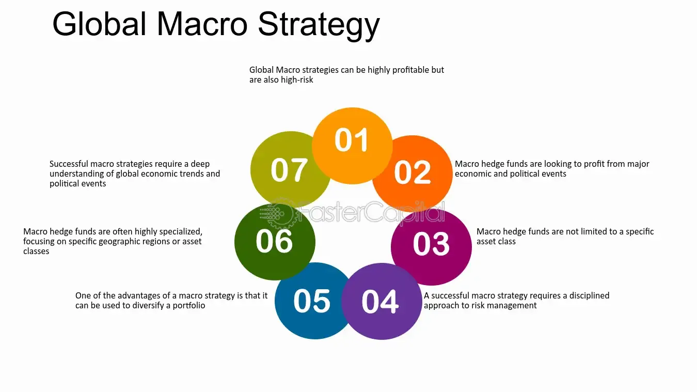

## Table of Contents

## What is a Global Macro Strategy?

A Global Macro Strategy is an investment approach where people try to make money by understanding and betting on big changes in the world. This could be anything from changes in how countries' economies are doing, to shifts in what people buy and sell, or even big events like elections or natural disasters. People using this strategy look at the big picture and try to guess how these events will affect things like stock prices, interest rates, or the value of different currencies.

The main idea behind a Global Macro Strategy is to make smart guesses about how global events will move markets. For example, if someone thinks a country's economy is going to grow a lot, they might buy stocks from that country, expecting the prices to go up. Or, if they think a currency will become weaker, they might sell it or buy another currency that they think will get stronger. This strategy can be risky because it's hard to predict what will happen, but it can also lead to big rewards if the guesses are right.

## How does Global Macro Strategy differ from other investment strategies?

Global Macro Strategy is different from other investment strategies because it focuses on big, worldwide events and trends. Instead of looking at specific companies or industries, people using this strategy try to understand how things like a country's economy, political changes, or even natural disasters might affect markets everywhere. For example, they might guess that a war in one part of the world will make oil prices go up, so they buy oil-related investments. This is different from, say, a value investing strategy, where someone would look for companies that seem underpriced and buy their stocks, hoping the price will go up over time.

Another big difference is that Global Macro Strategy often involves using financial tools like futures, options, and currencies to bet on these big changes. This means the strategy can be riskier but also has the potential for bigger rewards. For instance, if someone thinks the value of the US dollar will drop, they might use these tools to bet against it. In contrast, a strategy like dividend investing focuses on buying stocks that pay regular dividends, aiming for a steady income over time rather than big wins from guessing market movements. So, while other strategies might focus on steady growth or income, Global Macro Strategy is all about making big bets on global changes.

## What are the key components of a Global Macro Strategy?

A Global Macro Strategy is all about looking at the big picture of the world to make investment choices. People who use this strategy pay attention to things like how countries' economies are doing, big political changes, and even natural disasters. They try to guess how these big events will affect markets everywhere. For example, if they think a country's economy will grow a lot, they might buy stocks from that country, hoping the prices will go up. They also look at trends in what people buy and sell around the world, like if there's a big demand for oil or if people are buying more tech gadgets.

Another important part of a Global Macro Strategy is using special financial tools to make bets on these big changes. These tools include things like futures, options, and currencies. For instance, if someone thinks the value of the US dollar will drop, they might use these tools to bet against it. This can be risky because guessing wrong can lead to big losses, but it also means there's a chance for big rewards if the guesses are right. Unlike other strategies that might focus on specific companies or steady income, Global Macro Strategy is all about making big bets on how global events will move markets.

## Who typically uses Global Macro Strategies?

People who use Global Macro Strategies are usually big investors like [hedge fund](/wiki/hedge-fund-trading-strategies) managers and institutional investors. These are folks who manage a lot of money for other people, like pension funds or big investment firms. They have the resources and knowledge to look at the big picture of the world and make guesses about how big events will affect markets. They're not just looking at one company or one country; they're trying to understand how things like a country's economy, political changes, or even natural disasters might change things everywhere.

These investors often use special financial tools like futures, options, and currencies to make their bets. This can be risky because if they guess wrong, they could lose a lot of money. But if they guess right, they could make a lot of money too. That's why Global Macro Strategies are usually used by people who are okay with taking big risks and who have the skills to understand and predict how global events will move markets.

## What are the main economic indicators used in Global Macro Strategy?

People who use Global Macro Strategy pay attention to many big economic signs to help them guess how the world's markets will change. Some of the main things they look at are things like how fast a country's economy is growing, which is often measured by something called Gross Domestic Product (GDP). They also watch the unemployment rate, which tells them how many people are out of work. Another important sign is inflation, which is how much prices for things like food and clothes are going up. Interest rates set by central banks, like the Federal Reserve in the US, are also key because they can affect how much it costs to borrow money and how much people want to spend.

Another set of indicators they use are things that show how much people are buying and selling. For example, they look at retail sales to see if people are spending more or less money on stuff. They also keep an eye on manufacturing orders, which tell them how busy factories are. Trade balances are important too, because they show if a country is selling more stuff to other countries than it's buying, or the other way around. All these signs help investors using Global Macro Strategy to make big guesses about how the world's economies and markets will move, and then they use those guesses to decide where to put their money.

## How do geopolitical events influence Global Macro Strategy?

Geopolitical events are big happenings around the world that can shake up countries and their relationships with each other. Things like wars, elections, and trade deals can change how countries' economies work and how people around the world buy and sell things. For people using Global Macro Strategy, these events are super important because they try to guess how these changes will affect markets everywhere. For example, if there's a war that might mess up oil supplies, they might bet that oil prices will go up and buy oil-related investments.

These investors look at how geopolitical events might change things like interest rates, currency values, and stock prices. If a big election happens and a new leader comes in with different ideas about how to run the country, it could make the country's currency stronger or weaker. Or if countries start fighting over trade, it could make it harder for companies to sell their stuff abroad, which might make their stock prices go down. So, by keeping a close eye on these events, people using Global Macro Strategy try to make smart guesses about how the world's markets will move and then make their investment choices based on those guesses.

## What are the common investment vehicles used in Global Macro Strategy?

People who use Global Macro Strategy often use special tools to make their big guesses about how the world's markets will change. These tools are called investment vehicles. One common type is futures contracts, which let investors bet on what things like oil, gold, or stock indexes will be worth in the future. Another type is options, which give investors the right, but not the obligation, to buy or sell something at a set price before a certain time. These tools can be risky because if the guesses are wrong, investors can lose a lot of money, but they also offer the chance for big wins if the guesses are right.

Another important investment vehicle used in Global Macro Strategy is currencies. Investors might buy or sell different countries' money, guessing that one will become stronger or weaker compared to another. For example, if they think the US dollar will drop in value, they might sell dollars and buy euros instead. They also use exchange-traded funds (ETFs), which are like baskets of investments that track things like stock markets or commodities. These allow investors to bet on whole sectors or markets without having to pick individual stocks or commodities. By using these different tools, people using Global Macro Strategy try to make the most of their big-picture guesses about how the world will change.

## How can one analyze and predict global market trends using Global Macro Strategy?

To analyze and predict global market trends using Global Macro Strategy, people look at big events happening around the world. They pay attention to things like how countries' economies are doing, big political changes, and even natural disasters. By studying these events, they try to guess how they will affect things like stock prices, interest rates, and the value of different currencies. For example, if they think a country's economy will grow a lot, they might buy stocks from that country, expecting the prices to go up. They also look at trends in what people are buying and selling, like if there's a big demand for oil or if people are buying more tech gadgets.

To make these predictions, people using Global Macro Strategy use special tools called investment vehicles. These include futures contracts, which let them bet on what things like oil or stock indexes will be worth in the future. They also use options, which give them the right to buy or sell something at a set price before a certain time. Another tool is currencies, where they might buy or sell different countries' money, guessing that one will become stronger or weaker compared to another. By using these tools and keeping a close eye on global events, they try to make smart guesses about how the world's markets will move and then make their investment choices based on those guesses.

## What are the risks associated with Global Macro Strategy?

Using Global Macro Strategy can be risky because it's all about making big guesses about how the world will change. If someone guesses wrong about things like a country's economy or a big political event, they could lose a lot of money. For example, if they think oil prices will go up because of a war, but the war doesn't affect oil supplies as much as they thought, their investment could lose value. This strategy often involves using special financial tools like futures and options, which can make the risk even bigger because these tools can lead to big losses if the market moves the wrong way.

Another risk is that global events can be hard to predict. Things like elections, natural disasters, or changes in trade policies can be surprising and hard to see coming. Even if someone is really good at understanding the big picture, they might still get it wrong because the world is always changing. This uncertainty means that even the best guesses can sometimes lead to big losses. So, while Global Macro Strategy can offer the chance for big rewards, it also comes with the risk of big losses if the guesses about global trends don't turn out the way investors hoped.

## How does one develop a successful Global Macro Strategy?

To develop a successful Global Macro Strategy, you need to be really good at understanding big events happening around the world. This means keeping up with news about how countries' economies are doing, big political changes, and even natural disasters. You have to think about how these events might change things like stock prices, interest rates, and the value of different currencies. For example, if you think a country's economy will grow a lot, you might buy stocks from that country, expecting the prices to go up. You also need to look at trends in what people are buying and selling, like if there's a big demand for oil or if people are buying more tech gadgets.

Another important part of developing a successful Global Macro Strategy is using the right tools to make your bets. These tools include things like futures contracts, which let you bet on what things like oil or stock indexes will be worth in the future. You also use options, which give you the right to buy or sell something at a set price before a certain time. Another tool is currencies, where you might buy or sell different countries' money, guessing that one will become stronger or weaker compared to another. By using these tools and keeping a close eye on global events, you try to make smart guesses about how the world's markets will move and then make your investment choices based on those guesses.

## What historical examples illustrate the effectiveness of Global Macro Strategy?

One famous example of a successful Global Macro Strategy is when George Soros bet against the British pound in 1992. He thought the pound was too strong and would have to be devalued. So, he borrowed a lot of pounds and sold them, expecting to buy them back later at a lower price. When the British government couldn't keep the pound's value up, Soros made a huge profit, around $1 billion in one day. This showed how understanding big economic trends and making bold moves can lead to big rewards.

Another example is the success of the Quantum Fund, also managed by George Soros, in the late 1980s and early 1990s. The fund made big bets on things like the fall of the Japanese stock market and changes in currency values after the fall of the Berlin Wall. By looking at the big picture and guessing how these events would affect markets, the fund made huge profits. These examples show that a good Global Macro Strategy can be very effective, but it also needs a deep understanding of global events and the courage to make big bets.

## What advanced tools and technologies can enhance the application of Global Macro Strategy?

Advanced tools and technologies can really help people using Global Macro Strategy to make better guesses about how the world's markets will change. One important tool is big data analytics, which lets investors look at huge amounts of information from around the world. This can include things like economic reports, news articles, and even social media posts. By using computers to analyze all this data, investors can spot trends and patterns that might be hard to see otherwise. This helps them understand how big events, like a country's economy growing or a war starting, might affect things like stock prices or currency values.

Another helpful technology is [artificial intelligence](/wiki/ai-artificial-intelligence) (AI) and [machine learning](/wiki/machine-learning). These tools can learn from past data and make predictions about what might happen in the future. For example, AI can look at how markets have reacted to certain events in the past and guess how they might react in the future. This can be really useful for people using Global Macro Strategy because it can help them make smarter bets on things like futures and options. By using AI, investors can get a better idea of how global events might move markets, which can lead to better investment choices and bigger rewards.

## References & Further Reading

[1]: Bergstra, J., Bardenet, R., Bengio, Y., & Kégl, B. (2011). ["Algorithms for Hyper-Parameter Optimization."](https://papers.nips.cc/paper_files/paper/2011/hash/86e8f7ab32cfd12577bc2619bc635690-Abstract.html) Advances in Neural Information Processing Systems 24.

[2]: ["Advances in Financial Machine Learning"](https://www.amazon.com/Advances-Financial-Machine-Learning-Marcos/dp/1119482089) by Marcos Lopez de Prado

[3]: ["Evidence-Based Technical Analysis: Applying the Scientific Method and Statistical Inference to Trading Signals"](https://www.wiley.com/en-gb/Evidence+Based+Technical+Analysis:+Applying+the+Scientific+Method+and+Statistical+Inference+to+Trading+Signals-p-9780470008744) by David Aronson

[4]: ["Machine Learning for Algorithmic Trading"](https://www.amazon.com/Machine-Learning-Algorithmic-Trading-intelligence/dp/9918608013) by Stefan Jansen

[5]: ["Quantitative Trading: How to Build Your Own Algorithmic Trading Business"](https://www.amazon.com/Quantitative-Trading-Build-Algorithmic-Business/dp/0470284889) by Ernest P. Chan