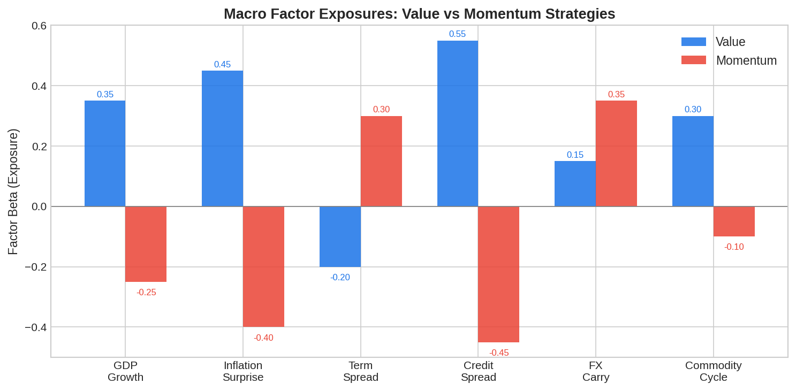
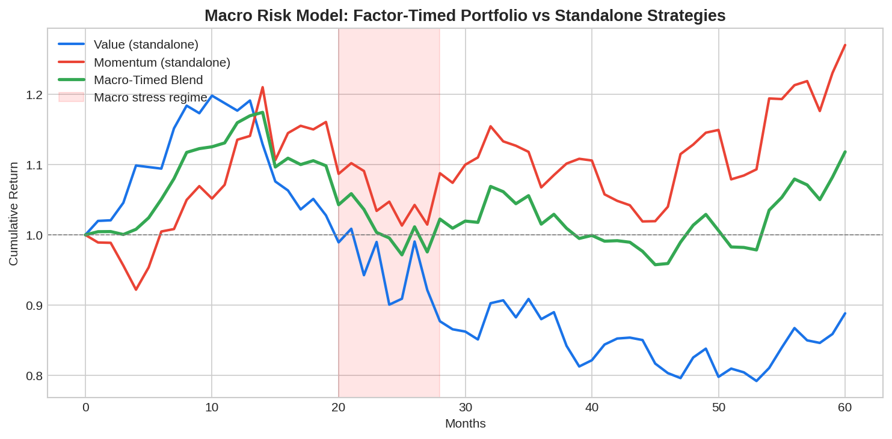

A **global macroeconomic risk model** links the returns of systematic strategies — particularly value and momentum — to underlying macro risk factors like GDP growth, inflation surprises, term spreads, and credit conditions. The key insight, formalized in the academic paper "A Global Macroeconomic Risk Model for Value, Momentum, and Other Asset Classes" (Ilmanen, Israel, and Moskowitz), is that value and momentum strategies carry opposite macro exposures. Value loads positively on pro-cyclical growth factors while momentum loads negatively — explaining both their individual risk premia and their negative correlation, which makes combining them particularly powerful for portfolio construction.

## The Core Idea

Traditional factor models like CAPM or Fama-French explain returns using statistical factors (market, size, value). A macro risk model goes deeper: it asks *why* value earns a premium and *why* momentum works. The answer lies in macroeconomic risk exposure.

The model specifies factor returns as a function of macro state variables:

$$r_{f,t} = \alpha_f + \sum_{k=1}^{K} \beta_{f,k} \cdot M_{k,t} + \epsilon_{f,t}$$

where $r_{f,t}$ is the return of factor $f$ at time $t$, $M_{k,t}$ are macro risk factors, and $\beta_{f,k}$ are the factor's macro exposures.

## Key Macro Risk Factors

The empirical literature identifies several macro variables that drive cross-sectional and time-series variation in factor returns:

| Macro Factor | What It Captures | Value Exposure | Momentum Exposure |
|-------------|-----------------|----------------|-------------------|
| GDP growth surprise | Real economic activity | Positive | Negative |
| Inflation surprise | Price level changes | Positive | Negative |
| Term spread | Yield curve slope | Negative | Positive |
| Credit spread | Default risk premium | Positive | Negative |
| FX carry | Global risk appetite | Moderate positive | Moderate positive |
| Commodity cycle | Real asset inflation | Positive | Negative |

The striking pattern: value and momentum load in **opposite directions** on most macro factors. Value is a pro-cyclical, inflation-sensitive strategy — it performs well when growth is strong and inflation is rising (cheap stocks recover). Momentum is anti-cyclical in a different sense — it thrives in persistent trends but suffers during sharp macro reversals.



## Why Value and Momentum Are Negatively Correlated

This opposite macro exposure is the primary driver of the well-documented negative correlation between value and momentum returns. When growth accelerates, value stocks (typically distressed, cyclical names) recover while momentum portfolios — often long the previous winners — face reversals as market leadership shifts.

The implication for portfolio construction is significant: a combined value-momentum portfolio hedges macro risk more effectively than either strategy alone. This is the quantitative foundation behind balanced factor approaches used by firms like AQR and the [Barra Risk Factor Analysis](https://paperswithbacktest.com/wiki/barra-risk-factor-analysis) framework.

## Building a Macro Factor Timing Model

Beyond explaining factor returns, macro risk models can be used to **time** factor allocations. The idea: when macro indicators signal an environment favorable to value (strong growth, rising inflation), overweight value. When conditions favor momentum (stable trends, low volatility), tilt toward momentum.

A practical implementation uses a regime indicator derived from macro variables:

$$z_t = w_1 \cdot \Delta \text{GDP}_t + w_2 \cdot \Delta \text{CPI}_t + w_3 \cdot \text{TermSpread}_t + w_4 \cdot \text{CreditSpread}_t$$

When $z_t$ is high (strong growth, rising inflation), allocate more to value. When $z_t$ is low or negative, allocate more to momentum.



## Python Implementation: Macro Factor Regression

The following code estimates a macro risk model for value and momentum factor returns:

```python
import numpy as np
from numpy.linalg import lstsq

np.random.seed(42)
T = 120  # 10 years of monthly data

# Simulate macro factors
gdp_growth = np.random.normal(0.02, 0.01, T)
inflation = np.random.normal(0.015, 0.008, T)
term_spread = np.random.normal(0.01, 0.005, T)
credit_spread = np.random.normal(0.02, 0.01, T)

# Stack macro factors
X = np.column_stack([
    np.ones(T),  # intercept
    gdp_growth,
    inflation,
    term_spread,
    credit_spread
])

# Simulate value returns with known macro exposures
value_betas = np.array([0.003, 0.35, 0.45, -0.20, 0.55])
value_returns = X @ value_betas + np.random.normal(0, 0.02, T)

# Simulate momentum returns with opposite exposures
mom_betas = np.array([0.004, -0.25, -0.40, 0.30, -0.45])
mom_returns = X @ mom_betas + np.random.normal(0, 0.025, T)

# Estimate macro betas via OLS
def estimate_macro_model(returns, X):
    betas, residuals, _, _ = lstsq(X, returns, rcond=None)
    y_hat = X @ betas
    ss_res = np.sum((returns - y_hat) ** 2)
    ss_tot = np.sum((returns - returns.mean()) ** 2)
    r_squared = 1 - ss_res / ss_tot
    return betas, r_squared

factor_names = ["Intercept", "GDP Growth", "Inflation", "Term Spread", "Credit Spread"]

for name, rets in [("Value", value_returns), ("Momentum", mom_returns)]:
    betas, r2 = estimate_macro_model(rets, X)
    print(f"\n{name} Factor — Macro Risk Decomposition (R² = {r2:.3f})")
    for fname, b in zip(factor_names, betas):
        print(f"  {fname:>15}: {b:+.4f}")

# Correlation between value and momentum
corr = np.corrcoef(value_returns, mom_returns)[0, 1]
print(f"\nValue-Momentum correlation: {corr:.3f}")

# Macro-timed blend
z = 0.3 * gdp_growth + 0.3 * inflation - 0.2 * term_spread + 0.2 * credit_spread
z_norm = (z - z.mean()) / z.std()
value_weight = 0.5 + 0.2 * np.clip(z_norm, -1, 1)
mom_weight = 1 - value_weight

blend_returns = value_weight * value_returns + mom_weight * mom_returns
sharpe_blend = blend_returns.mean() / blend_returns.std() * np.sqrt(12)
sharpe_value = value_returns.mean() / value_returns.std() * np.sqrt(12)
sharpe_mom = mom_returns.mean() / mom_returns.std() * np.sqrt(12)

print(f"\nAnnualized Sharpe Ratios:")
print(f"  Value only:     {sharpe_value:.3f}")
print(f"  Momentum only:  {sharpe_mom:.3f}")
print(f"  Macro-timed:    {sharpe_blend:.3f}")
```

## Applications for Algo Traders

**Dynamic factor allocation**: Rather than holding static weights to value and momentum, adjust allocations monthly based on macro regime indicators. This is the quantitative version of what discretionary macro traders do intuitively.

**Risk budgeting**: Use macro betas to ensure that portfolio-level macro exposures are balanced. If the portfolio is heavily exposed to GDP growth risk, reduce value weight or add diversifying strategies.

**Stress testing**: Run scenario analysis using the macro model. If inflation spikes 2% above consensus, the model predicts how much each factor will gain or lose — directly informing position sizing.

**Cross-asset extension**: The same macro factors that explain equity value and momentum also explain returns in FX carry, commodity momentum, and bond strategies. Traders building [multi-asset systematic strategies](https://paperswithbacktest.com/wiki/dual-momentum-trading-strategy) can use a unified macro risk framework across all asset classes.

## Limitations and Risks

Macro factor timing is notoriously difficult in practice. Macro data arrives with lags (GDP is revised months later), the relationship between macro variables and factor returns is unstable over time, and overfitting to historical macro regimes is a constant risk. The academic evidence for macro factor timing is mixed — while the macro exposures themselves are robust and statistically significant, using them for out-of-sample timing adds meaningful but not dramatic improvement over static diversification.

The best practical approach is conservative: use macro models to avoid extreme mismatches (don't be massively long value heading into a recession) rather than aggressively timing factor rotations.

## Conclusion

A global macroeconomic risk model reveals that the returns to value and momentum strategies are not statistical artifacts — they are compensation for bearing opposite types of macro risk. Value investors earn a premium for exposure to cyclical downturns and inflation shocks; momentum investors earn a premium for exposure to trend reversals. Understanding these macro exposures enables traders to build more robust multi-factor portfolios, time factor allocations intelligently, and stress-test positions against realistic macro scenarios. This macro-factor framework naturally complements the [Barra risk model](https://paperswithbacktest.com/wiki/barra-risk-factor-analysis) and informs strategies like the [All Weather Portfolio](https://paperswithbacktest.com/wiki/all-weather-portfolio).

---

**Explore further on PapersWithBacktest:**
- Browse [backtested value and momentum strategies](https://paperswithbacktest.com/strategies) with Python code and performance metrics
- Access [clean historical market data](https://paperswithbacktest.com/datasets) for equities, crypto, and futures
- Take the [algo trading course](https://paperswithbacktest.com/course) — 60+ video lessons and notebooks
- Related wiki pages: [Barra Risk Factor Analysis](https://paperswithbacktest.com/wiki/barra-risk-factor-analysis) · [Dual Momentum Trading Strategy](https://paperswithbacktest.com/wiki/dual-momentum-trading-strategy) · [All Weather Portfolio](https://paperswithbacktest.com/wiki/all-weather-portfolio)
