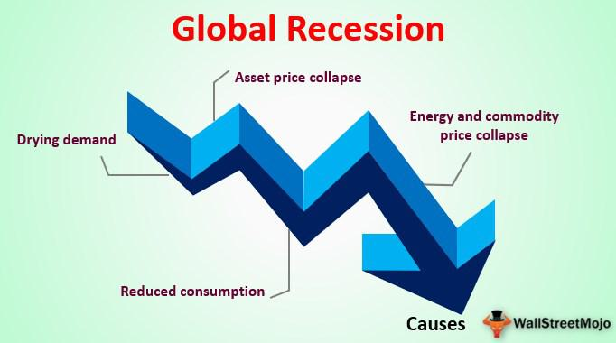

In an interconnected global economy, periods of economic downturn can have widespread and significant impacts. A global recession is defined as a synchronized decline in economic activity across multiple countries, characterized by significant reductions in global trade and investment, as well as increased unemployment rates. This phenomenon is of particular concern because of the interconnected nature of modern economies, where financial and economic disturbances in one region can quickly spread to others, amplifying the effects of the downturn.

Historical examples, such as the Great Depression of 1929-1939 and the Great Recession of 2007-2009, illustrate the profound effects these recessions can have on global economic dynamics. The Great Depression, sparked by a severe stock market crash, led to a decade-long global economic slump, resulting in mass unemployment and deflation. Subsequent policy responses, such as the New Deal in the United States, aimed to mitigate these impacts through economic reforms and interventions. Similarly, the Great Recession was triggered by the collapse of the housing market in the United States and resulted in a global financial crisis, prompting substantial monetary and fiscal policy responses worldwide.



Algorithmic trading, or algo trading, has emerged as a major influence on financial markets during these times. These automated trading systems utilize complex algorithms to make rapid trading decisions, significantly affecting market liquidity and price stability. Although algorithmic trading can provide liquidity and efficiency, its influence during economic downturns is scrutinized due to its potential to exacerbate market volatility.

Understanding the dynamics of economic downturns, the historical context of global recessions, and the evolving role of algo trading is essential to comprehend the broader implications of these economic phenomena. This article aims to explore economic downturns, historical recessions, the role of algo trading in financial markets, and its implications on managing future recessions, providing insights into potential strategies for navigating these complex economic landscapes.

## Table of Contents

## Understanding Global Recessions

A global recession is typically defined as a sustained period during which worldwide economic activity declines significantly. This decline is not limited to a single geographical region but affects multiple countries simultaneously due to the interconnectedness of the global economy. The primary indicator of a global recession is a decrease in the global Gross Domestic Product (GDP) for an extended period, often accompanied by a slowdown in trade, rising unemployment rates, and waning consumer confidence.

Key indicators that are commonly scrutinized to understand the onset and progression of global recessions include:

1. **Global GDP Decline:** A reduction in global GDP is a critical signal of economic contraction on a global scale. Analysts often look for consistent negative growth rates over several quarters to identify a recessionary trend.

2. **Trade and Investment:** During global recessions, international trade volumes often diminish as countries face reduced demand for exports, and investment flows retract due to heightened uncertainty and risk aversion among investors.

3. **Employment:** Increasing unemployment is a vital indicator, as economic downturns generally lead to reduced production and service activity, prompting layoffs and hiring freezes.

4. **Aggregate Demand and Supply Shocks:** Recessions can occur due to shocks in aggregate demand or supply. Demand shocks might occur due to decreased consumer confidence, while supply shocks could result from disruptions like supply chain breaks or increases in commodity prices.

The International Monetary Fund (IMF) employs several criteria to assess whether the global economy is experiencing a recession. One approach involves analyzing comprehensive economic data from a multitude of countries to identify synchronized declines in economic output, trade, capital flows, and labor markets.

Global recessions are characterized by synchronized economic disruptions emerging from the interdependent nature of financial systems worldwide. The complex web of international financial markets means that economic challenges in one major economy can rapidly propagate to others, leading to broader economic instability. For instance, financial contagion can occur when banking systems experience distress, prompting simultaneous contractions in credit availability across multiple economies.

Moreover, the IMF often uses quantitative thresholds to define a global recession, such as a decline in global output per capita or negative growth observed concurrently in a significant portion of the world economy. This multifaceted analysis helps policymakers and financial institutions formulate coordinated policies to mitigate the adverse impacts of such recessions and support a quicker recovery.

## Historical Examples of Global Recessions

The Great Depression (1929-1939) is often recognized as the most severe global recession in modern history, characterized by drastic declines in consumer spending, investment, and industrial production. It began in the United States following the stock market crash of October 1929 and quickly spread worldwide, leading to unprecedented unemployment rates and significant deflationary pressures. The global nature of economic interconnections during this period exacerbated the downturn, further illustrating the pervasive effects of such economic catastrophes. Government interventions, such as the New Deal policies in the United States, were pivotal responses aimed at economic recovery and reform, influencing future economic policy frameworks worldwide. 

The Great Recession, occurring between 2007 and 2009, was primarily triggered by the collapse of the housing market in the United States. This collapse resulted from the bursting of a housing bubble fueled by high-risk mortgage lending and the rapid proliferation of mortgage-backed securities. As the housing market deteriorated, financial institutions suffered significant losses, leading to a banking crisis that required substantial government intervention, including bailouts and monetary policy adjustments. The global financial system's interconnectedness meant that distress in U.S. financial markets had a cascading effect internationally, resulting in a substantial global economic contraction. The recession spurred regulatory reforms aimed at increasing the resilience of financial markets and reducing systemic risks.

In 2020, the International Monetary Fund (IMF) declared a global recession prompted by the economic impacts of the COVID-19 pandemic. Unlike previous recessions, this downturn was incited by a health crisis, leading to lockdowns and widespread disruptions in global supply chains. The pandemic-induced recession saw unprecedented economic contractions as industries such as travel, hospitality, and manufacturing experienced significant setbacks. In response, governments and central banks worldwide implemented expansive fiscal and monetary policies to mitigate the pandemic's adverse effects and stimulate recovery. This recent recession highlighted the vulnerabilities of globalized economies to non-economic shocks and underscored the importance of rapid and coordinated policy responses.  

These historical instances demonstrate the ability of global recessions to shape economic policies. They underscore the necessity for effective regulatory frameworks and coordinated international efforts to mitigate the impacts of future downturns. Through analyzing past recessions, policymakers can derive insights into crafting resilient economic strategies that can withstand future disruptions.

## Economic Downturns: Causes and Indicators

Economic downturns are often precipitated by a variety of factors including financial crises, geopolitical events, and unexpected global occurrences. These downturns can lead to significant disruptions in national and global economies. Financial crises, such as banking failures or stock market crashes, can severely affect [liquidity](/wiki/liquidity-risk-premium) and credit availability, leading to a contraction in economic activity. Geopolitical events, including wars and political instability, can disrupt trade and investment, affecting economic growth. Additionally, unforeseen global occurrences like natural disasters or pandemics can suddenly shock economies, leading to declines in key economic indicators.

Several indicators help identify and anticipate economic downturns. A decline in Gross Domestic Product (GDP) is one of the primary indicators of an economic slowdown. GDP measures the total value of goods and services produced over a specific time period and provides a comprehensive overview of economic activity. A sustained decrease in GDP signifies reduced economic output and can be indicative of an impending recession.

Employment levels are another critical indicator. Rising unemployment rates typically accompany economic downturns as companies may cut back on hiring or lay off workers in response to decreased demand. This rise in unemployment can lead to a vicious cycle of reduced consumer spending, further stalling economic growth.

Consumer confidence also serves as a valuable gauge for economic health. High consumer confidence typically correlates with increased spending, as individuals feel secure in their financial prospects. Conversely, a drop in consumer confidence can result in decreased spending and saving, contributing to an economic slowdown. Surveys conducted by organizations such as the Conference Board and the University of Michigan often provide insights into consumer sentiment and spending intentions.

Understanding these indicators allows policymakers, investors, and economists to better anticipate and respond to potential economic downturns. For example, policy interventions such as fiscal stimulus or monetary easing can be strategically deployed to mitigate the effects of an impending downturn. Additionally, businesses can utilize this knowledge to adjust their strategies, preserving financial stability during turbulent economic times.

## Algorithmic Trading During Economic Downturns

Algorithmic trading, or algo trading, involves the use of computerized systems and algorithms to execute trades on financial markets with minimal human intervention. In times of economic downturns, the role of [algorithmic trading](/wiki/algorithmic-trading) is closely examined due to its dual capacity to either stabilize or destabilize financial markets. During such periods, markets tend to become more volatile, and the actions performed by these trading algorithms can have significant implications on market dynamics.

One of the primary advantages of algorithmic trading during economic downturns is its ability to provide liquidity. Liquidity refers to the ease with which securities can be bought or sold without causing significant changes in their prices. In volatile markets, the presence of algorithmic traders can facilitate smoother transactions by continuously offering buy and sell orders, thus ensuring that market participants can execute trades without causing drastic price fluctuations.

However, the same characteristics that enable algorithms to provide liquidity can also contribute to market instability. This occurs due to the high-speed nature of algorithmic trading, where trading decisions are made and executed in fractions of a second based on predefined criteria. In uncertain market conditions, these algorithms may trigger rapid sequences of buy or sell orders in response to unfavorable trends or anomalies detected by the trading logic. Such reactions can lead to a feedback loop, exacerbating price movements and increasing overall market [volatility](/wiki/volatility-trading-strategies).

A prominent example demonstrating the impact of algorithmic trading during volatile periods is the "Flash Crash" of May 6, 2010. During this event, the Dow Jones Industrial Average plummeted by about 1,000 points within minutes, only to partially recover shortly thereafter. Investigations revealed that a combination of factors, including algorithmic trading, played a role in the excessive volatility experienced that day. Algorithms interacting with each other created a chain reaction of rapid selling, illustrating the potential risks associated with their use during high-stress market conditions.

To mitigate such risks, regulatory bodies have instituted measures aimed at enhancing the resilience of financial markets against the destabilizing effects of algorithmic trading. These measures include circuit breakers, which temporarily halt trading on exchanges during extreme market movements, and stricter oversight of algorithmic trading practices.

In conclusion, while algorithmic trading can provide substantial benefits in terms of liquidity provision, its potential to exacerbate volatility during economic downturns necessitates careful monitoring and regulation. Balancing the advantages of rapid automated trading with effective risk management strategies remains crucial for maintaining market stability in turbulent times.

## Can Algorithmic Trading Predict Economic Downturns?

Advancements in [artificial intelligence](/wiki/ai-artificial-intelligence) (AI) and [machine learning](/wiki/machine-learning) (ML) have significantly enhanced the capabilities of algorithmic trading in analyzing vast amounts of economic data. These algorithms are designed to identify patterns, trends, and anomalies in the data, which can serve as early warning signs of economic downturns. By processing large datasets, including historical market data, macroeconomic indicators, and real-time financial news, these algorithms can uncover signals that may precede economic declines.

A typical approach involves the use of predictive modeling techniques such as time series analysis, regression models, and neural networks. For instance, time series models like ARIMA (AutoRegressive Integrated Moving Average) can be used to forecast future values based on past behavior. Neural networks, particularly [deep learning](/wiki/deep-learning) models, have the ability to learn and distinguish complex nonlinear relationships within the data, making them suitable for predicting market trends and detecting potential downturns.

```python
import numpy as np
import pandas as pd
from sklearn.preprocessing import MinMaxScaler
from keras.models import Sequential
from keras.layers import Dense, LSTM

# Load economic data
data = pd.read_csv("economic_data.csv")
values = data['indicator'].values

# Scale data
scaler = MinMaxScaler(feature_range=(0, 1))
scaled_values = scaler.fit_transform(values.reshape(-1, 1))

# Prepare training and testing data
train_size = int(len(scaled_values) * 0.8)
train, test = scaled_values[0:train_size], scaled_values[train_size:len(scaled_values)]
X_train, y_train = train[:-1], train[1:]
X_test, y_test = test[:-1], test[1:]

# Reshape for LSTM input
X_train = np.reshape(X_train, (X_train.shape[0], 1, X_train.shape[1]))
X_test = np.reshape(X_test, (X_test.shape[0], 1, X_test.shape[1]))

# Build LSTM model
model = Sequential()
model.add(LSTM(50, return_sequences=True, input_shape=(X_train.shape[1], 1)))
model.add(LSTM(50))
model.add(Dense(1))
model.compile(optimizer='adam', loss='mean_squared_error')

# Train the model
model.fit(X_train, y_train, epochs=100, batch_size=32, verbose=2)

# Predict
predictions = model.predict(X_test)
```

Despite these advancements, the inherent complexity of economic systems poses a significant challenge in achieving accurate predictions. Economic environments are influenced by a myriad of factors, including political events, regulatory changes, and unforeseen natural disasters, which are difficult for any algorithm to account for fully. The interplay of these elements creates a level of uncertainty that even the most sophisticated algorithms cannot entirely eliminate.

Research is ongoing to enhance the predictive accuracy of algorithmic trading by integrating more refined models that can incorporate a broader range of data inputs and better simulate the intricate dynamics of global markets. Hybrid models that combine AI with econometric methods are being explored to improve the robustness of predictions. Additionally, efforts are being made to develop real-time adaptive algorithms capable of adjusting to new information as it becomes available.

In summary, while algorithmic trading systems equipped with AI and ML have the potential to foresee economic downturns, the multifaceted nature of global economies means that completely accurate predictions remain a formidable challenge. Future developments aim to refine these systems for improved forecasting capabilities, providing valuable tools for preemptive economic strategies.

## The Future of Algo Trading in Economic Depressions

Algorithmic trading is increasingly pivotal in navigating economic depressions, with technological advancements anticipated to further broaden its capabilities. As financial markets become more complex and interconnected, the role of algorithmic trading systems is likely to expand, offering new solutions for managing economic downturns.

One area of significant potential growth is enhanced risk assessment. Future developments in algo trading may focus on creating algorithms capable of more sophisticated risk analysis, integrating extensive real-time data from various sources. This could allow traders to evaluate the potential impacts of economic disturbances more accurately, enabling more informed decision-making processes.

In addition to risk assessment, algorithmic trading systems are expected to achieve quicker market response capabilities. Advancements in processing power and data transmission could lead to reduced latency in trade execution, allowing traders to capitalize on market movements with greater speed and efficiency. This increased responsiveness could help in stabilizing markets by providing liquidity during periods of volatility, thereby reducing the severity of economic contractions.

Moreover, the integration of algorithmic trading with advanced economic forecasting tools presents significant opportunities for anticipating economic conditions. By leveraging data from econometric models, machine learning algorithms, and macroeconomic indicators, algorithmic trading systems could offer predictive insights into potential economic downturns. For example, a machine learning model could be trained on historical economic data to identify patterns associated with past recessions, and then applied to current data to predict future downturns.

A simple Python example illustrating a potential approach might include using available economic datasets to train a predictive model:

```python
from sklearn.ensemble import RandomForestRegressor
from sklearn.model_selection import train_test_split
from sklearn.metrics import mean_squared_error
import numpy as np

# Sample dataset with hypothetical economic indicators
X = np.random.rand(100, 5)  # Features: e.g., GDP growth, inflation rate
y = np.random.rand(100)  # Target: e.g., market index change

# Split dataset into training and testing
X_train, X_test, y_train, y_test = train_test_split(X, y, test_size=0.2, random_state=42)

# Train a random forest model
model = RandomForestRegressor(n_estimators=100, random_state=42)
model.fit(X_train, y_train)

# Predict on the test set
predictions = model.predict(X_test)
mse = mean_squared_error(y_test, predictions)

print(f'Mean Squared Error of the model: {mse}')
```

This example illustrates the concept of using machine learning to model and predict economic impacts, a foundational aspect of future algo trading systems.

Overall, the future of algorithmic trading in economic depressions is shaped by its expanding role in risk management, rapid market engagement, and enhanced forecasting abilities. These innovations underscore the necessity for continuous advancements in AI and machine learning, coupled with a robust regulatory framework to address potential risks and ensure market stability.

## Conclusion

In the context of economic downturns, recognizing the influence of algorithmic trading is pivotal for crafting robust financial strategies. Algorithmic trading, a mechanism that executes trades at speeds and frequencies difficult for humans to replicate, exerts a significant impact on market dynamics, particularly during periods of economic volatility. As technological advancements in Artificial Intelligence (AI) and Machine Learning (ML) progress, the potential of algo trading to anticipate economic shifts increases.

AI and ML algorithms have shown promise in enhancing the predictive capabilities of algo trading by processing vast datasets to identify trends and patterns indicative of economic changes. For instance, employing sophisticated models like neural networks can improve the ability to forecast downturns by analyzing historical and real-time economic data. The predictive power of these technologies, however, is constrained by the inherent complexity and interconnectedness of global economic systems. 

Moreover, the benefits of technological innovation in algo trading must be balanced with effective regulatory oversight to mitigate associated risks, such as exacerbating market volatility or enabling unfair trading practices. Proper regulatory frameworks can ensure that these advancements contribute to market stability rather than detracting from it. 

In summary, understanding the dual role of algorithmic trading in both exploiting and influencing economic downturns is essential for developing effective financial strategies. By combining AI and ML advancements with sound regulatory policies, the financial sector can harness the power of algorithmic trading to better navigate future economic challenges.

## References & Further Reading

[1]: ["Manias, Panics, and Crashes: A History of Financial Crises"](https://link.springer.com/book/10.1057/9780230628045) by Charles P. Kindleberger and Robert Z. Aliber

[2]: Reinhart, C. M., & Rogoff, K. S. (2009). ["This Time is Different: Eight Centuries of Financial Folly"](https://www.nber.org/system/files/working_papers/w13882/w13882.pdf). Princeton University Press.

[3]: Elliot, L., & Atkinson, D. (2008). ["The Gods That Failed: How Blind Faith in Markets Has Cost Us Our Future"](https://www.semanticscholar.org/paper/The-gods-that-failed-%3A-how-blind-faith-in-markets-Elliott-Atkinson/47cd25d7163d21640dd7de9862a889614809e19d). Bodley Head.

[4]: Niederhoffer, V. (1997). ["The Education of a Speculator"](https://archive.org/details/educationofspecu0000nied). John Wiley & Sons.

[5]: Khandani, A. E., & Lo, A. W. (2007). ["What Happened To The Quants In August 2007?"](https://web.mit.edu/Alo/www/Papers/august07.pdf) Journal of Investment Management.