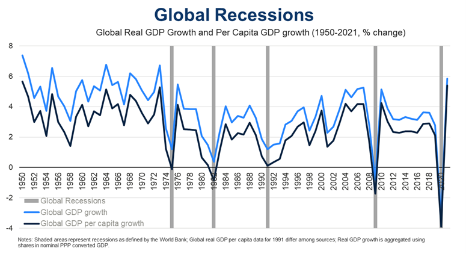

## Table of Contents

## What is a global recession?

A global recession is when the economy of the whole world slows down. It means that many countries are not doing well economically at the same time. People might lose their jobs, businesses might make less money, and it can be harder for people to buy things they need or want.

This happens because countries all over the world are connected through trade and finance. If one big economy, like the United States or China, starts to struggle, it can affect other countries too. For example, if fewer people in the U.S. are buying cars, then the countries that make car parts might sell less and their economies can slow down too. This chain reaction can lead to a global recession.

## How is a global recession defined economically?

A global recession is defined economically when the world's economy shrinks for a while. This happens when the total value of all goods and services produced around the world, called global gross domestic product (GDP), goes down for at least two quarters in a row. It's a sign that the world's economy is not doing well because countries are not making or selling as much as before.

Economists also look at other signs to confirm a global recession. They check if many countries are experiencing a recession at the same time, which means their own GDPs are falling. They also watch for high unemployment rates, where many people can't find jobs, and a drop in international trade, where countries are buying and selling less from each other. When these things happen together, it's a clear sign of a global recession.

## What are the common causes of global recessions?

Global recessions often start because of big problems in the economy. One common cause is a financial crisis, like when banks and other financial companies make bad loans or investments that fail. This can lead to a lot of people losing money and businesses not being able to borrow money to grow. Another cause can be a big drop in demand for goods and services. If people around the world start spending less money, businesses sell less, and this can slow down the whole world's economy.

Sometimes, global recessions happen because of things that affect many countries at the same time, like a big increase in oil prices. If oil gets really expensive, it costs more to move goods around the world, and this can make everything more expensive. Wars, natural disasters, or global health crises, like a pandemic, can also cause a global recession. These events can disrupt trade and make it hard for businesses to operate, leading to less production and fewer jobs.

In summary, global recessions can be triggered by a mix of financial troubles, drops in demand, and big events that impact the whole world. When these things happen, they can create a chain reaction that slows down the global economy.

## Can you list some major global recessions in history?

One big global recession happened in the 1930s. It's called the Great Depression. It started in the United States when the stock market crashed in 1929. People lost a lot of money, and many banks failed. This made it hard for businesses to get loans, so they had to close or lay off workers. The problems spread to other countries because they traded with the U.S. and couldn't sell their goods anymore. This led to high unemployment and poverty all over the world. The Great Depression lasted for about ten years and changed how countries managed their economies.

Another major global recession happened in 2007-2009. It's known as the Global Financial Crisis. It started in the U.S. with problems in the housing market. Banks had given out too many risky loans, and when people couldn't pay them back, the banks lost a lot of money. This caused a panic, and many banks failed or needed help from the government. The crisis quickly spread to other countries because banks and businesses around the world were connected. Stock markets fell, businesses closed, and many people lost their jobs. Governments had to work together to fix the problem and help their economies recover.

There was also a global recession in 2020 caused by the COVID-19 pandemic. When the virus spread around the world, many countries had to close businesses and tell people to stay home to stop the spread. This led to a sharp drop in economic activity because people couldn't go to work or spend money like they used to. The travel and tourism industries were hit especially hard. Governments had to spend a lot of money to help people and businesses survive. This recession was different because it was caused by a health crisis, but it still led to job losses and economic problems worldwide.

## How do global recessions impact different countries?

Global recessions can affect countries in different ways depending on how strong their economy is and how much they trade with other countries. For countries with strong economies, a global recession might mean slower growth and more people out of work, but they can usually handle it better because they have more resources and better ways to help their people. For example, they might have money saved up or be able to borrow money to help businesses and workers. Countries that rely a lot on trade with other countries can be hit harder because if other countries are buying less, their own businesses will sell less and might have to close or lay off workers.

Countries with weaker economies can face even bigger problems during a global recession. They might not have the money or resources to help their people as much, so more people could lose their jobs and have a hard time finding new ones. This can lead to more poverty and make it harder for the country to recover. Also, if a country has a lot of debt, a global recession can make it even harder for them to pay it back because their economy is not making as much money. In the end, global recessions can make the gap between rich and poor countries even bigger.

## What are the typical economic indicators of a global recession?

When the world is in a global recession, you can see it in a few key ways. One big sign is that the total amount of stuff the world makes and sells, called global GDP, goes down for at least two quarters in a row. This means that countries all over the world are not producing as much as they used to. Another sign is that many countries are going through a recession at the same time, which means their own GDPs are also falling. This shows that the problem is not just in one place, but everywhere.

Another important indicator is the unemployment rate. During a global recession, more people in many countries lose their jobs and have a hard time finding new ones. This is because businesses are not doing as well and don't need as many workers. Also, you can see a drop in international trade. Countries buy and sell less from each other because people are spending less money. When these things happen together, it's a clear sign that the world is in a global recession.

## How do global recessions affect global trade?

Global recessions make global trade go down a lot. When the world's economy is in a recession, people in many countries have less money to spend. This means they buy less stuff, and businesses that sell things to other countries sell less too. If a country like the United States is in a recession, it will buy fewer cars from Japan or fewer clothes from Bangladesh. This hurts the economies of those countries because they rely on selling their goods to other countries.

Also, during a global recession, it can be harder for businesses to get the money they need to buy things from other countries. Banks might be more careful about giving out loans because they're worried about the economy. This means businesses might not be able to buy as many raw materials or parts from other countries, which slows down global trade even more. In the end, a global recession makes the world trade less, which can make the recession last longer.

## What measures can governments take to mitigate the effects of a global recession?

When a global recession hits, governments can do a few things to help their country's economy. One big thing they can do is spend more money on projects that create jobs, like building roads or schools. This is called fiscal policy. By spending more, the government can help people who are out of work find new jobs, and this can help the economy start growing again. Governments can also cut taxes or give people more money to spend, which can encourage them to buy more things and help businesses sell more.

Another way governments can help is by working with their central bank to make borrowing money easier. This is called monetary policy. The central bank can lower interest rates, which makes it cheaper for businesses to borrow money to grow or for people to buy things like houses or cars. By making borrowing easier, the government can help keep the economy moving even when times are tough. Together, these actions can help a country recover from a global recession and get back on track.

## How do international organizations like the IMF and World Bank respond to global recessions?

When a global recession happens, the International Monetary Fund (IMF) and the World Bank step in to help countries that are struggling. The IMF gives out loans to countries that need money to keep their economies going. These loans can help countries pay for important things like healthcare and education, even when they're not making as much money. The IMF also gives advice to countries on how to fix their economies and get back on track. They might suggest ways to make businesses grow or to help people find jobs.

The World Bank also helps by giving loans and grants to poorer countries. They focus on projects that can help people in the long run, like building better roads or improving schools. During a global recession, the World Bank might give more money to these projects to help keep them going, even when money is tight. Both the IMF and the World Bank work together to make sure that countries around the world can recover from a global recession and start growing again.

## What role do monetary policies play during a global recession?

During a global recession, central banks use monetary policies to help their countries' economies. One main thing they do is lower interest rates. When interest rates go down, it becomes cheaper for people and businesses to borrow money. This can encourage people to buy things like houses or cars, and businesses to invest in new projects. By making borrowing easier, central banks hope to get more money moving in the economy, which can help create jobs and make businesses grow again.

Central banks might also use other tools like buying government bonds. This is called quantitative easing. When they buy bonds, they put more money into the economy, which can help businesses and people spend more. These actions can be really important during a global recession because they can help stop the economy from getting worse and help it start recovering. By working together with their governments, central banks can use monetary policies to make a big difference during tough economic times.

## How have global recessions influenced economic theories and policies over time?

Global recessions have changed how people think about the economy and how governments try to fix problems. One big example is the Great Depression in the 1930s. It made economists like John Maynard Keynes come up with new ideas. Keynes said that when the economy is in trouble, governments should spend more money to help people and businesses. This idea changed how countries handle recessions. Now, many governments use these ideas to create jobs and help their economies grow again when times are tough.

Another big change came after the Global Financial Crisis in 2007-2009. This crisis showed that banks and other financial companies can cause big problems if they're not careful. So, new rules were made to make sure banks don't take too many risks. Governments also started working together more to fix global economic problems. They realized that what happens in one country can affect the whole world, so they need to help each other out. These changes have made economic policies around the world more focused on preventing and dealing with global recessions.

## What are the long-term effects of global recessions on global economic structures?

Global recessions can change how the world's economy works in big ways. When a global recession hits, it can show that some parts of the economy are not strong enough. For example, after the 2007-2009 financial crisis, people saw that banks needed better rules to stop them from taking too many risks. This led to new laws and ways of watching over banks to make sure they don't cause another big problem. Also, countries started working together more to help each other out during tough times. This means they share more information and try to fix problems together, which can make the world's economy more stable in the long run.

Another long-term effect of global recessions is that they can make some countries weaker and others stronger. When a recession happens, countries with strong economies can help their people more easily. They can spend money on projects that create jobs and help businesses grow again. But countries with weaker economies might struggle more and take longer to recover. This can make the gap between rich and poor countries even bigger. Over time, this can change how countries trade with each other and how they work together in the global economy.

## References & Further Reading

[1]: ["Manias, Panics, and Crashes: A History of Financial Crises"](https://link.springer.com/book/10.1057/9780230628045) by Charles P. Kindleberger and Robert Z. Aliber

[2]: Reinhart, C. M., & Rogoff, K. S. (2009). ["This Time is Different: Eight Centuries of Financial Folly"](https://www.nber.org/system/files/working_papers/w13882/w13882.pdf). Princeton University Press.

[3]: Elliot, L., & Atkinson, D. (2008). ["The Gods That Failed: How Blind Faith in Markets Has Cost Us Our Future"](https://www.semanticscholar.org/paper/The-gods-that-failed-%3A-how-blind-faith-in-markets-Elliott-Atkinson/47cd25d7163d21640dd7de9862a889614809e19d). Bodley Head.

[4]: Niederhoffer, V. (1997). ["The Education of a Speculator"](https://archive.org/details/educationofspecu0000nied). John Wiley & Sons.

[5]: Khandani, A. E., & Lo, A. W. (2007). ["What Happened To The Quants In August 2007?"](https://web.mit.edu/Alo/www/Papers/august07.pdf) Journal of Investment Management.