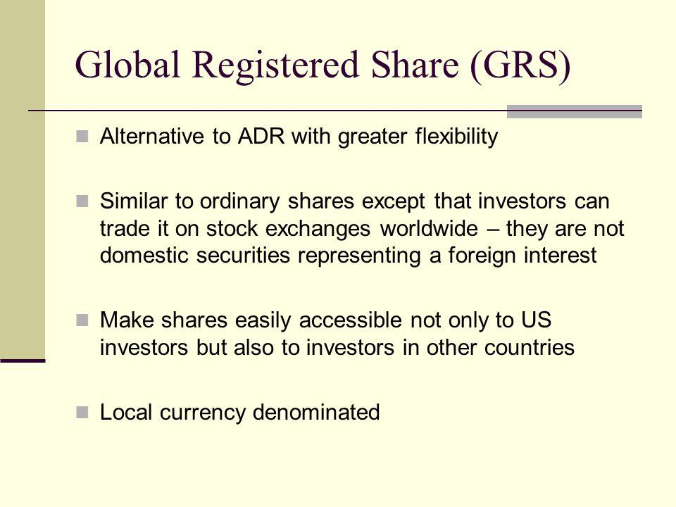

## Table of Contents

## What is a Global Registered Share?

A Global Registered Share is a type of stock that a company issues to shareholders. It is called "global" because it can be owned by people from different countries. The term "registered" means that the company keeps a record of who owns these shares. This helps the company know who its shareholders are and makes it easier to send them important information or dividends.

These shares are different from bearer shares, where ownership is not recorded by the company. With global registered shares, if you want to sell your shares, you need to update the company's records to show the new owner. This can make buying and selling a bit more complicated, but it also adds a layer of security and transparency, which can be good for both the company and the shareholders.

## How does a Global Registered Share differ from other types of shares?

A Global Registered Share is different from other types of shares mainly because it can be owned by people all around the world. This means someone in Japan, for example, can own the same type of share as someone in Brazil. Also, with Global Registered Shares, the company keeps a list of who owns the shares. This is different from bearer shares, where anyone who holds the share certificate is considered the owner, and the company doesn't keep track of who owns what.

Another difference is how you transfer ownership. With Global Registered Shares, if you want to sell your shares to someone else, you need to tell the company so they can update their records. This can take a bit more time and effort compared to bearer shares, where you can just hand over the certificate to the new owner. However, this extra step can make things safer and clearer for everyone involved, as the company always knows who the shareholders are.

Lastly, Global Registered Shares can be compared to other types of shares like common or preferred shares. While common and preferred shares focus more on the rights and benefits shareholders get, like voting rights or dividend payments, Global Registered Shares focus more on who can own them and how ownership is recorded. So, a company might issue Global Registered Shares that are either common or preferred, combining the features of both.

## What are the basic advantages of owning Global Registered Shares?

One big advantage of owning Global Registered Shares is that they are easy to keep track of. Since the company knows exactly who owns the shares, it's simple for them to send you important news or dividends. This also means if you lose your share certificate, you don't need to worry as much because the company can still prove you own the shares. It's like having a safety net for your investment.

Another advantage is that Global Registered Shares can be owned by people from all over the world. This means you can invest in a company no matter where you live. It opens up more opportunities for you to put your money into different companies and possibly make more money. Plus, knowing that the company keeps good records can make you feel more secure about your investment.

## Can you explain the process of issuing Global Registered Shares?

When a company wants to issue Global Registered Shares, it starts by deciding how many shares it wants to create. The company then works with a stock exchange or a financial institution to handle the process. They make sure everything follows the rules of the countries where the shares will be sold. Once everything is ready, the company issues the shares and records who owns them in a special register. This way, they know exactly who their shareholders are from the start.

After the shares are issued, if someone wants to buy them, they go through a broker or a financial institution. The buyer pays for the shares, and the company updates its register to show the new owner. This keeps everything clear and up-to-date. If someone wants to sell their shares, they also go through a broker, and the company updates the register again to show the new owner. This process makes sure that the company always knows who owns the shares, no matter where in the world the owners live.

## What are the key regulatory considerations for Global Registered Shares?

When a company decides to issue Global Registered Shares, it has to follow the rules of the countries where these shares will be sold. Different countries have different rules about how companies can sell shares and who can buy them. The company needs to make sure it understands and follows all these rules. This might mean working with lawyers or financial experts who know the laws in different places. They need to make sure everything is done correctly so the company doesn't get into trouble.

Another important thing is keeping the shareholder register up to date. The company must keep good records of who owns the shares and update them whenever shares are bought or sold. This is important for following the rules and also for sending out information and dividends to the right people. The company might need to report this information to regulators in different countries, so it's crucial to keep everything accurate and current. This helps make sure the company stays in good standing with the law and keeps trust with its shareholders.

## How do Global Registered Shares impact corporate governance?

Global Registered Shares can make corporate governance better because the company knows exactly who its shareholders are. This means the company can easily send important information and dividends to the right people. It also helps the company follow the rules in different countries, which can make shareholders feel more secure about their investment. When shareholders feel secure, they might be more likely to stay invested in the company, which can be good for the company's stability.

However, managing Global Registered Shares can also be more work for the company. They need to keep the shareholder register up to date, which means more paperwork and possibly more costs. The company also has to make sure they follow the rules in all the countries where the shares are sold. This can be tricky and might require hiring experts to help. But if the company does this well, it can build trust with its shareholders and make the company stronger overall.

## What historical events led to the development of Global Registered Shares?

Global Registered Shares started to become popular as companies began to do business all over the world. Before, companies mostly sold shares to people in their own country. But as trade grew and technology got better, companies wanted to let people from different countries buy their shares too. This helped companies get more money to grow their business. The idea of keeping a record of who owned the shares also became more important. It made things clearer and safer for everyone involved.

One big event that pushed for Global Registered Shares was the need for better ways to track who owned shares after some big financial problems. In the past, some people used bearer shares to hide money or do illegal things because no one knew who owned them. Governments and companies saw that having a clear record of shareholders could stop this kind of problem. So, they started using Global Registered Shares more often. This helped make the stock market more honest and safe, which was good for companies and investors around the world.

## How have Global Registered Shares evolved over time?

Global Registered Shares started to become popular as companies began to do business all over the world. Before, companies mostly sold shares to people in their own country. But as trade grew and technology got better, companies wanted to let people from different countries buy their shares too. This helped companies get more money to grow their business. The idea of keeping a record of who owned the shares also became more important. It made things clearer and safer for everyone involved.

One big event that pushed for Global Registered Shares was the need for better ways to track who owned shares after some big financial problems. In the past, some people used bearer shares to hide money or do illegal things because no one knew who owned them. Governments and companies saw that having a clear record of shareholders could stop this kind of problem. So, they started using Global Registered Shares more often. This helped make the stock market more honest and safe, which was good for companies and investors around the world.

Over time, the use of technology has made it even easier for companies to keep track of their Global Registered Shares. Now, companies can use computers and the internet to update their shareholder records quickly and easily. This makes the process of buying and selling shares smoother and more secure. As more countries work together on financial rules, Global Registered Shares have become a common way for companies to raise money from people all around the world.

## What are the tax implications of investing in Global Registered Shares?

When you invest in Global Registered Shares, you need to think about taxes in different countries. If you live in one country and the company you're investing in is in another, you might have to pay taxes in both places. This can get complicated because each country has its own rules about taxes on investments. For example, some countries might take a part of your dividends as tax, while others might tax the money you make when you sell your shares.

To make things easier, many countries have agreements called tax treaties. These treaties help make sure you don't get taxed twice on the same money. You might need to fill out some forms to get this benefit, but it can save you a lot of money. It's always a good idea to talk to a tax expert who knows about international investments. They can help you understand what you need to do and make sure you're not paying more tax than you have to.

## How do Global Registered Shares facilitate international investment?

Global Registered Shares make it easier for people from different countries to invest in a company. Because these shares can be owned by anyone around the world, someone in Japan can buy shares in a company based in Brazil, for example. This opens up more opportunities for investors to put their money into different companies and possibly make more money. It also helps companies raise money from people all over the world, which can be really helpful for growing their business.

Another way Global Registered Shares help with international investment is by keeping good records. Since the company keeps track of who owns the shares, it's easier to send important information and dividends to the right people, no matter where they live. This makes investors feel more secure because they know the company is keeping everything clear and up-to-date. It also helps the company follow the rules in different countries, which can build trust with investors and make the company stronger overall.

## What are the potential risks associated with Global Registered Shares?

One risk of Global Registered Shares is that they can be more complicated to buy and sell. Because the company keeps a record of who owns the shares, you need to tell the company whenever you want to sell your shares. This can take more time and might cost more money than with other types of shares. If you're not used to dealing with these kinds of rules, it can be a bit confusing.

Another risk is that you might have to pay taxes in different countries. If you live in one country and the company you're investing in is in another, you could end up paying taxes in both places. This can make things tricky because each country has its own tax rules. Even though there are tax treaties to help, it can still be a lot to figure out and might mean you need to hire a tax expert, which costs money.

## What advanced strategies can investors use with Global Registered Shares to optimize their portfolios?

Investors can use Global Registered Shares to spread their money across different countries and industries. This is called diversification. By owning shares in companies from around the world, investors can lower the risk of losing money if one country's economy does badly. They can also take advantage of growth in different parts of the world. For example, if an investor thinks a certain country will do well in the future, they can buy more shares in companies from that country. This way, they can possibly make more money as that country's economy grows.

Another strategy is to use Global Registered Shares to get regular income. Some companies pay dividends, which are like a share of the company's profits. Investors can choose companies that have a good history of paying dividends and buy their Global Registered Shares. This can give them a steady stream of money, which is helpful if they need income to live on. By [picking](/wiki/asset-class-picking) companies from different countries, investors can also make sure they're not relying too much on one place for their income. This can make their investment strategy safer and more stable over time.

## References & Further Reading

[1]: ["Global Registered Shares: Financials and Global Markets"](https://www.investopedia.com/terms/g/globalregisteredshare.asp) by Frank J. Fabozzi.

[2]: Gomber, P., Arndt, B., Lutat, M., & Uhle, T. (2011). ["High-Frequency Trading."](https://papers.ssrn.com/sol3/papers.cfm?abstract_id=1858626) Wirtschaftsinformatik, 53(2), 81-90.

[3]: Riordan, R., Storkenmaier, A., & Wagener, M. (2013). ["Do Financial Markets Truthfully Implement Central Bank Policy?"](https://papers.ssrn.com/sol3/papers.cfm?abstract_id=1852769) Journal of Business Economics, 83(6), 601-630.

[4]: Hasbrouck, J., & Saar, G. (2013). ["Low-Latency Trading."](https://www.sciencedirect.com/science/article/abs/pii/S1386418113000165) Journal of Financial Markets, 16(4), 646-679.

[5]: Domowitz, I., & Madhavan, A. (2001). ["Liquidity, Volatility and Equity Trading Costs across Countries and over Time."](https://onlinelibrary.wiley.com/doi/pdf/10.1111/1468-2362.00072) The Journal of Finance, 56(5), 2127-2161.