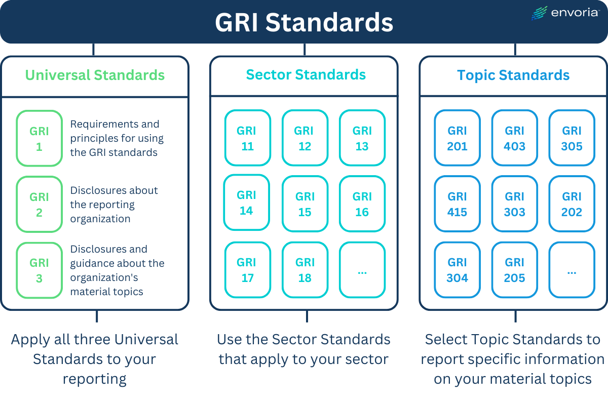

## Table of Contents

## What is the Global Reporting Initiative (GRI)?

The Global Reporting Initiative (GRI) is an organization that helps businesses and other organizations report their impact on the economy, environment, and society. It provides a set of standards that companies can use to measure and share information about their sustainability efforts. These standards are used by organizations all over the world to show how they are working towards a more sustainable future.

GRI was started in 1997 and has grown to become a widely recognized framework for sustainability reporting. It helps companies be more transparent about their actions and encourages them to think about how they can improve their practices. By using GRI standards, organizations can show their stakeholders, like customers and investors, that they are committed to making a positive impact on the world.

## What are the main components of the GRI Standards?

The GRI Standards are made up of three main parts: the Universal Standards, the Sector Standards, and the Topic Standards. The Universal Standards are the same for all organizations. They include things like how to report your organization's general information, how to talk about your strategies and how you make decisions, and how to show what you do to be ethical and follow the law. These standards help organizations tell their story in a clear way that everyone can understand.

The Sector Standards are special for different types of businesses, like mining or food and drink companies. These standards help these businesses report on the issues that are most important to them. For example, a mining company might need to report on how it affects the land and the people living nearby. The Topic Standards focus on specific topics like the environment, human rights, and how a company treats its workers. These standards help organizations report on these topics in a detailed way, so they can show how they are trying to make things better.

Together, these three parts of the GRI Standards help organizations give a full picture of their impact on the world. By using these standards, companies can show what they are doing to be more sustainable and how they are working to improve. This helps everyone, from customers to investors, understand what the company is doing and how it is trying to make a difference.

## Why is the GRI important for businesses?

The Global Reporting Initiative (GRI) is important for businesses because it helps them show how they are trying to be good for the world. By using GRI standards, companies can tell everyone about their impact on the environment, how they treat their workers, and other important things. This makes businesses more open and honest, which can help them build trust with customers, investors, and other people who care about what they do.

Using GRI standards also helps businesses find ways to do better. When companies report on their actions, they can see where they need to improve and make plans to be more sustainable. This not only helps the world but can also make the business stronger and more successful in the long run. By showing they care about sustainability, companies can attract more customers and investors who want to support businesses that are trying to make a positive difference.

## How do GRI Standards help in sustainability reporting?

GRI Standards help businesses talk about how they affect the world in a clear way. They give companies a set of rules to follow when they report on things like the environment, how they treat their workers, and other important topics. By using these standards, businesses can show everyone what they are doing to be more sustainable. This makes it easier for people like customers and investors to understand what the company is doing and how it is trying to make things better.

Using GRI Standards also helps businesses find ways to improve. When companies report on their actions, they can see where they need to do better and make plans to be more sustainable. This not only helps the world but can also make the business stronger and more successful over time. By showing they care about sustainability, companies can attract more customers and investors who want to support businesses that are trying to make a positive difference.

## What are the different types of GRI Standards?

The GRI Standards have three main parts: Universal Standards, Sector Standards, and Topic Standards. The Universal Standards are the same for all organizations. They help companies report basic information like their general details, strategies, and how they make decisions. These standards also cover how companies are ethical and follow the law. They make sure that every organization reports in a clear way that everyone can understand.

The Sector Standards are special for different types of businesses, like mining or food and drink companies. These standards help these businesses focus on the issues that matter most to them. For example, a mining company might need to report on how it affects the land and the people nearby. This helps companies in specific industries show what they are doing to be more sustainable.

The Topic Standards focus on specific topics like the environment, human rights, and how a company treats its workers. These standards help organizations report on these topics in detail. They show what companies are doing to improve in these areas. Together, these three types of standards help businesses give a full picture of their impact on the world and how they are working to be more sustainable.

## How can a company start implementing GRI Standards?

To start using GRI Standards, a company first needs to learn about them. They can go to the GRI website to find out all about the different standards like Universal, Sector, and Topic Standards. The company should read the guidelines and see which ones fit their business. They might want to start with the Universal Standards because these are the same for everyone. This will help the company report basic things like who they are, what they do, and how they make decisions.

After learning about the standards, the company should look at their own business and see where they need to report on things like the environment, human rights, and how they treat their workers. They can use the Sector Standards if they are in a specific industry like mining or food and drink. The company should gather all the information they need and then start writing their report. They can use the GRI's reporting tools and examples to help them. It's good to ask for feedback from people inside and outside the company to make sure the report is clear and useful.

Once the report is ready, the company should share it with everyone who cares about what they do, like customers, investors, and the community. They can put it on their website or in a newsletter. It's important to keep updating the report every year to show how the company is doing and what they are trying to improve. By using GRI Standards, the company can show they care about being sustainable and making the world a better place.

## What are the benefits of using GRI Standards for reporting?

Using GRI Standards for reporting helps businesses show everyone how they are trying to be good for the world. These standards give companies a clear way to talk about their impact on the environment, how they treat their workers, and other important things. By being open and honest, businesses can build trust with customers, investors, and the community. This can make people more likely to support the company because they see it is trying to do the right thing.

GRI Standards also help businesses find ways to improve. When companies report on what they are doing, they can see where they need to do better and make plans to be more sustainable. This not only helps the world but can also make the business stronger and more successful over time. By showing they care about sustainability, companies can attract more customers and investors who want to support businesses that are trying to make a positive difference.

## How do GRI Standards align with other sustainability frameworks?

GRI Standards work well with other sustainability frameworks like the United Nations Sustainable Development Goals (SDGs) and the Task Force on Climate-related Financial Disclosures (TCFD). These frameworks all aim to help businesses be more open about how they affect the world. GRI Standards help companies report on a wide range of topics, from the environment to how they treat their workers. The SDGs give companies goals to aim for, like ending poverty and protecting the planet. The TCFD focuses on how businesses handle climate risks and opportunities. By using GRI Standards, companies can show how they are working towards these goals and managing climate risks.

Using GRI Standards alongside other frameworks makes reporting easier and more complete. For example, a company can use GRI to report on its environmental impact, which can also show how it is helping with SDG goals like clean water and affordable energy. The same report can include information on climate risks, following TCFD guidelines. This way, businesses can meet different reporting needs at the same time. It helps them give a full picture of their sustainability efforts and show everyone how they are trying to make the world a better place.

## What challenges might companies face when adopting GRI Standards?

When companies start using GRI Standards, they might find it hard at first. One big challenge is gathering all the information they need to report. It can take a lot of time and work to collect data on things like the environment, how they treat their workers, and other important topics. Companies might need new systems or tools to help them keep track of this information. Also, they might need to train their staff to understand and use the GRI Standards properly.

Another challenge is making sure the report is clear and easy to understand. Companies have to explain their impact in a way that everyone, from customers to investors, can understand. This can be tough because the GRI Standards cover a lot of different topics. Sometimes, companies might need help from experts to make sure their report is good. It's also important for companies to keep updating their report every year, which can be a lot of work. But, by sticking with it, companies can show they are serious about being sustainable and making the world a better place.

## How does GRI ensure the quality and credibility of reported data?

GRI helps make sure the data companies report is good and trustworthy by setting clear rules that everyone has to follow. They have a set of standards that tell companies what information to share and how to share it. This helps make sure that all the reports are complete and easy to understand. GRI also gives companies tools and examples to help them write their reports the right way. This makes it easier for companies to show their impact on the world in a clear and honest way.

To make sure the data is really good, GRI works with other groups that check and review the reports. These groups look at the reports to see if they follow the GRI rules and if the information is correct. This helps build trust because people know that the reports have been checked by experts. By using these methods, GRI helps companies show everyone that they are serious about being sustainable and making the world a better place.

## What role does stakeholder engagement play in GRI reporting?

Stakeholder engagement is a big part of GRI reporting. It means talking to people who care about what the company does, like customers, workers, and people in the community. When companies use GRI Standards, they need to ask these people what they think is important. This helps the company know what to report on and how to make their report better. By listening to stakeholders, companies can show they care about what these people think and want to do things that make a positive difference.

Engaging with stakeholders also helps companies be more open and honest. When companies talk to their stakeholders, they can explain their actions and plans better. This builds trust because people see that the company is trying to be good for the world. It also helps companies find out where they need to improve and make plans to be more sustainable. By working with stakeholders, companies can make sure their GRI reports are clear, useful, and show how they are trying to make things better.

## How have GRI Standards evolved over time and what future developments are expected?

GRI Standards have changed a lot since they started in 1997. At first, they were just a simple set of rules for companies to report on their impact on the world. Over time, GRI made the standards better by adding more details and making them easier to use. They added Universal Standards that all companies have to follow, Sector Standards for different types of businesses, and Topic Standards for specific topics like the environment and human rights. This made the standards more complete and helpful for companies trying to be more sustainable.

In the future, GRI plans to keep making the standards even better. They want to make sure the standards fit with new ideas and laws about sustainability. GRI is also working on making the standards easier for small businesses to use. They are thinking about how to use new technology to make reporting easier and more accurate. By keeping the standards up to date, GRI hopes to help more companies show how they are trying to make the world a better place.

## References & Further Reading

[1]: Global Reporting Initiative. (2020). ["GRI Standards"](https://www.globalreporting.org/standards)

[2]: ["The New GRI Standards: Universality with Sector and Topic Specificity"](https://www.globalreporting.org/standards/standards-development/universal-standards/), Sustainability Reporting Updates

[3]: Elkington, J. (1997). ["Cannibals with Forks: The Triple Bottom Line of 21st Century Business"](https://link.springer.com/article/10.1023/A:1006129603978)

[4]: Chirinko, R. S. (2003). ["Corporate Sustainability: Moving From Why to How"](https://www.scirp.org/reference/referencespapers?referenceid=2606928)

[5]: O’Dwyer, B., & Unerman, J. (2016). ["Fostering rigour in sustainability research and publishment"](https://www.sciencedirect.com/science/article/abs/pii/S0361368215300027)

[6]: ["ESG Investing: Articles, Research, & Case Studies"](https://esg.wharton.upenn.edu/centers-labs/esg-case-studies/)

[7]: Friedman, H. L., & Warde, D. A. (1991). ["Algorithmic trading and the economics of the industry"](https://www.semanticscholar.org/paper/EVOLUTIONARY-GAMES-IN-ECONOMICS-Friedman/b7778738a1d31c567ae0ae8b637f28a1d90e1710)

[8]: Khan, M., & Edgecliffe-Johnson, A. (2019). ["Sustainable Investing: How Investment Firms are Embracing Sustainability"](https://www.researchgate.net/publication/314086105_Corporate_Sustainability_First_Evidence_on_Materiality)