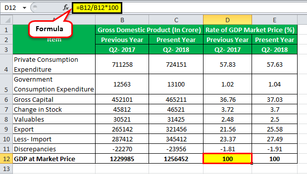

Research and Development (R&D) spending is essential for driving innovation and economic growth across the globe. Countries that invest significantly in R&D often enjoy technological advancements and competitive advantages in various sectors, including financial trading. This article explores the prioritization of R&D expenditures by different nations and identifies the global leaders in this domain. Specifically, we will examine the influence of substantial R&D spending on technological progress within algorithmic trading, a field increasingly dependent on cutting-edge research to maintain competitiveness.

Algorithmic trading, or algo trading, utilizes sophisticated algorithms and high-speed data analysis to execute trades at speeds beyond human capability. This reliance on advanced technology stems from considerable R&D investments, enabling the development of complex trading models and strategies. As such, countries that allocate more resources to R&D often lead in creating innovative solutions, thereby reinforcing their competitive positions in the global tech market.



Understanding the significance of R&D investments in national economic strategies provides insights into the competitive dynamics within the technology sector. It is crucial for nations to prioritize R&D expenditures to foster innovation and economic growth, influencing their standing in the global economy. This focus on R&D not only spurs advancements in sectors such as algo trading but also contributes to broader economic development by enhancing productivity and creating intellectual property.

## Table of Contents

## Global Leaders in R&D Expenditure

Israel and South Korea have emerged as global leaders in R&D spending relative to their Gross Domestic Product (GDP), highlighting their strategic emphasis on technological innovation. By dedicating a larger percentage of their GDP to R&D, these countries are actively investing in their future technological capabilities and economic growth.

### Israel

Israel's commitment to R&D is underscored by its robust government initiatives like the Yozma program, which was launched in the 1990s. This initiative played a pivotal role in boosting venture capital investment and nurturing a thriving tech ecosystem. Yozma's strategy involved leveraging government funds to mitigate investment risks, thereby attracting foreign investors and spurring private sector innovation. Currently, Israel spends approximately 4.95% of its GDP on R&D, one of the highest rates globally, according to the OECD. This focused investment has resulted in Israel becoming a hub for high-tech firms, startups, and advanced research institutions, contributing significantly to its economic resilience and technological prowess.

### South Korea

South Korea's dedication to research and innovation is similarly reflected in its R&D expenditure, which constitutes about 4.81% of its GDP. The South Korean government has strategically distributed its R&D investments across multiple sectors, sponsoring over 1,200 distinct projects that aim to propel the nation towards technological leadership. This distribution strategy encompasses areas such as information technology, robotics, biotechnology, and renewable energy. South Korea's aggressive R&D funding model is supported by policies that facilitate strong collaboration between the private sector and academia, fostering an innovative environment that drives economic growth and positions the country as a technological leader.

### The United States

While Israel and South Korea dominate in terms of R&D expenditure as a percentage of GDP, the United States leads in absolute spending. The U.S. invests hundreds of billions of dollars annually in science and technology projects, securing its position as a frontrunner in global technological advancements. The federal government plays a crucial role in supporting R&D through a mix of direct funding, tax incentives, and grants. This funding primarily focuses on sectors such as healthcare, climate science, and cutting-edge technology, which are critical for maintaining the country's competitive edge and economic vitality.

### Initiatives and Policies

The success of these nations in prioritizing R&D can be largely attributed to their forward-thinking policies and initiatives. Israel's government has created a policy environment conducive to innovation, focusing on intellectual property protection and entrepreneurship support. Similarly, South Korea's ambitious innovation-driven development strategy, encapsulated in policies like the Creative Economy Master Plan, encourages R&D investments and fosters high-impact innovation.

Meanwhile, the U.S. approach combines strong federal support with partnerships among universities, federal labs, and industries, providing a rich environment for groundbreaking research and development. These frameworks not only enhance their current technological standings but also set a benchmark for other countries aspiring to boost their R&D landscapes.

## Detailed Analysis of Top R&D Spending Countries

Israel's innovative spirit can be largely attributed to strategic government initiatives like Yozma, which significantly boost foreign investment by mitigating risk through insurance mechanisms. Established in the 1990s, Yozma catalyzed a vibrant venture capital industry in Israel by partnering with private investors and offering them downside protection. This novel approach facilitated the growth of numerous technology startups, propelling Israel to be known as the "Startup Nation." As a consequence, Israel invested approximately 4.9% of its GDP in R&D by 2021, one of the highest percentages globally [1]. The emphasis on R&D is mirrored in sectors such as information technology, pharmaceutical development, and cybersecurity, underpinning Israel's competitive edge in global tech innovation.

South Korea exemplifies an effective strategy in R&D spending, promoting its ambitious pursuit of global technological leadership. Allocating R&D resources over more than 1,200 diverse projects, the country focuses on sectors that promise significant technological breakthroughs. Key areas include electronics, telecommunications, automotive technology, and biotechnology. The government actively supports this ecosystem through substantial funding and policy backing, aiming to position South Korea as a hub of innovation. A strategic endeavor is the "5G Plus Strategy," which seeks dominance in next-generation telecommunication technologies through dedicated R&D investments. As of 2021, South Korea invested 4.8% of its GDP into R&D, fostering advancements that align with its long-term vision for technological supremacy [2].

The United States stands out by emphasizing federal R&D funding across vital sectors such as healthcare, climate science, and technology innovation. The nation's approach involves substantial public investment, augmented by private sector contributions to amplify R&D effectiveness and reach. Agencies like the National Institutes of Health (NIH) and the National Science Foundation (NSF) play instrumental roles in steering research, particularly in healthcare innovations and basic scientific research. Furthermore, initiatives toward mitigating climate change are notable, with federal funding directing significant research into renewable energy technologies and environmental science. In 2021, the United States spent over $709 billion on R&D, representing a complex interplay of governmental and private investments [3].

References:
1. Central Bureau of Statistics - Israel: Research and Development Statistics. 
2. Korean Ministry of Science and ICT - South Korea's Strategy for R&D Growth.
3. National Science Foundation - Science and Engineering Indicators 2022: U.S. R&D Performance and Competitiveness.

## R&D Spending in the Context of Algo Trading

Algorithmic trading, commonly known as algo trading, is a process of using computer algorithms to execute trading orders with minimal human intervention. The effectiveness of these systems depends heavily on rapid data processing, pattern recognition, and high-frequency trading ([HFT](/wiki/high-frequency-trading-strategies)) models. As a result, significant investments in research and development (R&D) are crucial to advancing the technology that underpins algo trading.

Countries with substantial R&D spending possess a competitive advantage in crafting sophisticated algo trading systems. This advantage arises from their ability to capitalize on cutting-edge technologies, such as [artificial intelligence](/wiki/ai-artificial-intelligence) (AI) and [machine learning](/wiki/machine-learning) (ML), that are essential for constructing robust algorithms capable of analyzing massive datasets and executing strategies at speeds and efficiencies beyond human capabilities.

AI and ML, in particular, have become indispensable in developing these trading algorithms. AI models can identify intricate patterns and make predictive analyses that adaptive trading strategies rely upon. Machine learning algorithms learn from historical market data to improve the accuracy and performance of trading strategies over time. For example, Python libraries such as TensorFlow and PyTorch facilitate the creation of neural networks that can process and learn from vast amounts of financial data, optimizing trading strategies and enhancing decision-making processes.

```python
import tensorflow as tf
from tensorflow.keras.models import Sequential
from tensorflow.keras.layers import Dense, LSTM

# Example: A simple model to predict stock prices 
model = Sequential([
    LSTM(50, return_sequences=True, input_shape=(time_steps, features)),
    LSTM(50, return_sequences=False),
    Dense(25),
    Dense(1)
])

# Compile the model
model.compile(optimizer='adam', loss='mean_squared_error')
```

Furthermore, high R&D expenditures enable countries to push the limits of computational power and data transmission speeds, both critical components of successful algo trading. For instance, innovations in quantum computing could dramatically impact the way algorithms solve complex optimization problems, potentially revolutionizing trading strategies that hinge on real-time data analysis.

The integration of AI and ML into algo trading is not only transformative but also underscores the necessity of ongoing R&D. As market conditions evolve and data grow in complexity and [volume](/wiki/volume-trading-strategy), continuous development of algorithms ensures they remain effective and competitive. Therefore, countries that invest heavily in R&D are well-equipped to lead the future of [algorithmic trading](/wiki/algorithmic-trading), thereby retaining strategic advantages in the global financial markets.

## Impact of R&D on Economic Growth

Research and Development (R&D) investments play a pivotal role in bolstering economic growth, primarily through enhancements in productivity and innovation. By committing resources to R&D, countries can cultivate environments conducive to technological innovations, which, in turn, drive productivity gains across various sectors.

One of the primary avenues through which R&D influences economic growth is by facilitating the creation of intellectual property. Nations that allocate substantial funds to R&D activities often lead in the development of patents, trademarks, and other forms of intellectual property. This not only provides a competitive edge in technology and innovation but also establishes strong industrial bases that can capitalize on new technologies and processes. As a result, these countries position themselves as leaders in high-value industries, contributing to sustained economic expansion.

Moreover, R&D contributes to economic growth by fostering technological advancements. Innovations borne out of R&D activities can lead to the creation of new industries or the transformation of existing ones, thereby generating new employment opportunities and increasing economic outputs. For instance, breakthroughs in sectors such as biotechnology, information technology, and renewable energy can lead to significant economic advantages by opening up new markets and enhancing productivity across traditional sectors.

Fostering a robust R&D environment allows countries to significantly improve their global economic standing. This necessitates not only financial investment but also the formulation of supportive policies that encourage innovation. Governments that prioritize R&D typically implement taxation policies, provide subsidies, or offer grants that incentivize businesses and academic institutions to engage in research activities. These measures create a virtuous cycle of investment and growth, where increased innovation attracts further investment, thereby propelling economic growth.

In summary, the correlation between R&D investments and economic growth is strongly positive. By leading in intellectual property creation and technological advancements, countries with higher R&D expenditures can build stronger, more versatile economies. As global competition intensifies, a committed focus on R&D remains a crucial strategy for nations seeking to maintain or enhance their economic status on the world stage.

## Future Trends and Considerations

The global landscape of Research and Development (R&D) spending is witnessing significant shifts as emerging economies increasingly prioritize innovation. This trend highlights the crucial role that R&D plays not only in advancing national economies but also in fostering technological inclusivity and sustainability. The rise of these emerging markets in R&D is marked by diversified investments across various sectors such as clean energy, healthcare, and digital technologies, reflecting their strategic repositioning in the global tech economy.

One of the primary challenges facing R&D expenditure is ensuring equitable distribution of funding. This disparity often results in imbalanced technological growth, where a few regions or sectors may advance rapidly, while others lag behind. Bridging this gap requires policies that promote inclusive access to R&D resources and foster collaborative innovation across different geographies and industries. Furthermore, addressing the digital divide is essential to ensure that technological advancements benefit a broader population rather than exacerbating existing inequalities.

Future trends in R&D point towards an intensified focus on sustainable and smart technologies. The integration of artificial intelligence (AI), machine learning, and the Internet of Things (IoT) in R&D processes is likely to enhance the development of technologies that are both innovative and environmentally responsible. For instance, AI-driven R&D can optimize resource allocation, reduce waste, and accelerate the discovery of energy-efficient technologies. Additionally, the rising interest in smart cities and green infrastructure underscores the need for R&D strategies that emphasize resilience and environmental stewardship.

In summary, the evolving dynamics of R&D spending call for strategic foresight and inclusive policies. As emerging economies elevate their R&D investments, they contribute to a more balanced global innovation landscape. Addressing funding inequities and the digital divide remains crucial for ensuring that technological advancements are inclusive and sustainable. The future of R&D is poised to be shaped by technologies that not only drive economic growth but also promote a more sustainable and equitable world.

## Conclusion

Research and Development (R&D) spending stands as a pivotal element in shaping national strategies for technological advancement and economic growth. Countries such as Israel, South Korea, and the United States exemplify high benchmarks in R&D investment, significantly impacting their respective technology sectors. Israel's commitment is evidenced by initiatives like Yozma, which effectively reduce investment risks and attract foreign capital. This has sparked an innovative ecosystem that continually propels technological progress. South Korea’s strategic allocation of resources across numerous projects showcases its dedication to establishing a leadership position in global technology. Meanwhile, the United States' substantial federal funding underscores its aim to drive advancements across various sectors, including healthcare and climate science.

As algorithmic trading becomes more nuanced, the expectations and demands on R&D investments continue to escalate. The integration of artificial intelligence and machine learning into trading algorithms is a testament to the evolving landscape of financial technologies. These advancements are critical, as they not only contribute to enhancements in trading efficiency and accuracy but also set new standards for global financial markets.

In conclusion, the strategic deployment of R&D funding is essential for countries to maintain and enhance their positions in the global technological arena. The focused investment by leading nations not only boosts their economic prowess but also serves as a catalyst for sustained innovation across industries. As the field of algorithmic trading and other tech-centric sectors continue to develop, the need for robust and forward-thinking R&D strategies becomes ever more apparent, fundamentally influencing the future trajectory of global economies.

## References & Further Reading

[1]: ["Research and Development Statistics - Israel,"](https://data.worldbank.org/indicator/GB.XPD.RSDV.GD.ZS?locations=IL) Central Bureau of Statistics - Israel

[2]: ["5G Plus Strategy,"](https://www.atlanticcouncil.org/in-depth-research-reports/report/forging-the-5g-future-strategic-imperatives-for-the-us-and-its-allies/) Korean Ministry of Science and ICT

[3]: ["Science and Engineering Indicators 2022: U.S. R&D Performance and Competitiveness,"](https://www.nsf.gov/statistics/seind/) National Science Foundation

[4]: Lopez de Prado, M. (2018). ["Advances in Financial Machine Learning."](https://www.amazon.com/Advances-Financial-Machine-Learning-Marcos/dp/1119482089) Wiley.

[5]: Aronson, D. (2007). ["Evidence-Based Technical Analysis: Applying the Scientific Method and Statistical Inference to Trading Signals."](https://www.wiley.com/en-us/Evidence+Based+Technical+Analysis%3A+Applying+the+Scientific+Method+and+Statistical+Inference+to+Trading+Signals-p-9780470008744) Wiley.