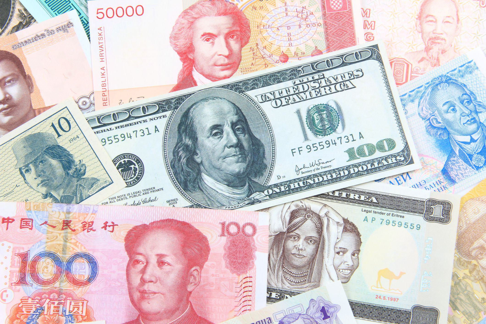

## Table of Contents

## What is a global single currency?

A global single currency is an idea where all countries in the world use the same money. Instead of having dollars, euros, yen, and other currencies, everyone would use one type of money. This idea is talked about by economists and world leaders because it could make trading between countries easier and help the world economy work better.

However, making a global single currency would be very hard. Every country would need to agree to use it, and they would have to give up control over their own money. This could be a problem because countries use their own money to help their economy. Also, if something bad happens to the global currency, it could hurt everyone in the world, not just one country.

## Why is there interest in a global single currency?

People are interested in a global single currency because it could make trading easier. Right now, when countries trade, they have to change their money into the other country's money. This can be hard and can cost money. If everyone used the same money, trading would be simpler and cheaper. It could also help the world economy grow because it would be easier for businesses to sell things in different countries.

Another reason people are interested in a global single currency is that it could help make the world more stable. When countries have their own money, they can have problems if their money becomes worth less or if they have too much debt. A global currency could help prevent these problems because everyone would be using the same money. However, it's a big challenge to get all countries to agree to use one currency, so it's still just an idea that people talk about.

## What are the potential benefits of a global single currency?

A global single currency could make trading between countries much easier. Right now, when a country wants to buy something from another country, they have to change their money into the other country's money. This can be hard and can cost money. If everyone used the same money, trading would be simpler and cheaper. This could help businesses sell their things in different countries more easily, which could make the world economy grow.

Another benefit of a global single currency is that it could help make the world more stable. When countries have their own money, they can have big problems if their money becomes worth less or if they have too much debt. A global currency could help prevent these problems because everyone would be using the same money. This could make it easier for countries to work together and help each other if they have money problems.

Overall, a global single currency could make trading easier and help the world economy grow. It could also make the world more stable by helping countries avoid big money problems. However, it's a big challenge to get all countries to agree to use one currency, so it's still just an idea that people talk about.

## What are the potential drawbacks of a global single currency?

One big problem with a global single currency is that it would be hard to get all countries to agree to use it. Every country would have to give up control over their own money. This is a big deal because countries use their own money to help their economy. If they can't control their own money, they might not be able to help their people as much. Also, some countries might not want to give up control because they think it could hurt them more than it helps.

Another problem is that if something bad happens to the global currency, it could hurt everyone in the world, not just one country. Right now, if one country's money has problems, it mostly affects that country. But with a global currency, if it has problems, it could cause big problems for everyone. This could make it harder for countries to fix their own money problems because they would all be using the same money.

Overall, while a global single currency could make trading easier and help the world economy, it would be hard to get everyone to agree to use it. And if something goes wrong with the global currency, it could cause big problems for everyone in the world.

## How would a global single currency be implemented?

Implementing a global single currency would be a huge challenge. It would need a lot of countries to agree to use the same money. They would have to work together to make the new currency and decide how to manage it. A big group, like the United Nations or a new group just for the currency, would have to be in charge. They would need to figure out how to change all the different kinds of money into the new global money. This would take a lot of time and planning.

Once the new currency is made, countries would have to stop using their old money and start using the global currency. This would mean changing all the money in banks, stores, and people's wallets. It would also mean changing all the prices and figuring out how to pay for things differently. It would be hard for people to get used to the new money, and there might be some confusion at first. But if everyone works together and follows the plan, it could happen.

The whole process would need a lot of trust between countries. They would have to believe that using the same money would be good for everyone. It would also need a lot of work to make sure the new currency is fair and works well for all countries. If any country doesn't agree or if there are big problems, the plan might not work. So, it's a big idea that would need a lot of careful planning and cooperation.

## What historical attempts have been made towards a global currency?

There have been some tries in the past to make a global currency, but they were not big successes. One of the earliest tries was the "Universal Currency" idea in the late 1800s. People thought about making a single money that everyone could use, but it did not happen because countries did not want to give up their own money. Another try was the "Bancor" idea during World War II. Economist John Maynard Keynes suggested this as a way to make trading easier between countries, but countries did not agree to use it.

More recently, the Euro was made in Europe in 1999. It was not a global currency, but it was a big step because many countries in Europe agreed to use the same money. The Euro showed that it is possible for different countries to use the same money, but it also showed that it can be hard. The Euro has had some problems, like when some countries had money troubles and it affected everyone using the Euro. This shows that even a regional currency can be hard to manage, so a global currency would be even harder.

## Which countries or organizations support the idea of a global single currency?

A few countries and organizations have talked about the idea of a global single currency, but not many have said they really want it to happen. Some economists and people who study money think it could be good for the world. They say it could make trading easier and help the world economy grow. The United Nations has talked about it sometimes, but they have not made a big plan to make it happen. They think it could help make the world more stable, but it's a hard thing to do.

Some countries in Europe have experience with a shared currency, the Euro, and they might be more open to the idea of a global currency. But even they have seen how hard it can be to manage a shared currency. China has also talked about making its money, the Yuan, more important in the world, but they have not said they want a global currency. Most countries are careful about the idea because they do not want to give up control over their own money. So, while some people and groups think a global currency could be good, it's not something that many countries or big organizations are pushing for right now.

## What role could existing international organizations play in managing a global currency?

Existing international organizations like the United Nations, the International Monetary Fund (IMF), and the World Bank could help manage a global currency. They already work to make the world's economy better and help countries with money problems. If there was a global currency, these groups could help make the rules for it and make sure everyone follows them. They could also help countries change their money to the new global currency and help people understand how to use it.

These organizations would need to work together and with all countries to make the global currency work well. They would have to be fair and make sure the new money helps everyone, not just some countries. This would be hard because every country has different needs and problems. But if they can do it, these groups could help make the world more stable and help the world economy grow by managing a global currency.

## How might a global single currency affect international trade?

A global single currency could make international trade a lot easier. Right now, when countries trade, they have to change their money into the other country's money. This can be hard and can cost money. If everyone used the same money, trading would be simpler and cheaper. Businesses could sell their things in different countries without worrying about changing money. This could help the world economy grow because it would be easier for businesses to trade with each other.

However, a global single currency could also cause problems. If something goes wrong with the global currency, it could hurt everyone in the world, not just one country. Right now, if one country's money has problems, it mostly affects that country. But with a global currency, if it has problems, it could cause big problems for everyone. This could make it harder for countries to fix their own money problems because they would all be using the same money. So, while a global currency could make trading easier, it could also make the world's economy more risky.

## What impact could a global single currency have on global economic stability?

A global single currency could make the world's economy more stable. Right now, different countries have their own money, and if one country's money becomes worth less or if they have too much debt, it can cause big problems just for that country. With a global currency, everyone would use the same money, so it could help prevent these problems. If one country has money troubles, other countries could help more easily because they all use the same money. This could make the world more stable because countries would work together better.

However, a global single currency could also make the world's economy more risky. If something bad happens to the global currency, it could hurt everyone in the world, not just one country. Right now, if one country's money has problems, it mostly affects that country. But with a global currency, if it has problems, it could cause big problems for everyone. This could make it harder for countries to fix their own money problems because they would all be using the same money. So, while a global currency could make the world more stable in some ways, it could also make it more risky in others.

## What are the political implications of adopting a global single currency?

Adopting a global single currency would have big political effects. Countries would have to give up control over their own money. This is a big deal because countries use their money to help their economy and people. If they can't control their own money, they might not be able to help their people as much. Some countries might not want to give up control because they think it could hurt them more than it helps. This could cause arguments and disagreements between countries.

Also, a global currency would need a lot of countries to agree to use it. It would be hard to get everyone to agree because every country has different needs and wants. Some countries might think a global currency is good for them, but others might think it's bad. This could make it hard for countries to work together and trust each other. If some countries don't agree, it could cause big political problems and make it hard to make the global currency happen.

## What technological advancements are necessary to support a global single currency?

To support a global single currency, we would need strong and safe technology. Right now, when people use money, they use banks, credit cards, and apps. If everyone used the same money, we would need a big computer system that works all over the world. This system would have to be safe so no one can steal money or mess with it. It would also need to work fast so people can use their money easily, no matter where they are.

We would also need technology to help change all the old money into the new global money. This would mean making new ways to keep track of money and make sure everyone gets the right amount of the new currency. It would be a big job to change all the money in the world, so the technology would have to be really good at doing this. If we can make this technology work well, it could help make a global single currency happen.

## References & Further Reading

[1]: ["International Monetary Fund's Special Drawing Rights (SDRs)."](https://www.imf.org/en/Topics/special-drawing-right) International Monetary Fund.

[2]: Eichengreen, B. (2011). ["Exorbitant Privilege: The Rise and Fall of the Dollar and the Future of the International Monetary System."](https://www.cambridge.org/core/journals/journal-of-economic-history/article/abs/exorbitant-privilege-the-rise-and-fall-of-the-dollar-and-the-future-of-the-international-monetary-system-by-barry-eichengreen-new-york-oxford-university-press-2011-pp-iii-215-2795-cloth/744B5389B6060F67D880ADBBA2ACBFCD) Oxford University Press.

[3]: Tobin, J. (1984). ["On the Efficiency of the Financial System."](https://economicsociology.org/wp-content/uploads/2014/12/tobin-on-the-efficiency-of-the-financial-system.pdf) Lloyds Bank Review.

[4]: Keynes, J.M. (1944). ["The Bretton Woods Conference."](https://www.brettonwoods.org/article/80-years-since-the-bretton-woods-conference) Encyclopaedia Britannica.

[5]: Aldridge, I. (2013). ["High-Frequency Trading: A Practical Guide to Algorithmic Strategies and Trading Systems."](https://www.amazon.com/High-Frequency-Trading-Practical-Algorithmic-Strategies/dp/1118343506) Wiley Trading.

[6]: Bank for International Settlements. (2019). ["Triennial Central Bank Survey of Foreign Exchange and OTC Derivatives Markets in 2019."](https://www.bis.org/statistics/rpfx19.htm)

[7]: Carney, M. (2019). ["The Growing Challenges for Monetary Policy in the current International Monetary and Financial System."](https://www.bankofengland.co.uk/-/media/boe/files/speech/2019/the-growing-challenges-for-monetary-policy-speech-by-mark-carney.pdf) Bank of England. 

[8]: Narang, R. (2013). ["Inside the Black Box: A Simple Guide to Quantitative and High-Frequency Trading."](https://onlinelibrary.wiley.com/doi/book/10.1002/9781118662717) Wiley Finance.