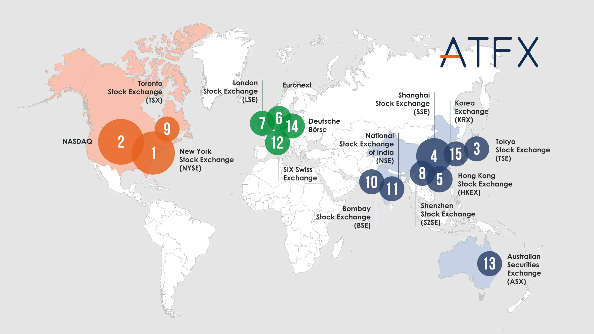

## Table of Contents

## What is a stock exchange?

A stock exchange is a place where people buy and sell shares of companies. It's like a big marketplace, but instead of buying fruits or clothes, people trade pieces of ownership in businesses. When someone buys a share, they own a small part of that company. Stock exchanges help companies raise money by selling shares to the public, and they help investors make money by buying and selling those shares.

There are many stock exchanges around the world, like the New York Stock Exchange and the Tokyo Stock Exchange. Each exchange has rules and a system to make sure trading is fair and organized. People can trade stocks through brokers, who are like helpers that make the trades for them. The prices of stocks go up and down based on how many people want to buy or sell them. This is important because it shows how well people think the company is doing.

## How many stock exchanges are there globally?

There are around 60 major stock exchanges around the world. These are the big ones where a lot of trading happens. But there are also many smaller stock exchanges, so the total number is much higher, maybe around 150 or more.

Each country usually has its own stock exchange. For example, the United States has the New York Stock Exchange and the NASDAQ. Some countries have more than one, like India, which has the Bombay Stock Exchange and the National Stock Exchange. All these exchanges help companies from different countries raise money and let people from all over the world invest in them.

## What are the largest stock exchanges in the world by market capitalization?

The largest stock exchange in the world by market capitalization is the New York Stock Exchange (NYSE). It has a total value of all the stocks traded there of over $25 trillion. This means that if you added up the value of every share on the NYSE, it would be worth more than $25 trillion. The NYSE is in New York City and has been around for over 200 years. It's where many big American companies, like Apple and Walmart, have their stocks traded.

The second largest stock exchange is the NASDAQ, also in the United States. Its market capitalization is around $20 trillion. The NASDAQ is known for having a lot of technology companies, like Amazon and Google. It's a bit newer than the NYSE but has grown very fast because of the tech industry. Both the NYSE and NASDAQ are important places for people to invest in American companies.

The third largest stock exchange is the Shanghai Stock Exchange in China, with a market capitalization of about $6 trillion. It's an important place for Chinese companies to raise money and for investors to buy and sell shares. The Tokyo Stock Exchange in Japan comes next, with around $5 trillion in market capitalization. These exchanges show how important stock markets are in different parts of the world, helping companies grow and giving people a way to invest their money.

## What is the role of stock exchanges in the global economy?

Stock exchanges play a big role in the global economy by helping companies get money to grow. When a company wants to expand or start new projects, it can sell shares on a stock exchange. People buy these shares, giving the company money to use. This helps the economy because companies can create new jobs and make new products. Stock exchanges make it easier for companies all over the world to raise money, no matter where they are.

Stock exchanges also help people invest their money. When people buy shares, they hope the value will go up so they can sell them for more money later. This is important because it gives people a way to save and grow their money. As more people invest, more money goes into the economy, helping it grow. Stock exchanges connect people and companies from different countries, making the global economy stronger and more connected.

## How do stock exchanges facilitate trading?

Stock exchanges make trading easy by providing a place where buyers and sellers can come together. When someone wants to buy a share, they can go to the stock exchange and find someone who wants to sell that share. The exchange uses a system that matches buyers and sellers, making sure the price is fair. This system is like a big computer that keeps track of all the orders and makes sure everything happens quickly and smoothly. People don't have to be in the same place to trade because the exchange does it all online.

Brokers are important helpers in this process. They work for the people who want to buy or sell shares. When someone wants to trade, they tell their broker what they want to do. The broker then uses the stock exchange's system to make the trade happen. This makes trading easier because people don't have to learn how to use the exchange's system themselves. The exchange also has rules to make sure everyone follows the same guidelines and that trading is fair for everyone.

## What are the differences between stock exchanges and over-the-counter markets?

Stock exchanges and over-the-counter (OTC) markets are both places where people can buy and sell shares, but they work in different ways. Stock exchanges are like big, organized marketplaces where companies list their shares and people trade them through a system that matches buyers and sellers. The New York Stock Exchange and the NASDAQ are examples of stock exchanges. These exchanges have strict rules and regulations to make sure trading is fair and transparent. People usually use brokers to trade on stock exchanges, and the prices of shares are always clear and easy to see.

On the other hand, OTC markets are less organized and more like trading between people directly. In OTC markets, companies that are smaller or newer might trade their shares. These markets don't have a central place or system like stock exchanges do. Instead, people trade through dealers or brokers who help find buyers and sellers. The prices in OTC markets can be less clear because there's less information available, and the rules are not as strict. This makes OTC markets a bit riskier but also a place where smaller companies can still raise money.

## How do regulations vary across different global stock exchanges?

Regulations for stock exchanges can be different in each country because each country has its own rules. These rules are made by the government or special groups that watch over the stock market. For example, in the United States, the Securities and Exchange Commission (SEC) makes sure that the New York Stock Exchange and the NASDAQ follow certain rules to keep trading fair and safe. These rules can include things like making sure companies tell the truth about their business and how they use the money they raise from selling shares. Other countries have their own groups, like the Financial Conduct Authority in the UK, that do similar things but might have different rules.

Even though the basic idea of keeping the market fair and safe is the same everywhere, the details can be different. Some countries might have stricter rules about how much information companies need to share with the public. Others might have different rules about how quickly trades need to happen or how much money someone needs to start trading. These differences can affect how easy or hard it is for companies to list their shares on different exchanges and for people to trade them. But the main goal of all these rules is to make sure that everyone can trust the stock market and that it works well for the economy.

## What technological advancements have impacted stock exchanges in recent years?

In recent years, technology has changed how stock exchanges work a lot. One big change is that trading is now mostly done by computers. This means that when people want to buy or sell shares, they can do it quickly online without needing to be at the stock exchange in person. Computers can match buyers and sellers faster than people can, which makes trading happen almost instantly. Another big change is the use of algorithms. These are like special math recipes that computers use to decide when to buy or sell shares. Many big investors use these algorithms to make trading decisions, which can make the market move very quickly.

Another important technological advancement is the use of data and analytics. Stock exchanges now collect a lot of information about what's happening in the market, and this data can be used to see patterns and make better trading decisions. For example, traders can use this data to predict how the price of a share might change in the future. Also, technology has made it easier for people to get information about companies and the market. With the internet, anyone can look up information about a company's financial health or read news that might affect its share price. These advancements have made stock exchanges more efficient and accessible to more people around the world.

## How do global stock exchanges affect international investment and capital flow?

Global stock exchanges play a big role in helping money move around the world. When people want to invest their money, they can buy shares on different stock exchanges, no matter where they live. This means that money can flow from one country to another easily. For example, an investor in Japan can buy shares in a company listed on the New York Stock Exchange. This helps companies in different countries get money to grow and create jobs, which is good for the global economy. It also gives investors more choices and chances to make money, because they can pick from companies all over the world.

Stock exchanges also help keep the global economy connected. When a company lists its shares on a stock exchange, it can attract investors from many different countries. This can bring in a lot of money, which can be used to expand the company or start new projects. At the same time, investors can spread their money across different countries, which can make their investments safer. If one country's economy is doing badly, they might still make money from investments in another country. This flow of money helps keep the global economy strong and balanced, making it easier for countries to work together and grow.

## What are the major indices associated with leading stock exchanges?

Major stock exchanges around the world have important indices that help people understand how the market is doing. In the United States, the New York Stock Exchange has the Dow Jones Industrial Average, which tracks 30 big companies. Another important index in the US is the S&P 500, which follows 500 large companies and gives a good picture of the overall market. The NASDAQ also has its own index, called the NASDAQ Composite, which includes all the companies listed on the NASDAQ and is known for tracking technology companies.

In other parts of the world, the Tokyo Stock Exchange in Japan has the Nikkei 225, which follows 225 of the biggest companies in Japan. In Europe, the FTSE 100 is an important index for the London Stock Exchange, representing the 100 largest companies listed there. The Shanghai Stock Exchange in China has the SSE Composite Index, which tracks all the shares traded on the exchange. These indices help investors see how well different parts of the world's economy are doing and make decisions about where to put their money.

## How do stock exchanges handle market volatility and financial crises?

Stock exchanges have rules and systems to help handle market [volatility](/wiki/volatility-trading-strategies) and financial crises. When the market gets too wild, with prices going up and down a lot, stock exchanges can use something called "circuit breakers." These are like emergency stops that pause trading for a while to give everyone a chance to calm down and think. This helps stop panic selling, which can make the market even more unstable. Stock exchanges also keep a close eye on the market all the time, using computers to watch for unusual activity that might be a sign of trouble.

During big financial crises, like the one in 2008, stock exchanges work with governments and other groups to help keep things stable. They might change their rules to make trading safer or to help companies that are in trouble. For example, they might let companies delay some payments or make it easier for them to raise money. Stock exchanges also share a lot of information with investors to help them understand what's happening and make better decisions. By doing all these things, stock exchanges try to keep the market working well, even when times are tough.

## What future trends are expected to influence the operations and structure of global stock exchanges?

In the future, technology will keep changing how stock exchanges work. One big trend is the use of blockchain and other new technologies to make trading faster and safer. Blockchain is like a digital record that everyone can see and trust, which can help make sure trades are done right and without cheating. Another trend is the growth of [artificial intelligence](/wiki/ai-artificial-intelligence) (AI). AI can help predict how the market will move and make trading decisions. This can make the market more efficient and help people make better choices about where to put their money. Also, more trading might happen on computers without people, using special programs that can buy and sell shares very quickly.

Another important trend is how global stock exchanges will work together more. As the world gets more connected, companies and investors want to trade easily across different countries. This might mean that stock exchanges will share more information and work together to make trading easier for everyone. Also, rules might change to help companies list their shares on more than one exchange, making it easier for them to raise money from around the world. These changes can help make the global economy stronger and more connected, but they also need to be done carefully to keep the market fair and safe for everyone.

## References & Further Reading

[1]: Bergstra, J., Bardenet, R., Bengio, Y., & Kégl, B. (2011). ["Algorithms for Hyper-Parameter Optimization."](https://papers.nips.cc/paper/4443-algorithms-for-hyper-parameter-optimization) Advances in Neural Information Processing Systems 24.

[2]: ["Advances in Financial Machine Learning"](https://www.amazon.com/Advances-Financial-Machine-Learning-Marcos/dp/1119482089) by Marcos Lopez de Prado

[3]: ["Evidence-Based Technical Analysis: Applying the Scientific Method and Statistical Inference to Trading Signals"](https://www.amazon.com/Evidence-Based-Technical-Analysis-Scientific-Statistical/dp/0470008741) by David Aronson

[4]: Hendershott, T., Jones, C. M., & Menkveld, A. J. (2010). ["Does Algorithmic Trading Improve Liquidity?"](https://onlinelibrary.wiley.com/doi/full/10.1111/j.1540-6261.2010.01624.x) The Review of Financial Studies, 24(3), 740-780.

[5]: Aldridge, I. (2013). ["High-Frequency Trading: A Practical Guide to Algorithmic Strategies and Trading Systems"](https://www.amazon.com/High-Frequency-Trading-Practical-Algorithmic-Strategies/dp/1118343506) by Irene Aldridge

[6]: ["Machine Learning for Algorithmic Trading"](https://github.com/stefan-jansen/machine-learning-for-trading) by Stefan Jansen

[7]: ["Quantitative Trading: How to Build Your Own Algorithmic Trading Business"](https://books.google.com/books/about/Quantitative_Trading.html?id=j70yEAAAQBAJ) by Ernest P. Chan