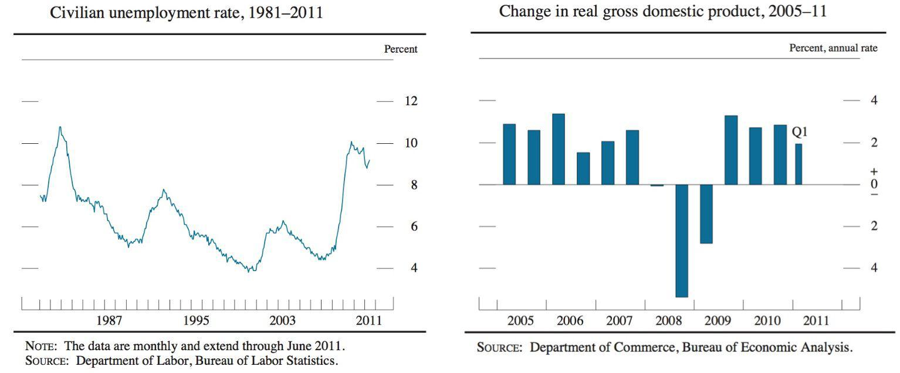

In a rapidly evolving global economy, comprehending the interplay between unemployment rates, economic trends, and technological advancements such as algorithmic trading is paramount. As these elements interact, they collectively shape the economic landscape, influencing both policy formulation and market behavior. Unemployment, often a critical indicator of economic health, tends to fluctuate with varying economic conditions and technological shifts. High unemployment can signal underlying economic weaknesses, whereas lower rates might reflect robust economic activity.

Economic trends post the global financial crisis and the recent pandemic have underscored the complexity of these relationships. Factors such as inflation, shifts in consumer demand, and changes in fiscal and monetary policies have further complicated the economic backdrop. These trends not only affect employment levels but also influence business investments, product pricing, and economic growth trajectories.

Advancements in technology like algorithmic trading have injected new dynamics into financial markets. Algorithmic trading, utilizing complex algorithms and high-speed computations, enhances market efficiency and liquidity but also introduces potential volatility and systemic risks. This method of trading has redefined traditional market operations, compelling stakeholders to adapt to new realities.

Thus, understanding how unemployment rates, economic trends, and technological innovations like algorithmic trading interconnect allows for more informed decision-making by policymakers, businesses, and individuals. This holistic perspective is essential for navigating the complexities of the modern economy and preparing for future challenges.

## Table of Contents

## Global Unemployment Rates: An Overview

Unemployment rates globally reveal substantial variations, significantly influenced by diverse regional economic conditions and policy implementations. As of recent data, countries like South Africa and Nigeria exhibit some of the highest unemployment rates, often exceeding 30%. Contributing factors include sluggish economic growth, structural economic issues, and political instability. In South Africa, for instance, unemployment stems from rigid labor laws, skill mismatches, and limited industrial diversification. Similarly, Nigeria faces challenges such as inadequate infrastructure, over-reliance on the oil sector, and socio-political unrest.

Conversely, countries such as Japan and Switzerland consistently report low unemployment rates, often below 3%. Several factors contribute to these figures, including robust educational systems, diversified economies, and effective government policies. Japan, known for its technology-driven economic strategies, benefits from high workforce participation and a strong emphasis on skill development. Switzerland's unemployment rate is influenced by its well-integrated vocational training system and economic resilience through its financial and pharmaceutical industries.

The implications of these extremes are multifaceted. High unemployment rates can lead to increased poverty levels, social unrest, and reduced economic productivity. Conversely, while low unemployment suggests economic stability, it may also lead to labor shortages and wage inflation.

Case studies further illustrate these dynamics. In Spain, the unemployment rate surged to over 25% during the European debt crisis. Recovery efforts focused on labor market reforms, such as reducing job protection and promoting temporary contracts. These policies, however, led to debates on job security and income inequality. Meanwhile, Germany, with its apprenticeship model and targeted social policies, maintained lower unemployment rates, exemplifying the effectiveness of integrated labor market strategies.

Understanding global unemployment rates necessitates examining diverse economic and policy landscapes. This analysis underscores the need for targeted strategies to address unemployment challenges, promoting sustainable economic development.

## Economic Trends Amidst Unemployment Challenges

Global economic trends are significantly influenced by unemployment levels, shaping consumer behavior, investment patterns, and policy decisions. The COVID-19 pandemic and subsequent inflationary periods have further emphasized these interrelations.

The pandemic-induced economic recession led to unprecedented unemployment rates worldwide. According to the International Labour Organization (ILO), global working hours declined by 8.8% in 2020, equivalent to 255 million full-time jobs losses. This severe contraction in employment triggered cascading effects on consumer spending, which is a critical component of economic growth. As unemployment increased, consumer confidence plummeted, leading to reduced spending on goods and services. Households prioritized essential expenditures, resulting in diminished demand for non-essential products, thus affecting businesses and the broader economy.

In response to these challenges, governments and central banks implemented various fiscal and monetary policies. Expansionary fiscal policies, such as increased government spending and tax relief measures, were employed to boost demand and support unemployed individuals. These measures aimed to stabilize the economy by providing financial assistance to affected sectors and stimulating consumption. For example, the United States introduced substantial stimulus packages, including direct payments to citizens and expanded unemployment benefits, which helped cushion the pandemic's economic impact.

Monetary policy also played a crucial role in addressing unemployment challenges. Central banks worldwide, including the Federal Reserve and the European Central Bank, adopted accommodative policies by reducing interest rates and implementing asset purchase programs. Lower interest rates facilitated borrowing, encouraging businesses to invest and expand, potentially creating new job opportunities. Quantitative easing, an unconventional monetary policy tool, was extensively used to increase money supply and lower borrowing costs, aiding economic recovery.

The post-pandemic period has also been characterized by inflationary pressures, partly due to supply chain disruptions and increased demand. Rising inflation can erode real incomes, affecting consumer spending and potentially leading to higher unemployment if not managed effectively. Policymakers have had to balance supporting economic recovery with controlling inflation by adjusting interest rates and refining fiscal policies. Some central banks have signaled a tightening of monetary policy to contain inflation, which could influence employment levels as borrowing costs increase.

In conclusion, the interconnectedness of unemployment and global economic trends highlights the critical role of fiscal and monetary interventions. Policymakers must carefully calibrate these measures to navigate the complex landscape of post-pandemic recovery and inflation, ensuring that economic growth is both sustainable and inclusive.

## Algorithmic Trading: Shaping Economic Landscapes

Algorithmic trading, a process that utilizes computer algorithms to automate trading decisions, has redefined the operations of financial markets over the past few decades. The use of [algorithmic trading](/wiki/algorithmic-trading) systems has significantly transformed market dynamics, influencing [liquidity](/wiki/liquidity-risk-premium), [volatility](/wiki/volatility-trading-strategies), and overall market efficiency.

### Impact on Liquidity

Algorithmic trading contributes to market liquidity by facilitating rapid buying and selling of securities without a significant impact on asset prices. The algorithms can process vast amounts of information almost instantaneously, executing trades at speeds far beyond human capabilities. This increased activity typically compresses bid-ask spreads, leading to more competitive pricing and enhanced liquidity. Studies have shown that the introduction of algorithmic trading has improved liquidity on major exchanges, reducing transaction costs for all market participants (Hendershott et al., 2011).

### Influence on Volatility

While algorithmic trading generally improves liquidity, its effect on market volatility is nuanced. The presence of high-frequency trading ([HFT](/wiki/high-frequency-trading-strategies)), a subset of algorithmic trading, can introduce short-term volatility as these algorithms react to market events in milliseconds. This can result in rapid price changes, particularly during events of uncertainty or market stress. However, in normal conditions, algorithmic trading typically enhances market stability as algorithms are designed to identify and exploit [arbitrage](/wiki/arbitrage) opportunities, thereby ensuring price adjustments maintain efficient market conditions.

### Market Dynamics

The integration of algorithmic trading in financial markets has also altered market dynamics. By leveraging complex algorithms, traders can analyze multiple market variables and execute trades based on a wide range of strategy models, including [statistical arbitrage](/wiki/statistical-arbitrage), [market making](/wiki/market-making), and [trend following](/wiki/trend-following). These capabilities have accelerated the pace of trading, making markets more reactive and interconnected.

Algorithmic trading also facilitates the cross-market arbitrage, linking multiple financial markets globally. For instance, discrepancies between asset prices in different markets can be exploited almost instantaneously, maintaining equilibrium across diverse trading platforms.

### Benefits of Algorithmic Trading

The primary advantages of algorithmic trading include the elimination of human error, reduction of transaction costs, and increased efficiency in order execution. Algorithmic systems can monitor and trade a vast array of securities simultaneously, offering diversified strategies not feasible through manual trading. Furthermore, the ability to backtest strategies on historical data ensures robust risk management and strategy optimization, thereby enhancing the potential for returns.

### Risks Associated with Algorithmic Trading

Despite its numerous benefits, algorithmic trading presents several risks. The reliance on automated systems means technical failures could lead to significant financial losses. Flash crashes, although rare, exemplify how algorithmic trading can swiftly disrupt markets. These are extreme cases where massive sell-offs occur within minutes due to algorithmic mechanisms, leading to abrupt market downturns.

Moreover, the complexity of algorithms raises regulatory concerns regarding market fairness and transparency. Regulators face challenges in monitoring and controlling the intricate networks of algorithmic trades, which necessitates ongoing advancements in regulatory frameworks to prevent manipulative practices such as spoofing or layering.

In summary, algorithmic trading is a double-edged sword that has reshaped economic landscapes by enhancing efficiency and liquidity while introducing potential volatility and regulatory challenges. Its continued evolution and integration require careful oversight to balance benefits with risks in the global financial markets.

## The Interconnection Between Unemployment and Economic Strength

Understanding the interconnection between unemployment and economic strength requires a nuanced analysis of various economic indicators and their interactions. It is a common misconception that low unemployment rates are always indicative of a robust economy. However, this is not necessarily the case, as the relationship between employment levels and economic health is complex and influenced by numerous factors.

### The Nuanced Relationship Between Unemployment and Economic Health

Low unemployment rates suggest that a large portion of the labor force is employed, which can indicate a thriving economy. For example, in the pre-2008 financial crisis period, the United States experienced low unemployment rates alongside strong economic performance. However, a critical evaluation reveals that low unemployment can mask underlying issues such as underemployment, where individuals work in positions that do not fully utilize their skills or provide adequate wages.

Conversely, an economy might show strong growth indicators even with relatively high unemployment rates. This paradox can occur in scenarios where economic advancements, such as technological innovations, spur productivity and economic output without a proportional increase in employment. For instance, countries with a high degree of automation might witness substantial GDP growth despite moderate to high unemployment levels.

Consider Japan's economic situation, where automation and technology integration have led to significant production efficiency, maintaining economic stability despite an aging workforce and low population growth. Here, the economic strength is maintained through productivity gains, despite potential employment challenges.

### Impact of Underemployment and Technological Displacement

Underemployment and job displacement emerge as significant concerns in assessing the true economic strength of economies with low unemployment figures. Underemployment often indicates that workers are unable to find full-time employment or positions commensurate with their qualifications and experience, leading to wage stagnation and lower economic mobility.

Technological advancements, particularly in automation and [artificial intelligence](/wiki/ai-artificial-intelligence), are primary drivers of job displacement. While these innovations enhance productivity and economic outputs, they often result in diminished demand for certain labor categories, especially in manufacturing and service sectors. This shift necessitates workforce re-skilling and transition programs to mitigate long-term unemployment and ensure that displaced workers can re-enter the labor market effectively.

For instance, Germany's labor market has been impacted by technological advances, leading to significant shifts in employment patterns. The German government has proactively invested in training programs to facilitate the transition of workers into new roles necessitated by technological change, showcasing how policy intervention can balance employment levels with economic growth. 

In conclusion, the relationship between unemployment and economic strength is multifaceted. While low unemployment can reflect a healthy economy, it does not guarantee it, particularly in the presence of underemployment and technological displacement. Addressing these challenges requires comprehensive policy measures aimed at fostering skill development and creating an adaptable workforce capable of thriving amidst evolving economic conditions.

## Future Outlook: Navigating the Economic Challenges

Economies globally are entering a period characterized by profound challenges, notably automation, potential recessions, and evolving labor markets. These factors necessitate a forward-looking approach to understanding future unemployment trends and economic growth. 

### Automation and Labor Demand Shifts

Automation and artificial intelligence (AI) are transforming industries, potentially displacing traditional jobs while creating new opportunities in tech-driven fields. According to a report by McKinsey Global Institute, approximately 15% of the global workforce could be displaced by automation by 2030, but, conversely, new roles could emerge in areas such as AI development, data analysis, and robotics maintenance. The net impact on unemployment will depend on training workers for these new roles and ensuring educational systems adapt to the skills needed in a technologically advanced workplace.

### Global Recessions and Economic Resilience

The threat of global recessions remains a persistent concern, aggravated by geopolitical tensions and financial market volatility. Economies must implement policies that build resilience against such downturns. Diversification of industries, investment in sustainable technologies, and fiscal policies aimed at supporting economic stability are crucial. The International Monetary Fund (IMF) suggests that counter-cyclical fiscal policies, such as increasing public investment during economic slowdowns, can mitigate recessionary pressures.

### Policy and Regulatory Considerations

Government policies and regulatory frameworks play a pivotal role in shaping employment and economic landscapes. Proactive policies that support job creation in emerging sectors, alongside protections for workers in declining industries, are necessary. Regulation can also foster fair labor practices and encourage ethical deployment of technology. For example, legislation that mandates transparent AI usage in hiring processes can maintain fairness and trust in technology-driven environments.

### Strategies for Adaptation

1. **For Individuals**: Updating skills through continuous education and training is essential. Online platforms and vocational training can equip workers with the necessary skills to transition into high-demand fields. Lifelong learning is becoming a crucial component of individual economic resilience.

2. **For Businesses**: Companies must adopt flexible business models that can swiftly adapt to technological advancements and market changes. Strategic investment in research and development can ensure competitiveness. Emphasizing agility and innovation will help businesses navigate economic shifts effectively.

3. **For Governments**: Implementing policies that promote entrepreneurship and innovation can stimulate job growth and economic diversity. Governments should also consider social safety nets to support workers in transition periods due to automation.

### Conclusion

Navigating future economic challenges requires a comprehensive understanding of the forces reshaping the global landscape. Coordinated efforts among individuals, businesses, and governments are critical. By anticipating changes and actively adapting to them, societies can strive for sustainable economic growth and employment stability in an evolving world.

## Conclusion

In the contemporary economic landscape, understanding the intersections between unemployment rates, economic trends, and technological advancements is paramount. The relationship between these factors is not static; it demands continuous observation and analysis to effectively respond to emerging challenges. With the increasing prevalence of technological innovations such as algorithmic trading, the implications for global markets are profound, necessitating informed policymaking and strategic adaptation.

The dynamic interplay between unemployment and economic trends underscores the complexity of modern economies. Low unemployment levels, while often assumed to indicate economic strength, do not automatically translate to economic robustness. Factors such as job quality, wage growth, and job displacement, partly due to technological advancements, must be considered. Therefore, policies aimed at improving employment rates must also prioritize the quality and sustainability of jobs.

Technology, although a catalyst for economic growth, presents challenges that require strategic responses. Algorithmic trading exemplifies both potential benefits and risks within financial markets. By improving liquidity and efficiency, algorithmic trading can enhance market dynamics. However, it also introduces volatility and systemic risks that necessitate comprehensive regulatory frameworks.

In navigating this complex terrain, continuous adaptation is pivotal. Policymakers must craft strategies that are responsive to rapid technological and economic changes. This involves not only mitigating the adverse effects of unemployment and technological disruptions but also leveraging them to create sustainable economic growth and employment opportunities.

The insights drawn from the analysis of unemployment rates, economic trends, and technology can guide the development of informed strategies. These strategies should prioritize resilience, adaptability, and innovation, ensuring that economies can withstand and thrive amidst the challenges and opportunities of the future economic landscape. Through vigilant assessment and proactive policymaking, sustainable economic development and employment stability can be achieved, benefiting both individuals and the broader society.

## References & Further Reading

[1]: Hendershott, T., Jones, C. M., & Menkveld, A. J. (2011). ["Does Algorithmic Trading Improve Liquidity?"](https://onlinelibrary.wiley.com/doi/full/10.1111/j.1540-6261.2010.01624.x) The Review of Financial Studies, 24(8), 2266–2301.

[2]: Brynjolfsson, E., & McAfee, A. (2014). ["The Second Machine Age: Work, Progress, and Prosperity in a Time of Brilliant Technologies."](https://psycnet.apa.org/record/2014-07087-000) W.W. Norton & Company.

[3]: International Labour Organization (2020). ["ILO Monitor: COVID-19 and the World of Work – 4th Edition."](https://www.ilo.org/sites/default/files/wcmsp5/groups/public/@dgreports/@dcomm/documents/briefingnote/wcms_745963.pdf) International Labour Organization.

[4]: McKinsey Global Institute (2017). ["Jobs Lost, Jobs Gained: Workforce Transitions in a Time of Automation."](https://www.mckinsey.com/~/media/McKinsey/Industries/Public%20and%20Social%20Sector/Our%20Insights/What%20the%20future%20of%20work%20will%20mean%20for%20jobs%20skills%20and%20wages/MGI-Jobs-Lost-Jobs-Gained-Executive-summary-December-6-2017.pdf) McKinsey & Company.

[5]: Autor, D. H. (2015). ["Why Are There Still So Many Jobs? The History and Future of Workplace Automation."](https://www.aeaweb.org/articles?id=10.1257/jep.29.3.3) Journal of Economic Perspectives, 29(3), 3–30.

[6]: Lopez de Prado, M. (2018). ["Advances in Financial Machine Learning."](https://www.amazon.com/Advances-Financial-Machine-Learning-Marcos/dp/1119482089) Wiley.