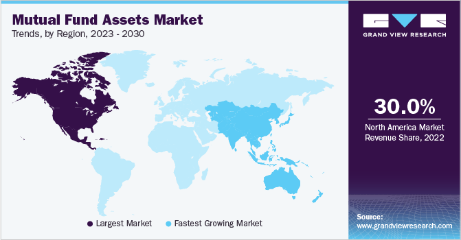

## Table of Contents

## What is a mutual fund?

A mutual fund is a type of investment where many people put their money together to buy a variety of stocks, bonds, or other assets. It's like a big basket where everyone's money is mixed and managed by a professional. This makes it easier for people to invest without having to pick individual stocks themselves.

When you invest in a mutual fund, you buy shares of the fund. The value of your shares goes up or down based on how well the investments in the fund are doing. Mutual funds are popular because they offer a way to diversify your investments, which means spreading your money across different types of assets to reduce risk. This can be a good option for people who want to grow their money over time but don't want to manage their investments themselves.

## How do mutual funds vary globally?

Mutual funds can be different in various parts of the world because each country has its own rules and ways of doing things. In the United States, for example, mutual funds are very popular and there are many different types to choose from, like stock funds, bond funds, and money market funds. In Europe, mutual funds might be called something else, like UCITS (Undertakings for Collective Investment in Transferable Securities), and they have to follow strict European Union rules. In Asia, especially in countries like China and India, mutual funds are growing fast but they might focus more on local markets and have different regulations.

Another way mutual funds vary globally is in the fees they charge. In some countries, the fees might be higher because of extra costs or different regulations. For example, in the U.S., you might see funds with lower fees because of competition, while in other places, the fees could be higher. Also, the way mutual funds are sold can be different. In some countries, you might buy them directly from the fund company, while in others, you might need to go through a bank or a financial advisor. This can affect how easy it is for people to invest in mutual funds and how much they end up paying.

## What are the different types of mutual funds available worldwide?

There are many types of mutual funds around the world, and they can be grouped by what they invest in and how they work. Some common types include stock funds, which invest in stocks of companies; bond funds, which invest in bonds issued by governments or companies; and money market funds, which invest in short-term, safe securities. There are also balanced funds, which mix stocks and bonds to balance risk and return. Some funds focus on specific areas, like technology or healthcare, while others invest in different countries or regions, like emerging markets or Europe.

Another way to look at mutual funds is by their management style. Actively managed funds have a person or team choosing which investments to buy and sell, trying to beat the market. Passively managed funds, often called index funds, just try to match the performance of a certain market index, like the S&P 500, and usually have lower fees. There are also funds that invest in a certain way, like socially responsible funds that avoid companies that don't meet certain ethical standards. All these types of mutual funds are available in different countries, but the exact mix and rules can change depending on where you are.

## How do regulations affect mutual funds in different countries?

Regulations have a big impact on mutual funds in different countries. Each country has its own rules about how mutual funds can be set up, what they can invest in, and how they need to tell people about their investments. For example, in the United States, mutual funds have to follow rules from the Securities and Exchange Commission (SEC). These rules say things like how much they can charge in fees and what they need to tell investors about their investments. In Europe, mutual funds often follow the UCITS rules, which are strict rules set by the European Union. These rules make sure that funds are safe and clear about what they're doing, so people feel more comfortable investing in them.

In other parts of the world, like Asia, regulations can be different. In China, for example, mutual funds have to follow rules from the China Securities Regulatory Commission (CSRC). These rules can limit what kinds of investments funds can make and how much risk they can take. In India, the Securities and Exchange Board of India (SEBI) sets the rules for mutual funds, making sure they are fair and protect investors. Because of these different rules, mutual funds in each country might look a bit different, charge different fees, and have different ways of doing things. This can affect how easy it is for people to invest and how much they can earn from their investments.

## What are the tax implications of investing in mutual funds across different regions?

The tax rules for mutual funds can be different in each country, and it's important to understand them before you invest. In the United States, when you make money from a mutual fund, you might have to pay taxes on it. If the fund sells stocks or bonds and makes a profit, you'll get a part of that profit as a capital gain, and you'll need to pay taxes on it. Also, if the fund pays you dividends, you'll have to pay taxes on those too. The tax rate depends on how long you held the investment and how much money you make overall.

In Europe, the tax rules can be different depending on the country. For example, in the United Kingdom, you might get a tax break on the first part of your dividend income, but you'll still have to pay taxes on any capital gains. In Germany, mutual fund earnings are taxed differently based on whether they come from stocks or bonds, and there can be special tax rules for certain types of funds. In Asia, countries like India have their own rules. In India, long-term capital gains from equity funds are taxed at a lower rate than short-term gains, and there might be taxes on dividends too.

Overall, the tax implications of investing in mutual funds can vary a lot from one region to another. It's a good idea to talk to a tax advisor who knows the rules in your country to make sure you understand how much you'll have to pay in taxes and how it might affect your investment returns.

## How does the performance of mutual funds differ across continents?

The performance of mutual funds can be different on each continent because of many reasons. In North America, especially the United States, mutual funds often do well because the economy is strong and there are lots of big companies to invest in. The stock market in the U.S. is also one of the biggest in the world, which means there are many chances for mutual funds to grow. But, the performance can go up and down a lot because the market can be very active and change quickly. In Europe, mutual funds might not grow as fast as in the U.S. because the economy can be slower, but they can still be a good choice for people who want to invest in a mix of different countries. European funds might also focus more on bonds and other safe investments, which can make them less risky but also less likely to grow a lot.

In Asia, the performance of mutual funds can be very different depending on the country. In places like China and India, the economy is growing fast, so mutual funds that invest in these countries can do really well. But, these markets can also be more risky because they can change a lot and be affected by things like government rules or big changes in the economy. In other parts of Asia, like Japan, the economy might not grow as fast, so mutual funds might not do as well. Overall, the performance of mutual funds around the world depends a lot on the economy of the country they invest in, the types of investments they make, and how much risk they are willing to take.

## What are the risks associated with investing in international mutual funds?

Investing in international mutual funds can be exciting because you get to put your money into different countries and economies. But it also comes with some risks. One big risk is currency risk. This means that if the money in the country you're investing in loses value compared to your own country's money, your investment might be worth less when you want to take your money out. Another risk is political risk. This happens when the government in a country where your fund invests changes its rules or does something that makes it harder for companies to do well. This can make the value of your investment go down.

Another thing to think about is economic risk. Different countries can have different economic problems, like high inflation or a recession. If the economy of a country where your mutual fund invests gets into trouble, it can hurt the value of your investment. Also, there's the risk of less information. When you invest in funds that focus on your own country, you might have more information about the companies and the economy. But with international funds, it can be harder to find out everything you need to know, which makes it riskier. So, while international mutual funds can help you spread your investments and maybe make more money, they also come with extra risks that you should think about carefully.

## How do cultural factors influence the structure and popularity of mutual funds in various countries?

Cultural factors can really change how mutual funds work and how popular they are in different countries. In some places, like the United States, people are used to investing in the stock market and taking risks. This makes mutual funds very popular because they're a good way to invest without having to pick stocks yourself. In these countries, people might trust financial advisors more and be more okay with putting their money into something they don't fully understand, as long as they think it can help them make more money.

In other countries, like Japan, people might be more careful with their money because of cultural reasons. They might prefer to save money in a bank instead of investing it in mutual funds. This can make mutual funds less popular there. Also, in some cultures, family and community are really important, so people might choose to invest in things that help their family or local businesses instead of putting money into a big mutual fund that invests all over the world. These cultural differences can affect how mutual funds are set up and how much people use them in different countries.

## What role do emerging markets play in the global mutual fund landscape?

Emerging markets are countries that are growing fast and becoming more important in the world economy. They play a big role in the global mutual fund landscape because they offer new chances for investors to make money. Mutual funds that focus on emerging markets can invest in countries like China, India, and Brazil, where the economy is growing quickly. This can mean more opportunities for the fund to earn higher returns than in more developed countries. But, investing in emerging markets can also be riskier because these countries can have more ups and downs in their economy and politics.

Because of the potential for high returns, many investors around the world are interested in putting their money into mutual funds that invest in emerging markets. These funds help spread the risk by investing in different countries and industries within these markets. This way, if one country or industry has problems, the whole fund doesn't lose as much money. As more people in emerging markets start to invest in mutual funds themselves, the demand for these funds grows, making them an even bigger part of the global mutual fund scene.

## How can investors access global mutual funds, and what are the considerations for doing so?

Investors can access global mutual funds in a few ways. One way is to buy them directly from the fund company that manages them. Many big fund companies have websites where you can sign up and invest in their global funds. Another way is through a financial advisor or a broker. They can help you pick the right global mutual funds and handle the buying and selling for you. Some banks also offer global mutual funds, so you might be able to invest through your bank account.

When thinking about investing in global mutual funds, there are some important things to consider. First, you need to think about the risks. Global funds can be riskier because they invest in different countries, and things like changes in currency values or political problems can affect your investment. Second, you should look at the fees. Global funds might charge more because they need to do more work to manage investments in different countries. Finally, think about your goals and how long you plan to keep your money in the fund. Global funds can be good for spreading your investments around the world, but they might need more time to grow than funds that focus on just one country.

## What are the trends in global mutual fund investments, and how are they expected to evolve?

One big trend in global mutual fund investments is that more and more people are putting their money into funds that invest in different countries, especially in emerging markets like China and India. These places are growing fast, and investors hope to make more money by investing there. Another trend is the growing popularity of [ESG](/wiki/esg-investing) (environmental, social, and governance) funds. These funds focus on companies that are good for the environment, treat their workers well, and have fair rules. More people want to invest in ways that match their values, so ESG funds are becoming more popular.

In the future, we might see even more money going into global mutual funds, especially as more people around the world start to invest. Technology is making it easier for people to buy and sell mutual funds from anywhere, so more people might want to try global funds. Also, as the world gets more connected, investors might want to spread their money around different countries to lower their risk. But, there could be more focus on making sure these funds are safe and clear about what they're doing, so people feel more comfortable investing in them.

## How do advanced analytical tools and technologies impact the management and selection of global mutual funds?

Advanced analytical tools and technologies are changing how global mutual funds are managed and chosen. These tools help fund managers look at lots of information quickly and make better choices about where to invest. For example, they can use big data and [machine learning](/wiki/machine-learning) to find patterns and predict how different markets might do in the future. This can help them pick the best investments and manage risks better. Also, these tools can help managers keep an eye on how their funds are doing all the time, so they can make changes faster if they need to.

For people who want to choose global mutual funds, these technologies make it easier to find good funds. Websites and apps now use advanced tools to show investors a lot of information about different funds, like how they've done in the past and what they invest in. This helps people make smarter choices about where to put their money. Plus, with things like robo-advisors, which use algorithms to suggest investments, it's easier for people to get advice on global funds without talking to a human advisor. As these technologies keep getting better, they will probably play an even bigger role in how global mutual funds are managed and chosen.

## References & Further Reading

[1]: Detollenaere, Q. (2017). ["UCITS and the European Mutual Fund Market: Law and Practice."](https://papers.ssrn.com/sol3/papers.cfm?abstract_id=2951681) Palgrave Macmillan.

[2]: Securities and Exchange Commission. ["A Guide to Mutual Funds."](https://www.sec.gov/investor/pubs/sec-guide-to-mutual-funds.pdf)

[3]: Aldridge, I. (2013). ["High-Frequency Trading: A Practical Guide to Algorithmic Strategies and Trading Systems."](https://www.amazon.com/High-Frequency-Trading-Practical-Algorithmic-Strategies/dp/1118343506) Wiley Finance.

[4]: Fabozzi, F. J., Focardi, S. M., & Rachev, S. T. (2007). ["The Basics of Financial Econometrics: Tools, Concepts, and Asset Management Applications."](https://onlinelibrary.wiley.com/doi/book/10.1002/9781118856406) Wiley.

[5]: UCITS. (2009). ["Directive 2009/65/EC of the European Parliament and of the Council."](https://eur-lex.europa.eu/eli/dir/2009/65/oj/eng)

[6]: Hasbrouck, J. (2007). ["Empirical Market Microstructure: The Institutions, Economics, and Econometrics of Securities Trading."](https://academic.oup.com/book/52241) Oxford University Press.