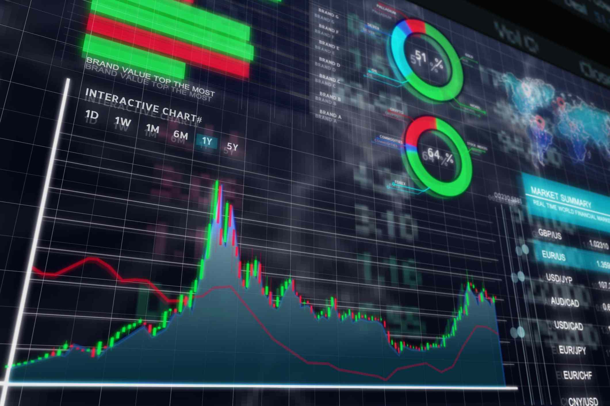

Investors face a plethora of choices when venturing into global financial markets. The complexity of these markets necessitates a robust understanding of the various investment vehicles available. Among these, mutual funds and algorithmic trading stand out as prominent strategies, each with distinct characteristics and operational frameworks shaped by diverse regulatory environments worldwide.

Mutual funds operate as pooled investment vehicles, gathering funds from numerous investors to collectively invest in a diversified portfolio of assets. This structure offers several benefits, including professional management and diversification, which can mitigate investment risk. However, the global landscape for mutual funds is defined by stark regulatory differences. For instance, in the United States, the Securities and Exchange Commission (SEC) exercises rigorous oversight, ensuring transparency and investor protection. In contrast, the European Union relies on the Undertakings for the Collective Investment in Transferable Securities (UCITS) framework, facilitating cross-border fund distribution while maintaining stringent regulatory standards. These variations inevitably influence mutual fund operations, asset allocation strategies, and investor accessibility across different regions.



Algorithmic trading represents a transformative approach to investment, leveraging computer algorithms to automate trading decisions. Its reliance on speed, precision, and data-driven methodologies introduces several advantages, notably the minimization of emotional biases and the ability to exploit market inefficiencies swiftly. Despite its benefits, algorithmic trading presents challenges, such as technical failures and substantial infrastructure costs. Moreover, varying regulatory stances across global markets affect algorithmic trading operations, with countries like the U.S. and EU enforcing regulations to curb potential market manipulations and ensure trading integrity.

In comparing mutual funds and algorithmic trading, investors must consider factors like risk tolerance, expected returns, and cost structures. A nuanced comprehension of these investment strategies, coupled with an awareness of international regulatory landscapes, is crucial for aligning investment decisions with individual financial objectives and market conditions. This article will dissect these aspects comprehensively, offering insights to guide investors in harmonizing their choices with overarching financial goals and the dynamic environment of global markets.

## Table of Contents

## Global Perspective on Mutual Funds

Mutual funds are investment vehicles that pool resources from multiple investors to purchase a diversified portfolio of securities, such as stocks, bonds, and other assets. Investors in mutual funds own shares in the fund, representing a portion of the entire portfolio. The primary benefit of mutual funds is diversification, which can reduce investment risk by spreading exposure across various securities. Additionally, mutual funds are managed by professional portfolio managers, who make buy and sell decisions with the aim of achieving the fund's investment objectives.

Globally, mutual funds differ significantly due to diverse regulatory frameworks that influence their structure, operation, and accessibility. In the United States, mutual funds are primarily regulated by the Securities and Exchange Commission (SEC). The SEC mandates transparency through regular disclosures, ensuring investors have access to critical information about fund performance, fees, and holdings. This regulation aims to protect investors by promoting informed decision-making and preventing fraudulent practices.

In contrast, the European Union has its own regulatory framework known as Undertakings for Collective Investment in Transferable Securities (UCITS). UCITS provides a standardized set of rules for mutual funds within the EU, making them cross-border investment vehicles accessible to investors across member states. UCITS ensures a high level of investor protection, including stringent requirements on fund diversification, [liquidity](/wiki/liquidity-risk-premium), and reporting.

These regulatory frameworks profoundly impact mutual fund operations, particularly concerning asset allocation and investor access. In the U.S., mutual funds have greater flexibility in terms of asset choices, allowing a wide range of investment strategies. However, they are subject to specific rules regarding risk management and conflict of interest to protect investors. The SEC's regulations require fund managers to adhere to fiduciary standards, ensuring they act in the best interests of fund shareholders.

The UCITS framework, while providing cross-border investment opportunities within the EU, imposes certain restrictions on investment strategies to ensure liquidity and safeguard investors. For instance, UCITS funds are generally limited in the proportion of assets they can allocate to non-liquid instruments, such as derivatives and private equity. This ensures that investors can redeem their shares on short notice, thus enhancing liquidity.

Investor access to mutual funds is also influenced by these regulatory environments. The U.S. market features a wide variety of mutual fund types, including open-ended funds, closed-ended funds, and exchange-traded funds (ETFs), providing investors with diverse options tailored to different investment goals and risk appetites. In Europe, UCITS funds are often favored for their transparency and ease of cross-border distribution, making them an attractive option for both domestic and international investors.

Overall, while mutual funds offer a common investment structure globally, regulatory variations lead to distinct market attributes. These differences affect the portfolio composition, risk management practices, and availability of mutual funds, all of which are critical considerations for investors navigating international markets.

## Understanding Algorithmic Trading

Algorithmic trading refers to the use of computerized systems and mathematical models to make trading decisions in financial markets. This type of trading automates the buying and selling of financial instruments by employing algorithms that are pre-programmed with various trading rules and strategies. The algorithms used can adapt to market changes in real-time, often executing trades at a speed and frequency that is impossible for a human trader to achieve.

One major advantage of [algorithmic trading](/wiki/algorithmic-trading) is execution speed. Computers can process and execute orders far quicker than human traders, allowing algorithmic traders to capitalize on fleeting market opportunities. This rapid execution minimizes the delay between market signals and trade implementation, which is crucial in highly volatile or liquid markets. Moreover, algorithmic trading ensures precision in order execution, reducing the chances of human error which might occur in manual trading. Additionally, by relying on algorithms, emotional bias—a common pitfall in trading—is significantly reduced, leading to more consistent and rational decision-making.

Several common strategies are utilized in algorithmic trading. Trend-following algorithms, for example, are designed to identify and capitalize on market trends. These algorithms do not predict future price movements but follow existing trends to generate profits. Arbitrage strategies seek to exploit price discrepancies across different markets or instruments, purchasing an asset at a lower price in one market and selling it at a higher price in another, thereby making a profit from the difference. Mean reversion strategies, on the other hand, are based on the assumption that market prices will revert to their historical mean or average over time, and thus, these algorithms seek to identify mispricings and trade them back to the mean.

While algorithmic trading offers substantial benefits, it also poses significant challenges. Technical failures, such as software bugs or network issues, can lead to substantial financial losses. These systems require high-quality infrastructure, which entails considerable costs for development, maintenance, and security. Additionally, the large [volume](/wiki/volume-trading-strategy) of trades executed by algorithms can have a noticeable impact on the market, sometimes causing liquidity issues or exacerbating price movements during volatile trading periods. Thus, while highly effective, algorithmic trading demands significant resources and risk management to function optimally in the dynamic financial landscape.

## Mutual Funds vs. Algorithmic Trading

When comparing mutual funds and algorithmic trading, several factors come into play, such as risk management, returns, and investor involvement. Understanding these differences is crucial for investors aiming to optimize their portfolio and align investments with personal goals.

**Risk Management**

Mutual funds are characterized by diversification, which reduces risk by spreading investments across a wide range of assets. This pooling of resources allows fund managers to mitigate unsystematic risk—that is, risk specific to individual investments. For instance, if one stock underperforms, gains from other investments within the portfolio can offset potential losses. This approach inherently offers investors a stable risk management framework due to the broad diversification and experienced oversight by fund managers.

Algorithmic trading, in contrast, centers on the use of computer algorithms that execute trades at high speeds and frequencies. These systems rely on preset criteria, seeking efficiencies and exploiting market conditions. Although algorithms can minimize decision-making biases and provide precise execution, they also introduce unique risks like technical failures and market [volatility](/wiki/volatility-trading-strategies) exacerbation, especially when multiple systems respond to the same market signals. There's a possibility of systemic risk if many algorithms react similarly during a market downturn, potentially amplifying price swings and causing liquidity issues.

**Returns and Investor Involvement**

When assessing returns, mutual funds offer investors a straightforward approach as returns are aligned with fund performance. The investor's role is relatively passive; once invested, professional fund managers handle asset allocation and periodic rebalancing according to the fund's objectives. The focus is usually on achieving long-term growth, with investors benefiting from dividends, interest, and capital gains.

Algorithmic trading aims to exploit minor inefficiencies in the market to achieve returns. These strategies can potentially generate high-frequency short-term profits, albeit with associated risks. Since algorithmic trading often requires significant initial capital and technical expertise, investor involvement tends to be more active, particularly when developing or customizing trading algorithms.

**Cost Structures**

Mutual funds typically involve a tiered expense structure dependent on the share class. Common classes include A, B, and C shares, each with specific fee structures affecting the net returns for investors. Class A shares may have front-end sales charges but tend to lower annual fees. Class B shares might avoid upfront fees but impose higher annual expenses and contingent deferred sales charges. Class C shares generally have no front-end or back-end load but higher ongoing fees than A shares. These costs can eat into investor profits, so choosing the appropriate class based on investment horizon and goals is essential.

Algorithmic trading platforms, however, incur costs related to technology and infrastructure. Costs include purchasing or developing algorithms, maintaining high-performance computing environments, and data feed subscriptions. Unlike mutual funds, these costs are less transparent and can vary significantly based on the complexity of the algorithms and required infrastructure. Over time, these expenses can accumulate, impacting net returns.

**Combining Mutual Funds with Algorithmic Trading**

Investors may explore hybrid approaches to leverage the strengths of both mutual funds and algorithmic trading. For instance, integrating algorithmic strategies within a mutual fund can enhance decision-making processes and optimize timing for trades, potentially improving the fund’s performance. Furthermore, mutual funds that utilize algorithmic trading innovations can react more swiftly to market trends while maintaining the benefits of managed diversification.

An example of such integration might involve using [machine learning](/wiki/machine-learning) algorithms to identify potential investment opportunities or rebalancing mutual fund portfolios with algorithmic strategies to minimize market impact and reduce transaction costs.

In conclusion, understanding the trade-offs between mutual funds and algorithmic trading in terms of risk, returns, and costs enables investors to make informed decisions and develop sophisticated investment strategies tailored to their financial objectives.

## Investment Strategies and Decision Making

Choosing between mutual funds and algorithmic trading requires a comprehensive understanding of investment goals and risk tolerance. Mutual funds offer diversified portfolios managed by professional fund managers, making them suitable for investors seeking a hands-off approach with moderate risk exposure. However, returns may be lower due to management fees and the relatively conservative strategies often employed. On the other hand, algorithmic trading provides opportunities for higher returns through precise and automated decision-making but necessitates a higher risk tolerance and technical expertise.

Global financial markets significantly impact strategy choice and performance. Investors must consider factors such as market liquidity, volatility, and economic indicators across different regions. Mutual fund performance can vary greatly depending on regional economic conditions and the performance of underlying assets. Algorithmic trading, while offering quicker adaptation to market changes, depends on data availability and the robustness of algorithms in handling diverse market conditions.

An essential aspect of international investing is understanding regulatory differences. Regulations such as those imposed by the U.S. Securities and Exchange Commission (SEC) or the European Union's Undertakings for the Collective Investment in Transferable Securities (UCITS) impact how investments are structured and accessed. These frameworks define asset allocation limits, investor protection measures, and disclosure requirements, which influence investment decision-making and strategy effectiveness.

To integrate technology and algorithmic insights into traditional investment strategies, investors can consider the following tips:

1. **Data Analytics Integration**: Utilize data analytics tools to assess market trends and asset performance. Python libraries such as Pandas and NumPy can be employed to analyze historical price data and perform quantitative analysis.

   ```python
   import pandas as pd
   import numpy as np

   # Example: Calculate daily returns for a stock
   data = pd.read_csv('historical_stock_prices.csv')
   data['daily_return'] = data['Close'].pct_change()
   ```

2. **Backtesting Strategies**: Implement backtesting to evaluate the efficacy of investment strategies using historical data. Libraries like Backtrader can be employed to simulate algorithmic trading strategies under various market conditions.

   ```python
   from backtrader import Cerebro

   # Create a Cerebro entity
   cerebro = Cerebro()

   # Add a strategy
   cerebro.addstrategy(YourTradingStrategy)

   # Run the backtest
   cerebro.run()
   ```

3. **Risk Management Tools**: Leverage technology for risk assessment and portfolio optimization. Using Python's PyPortfolioOpt, you can identify the optimal asset allocation to maximize returns for a given risk level.

   ```python
   from pypfopt import EfficientFrontier, risk_models, expected_returns

   # Example: Optimize a portfolio
   mu = expected_returns.mean_historical_return(data)
   S = risk_models.sample_cov(data)
   ef = EfficientFrontier(mu, S)
   weights = ef.max_sharpe()
   ```

Aligning investment strategies with financial goals and market conditions requires continuous learning and adaptation. Investors should stay informed about market dynamics and evolving technologies to make informed decisions that align with their risk tolerance and investment objectives.

## Conclusion

Mutual funds and algorithmic trading represent two distinct approaches to investment management, each offering unique benefits and challenges. Mutual funds serve as pooled investment vehicles where resources from various investors are aggregated to purchase a diverse portfolio of assets. Their operation is heavily influenced by regulatory environments, with entities such as the Securities and Exchange Commission (SEC) in the United States and the Undertakings for the Collective Investment in Transferable Securities (UCITS) in the European Union playing crucial roles in governing their transparency, asset allocation, and investor protection.

Algorithmic trading, on the other hand, relies on computer algorithms to automate trading decisions, boasting advantages like speed, precision, and the elimination of emotional bias. Typical strategies include trend-following, [arbitrage](/wiki/arbitrage), and mean reversion, but it comes with its set of challenges including technical failures, high infrastructure costs, and potential market impact.

Despite their differences, both investment strategies require a deep understanding of market dynamics. Investors must align their financial goals with their investment choices, considering risk tolerance, expected returns, and the nuances of global market regulations. This is critical since regulatory frameworks and market conditions can significantly influence investment outcomes.

Technological advancements have further blurred the lines between these strategies, providing opportunities for integrating algorithmic insights into mutual fund management to enhance performance. This intersection underscores the importance of continuous learning and adaptation, as staying abreast of technological innovations allows investors to refine their strategies and stay competitive in the fast-evolving landscape of global finance.

In conclusion, the judicious selection between mutual funds and algorithmic trading hinges on an investor's financial objectives, comprehension of regulatory differences, and ability to adapt to technological advancements. By recognizing and leveraging the strengths and limitations of both approaches, investors can optimize their portfolios to better meet personal financial goals within the context of shifting market environments.

## References & Further Reading

[1]: Detollenaere, Q. (2017). ["UCITS and the European Mutual Fund Market: Law and Practice."](https://papers.ssrn.com/sol3/papers.cfm?abstract_id=2951681) Palgrave Macmillan.

[2]: Securities and Exchange Commission. ["A Guide to Mutual Funds."](https://www.sec.gov/investor/pubs/sec-guide-to-mutual-funds.pdf)

[3]: Aldridge, I. (2013). ["High-Frequency Trading: A Practical Guide to Algorithmic Strategies and Trading Systems."](https://www.amazon.com/High-Frequency-Trading-Practical-Algorithmic-Strategies/dp/1118343506) Wiley Finance.

[4]: Fabozzi, F. J., Focardi, S. M., & Rachev, S. T. (2007). ["The Basics of Financial Econometrics: Tools, Concepts, and Asset Management Applications."](https://onlinelibrary.wiley.com/doi/book/10.1002/9781118856406) Wiley.

[5]: UCITS. (2009). ["Directive 2009/65/EC of the European Parliament and of the Council."](https://eur-lex.europa.eu/eli/dir/2009/65/oj/eng)

[6]: Hasbrouck, J. (2007). ["Empirical Market Microstructure: The Institutions, Economics, and Econometrics of Securities Trading."](https://academic.oup.com/book/52241) Oxford University Press.