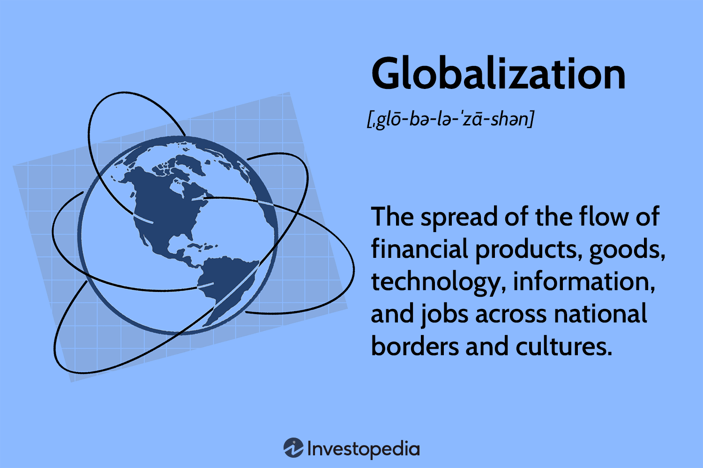

## Table of Contents

## What is globalization in the context of business?

Globalization in business means that companies can now work and sell their products or services all over the world more easily. This happens because of better technology, like the internet, and because countries have made agreements to trade with each other more freely. Companies can find new customers in different countries, and they can also get resources and materials from anywhere in the world. This makes it easier for businesses to grow and make more money.

However, globalization also brings challenges. Companies have to deal with different laws, cultures, and languages in each country they work in. They also face more competition because other businesses from around the world can now enter their markets. Sometimes, globalization can lead to job losses in one country if a company decides to move its operations to a place where labor is cheaper. Despite these challenges, many businesses see globalization as an opportunity to expand and succeed on a global scale.

## How did globalization in business start and evolve historically?

Globalization in business began a long time ago, but it really started to grow in the late 20th century. In the old days, trading between countries was hard because of long distances and slow communication. But things changed with the Industrial Revolution in the 1800s. New inventions like steamships and telegraphs made it easier and faster to move goods and messages around the world. After World War II, countries started making more agreements to help trade, like the General Agreement on Tariffs and Trade (GATT). These agreements helped lower the barriers that made trading difficult.

The big change came in the late 20th century with technology. The internet and better transportation made it even easier for businesses to work globally. Companies could now sell products online to customers all over the world. Also, big businesses started moving parts of their operations to different countries to save money and reach new markets. This is called offshoring and outsourcing. Today, globalization is a big part of how businesses work. They can quickly move money, goods, and information around the world, but they also face new challenges like dealing with different laws and cultures in each country they work in.

## What are the main drivers of globalization in business?

The main drivers of globalization in business are technology and trade agreements. Technology, like the internet and better transportation, has made it easier for companies to reach customers and partners all over the world. With the internet, businesses can sell products online to people in different countries. Better transportation, like faster ships and planes, makes it quicker to move goods around the world. These technological advances have made the world feel smaller and more connected.

Trade agreements between countries also help drive globalization. These agreements lower the barriers that make trading difficult, like high taxes on imports or strict rules about what can be sold. For example, agreements like the General Agreement on Tariffs and Trade (GATT) and the World Trade Organization (WTO) have made it easier for countries to trade with each other. As a result, companies can sell their products in more places and get resources from anywhere in the world, helping them grow and make more money.

## What are the primary benefits of globalization for businesses?

Globalization helps businesses by giving them more chances to grow and make money. When companies can sell their products to people in different countries, they can reach more customers. This means they can sell more and make more money. Also, globalization lets businesses get resources and materials from anywhere in the world. If something is cheaper or better in another country, a business can use that to save money and make better products.

Another big benefit is that companies can learn from other places and get new ideas. When businesses work in different countries, they see how people do things differently. This can help them come up with new products or ways of working that they might not have thought of before. Plus, globalization can help businesses spread out their risks. If something goes wrong in one country, like a bad economy, a business that works in many countries might still do well in other places.

## How does globalization affect economic growth and development?

Globalization can help countries grow their economies by making it easier for them to trade with each other. When countries can sell their products to people all over the world, they can make more money. This money can be used to build better roads, schools, and hospitals, which helps the country grow. Also, when companies from other countries come to a place, they can create new jobs for people there. This means more people have work and can earn money to spend on things they need, which helps the economy grow even more.

But globalization can also bring problems. Sometimes, big companies from rich countries come to poorer countries because labor is cheaper there. This can lead to job losses in the rich countries, and the workers in the poorer countries might not get paid very well. Also, if a country depends too much on selling things to other countries, it can be a problem if something goes wrong, like a global economic crisis. So, while globalization can help a country's economy grow, it also brings challenges that need to be managed carefully.

## What are the potential drawbacks of globalization for businesses?

Globalization can be tough for businesses because it brings more competition. When companies can sell their products all over the world, they have to compete with businesses from everywhere. This means they need to work harder to make their products better or cheaper. If they don't, they might lose customers to companies from other countries. Also, dealing with different laws and cultures in each country can be hard and expensive. Businesses have to learn about and follow different rules in every place they work, which can be a big challenge.

Another problem is that globalization can make businesses depend too much on other countries. If a company moves part of its work to another country to save money, it can be risky. If something goes wrong in that country, like a war or a bad economy, the business might have big problems. Also, if a company relies on selling to other countries, it can be hurt if those countries stop buying as much. This can make it hard for the business to plan and grow in a stable way.

## How does globalization impact local cultures and communities?

Globalization can change local cultures and communities in big ways. When big companies come to a new place, they bring their own ways of doing things. This can mean that local people start to like and buy the same things that people in other countries do. For example, more people might eat at fast food restaurants or watch the same movies. This can make local traditions and customs less important, as people start to follow global trends instead. Sometimes, this can lead to a loss of the unique things that make a community special.

But globalization can also help local cultures and communities in some ways. When people from different places work together, they can learn from each other and share new ideas. This can help local communities grow and change in good ways. For example, a small business might start selling its products online to people in other countries, which can help it grow and create more jobs. Also, when people travel and learn about other cultures, they can bring back new ideas and ways of doing things that can make their own communities better. So, while globalization can be tough on local cultures, it can also bring new opportunities and growth.

## What role do international trade agreements play in business globalization?

International trade agreements are very important for business globalization. They are like rules that countries agree on to make trading easier. These agreements help lower the things that make trading hard, like high taxes on imports or strict rules about what can be sold. For example, the General Agreement on Tariffs and Trade (GATT) and the World Trade Organization (WTO) have made it easier for countries to trade with each other. When these barriers are lower, companies can sell their products in more places and get resources from anywhere in the world. This helps them grow and make more money.

These agreements also help businesses feel more sure about working in other countries. When companies know the rules and can trust that they will be treated fairly, they are more likely to invest in new places. This can lead to more jobs and better economies in the countries where they work. But, it's not always easy. Sometimes, these agreements can lead to problems, like job losses in one country if a company moves its work to a place where labor is cheaper. So, while international trade agreements are key to globalization, they also bring challenges that need to be managed carefully.

## How can businesses effectively manage the risks associated with globalization?

Businesses can manage the risks of globalization by planning carefully and staying flexible. One way to do this is by spreading out their work and sales to different countries. If something goes wrong in one place, like a bad economy or a natural disaster, the business can still do well in other places. This is called diversification. Companies can also use contracts and insurance to protect themselves from risks like changes in currency values or problems with suppliers. By planning ahead and having backup plans, businesses can be ready for whatever might happen.

Another way to manage risks is by learning about the places where they work. This means understanding the local laws, cultures, and ways of doing business. When companies know these things, they can avoid mistakes and build good relationships with local people. It's also important for businesses to keep an eye on what's happening around the world, like political changes or economic trends. By staying informed and adapting quickly, businesses can handle the challenges of globalization and keep growing.

## What are some advanced strategies businesses use to capitalize on globalization?

Businesses use smart strategies to make the most of globalization. One big strategy is to set up operations in different countries. This helps them get closer to new customers and find cheaper resources. For example, a company might build a factory in a country where labor is less expensive, and then sell the products they make to customers all over the world. This way, they can save money and reach more people. Another strategy is to use technology to their advantage. Companies can use the internet to sell products online to people in different countries, and they can use data to understand what customers in different places want. This helps them make better products and sell more.

Another important strategy is to form partnerships with businesses in other countries. This can help a company learn new ways of doing things and reach new markets. For example, a business might work with a local company to understand the culture and laws of a new country. This can make it easier to sell products there and build good relationships with local people. Companies also use global supply chains to get the best resources from around the world. By carefully managing these supply chains, businesses can make their products better and cheaper, which helps them compete on a global scale.

## How does globalization influence innovation and technology transfer in businesses?

Globalization helps businesses come up with new ideas and share technology. When companies work in different countries, they can learn from people who do things differently. This can give them new ideas for products or ways of working. For example, a company might see a new technology in one country and use it to make their products better. Also, when businesses work together across borders, they can share their knowledge and technology more easily. This means that new inventions and technologies can spread faster around the world, helping everyone to improve and grow.

But globalization can also make it harder for some businesses to keep up. Big companies with lots of money can use their resources to buy new technology and hire the best people. Smaller companies might not be able to do this, so they can fall behind. Also, when technology spreads quickly around the world, it can be hard for businesses to keep their ideas secret. If a company comes up with a new invention, other companies might copy it quickly. So, while globalization can help spread innovation and technology, it also brings challenges that businesses need to be ready for.

## What future trends are expected in the globalization of business?

In the future, businesses will keep using technology to grow and reach more people around the world. The internet and new tools like [artificial intelligence](/wiki/ai-artificial-intelligence) will make it even easier for companies to sell their products online to customers in different countries. They will also use technology to learn more about what people want and make their products better. More businesses will move parts of their work to other countries to save money and find new customers. This means that companies will need to be good at working with people from different places and understanding different cultures.

Another trend we will see is more focus on being good to the environment and society. As people care more about these things, businesses will need to show that they are helping the planet and treating people well. This might mean using less energy, making products that are better for the environment, and making sure workers in different countries are treated fairly. Companies that do these things well will be more popular with customers and might have an easier time growing in the global market. But, they will also need to be ready for new rules and challenges that come with working in many different countries.

## References & Further Reading

[1]: Piketty, T. (2014). [Capital in the Twenty-First Century.](https://www.jstor.org/stable/j.ctt6wpqbc) Harvard University Press.

[2]: Bhagwati, J. (2004). [In Defense of Globalization.](https://www.researchgate.net/publication/274185673_In_Defense_of_Globalization) Oxford University Press.

[3]: Stern, N. (2007). [The Economics of Climate Change: The Stern Review.](https://assets.cambridge.org/97805217/00801/frontmatter/9780521700801_frontmatter.pdf) Cambridge University Press.

[4]: Baldwin, R. E. (2016). [The Great Convergence: Information Technology and the New Globalization.](https://www.jstor.org/stable/j.ctv24w655w) Harvard University Press.

[5]: Drucker, P. F. (2002). [Managing in the Next Society.](https://www.taylorfrancis.com/books/mono/10.4324/9780080496283/managing-next-society-peter-drucker) St. Martin's Press.